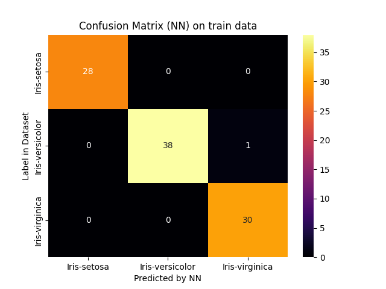
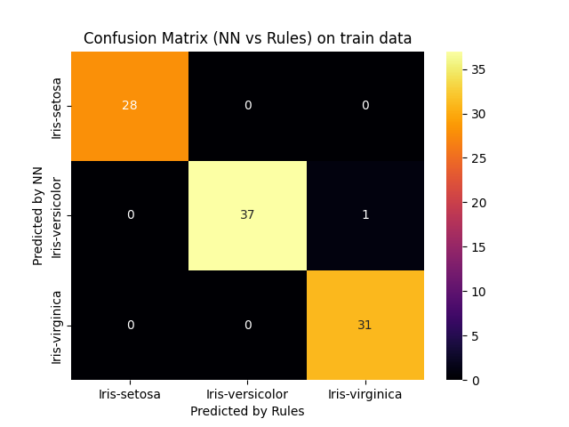

# Report for scenario: train

Rule Extraction Assistant report for alpa on train data.

- algorithm: `alpa`
- seed: `123`

## Extracted Rules

These are the rules extracted in a human-readable form:
```python

IF 0.9777777777777777[(sepal_length > 6.2526927) AND (petal_length <= 4.7783475)] THEN OUTPUT_CLASS=Iris-versicolor

IF 0.9850746268656716[(petal_length <= 4.7783475) AND (petal_length > 1.9) AND (petal_width <= 1.5841892)] THEN OUTPUT_CLASS=Iris-versicolor

IF 0.9722222222222222[(petal_length <= 4.6510396) AND (sepal_length > 5.8044615)] THEN OUTPUT_CLASS=Iris-versicolor

IF 0.9714285714285714[(petal_length <= 4.7783475) AND (sepal_length > 5.8044615) AND (sepal_width > 2.8)] THEN OUTPUT_CLASS=Iris-versicolor

IF 0.9523809523809523[(petal_length <= 5.4167104) AND (sepal_length > 6.0427194) AND (petal_width <= 1.7302907)] THEN OUTPUT_CLASS=Iris-versicolor

IF 0.95[(sepal_length > 6.6170897) AND (petal_length <= 5.1524878)] THEN OUTPUT_CLASS=Iris-versicolor

IF 0.98[(petal_width > 1.7302907) AND (petal_length > 5.1524878)] THEN OUTPUT_CLASS=Iris-virginica

IF 0.9746835443037974[(petal_width > 1.7302907) AND (sepal_length <= 6.6170897) AND (petal_length > 4.7783475)] THEN OUTPUT_CLASS=Iris-virginica

IF 0.9705882352941176[(petal_length > 5.4167104)] THEN OUTPUT_CLASS=Iris-virginica

IF 0.96[(petal_length > 4.7783475) AND (sepal_length <= 6.0427194)] THEN OUTPUT_CLASS=Iris-virginica

IF 0.9411764705882353[(petal_length > 4.6510396) AND (sepal_length <= 6.2526927) AND (petal_width > 1.5841892) AND (sepal_width <= 2.8)] THEN OUTPUT_CLASS=Iris-virginica

IF 0.9666666666666667[(petal_length <= 1.9)] THEN OUTPUT_CLASS=Iris-setosa

IF 0.9333333333333333[(petal_width > 1.5841892) AND (sepal_length <= 5.8044615)] THEN OUTPUT_CLASS=Iris-virginica

IF 0.8095238095238095[(petal_width > 1.5841892) AND (sepal_length <= 6.2526927) AND (sepal_width <= 2.8)] THEN OUTPUT_CLASS=Iris-virginica

```

And these are the rules with internal decoding:
```python

IF 0.9777777777777777[(h_0,0 > 6.2526927) AND (h_0,2 <= 4.7783475)] THEN OUTPUT_CLASS=Iris-versicolor
Number of clauses: 1

IF 0.9850746268656716[(h_0,2 <= 4.7783475) AND (h_0,2 > 1.9) AND (h_0,3 <= 1.5841892)] THEN OUTPUT_CLASS=Iris-versicolor
Number of clauses: 1

IF 0.9722222222222222[(h_0,2 <= 4.6510396) AND (h_0,0 > 5.8044615)] THEN OUTPUT_CLASS=Iris-versicolor
Number of clauses: 1

IF 0.9714285714285714[(h_0,2 <= 4.7783475) AND (h_0,0 > 5.8044615) AND (h_0,1 > 2.8)] THEN OUTPUT_CLASS=Iris-versicolor
Number of clauses: 1

IF 0.9523809523809523[(h_0,2 <= 5.4167104) AND (h_0,0 > 6.0427194) AND (h_0,3 <= 1.7302907)] THEN OUTPUT_CLASS=Iris-versicolor
Number of clauses: 1

IF 0.95[(h_0,0 > 6.6170897) AND (h_0,2 <= 5.1524878)] THEN OUTPUT_CLASS=Iris-versicolor
Number of clauses: 1

IF 0.98[(h_0,3 > 1.7302907) AND (h_0,2 > 5.1524878)] THEN OUTPUT_CLASS=Iris-virginica
Number of clauses: 1

IF 0.9746835443037974[(h_0,3 > 1.7302907) AND (h_0,0 <= 6.6170897) AND (h_0,2 > 4.7783475)] THEN OUTPUT_CLASS=Iris-virginica
Number of clauses: 1

IF 0.9705882352941176[(h_0,2 > 5.4167104)] THEN OUTPUT_CLASS=Iris-virginica
Number of clauses: 1

IF 0.96[(h_0,2 > 4.7783475) AND (h_0,0 <= 6.0427194)] THEN OUTPUT_CLASS=Iris-virginica
Number of clauses: 1

IF 0.9411764705882353[(h_0,2 > 4.6510396) AND (h_0,0 <= 6.2526927) AND (h_0,3 > 1.5841892) AND (h_0,1 <= 2.8)] THEN OUTPUT_CLASS=Iris-virginica
Number of clauses: 1

IF 0.9666666666666667[(h_0,2 <= 1.9)] THEN OUTPUT_CLASS=Iris-setosa
Number of clauses: 1

IF 0.9333333333333333[(h_0,3 > 1.5841892) AND (h_0,0 <= 5.8044615)] THEN OUTPUT_CLASS=Iris-virginica
Number of clauses: 1

IF 0.8095238095238095[(h_0,3 > 1.5841892) AND (h_0,0 <= 6.2526927) AND (h_0,1 <= 2.8)] THEN OUTPUT_CLASS=Iris-virginica
Number of clauses: 1

```


### Rule Metrics

The following are metrics on the ruleset.


The loop of the ALPA algorithm you used found the following optimum:
- maximum fidelity achieved: `0.9933554817275747`
- rho with maximum fidelity: `2.1`


The following metrics are *per output class*:

|class:                  |                "Iris-versicolor"       |                "Iris-virginica"       |                "Iris-setosa"       |
|-----------------------:|:--------------------------------:|:--------------------------------:|:--------------------------------:|
|n_clauses:              |       `6`   |       `7`   |       `1`   |
|min_terms:              |             `2` |             `1` |             `1` |
|max_terms:              |             `3` |             `4` |             `1` |
|avg_terms:              |     `2.5` |     `2.43` |     `1.0` |
|used features:          |        `sepal_width, petal_length, sepal_length, petal_width`        |        `sepal_width, petal_length, sepal_length, petal_width`        |        `petal_length`        |
|features in every rule: | `petal_length`        | ``        | `petal_length`        |

These metrics are over the *whole ruleset*:

- total number of rules: 14
- common features (used by all classes): `petal_length`
  - number of common features: `1`

## Accuracy and Fidelity

The accuracy and fidelity measures of the neural network compared to the rules.

- neural network:
  - accuracy: `0.9897`
- rules:
  - accuracy: `0.9794`
  - fidelity: `0.9897`

## Confusion Matrices






## Performance

- rule extraction:
    - time: `2.1102 sec`
    - memory: `49.5938 MB`
