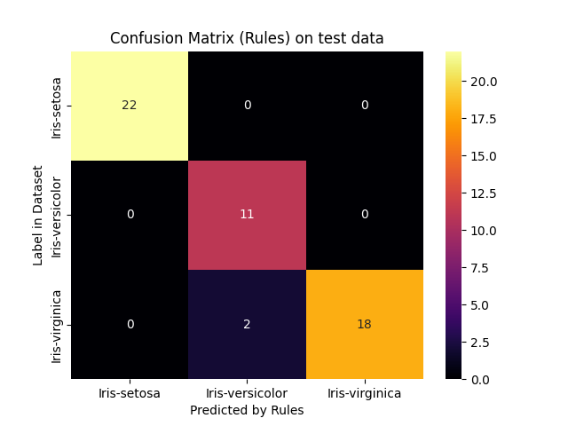
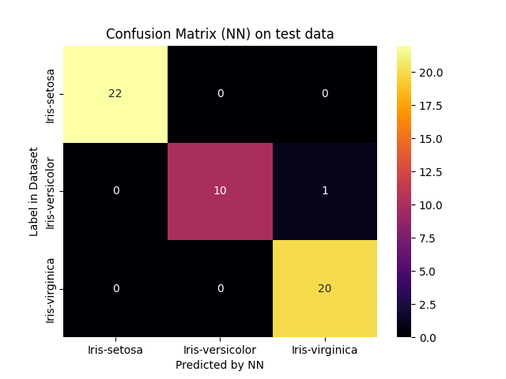
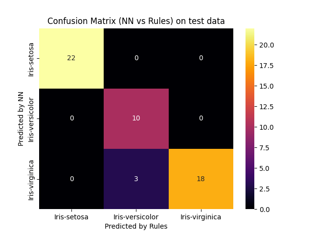

# Report for scenario: test

Rule Extraction Assistant report for dnnre on test data.

- algorithm: `dnnre`
- seed: `123`

## Extracted Rules

These are the rules extracted in a human-readable form:
```python

IF 0.7559264935366768[(petal_length > 1.9) AND (petal_width <= 1.6)] THEN OUTPUT_CLASS=Iris-versicolor

IF 0.8813725490196078[(petal_width > 1.7)] THEN OUTPUT_CLASS=Iris-virginica

IF 0.9032962962962963[(petal_length <= 1.9)] THEN OUTPUT_CLASS=Iris-setosa

```

And these are the rules with internal decoding:
```python

IF 0.7559264935366768[(h_0,2 > 1.9) AND (h_0,3 <= 1.6)] THEN OUTPUT_CLASS=Iris-versicolor
Number of clauses: 1

IF 0.8813725490196078[(h_0,3 > 1.7)] THEN OUTPUT_CLASS=Iris-virginica
Number of clauses: 1

IF 0.9032962962962963[(h_0,2 <= 1.9)] THEN OUTPUT_CLASS=Iris-setosa
Number of clauses: 1

```


### Rule Metrics

The following are metrics on the ruleset.


The following metrics are *per output class*:

|class:                  |                "Iris-versicolor"       |                "Iris-virginica"       |                "Iris-setosa"       |
|-----------------------:|:--------------------------------:|:--------------------------------:|:--------------------------------:|
|n_clauses:              |       `1`   |       `1`   |       `1`   |
|min_terms:              |             `2` |             `1` |             `1` |
|max_terms:              |             `2` |             `1` |             `1` |
|avg_terms:              |     `2.0` |     `1.0` |     `1.0` |
|used features:          |        `petal_length, petal_width`        |        `petal_width`        |        `petal_length`        |
|features in every rule: | `petal_length, petal_width`        | `petal_width`        | `petal_length`        |

These metrics are over the *whole ruleset*:

- total number of rules: 3
- common features (used by all classes): ``
  - number of common features: `0`

## Accuracy and Fidelity

The accuracy and fidelity measures of the neural network compared to the rules.

- neural network:
  - accuracy: `0.9811`
- rules:
  - accuracy: `0.9623`
  - fidelity: `0.9434`

## Confusion Matrices







## Performance

- rule extraction:
    - time: `1.2278 sec`
    - memory: `49.1172 MB`
