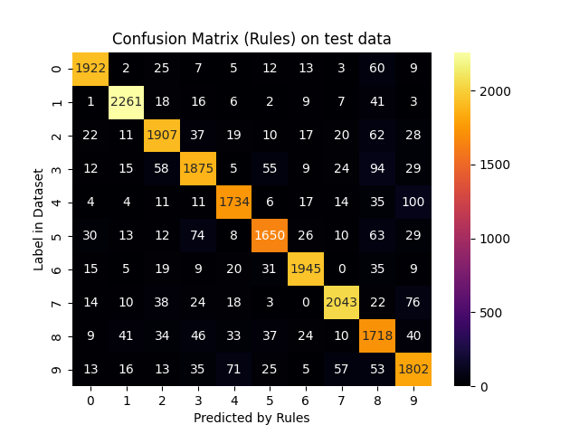
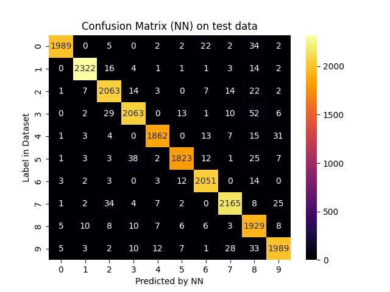

# Report for scenario: test

Rule Extraction Assistant report for alpa on test data.

- algorithm: `alpa`
- seed: `42`

## Extracted Rules

These are the rules extracted in a human-readable form:
```python

IF 0.9545454545454546[(17x23 <= 5) AND (21x10 <= 0) AND (24x16 <= 5.0049062) AND (14x10 > 0.81260794) AND (6x24 <= 0) AND (9x13 > 1.4521827) AND (6x12 <= 2) AND (3x14 <= 0) AND (15x12 <= 52) AND (14x18 > 11) AND (5x17 <= 6) AND (20x12 > 189) AND (18x10 <= 102)] THEN OUTPUT_CLASS=7

IF 0.9503105590062112[(20x12 <= 13.295131) AND (14x10 <= 24) AND (27x14 > 0) AND (19x14 > 151) AND (9x15 > 7.3196893)] THEN OUTPUT_CLASS=7

IF 0.9493545183714002[(9x9 > 129.04745) AND (14x10 <= 0.81260794) AND (20x7 <= 2) AND (13x13 <= 5) AND (15x8 <= 118) AND (14x15 <= 135.19209) AND (9x14 > 23) AND (5x21 <= 2) AND (20x24 <= 9.4928341) AND (18x15 > 30) AND (6x15 <= 0) AND (15x6 <= 0.41678992)] THEN OUTPUT_CLASS=7

IF 0.9468085106382979[(13x12 > 1.4896443) AND (14x10 <= 0.81260794) AND (12x5 > 43) AND (27x10 <= 0) AND (20x22 <= 115) AND (15x7 <= 12.285851)] THEN OUTPUT_CLASS=7

IF 0.9457364341085271[(8x7 <= 21) AND (22x13 > 126) AND (26x7 <= 88) AND (27x14 <= 0) AND (13x10 <= 40) AND (6x12 <= 2) AND (23x6 <= 3) AND (8x15 > 0) AND (14x18 > 11) AND (20x12 <= 189) AND (7x10 > 16) AND (6x16 <= 5.0049062) AND (17x15 > 2.9932816) AND (19x8 <= 45)] THEN OUTPUT_CLASS=7

IF 0.9310344827586207[(14x10 <= 0.81260794) AND (21x18 <= 23) AND (19x14 > 30) AND (13x12 <= 1.4896443) AND (27x14 <= 0) AND (12x13 <= 84) AND (15x7 <= 12.285851) AND (6x11 <= 79) AND (14x15 > 135.19209) AND (19x12 <= 51) AND (19x8 <= 133) AND (6x19 <= 76) AND (5x15 <= 65) AND (14x14 > 2) AND (17x15 > 2.9932816) AND (8x10 > 0)] THEN OUTPUT_CLASS=7

IF 0.9173669467787114[(14x10 <= 0.81260794) AND (10x17 > 187) AND (13x12 <= 1.4896443) AND (26x12 <= 0) AND (15x7 <= 12.285851) AND (26x15 > 1)] THEN OUTPUT_CLASS=7

IF 0.9090909090909091[(26x9 > 31) AND (18x14 > 1) AND (14x16 <= 0) AND (12x17 <= 101) AND (8x26 <= 3) AND (15x15 <= 82.463417) AND (26x11 <= 10)] THEN OUTPUT_CLASS=7

IF 0.8582995951417004[(18x12 > 3.1456177) AND (17x12 > 31) AND (13x21 > 138) AND (21x25 <= 3) AND (26x14 <= 4) AND (12x24 <= 39) AND (24x13 > 5) AND (17x15 <= 2.9932816) AND (26x11 <= 81.147446) AND (11x19 > 1.1692258)] THEN OUTPUT_CLASS=0

IF 0.9924324324324324[(9x18 > 96) AND (27x14 <= 0) AND (15x7 > 12.285851) AND (17x12 <= 126) AND (14x24 > 97) AND (8x15 > 3) AND (15x12 <= 30.481853)] THEN OUTPUT_CLASS=0

IF 0.9872611464968153[(12x15 > 10) AND (26x14 <= 1) AND (13x24 > 124) AND (14x16 <= 0) AND (10x18 > 76) AND (26x18 <= 2.0784225) AND (17x15 <= 2.9932816) AND (4x10 <= 0) AND (26x11 <= 10)] THEN OUTPUT_CLASS=0

IF 0.9859359844810863[(26x16 <= 14) AND (26x14 <= 1) AND (9x19 > 10) AND (27x10 <= 0) AND (14x16 <= 0) AND (18x14 <= 1) AND (27x17 <= 0) AND (26x20 <= 12) AND (12x17 <= 101) AND (8x26 <= 3) AND (13x4 <= 5) AND (13x12 > 0.2468663) AND (15x15 <= 82.463417) AND (17x15 <= 2.9932816) AND (4x10 <= 0) AND (26x11 <= 10)] THEN OUTPUT_CLASS=0

IF 0.9833887043189369[(10x25 <= 97) AND (14x10 > 0.81260794) AND (21x9 > 1) AND (12x9 > 89) AND (3x14 <= 0) AND (4x17 <= 0) AND (7x17 > 7.7360821) AND (14x21 > 3) AND (11x14 <= 73) AND (25x10 <= 9) AND (14x18 <= 11)] THEN OUTPUT_CLASS=0

IF 0.9754901960784313[(4x23 <= 7) AND (4x13 <= 14) AND (26x14 <= 1) AND (16x9 > 4.4285369) AND (27x10 <= 0) AND (23x12 > 104) AND (14x16 <= 0) AND (10x18 > 76) AND (23x23 <= 63) AND (15x15 <= 82.463417) AND (17x15 <= 2.9932816) AND (8x26 <= 67) AND (4x14 <= 43.152298) AND (4x10 <= 0) AND (25x21 <= 6) AND (26x11 <= 10)] THEN OUTPUT_CLASS=0

IF 0.9715639810426541[(4x20 <= 0) AND (14x10 > 0.81260794) AND (5x7 <= 6) AND (21x9 > 1) AND (4x14 <= 3) AND (4x17 <= 0) AND (17x14 <= 97) AND (11x14 > 73) AND (4x10 <= 0) AND (14x21 > 3) AND (13x22 > 2) AND (14x18 <= 11)] THEN OUTPUT_CLASS=0

IF 0.9724473257698542[(14x10 > 0.81260794) AND (5x7 <= 6) AND (16x24 > 10) AND (21x9 > 1) AND (16x17 <= 142.22484) AND (4x14 <= 3) AND (11x14 > 73) AND (4x10 <= 0) AND (14x18 <= 11) AND (13x22 > 2)] THEN OUTPUT_CLASS=0

IF 0.9585798816568047[(14x10 > 0.81260794) AND (10x25 > 11) AND (14x21 <= 3) AND (14x18 <= 11) AND (17x21 > 32)] THEN OUTPUT_CLASS=0

IF 0.9561128526645768[(4x20 <= 0) AND (17x14 <= 60) AND (21x10 > 0) AND (22x12 > 28) AND (26x9 <= 1.4863859) AND (12x12 > 24) AND (14x10 > 0.81260794) AND (13x20 > 79) AND (23x23 <= 33) AND (4x14 <= 3) AND (4x17 <= 0) AND (14x16 <= 28) AND (4x10 <= 0) AND (8x16 > 7) AND (24x15 <= 1) AND (20x4 <= 13)] THEN OUTPUT_CLASS=0

IF 0.975[(14x10 <= 0.81260794) AND (26x9 > 4) AND (15x7 <= 12.285851) AND (24x14 <= 30) AND (18x7 <= 4) AND (14x14 <= 29.460035) AND (15x11 <= 121) AND (17x15 > 2.9932816)] THEN OUTPUT_CLASS=7

IF 0.9736842105263158[(15x12 <= 150) AND (20x12 > 13.295131) AND (9x26 <= 23) AND (27x14 > 0) AND (22x13 > 233)] THEN OUTPUT_CLASS=7

IF 0.9722222222222222[(18x22 > 11) AND (15x14 <= 2) AND (27x14 > 0)] THEN OUTPUT_CLASS=7

IF 0.9703389830508474[(14x10 <= 0.81260794) AND (13x13 <= 5) AND (6x18 <= 100) AND (23x17 <= 0.33345181) AND (25x12 > 6.2714691) AND (21x18 <= 4.4985428) AND (14x15 <= 135.19209) AND (19x14 > 33) AND (7x14 > 59.293476) AND (4x17 <= 0) AND (13x11 <= 38.245792)] THEN OUTPUT_CLASS=7

IF 0.9694041867954911[(14x10 <= 0.81260794) AND (13x12 <= 1.4896443) AND (15x7 <= 12.285851) AND (26x12 > 0) AND (20x19 <= 126) AND (24x16 <= 132) AND (17x15 > 2.9932816) AND (8x10 > 0)] THEN OUTPUT_CLASS=7

IF 0.9635416666666666[(26x9 > 1.4863859) AND (21x10 > 0) AND (26x6 <= 63) AND (22x8 <= 53) AND (15x13 <= 8) AND (8x16 > 7) AND (24x15 <= 1) AND (19x10 <= 125)] THEN OUTPUT_CLASS=7

IF 0.9632352941176471[(13x13 <= 150) AND (14x10 <= 0.81260794) AND (26x7 > 14) AND (19x12 > 7) AND (20x8 <= 3)] THEN OUTPUT_CLASS=7

IF 0.9616122840690979[(14x10 <= 0.81260794) AND (20x22 <= 0.073576413) AND (13x12 <= 1.4896443) AND (17x24 <= 8) AND (15x7 <= 12.285851) AND (10x7 > 18) AND (17x19 > 0.48865759) AND (8x10 <= 0)] THEN OUTPUT_CLASS=7

IF 0.9959183673469387[(16x13 <= 7) AND (8x16 <= 7) AND (27x12 > 35) AND (27x10 <= 0) AND (14x18 > 11) AND (13x15 <= 147)] THEN OUTPUT_CLASS=7

IF 0.9955686853766618[(14x14 <= 4) AND (27x14 > 0) AND (15x14 <= 2) AND (19x11 <= 1) AND (17x13 <= 69)] THEN OUTPUT_CLASS=7

IF 0.971830985915493[(8x22 <= 191.03856) AND (18x22 <= 11) AND (27x14 > 0) AND (17x13 > 69) AND (15x14 <= 2) AND (14x19 > 9)] THEN OUTPUT_CLASS=9

IF 0.9705215419501134[(9x26 <= 23) AND (10x7 <= 57) AND (27x14 > 0) AND (15x14 > 2) AND (19x14 <= 151) AND (14x18 > 8) AND (9x15 > 7.3196893) AND (8x7 <= 2)] THEN OUTPUT_CLASS=9

IF 0.9541284403669725[(23x8 <= 141) AND (20x13 <= 125) AND (6x12 <= 2) AND (8x15 > 0) AND (16x18 > 5) AND (12x13 <= 123) AND (23x17 > 188) AND (17x15 > 2.9932816) AND (27x17 <= 0) AND (18x21 <= 162) AND (18x22 <= 10) AND (9x13 > 1.4521827) AND (10x8 <= 162) AND (5x17 <= 6) AND (14x18 > 11) AND (8x16 > 7) AND (17x23 <= 5) AND (21x10 <= 0) AND (8x17 > 5.748168) AND (14x10 > 0.81260794) AND (23x6 <= 3) AND (25x15 <= 246)] THEN OUTPUT_CLASS=9

IF 0.9534883720930233[(14x16 > 0) AND (17x15 <= 2.9932816) AND (27x19 > 8) AND (16x11 > 16) AND (27x17 <= 0)] THEN OUTPUT_CLASS=9

IF 0.9534883720930233[(27x17 > 0) AND (18x12 <= 89) AND (9x22 <= 64) AND (14x14 > 43) AND (15x13 > 10)] THEN OUTPUT_CLASS=9

IF 0.9428571428571428[(8x15 > 98) AND (26x14 <= 1) AND (24x14 <= 28.228645) AND (14x16 <= 0) AND (26x18 <= 2.0784225) AND (7x10 <= 193) AND (8x23 <= 1) AND (16x14 <= 54) AND (26x16 > 14) AND (27x17 <= 0)] THEN OUTPUT_CLASS=9

IF 0.94[(13x12 > 1.4896443) AND (12x12 > 48.190826) AND (27x10 <= 0) AND (26x9 > 4) AND (8x18 > 114) AND (19x12 > 7) AND (24x14 <= 30) AND (18x7 <= 4) AND (14x14 > 29.460035) AND (17x15 > 2.9932816)] THEN OUTPUT_CLASS=9

IF 0.9354838709677419[(20x13 <= 3) AND (21x10 <= 0) AND (8x16 > 51) AND (6x10 <= 18) AND (13x9 > 68) AND (23x6 <= 3) AND (20x22 <= 102) AND (6x12 > 2) AND (14x18 > 11) AND (17x15 > 2.9932816) AND (7x14 > 40) AND (10x7 <= 13)] THEN OUTPUT_CLASS=9

IF 0.9325153374233128[(16x14 > 217) AND (14x16 > 0) AND (21x12 <= 1) AND (23x11 <= 4) AND (8x15 > 1) AND (12x10 > 88) AND (17x15 <= 2.9932816) AND (18x12 <= 3.1456177)] THEN OUTPUT_CLASS=9

IF 0.92[(14x16 > 0) AND (12x11 > 235) AND (11x20 > 73) AND (17x8 <= 150) AND (18x10 <= 63) AND (23x11 > 4) AND (11x17 <= 1) AND (17x15 <= 2.9932816) AND (18x12 <= 3.1456177)] THEN OUTPUT_CLASS=9

IF 0.36585365853658536[(15x15 > 82.463417) AND (25x17 > 181) AND (14x16 <= 0) AND (13x14 > 37.347412)] THEN OUTPUT_CLASS=8

IF 0.34806428049671295[(4x14 <= 3) AND (21x10 > 1) AND (4x17 <= 0) AND (14x21 > 3) AND (17x15 > 2.9932816)] THEN OUTPUT_CLASS=8

IF 0.3103448275862069[(14x15 > 82) AND (14x16 <= 0) AND (11x20 > 46)] THEN OUTPUT_CLASS=8

IF 0.27860696517412936[(11x16 > 153) AND (20x7 > 47) AND (17x15 > 2.9932816) AND (14x18 > 11)] THEN OUTPUT_CLASS=8

IF 0.22821576763485477[(17x14 > 136) AND (17x15 <= 2.9932816)] THEN OUTPUT_CLASS=8

IF 0.9714285714285714[(23x17 > 0.33345181) AND (14x10 <= 0.81260794) AND (25x12 > 6.2714691) AND (13x12 <= 1.4896443) AND (14x15 <= 135.19209) AND (15x7 <= 12.285851) AND (7x14 > 59.293476) AND (15x12 > 26.357803) AND (13x11 <= 38.245792)] THEN OUTPUT_CLASS=3

IF 0.9692307692307692[(17x24 <= 2) AND (19x25 <= 13) AND (14x10 > 0.81260794) AND (13x16 <= 58) AND (6x10 > 14) AND (14x19 <= 5) AND (10x6 <= 97) AND (4x14 <= 3) AND (10x22 <= 4) AND (12x14 > 67) AND (14x22 <= 3)] THEN OUTPUT_CLASS=3

IF 0.967741935483871[(12x9 <= 97) AND (23x11 <= 4) AND (24x10 > 14) AND (17x15 <= 2.9932816) AND (8x15 <= 1) AND (18x12 <= 3.1456177)] THEN OUTPUT_CLASS=3

IF 0.9684106614017769[(14x16 > 0) AND (17x8 <= 150) AND (11x20 > 73) AND (18x10 <= 63) AND (23x11 > 4) AND (27x10 <= 0) AND (16x24 <= 16) AND (13x18 > 48.411911) AND (18x15 <= 20) AND (18x12 <= 3.1456177) AND (12x24 <= 18) AND (12x11 <= 235)] THEN OUTPUT_CLASS=3

IF 0.9682539682539683[(20x12 <= 18) AND (14x10 <= 0.81260794) AND (15x8 <= 118) AND (15x16 > 83) AND (13x12 <= 1.4896443) AND (21x20 > 7) AND (27x14 <= 0) AND (17x15 > 2.9932816) AND (12x14 <= 99) AND (20x24 <= 9.4928341) AND (6x15 <= 0) AND (6x19 <= 7.1194534) AND (27x17 <= 0) AND (15x6 <= 0.41678992)] THEN OUTPUT_CLASS=3

IF 0.967741935483871[(20x13 <= 3) AND (21x10 <= 0) AND (6x10 > 18) AND (14x10 > 0.81260794) AND (11x9 <= 234) AND (19x6 <= 101) AND (14x18 > 11) AND (8x16 > 7) AND (17x15 > 2.9932816) AND (7x14 > 40) AND (13x7 <= 128)] THEN OUTPUT_CLASS=3

IF 0.9883720930232558[(13x12 > 1.4896443) AND (13x10 <= 38) AND (5x23 <= 50) AND (23x8 > 43) AND (18x10 <= 40) AND (19x12 <= 7) AND (13x18 > 0) AND (10x25 <= 8) AND (4x17 <= 0) AND (17x15 > 2.9932816)] THEN OUTPUT_CLASS=3

IF 0.9869281045751634[(24x5 > 32) AND (14x16 > 0) AND (24x13 > 5) AND (17x15 <= 2.9932816) AND (11x19 > 1.1692258) AND (16x10 <= 252.47775)] THEN OUTPUT_CLASS=3

IF 0.9666666666666667[(4x20 <= 0) AND (12x14 <= 192) AND (14x10 <= 0.81260794) AND (18x14 <= 253) AND (20x22 <= 0.073576413) AND (13x12 <= 1.4896443) AND (10x7 <= 18) AND (15x7 <= 12.285851) AND (14x24 <= 7) AND (14x15 > 135.19209) AND (17x19 > 0.48865759) AND (17x24 <= 8) AND (15x9 <= 27) AND (4x17 <= 0) AND (19x12 <= 89) AND (19x10 <= 132) AND (8x10 <= 0) AND (17x15 > 2.9932816)] THEN OUTPUT_CLASS=3

IF 0.9659090909090909[(13x12 > 1.4896443) AND (14x10 <= 0.81260794) AND (12x12 <= 48.190826) AND (4x14 <= 17) AND (12x16 > 145) AND (6x11 > 208) AND (18x7 <= 4) AND (19x23 <= 60) AND (23x23 <= 4)] THEN OUTPUT_CLASS=3

IF 0.9813374805598756[(5x20 <= 9) AND (17x24 <= 2) AND (13x21 <= 7) AND (17x15 > 2.9932816) AND (14x10 > 0.81260794) AND (27x14 <= 0) AND (13x16 <= 58) AND (5x12 <= 75) AND (14x19 <= 5) AND (14x22 <= 3) AND (5x19 <= 21.420963) AND (4x14 <= 3) AND (4x17 <= 0) AND (12x14 <= 67) AND (14x21 <= 3) AND (14x18 <= 11) AND (27x17 <= 0)] THEN OUTPUT_CLASS=5

IF 0.9797101449275363[(11x12 > 194) AND (14x16 > 0) AND (18x10 <= 63) AND (23x11 > 4) AND (12x22 <= 143) AND (18x15 <= 3) AND (5x17 <= 122) AND (17x15 <= 2.9932816) AND (7x23 > 1) AND (18x12 <= 3.1456177) AND (12x24 <= 18)] THEN OUTPUT_CLASS=5

IF 0.9545454545454546[(14x16 > 0) AND (16x14 <= 217) AND (18x17 <= 85.254417) AND (23x11 <= 4) AND (8x15 > 1) AND (25x13 > 178) AND (12x10 > 88) AND (17x15 <= 2.9932816) AND (11x14 <= 134)] THEN OUTPUT_CLASS=5

IF 0.9767441860465116[(14x16 > 0) AND (16x14 <= 217) AND (18x17 <= 85.254417) AND (21x12 <= 1) AND (23x11 <= 4) AND (8x15 > 1) AND (12x10 > 88) AND (17x15 <= 2.9932816) AND (8x20 > 110) AND (25x21 <= 130)] THEN OUTPUT_CLASS=5

IF 0.9772727272727273[(14x16 > 0) AND (11x16 <= 136) AND (18x12 <= 3.1456177) AND (11x20 <= 29) AND (16x10 <= 31) AND (5x10 <= 13) AND (12x22 <= 168) AND (11x19 <= 2) AND (17x15 <= 2.9932816) AND (3x20 <= 1) AND (18x10 > 63)] THEN OUTPUT_CLASS=5

IF 0.9774436090225563[(10x15 <= 224) AND (13x23 <= 62) AND (17x10 <= 130) AND (12x17 > 101) AND (14x16 <= 0) AND (9x21 <= 154) AND (15x15 <= 82.463417) AND (6x18 > 17.002625) AND (10x18 <= 76) AND (10x17 <= 157) AND (10x22 <= 248) AND (17x17 <= 233)] THEN OUTPUT_CLASS=5

IF 0.9746835443037974[(10x12 > 46.005009) AND (14x10 <= 0.81260794) AND (9x13 > 120) AND (18x18 <= 2) AND (17x19 <= 0.48865759) AND (17x24 <= 8) AND (13x20 <= 33) AND (14x15 > 135.19209) AND (4x17 <= 0) AND (23x19 <= 1.3934743) AND (6x18 > 73) AND (9x11 <= 0.31665674)] THEN OUTPUT_CLASS=8

IF 0.9745958429561201[(4x20 <= 0) AND (13x12 > 1.4896443) AND (26x7 <= 14) AND (15x13 > 35) AND (12x12 > 48.190826) AND (26x9 <= 4) AND (7x18 > 4) AND (19x5 <= 5) AND (19x12 > 7) AND (18x7 <= 4) AND (4x17 <= 0) AND (15x11 <= 121) AND (23x23 <= 4) AND (16x10 <= 7) AND (16x22 <= 117) AND (19x23 <= 60) AND (17x15 > 2.9932816)] THEN OUTPUT_CLASS=8

IF 0.9750367107195301[(21x10 > 0) AND (17x13 > 1.4678764) AND (19x26 <= 5) AND (14x10 > 0.81260794) AND (13x19 > 2) AND (19x11 > 2.4853466) AND (24x15 > 1) AND (4x17 <= 0) AND (15x13 > 101) AND (16x13 > 25) AND (8x16 > 7) AND (17x15 > 2.9932816)] THEN OUTPUT_CLASS=8

IF 0.782608695652174[(4x20 <= 0) AND (14x15 <= 231) AND (13x12 > 1.4896443) AND (12x12 <= 48.190826) AND (26x7 <= 14) AND (12x16 > 145) AND (19x5 <= 5) AND (19x12 > 7) AND (18x7 <= 4) AND (3x11 <= 0) AND (15x11 <= 121) AND (3x17 <= 0) AND (17x15 > 2.9932816) AND (8x7 <= 102)] THEN OUTPUT_CLASS=8

IF 0.75[(14x16 > 0) AND (23x11 > 4) AND (12x22 <= 143) AND (11x12 <= 194) AND (11x21 > 29) AND (11x9 > 92) AND (17x15 <= 2.9932816) AND (9x25 <= 0.093102768) AND (12x9 > 155.21465) AND (12x24 <= 18) AND (11x17 > 1)] THEN OUTPUT_CLASS=8

IF 0.7391304347826086[(18x12 > 3.1456177) AND (14x16 > 0) AND (11x5 > 11) AND (26x20 <= 25) AND (17x15 <= 2.9932816)] THEN OUTPUT_CLASS=8

IF 0.7272727272727273[(4x20 <= 0) AND (13x12 > 1.4896443) AND (14x10 <= 0.81260794) AND (13x19 <= 1.4963115) AND (19x12 <= 7) AND (19x25 <= 3) AND (19x10 > 101) AND (17x24 <= 11) AND (3x20 <= 1) AND (8x23 <= 0) AND (17x15 > 2.9932816) AND (4x23 <= 65) AND (6x23 <= 114)] THEN OUTPUT_CLASS=8

IF 0.875[(14x10 > 0.81260794) AND (13x16 <= 58) AND (10x6 > 97) AND (12x15 > 85) AND (7x20 > 125) AND (17x15 > 2.9932816)] THEN OUTPUT_CLASS=8

IF 0.875[(13x17 > 164) AND (7x25 > 9.0994949) AND (14x10 > 0.81260794) AND (14x21 <= 3) AND (10x25 <= 11) AND (14x18 <= 11)] THEN OUTPUT_CLASS=8

IF 0.9885057471264368[(17x23 <= 5) AND (23x8 <= 141) AND (9x25 <= 12) AND (20x8 <= 20) AND (22x11 > 84) AND (14x10 > 0.81260794) AND (9x9 <= 186) AND (6x12 <= 2) AND (6x18 <= 86) AND (4x14 <= 3) AND (4x17 <= 0) AND (14x18 > 11) AND (22x18 > 34) AND (9x12 > 0.099526972) AND (17x15 > 2.9932816)] THEN OUTPUT_CLASS=8

IF 0.9609690444145357[(4x20 <= 0) AND (4x23 <= 84) AND (13x12 > 1.4896443) AND (14x10 <= 0.81260794) AND (6x24 <= 178) AND (26x7 <= 14) AND (24x5 <= 0.27885818) AND (27x10 <= 0) AND (19x5 <= 5) AND (12x13 > 24) AND (19x12 > 7) AND (13x18 > 9) AND (22x9 > 10) AND (4x17 <= 0) AND (19x23 <= 60) AND (23x23 <= 4) AND (16x14 > 112) AND (17x15 > 2.9932816)] THEN OUTPUT_CLASS=8

IF 0.96[(4x20 <= 0) AND (12x15 <= 244) AND (26x9 <= 85) AND (14x10 <= 0.81260794) AND (11x17 <= 242) AND (13x13 > 5) AND (12x18 <= 234) AND (13x12 <= 1.4896443) AND (27x10 <= 0) AND (20x4 <= 92) AND (7x11 <= 24) AND (4x17 <= 0) AND (14x17 > 62) AND (17x15 > 2.9932816) AND (10x12 <= 240) AND (13x14 > 88.447388)] THEN OUTPUT_CLASS=8

IF 0.9596690796277145[(13x12 > 1.4896443) AND (14x16 > 84) AND (11x11 > 49.220505) AND (14x10 <= 0.81260794) AND (18x22 <= 98) AND (26x7 <= 14) AND (4x14 <= 17) AND (4x13 <= 81) AND (27x10 <= 0) AND (25x21 <= 45) AND (19x5 <= 5) AND (19x12 > 7) AND (26x16 <= 58) AND (4x17 <= 0) AND (19x23 <= 60) AND (23x23 <= 4) AND (17x15 > 2.9932816)] THEN OUTPUT_CLASS=8

IF 0.9922480620155039[(26x18 <= 17) AND (13x15 <= 113) AND (14x21 <= 3) AND (17x15 > 2.9932816) AND (8x7 <= 2) AND (5x20 <= 9) AND (13x16 <= 58) AND (4x14 <= 3) AND (12x10 > 2.1625404) AND (23x17 > 13) AND (19x25 <= 13) AND (5x19 <= 21.420963) AND (4x17 <= 0) AND (5x12 <= 75) AND (13x21 <= 7) AND (6x10 <= 14) AND (14x19 <= 5) AND (10x6 <= 97) AND (14x18 <= 11)] THEN OUTPUT_CLASS=5

IF 0.9894736842105263[(14x16 > 0) AND (9x25 <= 24) AND (17x15 <= 2.9932816) AND (9x19 > 150) AND (7x25 > 39)] THEN OUTPUT_CLASS=5

IF 0.9565217391304348[(3x17 <= 0) AND (15x15 > 82.463417) AND (14x16 <= 0) AND (18x12 <= 185) AND (16x17 > 4) AND (4x20 <= 46) AND (17x15 <= 2.9932816) AND (11x12 > 95) AND (14x18 <= 21)] THEN OUTPUT_CLASS=5

IF 0.7619047619047619[(19x23 > 165) AND (12x17 > 101) AND (14x16 <= 0) AND (9x21 <= 154) AND (13x4 <= 5) AND (17x15 <= 2.9932816) AND (10x18 <= 76) AND (4x10 <= 0) AND (6x8 <= 123)] THEN OUTPUT_CLASS=5

IF 0.9333333333333333[(11x12 > 194) AND (18x10 <= 63) AND (23x11 > 4) AND (12x22 <= 143) AND (27x14 <= 0) AND (17x15 <= 2.9932816) AND (26x14 > 182.22908)] THEN OUTPUT_CLASS=5

IF 0.9285714285714286[(19x16 <= 85) AND (14x16 > 0) AND (10x23 <= 201) AND (24x19 <= 1) AND (8x15 > 1) AND (13x18 <= 3) AND (6x11 <= 21) AND (11x15 <= 4.2541294) AND (26x9 <= 29) AND (17x15 <= 2.9932816) AND (18x12 <= 3.1456177) AND (18x17 > 85.254417)] THEN OUTPUT_CLASS=5

IF 0.926829268292683[(25x21 <= 1.0386401) AND (27x10 <= 0) AND (27x14 <= 0) AND (10x18 > 76) AND (16x9 <= 4.4285369) AND (10x24 > 1) AND (13x24 <= 124) AND (17x15 <= 2.9932816) AND (12x15 > 10) AND (26x11 <= 10) AND (14x5 <= 2)] THEN OUTPUT_CLASS=5

IF 0.9230769230769231[(26x18 > 2.0784225) AND (14x16 <= 0) AND (19x14 > 52) AND (18x18 <= 95.47821) AND (17x15 <= 2.9932816)] THEN OUTPUT_CLASS=5

IF 0.9230769230769231[(6x20 > 53) AND (14x16 > 0) AND (21x12 <= 1) AND (23x11 <= 4) AND (8x15 > 1) AND (10x21 <= 99) AND (17x15 <= 2.9932816) AND (18x12 <= 3.1456177) AND (18x17 > 85.254417)] THEN OUTPUT_CLASS=5

IF 0.92[(14x16 > 0) AND (11x12 > 194) AND (11x15 > 240) AND (18x10 <= 63) AND (23x11 > 4) AND (12x22 <= 143) AND (18x15 <= 3) AND (17x15 <= 2.9932816) AND (16x10 > 152.429) AND (11x17 > 1)] THEN OUTPUT_CLASS=5

IF 0.9980979553019496[(13x12 <= 1.4896443) AND (26x14 <= 29) AND (14x15 > 135.19209) AND (9x11 <= 0.31665674) AND (8x25 <= 0) AND (20x20 <= 1) AND (17x24 <= 8) AND (26x10 <= 1.2880546) AND (7x11 <= 67.356178) AND (23x22 <= 1) AND (19x6 <= 0) AND (11x21 <= 1) AND (12x16 > 25) AND (13x20 <= 33) AND (6x17 <= 36.156948) AND (16x10 <= 4) AND (4x17 <= 0) AND (4x20 <= 0) AND (18x18 <= 2) AND (10x12 <= 46.005009)] THEN OUTPUT_CLASS=1

IF 0.9918283963227783[(21x10 <= 2.4238741) AND (14x10 <= 0.81260794) AND (4x14 <= 17) AND (13x18 <= 0) AND (10x8 <= 15) AND (13x19 <= 1.4963115) AND (17x11 <= 20) AND (19x12 <= 7) AND (19x15 > 188) AND (19x25 <= 3) AND (23x22 <= 41) AND (10x22 <= 66) AND (17x24 <= 11) AND (4x17 <= 0) AND (26x14 <= 6) AND (8x19 <= 22) AND (10x10 <= 231)] THEN OUTPUT_CLASS=1

IF 0.9884868421052632[(4x20 <= 0) AND (14x10 <= 0.81260794) AND (17x8 <= 163) AND (4x23 <= 61) AND (8x13 <= 69) AND (20x22 <= 0.073576413) AND (13x12 <= 1.4896443) AND (23x22 <= 1) AND (17x24 <= 8) AND (11x16 > 230) AND (14x15 > 135.19209) AND (4x17 <= 0) AND (19x12 > 89) AND (13x15 > 170) AND (8x10 <= 0) AND (17x15 > 2.9932816) AND (9x13 <= 26)] THEN OUTPUT_CLASS=1

IF 0.9883720930232558[(13x12 > 1.4896443) AND (14x10 <= 0.81260794) AND (20x19 <= 2) AND (18x10 <= 40) AND (13x18 > 0) AND (14x12 > 6) AND (12x16 <= 190) AND (21x7 <= 3) AND (21x18 > 103) AND (17x15 > 2.9932816)] THEN OUTPUT_CLASS=8

IF 0.9865771812080537[(13x12 > 1.4896443) AND (14x10 <= 0.81260794) AND (15x14 > 219) AND (18x22 <= 133) AND (4x14 <= 17) AND (19x12 <= 7) AND (12x15 <= 253.3669) AND (13x18 > 0) AND (15x11 <= 241) AND (4x23 <= 37) AND (4x17 <= 0) AND (18x10 > 40) AND (17x15 > 2.9932816)] THEN OUTPUT_CLASS=8

IF 0.9743589743589743[(18x21 <= 162) AND (23x8 <= 141) AND (21x10 <= 0) AND (8x17 > 5.748168) AND (14x10 > 0.81260794) AND (6x12 <= 2) AND (6x16 > 5.0049062) AND (25x15 > 246) AND (14x18 > 11) AND (23x17 > 188) AND (17x15 > 2.9932816)] THEN OUTPUT_CLASS=8

IF 0.9714285714285714[(13x21 <= 0.45554563) AND (14x10 <= 0.81260794) AND (11x17 <= 73.412346) AND (26x10 <= 1.2880546) AND (20x22 <= 0.073576413) AND (23x22 <= 1) AND (13x12 <= 1.4896443) AND (22x6 <= 28) AND (17x19 <= 0.48865759) AND (14x15 > 135.19209) AND (23x8 <= 236) AND (4x17 <= 0) AND (13x20 > 33) AND (8x10 <= 0) AND (17x15 > 2.9932816)] THEN OUTPUT_CLASS=8

IF 0.9705882352941176[(16x24 <= 1) AND (17x15 > 2.9932816) AND (13x12 <= 1.4896443) AND (14x15 > 135.19209) AND (19x12 > 51) AND (12x13 > 158) AND (8x10 > 0)] THEN OUTPUT_CLASS=8

IF 0.9835390946502057[(18x13 <= 136) AND (21x10 <= 0) AND (10x15 > 216) AND (13x15 <= 73) AND (6x13 <= 1) AND (9x13 > 1.4521827) AND (14x18 > 11) AND (20x12 <= 189) AND (6x16 <= 5.0049062) AND (17x15 > 2.9932816) AND (16x14 <= 17.135895)] THEN OUTPUT_CLASS=7

IF 0.981021897810219[(21x12 <= 1) AND (24x10 <= 14) AND (10x15 > 168) AND (23x11 <= 4) AND (27x10 <= 0) AND (17x15 <= 2.9932816) AND (8x15 <= 1) AND (16x13 <= 73) AND (20x7 <= 6) AND (18x12 <= 3.1456177)] THEN OUTPUT_CLASS=7

IF 0.9804878048780488[(6x17 <= 76) AND (16x10 <= 124) AND (21x12 <= 1) AND (12x14 > 88) AND (23x11 <= 4) AND (6x14 <= 16) AND (8x15 <= 1) AND (17x15 <= 2.9932816) AND (18x14 <= 1.195142) AND (18x12 <= 3.1456177) AND (8x5 <= 166)] THEN OUTPUT_CLASS=7

IF 0.9795454545454545[(13x19 > 144) AND (21x12 <= 1) AND (23x11 <= 4) AND (8x15 > 1) AND (15x14 <= 9) AND (6x11 <= 21) AND (27x17 <= 0) AND (17x15 <= 2.9932816) AND (18x12 <= 3.1456177) AND (18x17 > 85.254417)] THEN OUTPUT_CLASS=7

IF 0.98046875[(12x16 <= 217) AND (14x10 <= 0.81260794) AND (20x7 <= 2) AND (21x11 <= 201) AND (13x13 <= 5) AND (21x20 <= 7) AND (18x25 <= 64) AND (13x12 <= 1.4896443) AND (24x20 <= 4.1209121) AND (14x15 <= 135.19209) AND (15x8 <= 1.0947191) AND (18x15 <= 27) AND (5x21 <= 2) AND (25x12 <= 55) AND (6x19 <= 7.1194534) AND (6x15 <= 0) AND (20x13 <= 33) AND (15x6 <= 0.41678992)] THEN OUTPUT_CLASS=7

IF 0.9802631578947368[(14x15 <= 9) AND (7x17 <= 205) AND (26x18 > 2.0784225) AND (14x16 <= 0) AND (19x14 <= 52) AND (16x24 <= 87) AND (26x20 <= 12) AND (17x15 <= 2.9932816) AND (8x22 <= 61)] THEN OUTPUT_CLASS=7

IF 0.9766899766899767[(9x26 <= 1) AND (14x10 <= 0.81260794) AND (17x15 > 192) AND (20x22 <= 0.073576413) AND (13x12 <= 1.4896443) AND (22x12 > 130) AND (15x7 <= 12.285851) AND (26x10 > 1.2880546) AND (19x13 > 65)] THEN OUTPUT_CLASS=7

IF 0.977319587628866[(18x12 <= 131) AND (14x15 <= 15) AND (25x14 > 205.46979) AND (27x10 <= 0) AND (6x13 <= 1) AND (6x18 <= 86) AND (9x13 > 1.4521827) AND (14x18 > 11) AND (20x12 <= 189) AND (6x16 <= 5.0049062) AND (17x15 > 2.9932816) AND (16x14 <= 17.135895)] THEN OUTPUT_CLASS=7

IF 0.991869918699187[(17x8 <= 131) AND (26x14 <= 1) AND (27x12 <= 9) AND (14x16 <= 0) AND (14x15 <= 1) AND (16x12 <= 127.16718) AND (17x15 <= 2.9932816) AND (18x17 > 106) AND (26x11 > 10)] THEN OUTPUT_CLASS=7

IF 0.9922480620155039[(27x10 > 0) AND (14x18 > 3) AND (9x18 > 45) AND (8x10 > 20)] THEN OUTPUT_CLASS=7

IF 0.9558823529411765[(18x12 > 3.1456177) AND (6x14 > 117) AND (17x12 > 31) AND (6x6 <= 3) AND (14x16 > 0) AND (17x5 <= 7.0293069) AND (13x10 > 151) AND (13x21 <= 138) AND (24x13 > 5) AND (17x15 <= 2.9932816) AND (13x24 <= 14) AND (11x19 > 1.1692258)] THEN OUTPUT_CLASS=8

IF 0.9545454545454546[(18x12 > 3.1456177) AND (14x17 > 0.15691276) AND (11x21 > 24) AND (18x15 <= 59) AND (13x22 <= 106) AND (17x15 <= 2.9932816) AND (11x19 <= 1.1692258) AND (27x17 <= 0)] THEN OUTPUT_CLASS=8

IF 0.9550561797752809[(8x16 <= 7) AND (14x10 > 0.81260794) AND (6x9 <= 200) AND (12x19 > 0.32243565) AND (14x18 > 11) AND (22x18 > 40) AND (6x16 > 69.062225) AND (17x15 > 2.9932816) AND (24x14 > 3) AND (11x15 <= 81)] THEN OUTPUT_CLASS=8

IF 0.9548387096774194[(4x20 <= 0) AND (21x10 > 157) AND (12x19 > 81) AND (26x6 <= 63) AND (17x14 > 60) AND (26x9 <= 1.4863859) AND (16x23 <= 253) AND (12x12 > 24) AND (17x15 > 2.9932816) AND (14x10 > 0.81260794) AND (19x25 <= 2) AND (14x18 > 11) AND (8x19 > 13) AND (5x14 <= 57) AND (8x16 > 7) AND (5x17 <= 129.39912)] THEN OUTPUT_CLASS=8

IF 0.9523809523809523[(14x10 <= 0.81260794) AND (9x26 > 1) AND (13x12 <= 1.4896443) AND (14x15 > 135.19209) AND (4x17 <= 0) AND (13x18 > 41)] THEN OUTPUT_CLASS=8

IF 0.95[(10x10 > 1) AND (21x10 <= 0) AND (14x10 > 0.81260794) AND (23x14 > 169.07204) AND (5x17 > 6) AND (9x13 > 1.4521827) AND (6x12 <= 2) AND (22x10 <= 40) AND (4x17 <= 0) AND (14x18 > 11) AND (17x15 > 2.9932816)] THEN OUTPUT_CLASS=8

IF 0.9259259259259259[(14x10 <= 0.81260794) AND (12x14 > 192) AND (13x12 <= 1.4896443) AND (27x14 <= 0) AND (24x14 > 8) AND (14x15 > 135.19209) AND (17x19 > 0.48865759) AND (8x10 <= 0) AND (17x15 > 2.9932816)] THEN OUTPUT_CLASS=8

IF 0.9259259259259259[(26x9 <= 1.4863859) AND (7x25 > 41) AND (14x10 > 0.81260794) AND (12x12 <= 24) AND (14x18 > 11) AND (8x16 > 7) AND (17x15 > 2.9932816)] THEN OUTPUT_CLASS=8

IF 0.9230769230769231[(13x12 > 1.4896443) AND (20x8 > 3) AND (26x7 > 14) AND (14x10 <= 0.81260794)] THEN OUTPUT_CLASS=8

IF 0.921875[(13x12 > 1.4896443) AND (14x10 <= 0.81260794) AND (20x19 <= 2) AND (18x10 <= 40) AND (13x18 > 0) AND (23x8 <= 43) AND (6x14 > 6) AND (4x17 <= 0) AND (14x12 <= 6) AND (17x15 > 2.9932816)] THEN OUTPUT_CLASS=8

IF 0.8461538461538461[(14x10 <= 0.81260794) AND (13x13 > 150) AND (27x10 <= 0) AND (26x7 > 14) AND (19x12 > 7) AND (20x8 <= 3) AND (17x15 > 2.9932816)] THEN OUTPUT_CLASS=9

IF 0.7857142857142857[(13x13 <= 5) AND (17x15 > 2.9932816) AND (27x10 <= 0) AND (14x15 <= 135.19209) AND (15x7 <= 12.285851) AND (7x10 <= 81) AND (15x5 > 103) AND (6x15 <= 0)] THEN OUTPUT_CLASS=9

IF 0.6981132075471698[(13x12 > 1.4896443) AND (14x10 <= 0.81260794) AND (19x15 > 188) AND (13x19 <= 1.4963115) AND (26x14 > 6) AND (10x10 <= 231) AND (27x17 <= 0) AND (8x23 <= 0)] THEN OUTPUT_CLASS=9

IF 0.6862745098039216[(13x12 > 1.4896443) AND (14x10 <= 0.81260794) AND (20x19 <= 2) AND (21x22 <= 76) AND (18x10 <= 40) AND (12x16 > 190) AND (19x12 <= 7) AND (13x18 > 0) AND (14x12 > 6) AND (23x8 <= 43) AND (10x25 <= 8) AND (19x13 <= 36) AND (17x15 > 2.9932816)] THEN OUTPUT_CLASS=9

IF 0.48760330578512395[(13x13 > 5) AND (9x11 <= 62) AND (14x17 > 62) AND (26x9 > 85)] THEN OUTPUT_CLASS=9

IF 0.9772727272727273[(8x16 > 53.023174) AND (8x25 <= 3) AND (14x10 <= 0.81260794) AND (22x11 <= 166) AND (18x25 <= 23) AND (23x7 <= 2) AND (17x15 > 2.9932816) AND (27x14 <= 0) AND (15x11 <= 232) AND (15x7 > 12.285851) AND (8x14 > 1) AND (14x24 <= 97) AND (17x8 > 2.4793725) AND (5x14 <= 35) AND (21x24 <= 22) AND (14x11 <= 9) AND (5x17 <= 2) AND (6x24 <= 15)] THEN OUTPUT_CLASS=9

IF 0.9773869346733668[(20x12 <= 13.295131) AND (10x7 <= 57) AND (27x14 > 0) AND (15x14 > 2) AND (14x10 > 24) AND (24x20 <= 4) AND (9x15 > 7.3196893) AND (8x7 <= 2) AND (8x23 <= 128)] THEN OUTPUT_CLASS=9

IF 0.975[(14x22 <= 70) AND (16x13 > 7) AND (14x10 > 0.81260794) AND (27x12 > 35) AND (27x10 <= 0) AND (27x14 <= 0) AND (14x18 > 11)] THEN OUTPUT_CLASS=9

IF 0.9743589743589743[(26x9 > 1.4863859) AND (21x10 > 0) AND (24x15 <= 1) AND (8x18 > 137) AND (17x23 <= 39) AND (14x10 > 0.81260794) AND (27x10 <= 0) AND (22x8 <= 53) AND (15x13 > 8) AND (17x15 > 2.9932816)] THEN OUTPUT_CLASS=9

IF 0.9722222222222222[(19x12 > 31) AND (9x22 <= 100) AND (14x16 <= 0) AND (26x20 > 12) AND (17x15 <= 2.9932816)] THEN OUTPUT_CLASS=9

IF 0.8727272727272727[(15x26 > 14) AND (14x10 <= 0.81260794) AND (19x12 > 7) AND (15x7 <= 12.285851) AND (3x14 <= 0) AND (3x17 <= 0)] THEN OUTPUT_CLASS=2

IF 0.9966254218222722[(16x14 > 17.135895) AND (23x8 <= 141) AND (6x12 <= 2) AND (8x15 > 0) AND (15x16 > 1) AND (20x12 <= 189) AND (6x16 <= 5.0049062) AND (17x15 > 2.9932816) AND (27x17 <= 0) AND (13x10 > 40) AND (9x13 > 1.4521827) AND (9x25 <= 12) AND (15x23 <= 16) AND (20x13 <= 251.07471) AND (9x9 <= 186) AND (14x12 <= 103) AND (14x18 > 11) AND (9x12 > 0.099526972) AND (8x16 > 7) AND (17x23 <= 5) AND (21x10 <= 0) AND (8x17 > 5.748168) AND (14x10 > 0.81260794) AND (27x10 <= 0) AND (6x18 <= 86)] THEN OUTPUT_CLASS=9

IF 0.9945054945054945[(17x21 <= 166) AND (23x8 <= 141) AND (16x14 > 17.135895) AND (21x10 <= 0) AND (8x16 > 7) AND (8x17 > 5.748168) AND (14x10 > 0.81260794) AND (20x13 <= 251.07471) AND (9x13 > 1.4521827) AND (6x12 <= 2) AND (15x9 <= 211) AND (9x12 <= 0.099526972) AND (15x16 > 1) AND (14x18 > 11) AND (20x12 <= 189) AND (6x16 <= 5.0049062)] THEN OUTPUT_CLASS=9

IF 0.9672131147540983[(14x16 > 0) AND (27x19 > 8) AND (18x10 > 64)] THEN OUTPUT_CLASS=9

IF 0.9655172413793104[(23x8 <= 141) AND (20x13 <= 125) AND (6x24 <= 0) AND (6x12 <= 2) AND (8x15 > 0) AND (12x13 <= 123) AND (17x15 > 2.9932816) AND (18x22 <= 10) AND (9x13 > 1.4521827) AND (10x8 <= 162) AND (5x17 <= 6) AND (12x11 > 1) AND (23x17 <= 188) AND (14x18 > 11) AND (17x23 <= 5) AND (21x10 <= 0) AND (8x17 > 5.748168) AND (14x10 > 0.81260794) AND (6x16 > 5.0049062)] THEN OUTPUT_CLASS=9

IF 0.9655172413793104[(25x21 > 130) AND (14x16 > 0) AND (23x14 <= 19) AND (17x17 <= 78) AND (23x11 <= 4) AND (8x15 > 1) AND (27x19 <= 8) AND (17x15 <= 2.9932816) AND (21x12 <= 1) AND (19x23 <= 252.19652)] THEN OUTPUT_CLASS=9

IF 0.963963963963964[(14x10 <= 0.81260794) AND (8x15 > 3) AND (22x11 <= 166) AND (6x24 <= 15) AND (17x15 > 2.9932816) AND (8x25 <= 3) AND (23x7 <= 2) AND (15x11 <= 232) AND (25x13 <= 211) AND (8x14 > 1) AND (18x25 <= 23) AND (14x24 <= 97) AND (5x14 <= 35) AND (21x24 <= 22) AND (5x17 <= 2) AND (27x10 <= 0) AND (27x14 <= 0) AND (15x7 > 12.285851) AND (14x11 <= 9)] THEN OUTPUT_CLASS=9

IF 0.8695652173913043[(18x12 > 3.1456177) AND (14x16 > 0) AND (11x5 <= 11) AND (15x19 <= 123) AND (9x21 > 116) AND (10x17 <= 4) AND (17x15 <= 2.9932816) AND (3x17 <= 0) AND (24x13 <= 5)] THEN OUTPUT_CLASS=2

IF 0.8617021276595744[(23x8 <= 141) AND (14x18 > 11) AND (9x13 <= 1.4521827) AND (17x15 > 2.9932816) AND (20x4 > 4)] THEN OUTPUT_CLASS=2

IF 0.9545454545454546[(11x11 <= 10) AND (14x16 > 0) AND (18x12 <= 3.1456177) AND (6x15 > 57) AND (16x11 > 32) AND (17x15 <= 2.9932816) AND (19x15 > 97) AND (18x10 > 63)] THEN OUTPUT_CLASS=2

IF 0.9166666666666666[(26x18 > 17) AND (12x19 > 14) AND (13x21 <= 7) AND (14x10 > 0.81260794) AND (14x18 <= 11) AND (11x17 <= 121) AND (8x7 <= 2)] THEN OUTPUT_CLASS=9

IF 0.9877300613496932[(14x10 <= 0.81260794) AND (20x22 > 0.073576413) AND (25x12 <= 5) AND (14x22 <= 34) AND (13x12 <= 1.4896443) AND (15x7 <= 12.285851) AND (3x14 <= 0) AND (18x13 > 117) AND (8x10 <= 0) AND (17x15 > 2.9932816)] THEN OUTPUT_CLASS=2

IF 0.9855072463768116[(4x20 <= 0) AND (6x16 <= 69.062225) AND (19x26 > 2) AND (11x16 > 153) AND (17x15 > 2.9932816)] THEN OUTPUT_CLASS=2

IF 0.9854014598540146[(6x15 > 0) AND (14x10 <= 0.81260794) AND (13x13 <= 5) AND (12x15 <= 218) AND (15x8 <= 118) AND (17x15 <= 253.35597) AND (14x15 <= 135.19209) AND (19x14 > 33) AND (15x7 <= 12.285851) AND (15x12 <= 26.357803) AND (23x17 > 0.33345181) AND (17x15 > 2.9932816)] THEN OUTPUT_CLASS=2

IF 0.9090909090909091[(14x16 > 0) AND (23x11 <= 4) AND (11x11 <= 28) AND (15x9 > 28) AND (21x12 > 1) AND (10x19 > 109) AND (17x15 <= 2.9932816) AND (12x20 > 126) AND (18x12 <= 3.1456177) AND (6x7 <= 125)] THEN OUTPUT_CLASS=2

IF 0.9877899877899878[(11x15 <= 113) AND (13x9 <= 7.3975492) AND (14x24 <= 11) AND (12x13 <= 12.093523) AND (4x17 > 0) AND (5x15 > 1.2505102) AND (3x20 <= 1) AND (12x12 <= 0) AND (17x15 > 2.9932816)] THEN OUTPUT_CLASS=2

IF 0.9870550161812298[(4x20 <= 0) AND (18x25 <= 23) AND (20x17 > 121) AND (21x24 > 22) AND (8x15 > 3) AND (14x11 <= 9) AND (17x15 > 2.9932816)] THEN OUTPUT_CLASS=2

IF 0.9869281045751634[(27x10 <= 0) AND (19x26 > 5) AND (13x22 <= 13) AND (4x17 <= 0) AND (14x18 > 11) AND (8x16 > 7) AND (17x15 > 2.9932816)] THEN OUTPUT_CLASS=2

IF 0.9856611789697292[(6x15 > 0) AND (14x10 <= 0.81260794) AND (13x13 <= 5) AND (25x12 <= 6.2714691) AND (25x16 <= 60) AND (15x8 <= 118) AND (13x12 <= 1.4896443) AND (18x14 > 0.43128356) AND (14x15 <= 135.19209) AND (15x7 <= 12.285851) AND (17x15 > 2.9932816) AND (13x15 <= 92)] THEN OUTPUT_CLASS=2

IF 0.9858247422680413[(14x11 <= 98) AND (14x10 <= 0.81260794) AND (12x5 <= 43) AND (27x14 <= 0) AND (27x10 <= 0) AND (27x17 <= 0) AND (19x12 > 7) AND (15x7 <= 12.285851) AND (24x16 <= 97) AND (3x14 <= 0) AND (23x23 <= 4) AND (3x20 <= 1) AND (19x23 > 60) AND (17x15 > 2.9932816) AND (3x11 <= 0)] THEN OUTPUT_CLASS=2

IF 0.9824561403508771[(14x10 <= 0.81260794) AND (8x25 <= 0) AND (17x14 > 79) AND (24x13 <= 42) AND (13x12 <= 1.4896443) AND (19x10 > 2) AND (16x10 > 4) AND (17x19 <= 0.48865759) AND (15x7 <= 12.285851) AND (14x15 > 135.19209) AND (13x15 <= 234) AND (8x10 <= 0)] THEN OUTPUT_CLASS=2

IF 0.8949416342412452[(10x24 > 63) AND (12x22 <= 143) AND (11x12 <= 194) AND (18x12 <= 3.1456177) AND (12x24 <= 18) AND (11x17 > 1)] THEN OUTPUT_CLASS=5

IF 0.8846153846153846[(4x20 <= 0) AND (13x12 > 1.4896443) AND (14x10 <= 0.81260794) AND (19x5 <= 5) AND (19x12 > 7) AND (15x7 <= 12.285851) AND (4x17 <= 0) AND (15x11 <= 121) AND (23x23 <= 4) AND (18x7 > 4) AND (17x12 <= 157) AND (17x15 > 2.9932816)] THEN OUTPUT_CLASS=5

IF 0.8823529411764706[(9x19 <= 150) AND (18x12 > 3.1456177) AND (14x16 > 0) AND (26x15 <= 17) AND (22x5 <= 18) AND (8x17 <= 170) AND (17x12 <= 17) AND (17x27 <= 2) AND (26x18 <= 16) AND (3x14 <= 0) AND (24x20 <= 4) AND (17x15 <= 2.9932816) AND (3x17 <= 0) AND (19x5 <= 81) AND (15x9 <= 14) AND (3x11 <= 0) AND (24x13 <= 5)] THEN OUTPUT_CLASS=5

IF 0.41818181818181815[(14x16 > 0) AND (23x11 <= 4) AND (11x11 <= 28) AND (10x19 <= 109) AND (15x9 > 28) AND (21x12 > 1) AND (17x15 <= 2.9932816) AND (3x17 <= 0) AND (18x12 <= 3.1456177)] THEN OUTPUT_CLASS=5

IF 0.244[(11x25 > 94)] THEN OUTPUT_CLASS=5

IF 0.22910321489001692[(13x12 > 1.4896443) AND (15x11 > 121) AND (22x9 > 10)] THEN OUTPUT_CLASS=5

IF 0.21016166281755197[(14x15 > 135.19209) AND (8x10 <= 0) AND (12x13 > 210) AND (10x10 > 11)] THEN OUTPUT_CLASS=5

IF 0.9090909090909091[(14x16 > 0) AND (13x10 <= 79) AND (18x10 <= 63) AND (11x22 > 127) AND (11x17 <= 1) AND (14x22 > 140) AND (11x20 <= 73) AND (17x15 <= 2.9932816)] THEN OUTPUT_CLASS=2

IF 0.8947368421052632[(9x19 <= 150) AND (18x12 > 3.1456177) AND (14x16 > 0) AND (26x15 <= 17) AND (11x9 <= 112) AND (9x25 <= 24) AND (18x15 > 69) AND (3x14 <= 0) AND (12x12 <= 13) AND (17x15 <= 2.9932816) AND (24x20 <= 4) AND (19x5 <= 81) AND (25x17 <= 5)] THEN OUTPUT_CLASS=2

IF 0.8928571428571429[(26x16 <= 14) AND (26x14 <= 1) AND (9x19 > 10) AND (17x17 > 181) AND (27x12 <= 9) AND (14x16 <= 0) AND (18x14 <= 1) AND (26x20 <= 12) AND (12x17 <= 101) AND (26x7 <= 45) AND (13x4 <= 5) AND (15x9 <= 5) AND (15x15 <= 82.463417) AND (17x15 <= 2.9932816) AND (26x11 <= 10) AND (13x12 <= 0.2468663)] THEN OUTPUT_CLASS=2

IF 0.8843537414965986[(10x20 > 16) AND (4x20 > 0) AND (8x16 > 16) AND (3x20 <= 1) AND (23x17 <= 105) AND (17x15 > 2.9932816)] THEN OUTPUT_CLASS=2

IF 0.8823529411764706[(21x9 <= 1) AND (23x8 > 252.16162) AND (23x6 > 2) AND (14x21 > 3) AND (17x15 > 2.9932816) AND (14x18 <= 11)] THEN OUTPUT_CLASS=2

IF 0.875[(14x16 > 0) AND (18x12 <= 3.1456177) AND (23x11 > 4) AND (5x14 > 215) AND (21x10 <= 16) AND (17x15 <= 2.9932816) AND (18x10 > 63)] THEN OUTPUT_CLASS=2

IF 0.9904761904761905[(21x10 > 0) AND (26x9 <= 1.4863859) AND (24x15 <= 1) AND (17x15 > 2.9932816) AND (14x10 > 0.81260794) AND (12x12 <= 24) AND (4x22 <= 14) AND (25x17 <= 3) AND (14x8 <= 240.68706) AND (4x17 <= 0) AND (14x18 > 11) AND (26x18 <= 3) AND (3x20 <= 1) AND (8x16 > 7) AND (17x8 > 12)] THEN OUTPUT_CLASS=2

IF 0.9893491124260355[(14x10 <= 0.81260794) AND (19x14 > 30) AND (13x12 <= 1.4896443) AND (7x11 > 133) AND (15x7 <= 12.285851) AND (12x13 <= 84) AND (5x15 > 65) AND (17x15 > 2.9932816)] THEN OUTPUT_CLASS=2

IF 0.9892008639308856[(13x9 <= 7.3975492) AND (17x10 > 91.01609) AND (17x15 > 2.9932816) AND (4x17 > 0) AND (12x12 <= 0) AND (10x19 > 2)] THEN OUTPUT_CLASS=2

IF 0.9884393063583815[(14x10 <= 0.81260794) AND (13x12 <= 1.4896443) AND (15x7 <= 12.285851) AND (23x24 > 2) AND (14x15 > 135.19209) AND (17x15 > 2.9932816)] THEN OUTPUT_CLASS=2

IF 0.9966499162479062[(14x10 <= 0.81260794) AND (15x8 <= 118) AND (20x24 > 9.4928341) AND (27x14 <= 0) AND (27x10 <= 0) AND (14x15 <= 135.19209) AND (25x15 <= 85) AND (3x17 <= 0) AND (17x15 > 2.9932816) AND (15x6 <= 0.41678992)] THEN OUTPUT_CLASS=2

IF 0.9958402662229617[(14x10 <= 0.81260794) AND (13x13 <= 5) AND (20x12 > 18) AND (15x8 <= 118) AND (13x12 <= 1.4896443) AND (21x20 > 7) AND (14x15 <= 135.19209) AND (17x15 > 2.9932816) AND (15x6 <= 0.41678992)] THEN OUTPUT_CLASS=2

IF 0.9957716701902748[(4x20 <= 0) AND (13x21 <= 0.45554563) AND (14x10 <= 0.81260794) AND (13x12 <= 1.4896443) AND (18x18 <= 2) AND (12x22 <= 0.31813574) AND (9x19 > 32) AND (17x19 <= 0.48865759) AND (21x19 > 24) AND (26x14 <= 29) AND (16x10 <= 4) AND (17x15 > 2.9932816)] THEN OUTPUT_CLASS=2

IF 0.9958677685950413[(14x10 <= 0.81260794) AND (20x25 > 0) AND (15x7 <= 12.285851) AND (14x15 > 135.19209) AND (17x15 > 2.9932816) AND (8x10 > 0)] THEN OUTPUT_CLASS=2

IF 0.972972972972973[(5x17 > 2) AND (14x10 <= 0.81260794) AND (15x7 > 12.285851) AND (12x9 <= 99) AND (8x15 > 3) AND (17x15 > 2.9932816) AND (17x17 > 43.038616)] THEN OUTPUT_CLASS=2

IF 0.9722222222222222[(14x16 > 0) AND (11x20 > 73) AND (23x11 > 4) AND (11x17 <= 1) AND (17x20 > 40) AND (17x15 <= 2.9932816) AND (17x8 > 150) AND (18x12 <= 3.1456177) AND (11x14 <= 69)] THEN OUTPUT_CLASS=2

IF 0.9722222222222222[(11x12 <= 62) AND (8x18 > 1) AND (3x14 > 0)] THEN OUTPUT_CLASS=2

IF 0.9824868651488616[(20x14 > 41.27742) AND (10x20 > 9) AND (4x17 > 0) AND (13x15 <= 251) AND (3x17 <= 0) AND (3x20 <= 1) AND (5x17 > 149) AND (17x15 > 2.9932816) AND (10x24 <= 14)] THEN OUTPUT_CLASS=2

IF 0.9941908713692946[(6x15 > 0) AND (14x10 <= 0.81260794) AND (13x13 <= 5) AND (25x12 <= 6.2714691) AND (25x16 <= 60) AND (15x8 <= 118) AND (13x12 <= 1.4896443) AND (15x7 <= 12.285851) AND (14x16 <= 221) AND (17x11 > 46) AND (17x15 > 2.9932816) AND (13x15 <= 92)] THEN OUTPUT_CLASS=2

IF 0.9939759036144579[(14x10 <= 0.81260794) AND (19x13 > 76) AND (13x12 <= 1.4896443) AND (12x22 <= 0.31813574) AND (17x19 <= 0.48865759) AND (7x11 > 67.356178) AND (14x15 > 135.19209) AND (9x11 <= 0.31665674) AND (26x10 <= 1.2880546) AND (11x14 <= 63)] THEN OUTPUT_CLASS=2

IF 0.9166666666666666[(4x20 <= 0) AND (9x26 <= 1) AND (14x10 <= 0.81260794) AND (19x10 <= 2) AND (13x12 <= 1.4896443) AND (18x17 > 40) AND (16x12 > 146) AND (17x19 <= 0.48865759) AND (15x7 <= 12.285851) AND (17x24 <= 8) AND (14x15 > 135.19209) AND (4x17 <= 0) AND (16x10 > 4) AND (8x10 <= 0)] THEN OUTPUT_CLASS=3

IF 0.9142857142857143[(11x15 > 4.2541294) AND (14x16 > 0) AND (21x12 <= 1) AND (15x14 > 9) AND (6x20 <= 53) AND (8x15 > 1) AND (13x18 <= 3) AND (23x11 <= 4) AND (24x19 <= 1) AND (27x10 <= 0) AND (5x15 <= 72) AND (26x9 <= 29) AND (27x14 <= 0) AND (17x15 <= 2.9932816) AND (18x12 <= 3.1456177)] THEN OUTPUT_CLASS=3

IF 0.9130434782608695[(6x15 > 0) AND (24x13 > 100) AND (14x10 <= 0.81260794) AND (13x13 <= 5) AND (17x11 <= 46) AND (25x12 <= 6.2714691) AND (13x12 <= 1.4896443) AND (18x14 <= 0.43128356) AND (17x15 > 2.9932816) AND (13x15 <= 92)] THEN OUTPUT_CLASS=3

IF 0.9097744360902256[(21x10 <= 0) AND (23x6 > 3) AND (27x14 <= 0) AND (27x17 <= 0) AND (14x18 > 11) AND (8x16 > 7) AND (17x15 > 2.9932816) AND (19x8 <= 32.287457)] THEN OUTPUT_CLASS=3

IF 0.9523809523809523[(4x20 <= 0) AND (14x10 <= 0.81260794) AND (13x13 > 5) AND (7x11 > 24) AND (11x12 <= 16.007313) AND (13x12 <= 1.4896443) AND (14x15 <= 135.19209) AND (15x7 <= 12.285851) AND (17x15 > 2.9932816) AND (19x24 <= 103)] THEN OUTPUT_CLASS=3

IF 0.949238578680203[(12x10 <= 7.053637) AND (14x10 > 0.81260794) AND (12x7 <= 212) AND (13x15 > 123) AND (12x17 > 18.36762) AND (13x16 > 58) AND (8x25 <= 43) AND (15x13 > 53) AND (14x21 <= 3) AND (11x25 <= 2) AND (10x25 <= 11) AND (19x11 <= 52) AND (14x18 <= 11) AND (19x14 <= 219) AND (27x17 <= 0)] THEN OUTPUT_CLASS=3

IF 0.972027972027972[(7x21 <= 16) AND (18x10 <= 63) AND (23x11 > 4) AND (11x22 <= 127) AND (11x17 <= 1) AND (11x15 > 152) AND (10x19 <= 77) AND (17x15 <= 2.9932816) AND (5x21 <= 5) AND (18x15 <= 20) AND (18x12 <= 3.1456177) AND (12x24 <= 18)] THEN OUTPUT_CLASS=3

IF 0.9722222222222222[(18x12 > 3.1456177) AND (13x10 <= 151) AND (26x14 <= 4) AND (12x13 <= 98) AND (24x13 > 5) AND (19x11 <= 17) AND (17x15 <= 2.9932816) AND (13x17 > 84) AND (11x19 > 1.1692258)] THEN OUTPUT_CLASS=3

IF 0.9724770642201835[(13x12 > 1.4896443) AND (14x10 <= 0.81260794) AND (4x14 <= 17) AND (12x16 > 16) AND (13x18 <= 0) AND (19x12 <= 7) AND (19x15 <= 188) AND (19x10 <= 101) AND (13x22 <= 29) AND (27x17 <= 0) AND (13x17 <= 175) AND (17x24 <= 11) AND (5x23 <= 64) AND (8x23 <= 0) AND (10x22 <= 17) AND (17x15 > 2.9932816) AND (19x14 <= 76)] THEN OUTPUT_CLASS=3

IF 0.9705882352941176[(14x16 > 0) AND (17x12 <= 149) AND (23x11 > 4) AND (18x12 <= 3.1456177) AND (17x10 <= 116) AND (11x19 > 2) AND (17x15 <= 2.9932816) AND (12x9 <= 155.21465) AND (18x10 > 63)] THEN OUTPUT_CLASS=3

IF 0.8846153846153846[(8x20 <= 133) AND (21x10 > 0) AND (26x6 > 63)] THEN OUTPUT_CLASS=7

IF 0.7798165137614679[(9x11 > 0.31665674) AND (13x21 <= 0.45554563) AND (14x10 <= 0.81260794) AND (11x15 <= 29) AND (20x20 <= 1) AND (23x22 <= 1) AND (13x12 <= 1.4896443) AND (18x18 <= 2) AND (11x22 <= 7) AND (4x17 <= 0) AND (8x10 <= 0) AND (17x15 > 2.9932816)] THEN OUTPUT_CLASS=7

IF 0.4507042253521127[(12x24 > 18) AND (23x12 <= 126) AND (9x15 <= 2.5119276) AND (17x15 <= 2.9932816) AND (21x10 <= 126.06419) AND (18x12 <= 3.1456177)] THEN OUTPUT_CLASS=7

IF 0.9985380116959064[(27x17 > 0) AND (18x12 <= 89) AND (15x13 <= 10) AND (20x13 <= 128) AND (8x23 <= 52) AND (14x12 <= 132) AND (16x13 <= 1.4965603) AND (14x15 <= 177.4575)] THEN OUTPUT_CLASS=7

IF 0.9977194982896237[(27x10 > 0) AND (15x13 <= 0) AND (14x14 <= 97) AND (17x11 <= 80)] THEN OUTPUT_CLASS=7

IF 0.9972602739726028[(17x11 <= 21) AND (27x10 <= 0) AND (14x16 <= 0) AND (27x12 > 9) AND (17x15 <= 2.9932816)] THEN OUTPUT_CLASS=7

IF 0.9770114942528736[(12x16 > 68) AND (27x14 > 0) AND (9x15 <= 7.3196893)] THEN OUTPUT_CLASS=7

IF 0.9746835443037974[(13x12 > 1.4896443) AND (14x10 <= 0.81260794) AND (20x19 <= 2) AND (21x22 <= 76) AND (19x12 <= 7) AND (27x14 <= 0) AND (13x18 > 0) AND (13x13 <= 104) AND (21x7 <= 3) AND (6x14 <= 6) AND (14x12 <= 6) AND (17x15 > 2.9932816)] THEN OUTPUT_CLASS=7

IF 0.9860583016476553[(14x10 <= 0.81260794) AND (26x19 <= 26) AND (6x20 <= 76) AND (21x20 <= 7) AND (18x25 <= 64) AND (13x12 <= 1.4896443) AND (6x19 <= 7.1194534) AND (17x15 > 2.9932816) AND (6x15 <= 0) AND (15x6 <= 0.41678992) AND (13x13 <= 5) AND (20x7 <= 2) AND (24x20 <= 4.1209121) AND (3x11 <= 0) AND (14x15 <= 135.19209) AND (15x14 <= 12) AND (15x8 <= 1.0947191) AND (5x21 <= 2) AND (18x15 > 27) AND (20x24 <= 9.4928341) AND (6x17 <= 30.463037)] THEN OUTPUT_CLASS=7

IF 0.9855072463768116[(13x4 > 5) AND (14x16 <= 0) AND (26x20 <= 12) AND (17x15 <= 2.9932816) AND (19x6 <= 39)] THEN OUTPUT_CLASS=7

IF 0.9898580121703854[(4x20 <= 0) AND (10x17 <= 201) AND (14x10 > 0.81260794) AND (8x19 <= 1) AND (23x23 <= 8) AND (10x19 <= 253) AND (4x14 > 3) AND (17x15 > 2.9932816)] THEN OUTPUT_CLASS=6

IF 0.9888475836431226[(13x12 > 1.4896443) AND (7x17 <= 48.231197) AND (16x12 > 78) AND (4x14 > 17) AND (4x17 <= 0) AND (5x10 <= 15) AND (17x15 > 2.9932816)] THEN OUTPUT_CLASS=6

IF 0.9881235154394299[(18x12 > 3.1456177) AND (11x21 <= 24) AND (14x16 > 0) AND (13x24 <= 14) AND (13x22 <= 106) AND (16x11 > 48) AND (5x15 <= 167.0374) AND (11x18 <= 43.496162) AND (11x19 <= 1.1692258) AND (26x11 <= 81.147446) AND (8x12 <= 39.351318) AND (22x12 > 74) AND (11x16 <= 59)] THEN OUTPUT_CLASS=6

IF 0.9876543209876543[(4x20 <= 0) AND (8x15 <= 3) AND (14x10 <= 0.81260794) AND (17x11 <= 20) AND (15x7 > 12.285851) AND (9x25 <= 178) AND (8x19 <= 152) AND (16x19 <= 90) AND (12x14 <= 32) AND (26x11 <= 7) AND (17x15 > 2.9932816)] THEN OUTPUT_CLASS=6

IF 0.9875[(8x16 <= 7) AND (10x15 <= 156) AND (14x10 > 0.81260794) AND (14x22 > 36.239323) AND (19x24 > 2) AND (14x18 > 11) AND (20x24 <= 1) AND (17x15 > 2.9932816)] THEN OUTPUT_CLASS=6

IF 0.9882425742574258[(10x20 <= 9) AND (4x17 > 0) AND (11x17 <= 145) AND (17x15 > 2.9932816) AND (12x12 > 0) AND (13x15 <= 250)] THEN OUTPUT_CLASS=6

IF 0.9874826147426982[(13x9 <= 7.3975492) AND (4x17 > 0) AND (12x13 > 12.093523) AND (9x12 <= 46) AND (12x17 <= 120) AND (10x19 <= 2) AND (17x15 > 2.9932816)] THEN OUTPUT_CLASS=6

IF 0.9859154929577465[(14x16 > 0) AND (11x20 <= 29) AND (5x10 <= 13) AND (12x22 <= 168) AND (3x14 <= 0) AND (11x19 <= 2) AND (11x17 <= 192.19098) AND (18x10 > 63) AND (4x18 > 1)] THEN OUTPUT_CLASS=6

IF 0.9848484848484849[(3x11 > 0) AND (3x14 <= 0) AND (7x18 <= 92) AND (8x16 <= 9)] THEN OUTPUT_CLASS=6

IF 0.9821428571428571[(11x20 <= 29) AND (23x11 > 4) AND (11x19 <= 2) AND (4x18 <= 1) AND (4x22 > 93) AND (18x10 > 63) AND (12x24 <= 18)] THEN OUTPUT_CLASS=6

IF 0.5815085158150851[(14x16 > 0) AND (26x15 <= 17) AND (11x5 <= 11) AND (19x5 > 81) AND (25x21 <= 6) AND (17x15 <= 2.9932816) AND (3x17 <= 0)] THEN OUTPUT_CLASS=3

IF 0.5591133004926109[(21x10 > 0) AND (19x26 <= 5) AND (24x15 > 1) AND (14x18 > 11) AND (8x16 > 7) AND (17x15 > 2.9932816) AND (19x11 <= 2.4853466)] THEN OUTPUT_CLASS=3

IF 0.5162337662337663[(17x10 <= 130) AND (26x16 <= 14) AND (26x14 <= 1) AND (12x15 > 8) AND (27x17 <= 0) AND (6x18 <= 17.002625) AND (13x4 <= 5) AND (17x15 <= 2.9932816) AND (10x18 <= 76) AND (11x4 <= 18) AND (26x11 <= 10) AND (17x17 <= 233)] THEN OUTPUT_CLASS=3

IF 0.43352601156069365[(15x14 > 2) AND (8x7 > 2)] THEN OUTPUT_CLASS=3

IF 0.12389235313423039[(14x10 <= 0.81260794)] THEN OUTPUT_CLASS=3

IF 0.9090909090909091[(18x12 > 3.1456177) AND (14x17 > 0.15691276) AND (24x13 > 5) AND (13x22 <= 106) AND (11x16 > 59) AND (5x20 <= 17) AND (10x19 <= 102) AND (11x19 <= 1.1692258) AND (17x15 <= 2.9932816) AND (21x9 > 171)] THEN OUTPUT_CLASS=3

IF 0.8080229226361032[(4x20 <= 0) AND (15x8 <= 118) AND (13x13 > 5) AND (17x15 > 2.9932816) AND (27x10 <= 0) AND (6x13 <= 27) AND (14x15 <= 135.19209) AND (14x17 <= 62) AND (7x11 <= 24) AND (15x19 <= 90) AND (4x17 <= 0) AND (9x11 <= 62) AND (4x15 <= 230) AND (19x24 <= 103)] THEN OUTPUT_CLASS=5

IF 0.953757225433526[(14x16 > 0) AND (9x25 > 24) AND (13x21 <= 83) AND (17x15 <= 2.9932816) AND (24x13 <= 5)] THEN OUTPUT_CLASS=5

IF 0.952076677316294[(11x21 <= 24) AND (6x6 <= 3) AND (13x24 <= 14) AND (26x14 <= 4) AND (18x15 <= 59) AND (18x13 <= 231) AND (22x12 <= 74) AND (24x13 > 5) AND (13x22 <= 106) AND (16x11 > 48) AND (11x18 <= 43.496162) AND (11x19 <= 1.1692258) AND (26x11 <= 81.147446) AND (11x16 <= 59)] THEN OUTPUT_CLASS=5

IF 0.9506172839506173[(6x7 <= 154) AND (11x12 > 194) AND (14x16 > 0) AND (4x14 <= 43) AND (18x10 <= 63) AND (23x11 > 4) AND (11x18 <= 89) AND (11x15 <= 240) AND (27x19 <= 8) AND (17x15 <= 2.9932816) AND (18x12 <= 3.1456177) AND (12x24 <= 18) AND (11x17 > 1)] THEN OUTPUT_CLASS=5

IF 0.9508928571428571[(14x16 > 0) AND (11x16 <= 136) AND (23x11 > 4) AND (11x20 <= 29) AND (16x10 > 31) AND (5x10 <= 13) AND (12x22 <= 168) AND (20x20 <= 126.05853) AND (19x15 <= 97) AND (11x19 <= 2) AND (4x22 <= 93) AND (11x17 <= 192.19098) AND (4x18 <= 1) AND (18x12 <= 3.1456177) AND (12x24 <= 18)] THEN OUTPUT_CLASS=5

IF 0.9486486486486486[(14x16 > 0) AND (16x14 <= 217) AND (6x7 <= 18) AND (18x17 <= 85.254417) AND (21x12 <= 1) AND (27x14 <= 0) AND (8x15 > 1) AND (27x17 <= 0) AND (12x10 > 88) AND (17x15 <= 2.9932816) AND (11x14 <= 134) AND (18x12 <= 3.1456177) AND (25x21 <= 130) AND (12x24 <= 18) AND (11x17 <= 3.4614234)] THEN OUTPUT_CLASS=5

IF 0.9375[(18x12 > 3.1456177) AND (11x21 <= 24) AND (14x16 > 0) AND (24x15 <= 218.01888) AND (16x11 <= 48) AND (18x13 <= 231) AND (24x13 > 5) AND (17x15 <= 2.9932816) AND (11x18 <= 43.496162) AND (11x19 <= 1.1692258) AND (11x16 <= 59)] THEN OUTPUT_CLASS=5

IF 0.9114583333333334[(4x20 <= 0) AND (12x19 <= 12) AND (20x22 <= 0.073576413) AND (12x22 <= 0.31813574) AND (17x19 <= 0.48865759) AND (15x7 <= 12.285851) AND (17x24 <= 8) AND (18x18 > 2) AND (4x17 <= 0) AND (8x10 <= 0) AND (17x15 > 2.9932816) AND (23x8 > 9)] THEN OUTPUT_CLASS=5

IF 0.9090909090909091[(27x17 > 0) AND (14x19 <= 126.20339) AND (8x23 > 52)] THEN OUTPUT_CLASS=5

IF 0.9978165938864629[(13x12 > 1.4896443) AND (13x19 <= 1.4963115) AND (19x12 <= 7) AND (19x10 <= 101) AND (13x22 <= 29) AND (7x21 > 15) AND (13x17 <= 175) AND (12x16 <= 16) AND (5x23 <= 64) AND (10x22 <= 17) AND (17x15 > 2.9932816)] THEN OUTPUT_CLASS=5

IF 0.9879518072289156[(23x8 <= 141) AND (12x11 > 2) AND (17x15 > 2.9932816) AND (21x22 <= 160) AND (17x23 > 5) AND (9x13 > 1.4521827) AND (4x14 <= 3) AND (10x6 <= 187) AND (27x12 <= 126) AND (24x23 <= 19) AND (4x17 <= 0) AND (14x18 > 11) AND (13x21 <= 108) AND (8x16 > 7) AND (21x10 <= 0) AND (14x10 > 0.81260794) AND (19x26 <= 5) AND (27x10 <= 0) AND (27x14 <= 0) AND (10x10 <= 252.37978)] THEN OUTPUT_CLASS=4

IF 0.9375[(13x12 > 1.4896443) AND (15x14 <= 219) AND (14x10 <= 0.81260794) AND (11x16 <= 158) AND (19x12 <= 7) AND (13x18 > 0) AND (4x17 <= 0) AND (7x17 <= 158) AND (18x10 > 40) AND (17x15 > 2.9932816)] THEN OUTPUT_CLASS=4

IF 0.9361702127659575[(4x20 <= 0) AND (13x12 > 1.4896443) AND (14x10 <= 0.81260794) AND (26x7 <= 14) AND (4x14 <= 17) AND (27x14 <= 0) AND (14x15 <= 127) AND (7x17 <= 254.44044) AND (15x11 > 121) AND (19x5 <= 5) AND (19x12 > 7) AND (22x9 <= 10) AND (13x18 > 9) AND (26x16 <= 58) AND (4x17 <= 0) AND (17x15 > 2.9932816) AND (11x11 <= 49.220505)] THEN OUTPUT_CLASS=4

IF 0.9294117647058824[(14x16 <= 0) AND (26x20 <= 12) AND (12x17 <= 101) AND (15x15 <= 82.463417) AND (13x4 <= 5) AND (8x15 <= 23) AND (25x21 > 12)] THEN OUTPUT_CLASS=4

IF 0.9230769230769231[(21x12 <= 1) AND (15x14 > 9) AND (23x11 <= 4) AND (8x15 > 1) AND (6x15 > 72) AND (6x12 <= 2) AND (13x18 > 3) AND (17x15 <= 2.9932816) AND (24x10 <= 14) AND (18x12 <= 3.1456177) AND (18x17 > 85.254417)] THEN OUTPUT_CLASS=4

IF 0.9824561403508771[(26x15 <= 20) AND (26x7 <= 28) AND (21x10 <= 0) AND (25x10 <= 156) AND (20x11 <= 176) AND (20x9 <= 40) AND (26x12 <= 2.4290409) AND (14x10 > 0.81260794) AND (27x14 <= 0) AND (27x17 <= 0) AND (6x12 <= 2) AND (8x13 <= 45) AND (4x17 <= 0) AND (14x14 <= 121) AND (14x18 > 11) AND (9x13 <= 1.4521827) AND (8x16 > 7) AND (17x15 > 2.9932816)] THEN OUTPUT_CLASS=4

IF 0.9807692307692307[(13x5 <= 18) AND (14x16 <= 0) AND (15x15 <= 82.463417) AND (4x10 <= 0) AND (22x11 <= 4) AND (18x14 > 1) AND (17x15 <= 2.9932816) AND (3x17 <= 0) AND (21x9 <= 31) AND (12x16 <= 72) AND (26x16 <= 14) AND (26x20 <= 12) AND (13x24 <= 27) AND (17x18 > 8) AND (19x12 > 35) AND (22x13 <= 251) AND (8x17 <= 86) AND (27x12 <= 9) AND (12x17 <= 101) AND (4x15 <= 12)] THEN OUTPUT_CLASS=4

IF 0.9811320754716981[(22x13 <= 15) AND (13x5 <= 18) AND (14x16 <= 0) AND (15x15 <= 82.463417) AND (4x10 <= 0) AND (27x17 <= 0) AND (22x11 <= 4) AND (17x15 <= 2.9932816) AND (3x17 <= 0) AND (21x9 <= 31) AND (3x11 <= 0) AND (12x16 <= 72) AND (26x20 <= 12) AND (13x24 <= 27) AND (17x18 > 8) AND (19x12 > 35) AND (8x13 <= 98) AND (27x12 <= 9) AND (27x14 <= 0) AND (3x14 <= 0) AND (4x15 <= 12)] THEN OUTPUT_CLASS=4

IF 0.9791666666666666[(16x14 > 17.135895) AND (21x10 <= 0) AND (14x10 > 0.81260794) AND (19x26 <= 5) AND (13x10 <= 40) AND (23x6 <= 3) AND (14x18 > 11) AND (18x7 > 17) AND (17x15 > 2.9932816) AND (19x8 <= 45)] THEN OUTPUT_CLASS=4

IF 0.9420289855072463[(4x20 <= 0) AND (21x10 <= 0) AND (14x10 > 0.81260794) AND (5x17 > 6) AND (6x12 <= 2) AND (23x6 <= 3) AND (4x17 <= 0) AND (14x18 > 11) AND (23x14 <= 169.07204) AND (8x16 > 7) AND (17x15 > 2.9932816)] THEN OUTPUT_CLASS=4

IF 0.9761904761904762[(22x11 <= 4) AND (18x14 > 1) AND (24x13 > 83) AND (27x14 <= 0) AND (17x18 <= 8) AND (12x17 <= 101) AND (15x15 <= 82.463417) AND (17x15 <= 2.9932816)] THEN OUTPUT_CLASS=5

IF 0.9736842105263158[(18x17 <= 106) AND (27x12 <= 9) AND (14x16 <= 0) AND (21x7 <= 10) AND (13x22 <= 22) AND (17x15 <= 2.9932816) AND (26x11 > 10)] THEN OUTPUT_CLASS=5

IF 0.9736842105263158[(14x16 > 0) AND (11x16 <= 136) AND (18x12 <= 3.1456177) AND (11x20 <= 29) AND (23x11 > 4) AND (5x10 <= 13) AND (12x22 <= 168) AND (19x15 <= 97) AND (11x19 <= 2) AND (20x10 <= 105) AND (4x22 <= 93) AND (4x18 <= 1) AND (18x10 > 63) AND (12x24 <= 18)] THEN OUTPUT_CLASS=5

IF 0.9738903394255874[(8x10 <= 0) AND (12x22 <= 0.31813574) AND (17x19 <= 0.48865759) AND (17x24 <= 8) AND (15x7 <= 12.285851) AND (8x25 > 0) AND (17x15 > 2.9932816) AND (11x20 <= 78)] THEN OUTPUT_CLASS=5

IF 0.46153846153846156[(19x6 > 39) AND (13x4 > 5)] THEN OUTPUT_CLASS=9

IF 0.26649076517150394[(15x6 > 0.41678992) AND (17x15 > 2.9932816) AND (13x13 <= 5)] THEN OUTPUT_CLASS=9

IF 0.26483608518784396[(23x8 <= 141) AND (21x10 <= 0) AND (14x18 > 11)] THEN OUTPUT_CLASS=9

IF 0.20899241603466956[(24x14 <= 3) AND (14x10 > 0.81260794) AND (4x17 <= 0)] THEN OUTPUT_CLASS=9

IF 0.16507225727661307[(12x18 > 234) AND (17x15 > 2.9932816) AND (14x15 <= 135.19209)] THEN OUTPUT_CLASS=9

IF 0.875[(21x10 > 0) AND (14x10 > 0.81260794) AND (8x20 > 133) AND (26x6 > 63) AND (8x16 > 7) AND (17x15 > 2.9932816)] THEN OUTPUT_CLASS=9

IF 0.8571428571428571[(15x26 <= 1) AND (20x19 <= 11) AND (17x15 > 2.9932816) AND (14x10 > 0.81260794) AND (12x10 > 7.053637) AND (10x15 <= 239) AND (13x16 > 58) AND (15x14 <= 159) AND (16x19 <= 194.1539) AND (14x18 <= 11) AND (7x14 > 56)] THEN OUTPUT_CLASS=9

IF 0.9615384615384616[(18x12 > 3.1456177) AND (26x20 > 25) AND (27x19 <= 8) AND (26x18 <= 16) AND (17x15 <= 2.9932816) AND (14x12 <= 35)] THEN OUTPUT_CLASS=9

IF 0.9615384615384616[(14x10 <= 0.81260794) AND (22x12 > 130) AND (17x19 <= 0.48865759) AND (26x10 > 1.2880546) AND (14x15 > 135.19209) AND (19x13 <= 65) AND (8x10 <= 0)] THEN OUTPUT_CLASS=9

IF 0.9615384615384616[(27x10 > 0) AND (23x8 <= 106) AND (14x18 > 3) AND (16x22 <= 173) AND (15x16 > 18) AND (8x10 <= 20) AND (9x18 > 45) AND (15x13 > 0)] THEN OUTPUT_CLASS=9

IF 0.9[(26x9 > 1.4863859) AND (21x10 > 0) AND (14x10 > 0.81260794) AND (27x10 <= 0) AND (22x8 <= 53) AND (8x18 <= 137) AND (15x13 > 8) AND (8x16 > 7) AND (24x15 <= 1)] THEN OUTPUT_CLASS=4

IF 0.9705882352941176[(4x20 > 0) AND (3x22 <= 3) AND (22x6 <= 9) AND (17x10 > 109) AND (8x16 <= 16) AND (4x17 <= 0) AND (22x11 <= 110.4845)] THEN OUTPUT_CLASS=4

IF 0.968421052631579[(17x23 <= 5) AND (8x7 <= 21) AND (16x14 > 17.135895) AND (13x10 > 40) AND (21x10 <= 0) AND (14x10 > 0.81260794) AND (12x10 <= 251) AND (15x23 > 16) AND (9x9 <= 186) AND (23x6 <= 3) AND (4x14 <= 3) AND (5x17 <= 6) AND (17x15 > 2.9932816) AND (3x11 <= 0)] THEN OUTPUT_CLASS=4

IF 0.9596774193548387[(14x10 > 0.81260794) AND (6x12 <= 2) AND (23x6 <= 3) AND (6x13 > 1) AND (4x14 <= 3) AND (14x18 > 11) AND (20x12 <= 189) AND (6x16 <= 5.0049062) AND (17x15 > 2.9932816)] THEN OUTPUT_CLASS=4

IF 0.8587570621468926[(14x16 > 0) AND (18x10 <= 63) AND (23x11 > 4) AND (18x15 > 20) AND (11x17 <= 1) AND (27x10 <= 0) AND (6x15 <= 40) AND (8x18 <= 43) AND (18x12 <= 3.1456177) AND (12x24 <= 18)] THEN OUTPUT_CLASS=4

IF 0.9915966386554622[(26x15 <= 20) AND (23x8 <= 141) AND (25x10 <= 156) AND (26x12 <= 2.4290409) AND (20x11 <= 176) AND (20x9 <= 40) AND (14x10 > 0.81260794) AND (27x14 <= 0) AND (6x12 <= 2) AND (8x13 <= 45) AND (14x18 > 11) AND (20x4 <= 4) AND (9x13 <= 1.4521827) AND (8x16 > 7) AND (17x15 > 2.9932816) AND (12x17 > 93)] THEN OUTPUT_CLASS=4

IF 0.9922480620155039[(21x10 <= 0) AND (10x17 <= 172) AND (11x17 <= 107) AND (14x10 > 0.81260794) AND (6x18 <= 132) AND (6x12 <= 2) AND (12x12 > 184) AND (4x14 <= 3) AND (4x17 <= 0) AND (8x17 <= 5.748168) AND (5x17 <= 6) AND (14x18 > 11) AND (8x16 > 7) AND (17x15 > 2.9932816)] THEN OUTPUT_CLASS=4

IF 0.9914040114613181[(4x20 <= 0) AND (23x8 <= 141) AND (21x10 <= 0) AND (24x15 <= 252.36491) AND (6x19 <= 22) AND (23x6 <= 3) AND (6x24 > 0) AND (14x18 > 11) AND (17x15 > 2.9932816)] THEN OUTPUT_CLASS=4

IF 0.9896373056994818[(21x10 <= 0) AND (14x10 > 0.81260794) AND (4x14 <= 3) AND (6x18 > 86) AND (14x18 > 11) AND (20x12 <= 189) AND (6x16 <= 5.0049062) AND (17x15 > 2.9932816) AND (7x20 <= 28.03299)] THEN OUTPUT_CLASS=4

IF 0.988542329726289[(8x16 <= 7) AND (4x10 <= 0) AND (17x15 > 2.9932816) AND (27x17 <= 0) AND (27x12 <= 35) AND (8x6 <= 1) AND (20x21 <= 172) AND (4x14 <= 3) AND (13x24 <= 40) AND (3x11 <= 0) AND (10x14 <= 140) AND (20x7 <= 47) AND (7x25 <= 151) AND (16x12 > 21) AND (4x17 <= 0) AND (14x18 > 11) AND (4x20 <= 0) AND (22x8 <= 151) AND (6x16 <= 69.062225) AND (20x11 <= 253.44565) AND (19x26 <= 2) AND (26x20 <= 39) AND (14x10 > 0.81260794) AND (26x9 <= 52) AND (5x23 <= 106) AND (3x14 <= 0)] THEN OUTPUT_CLASS=4

IF 0.94[(23x6 <= 2) AND (21x9 <= 1) AND (17x15 > 2.9932816) AND (14x10 > 0.81260794) AND (13x12 > 81) AND (17x11 > 6) AND (18x23 <= 145) AND (3x14 <= 0) AND (4x17 <= 0) AND (4x12 <= 39) AND (14x21 > 3) AND (27x17 <= 0) AND (14x18 <= 11) AND (21x10 <= 1)] THEN OUTPUT_CLASS=4

IF 0.9394812680115274[(8x16 <= 7) AND (10x14 > 40.345398) AND (14x10 > 0.81260794) AND (27x10 <= 0) AND (27x14 <= 0) AND (6x9 <= 200) AND (14x18 > 11) AND (17x15 > 2.9932816) AND (24x14 > 3) AND (11x15 <= 81)] THEN OUTPUT_CLASS=4

IF 0.8181818181818182[(27x10 > 0) AND (9x18 <= 45) AND (15x17 > 130) AND (27x14 <= 0) AND (15x13 > 0)] THEN OUTPUT_CLASS=4

IF 0.8181818181818182[(9x26 <= 23) AND (12x16 <= 68) AND (27x14 > 0) AND (15x14 > 2) AND (9x15 <= 7.3196893)] THEN OUTPUT_CLASS=4

IF 0.7142857142857143[(6x15 > 0) AND (12x15 > 218) AND (13x13 <= 5) AND (14x15 <= 135.19209) AND (17x15 > 2.9932816)] THEN OUTPUT_CLASS=8

IF 0.7142857142857143[(6x16 <= 69.062225) AND (8x16 <= 7) AND (14x10 > 0.81260794) AND (11x16 > 153) AND (5x23 <= 106) AND (14x18 > 11) AND (17x15 > 2.9932816) AND (22x8 > 151)] THEN OUTPUT_CLASS=8

IF 0.5945945945945946[(22x12 <= 130) AND (23x10 > 127) AND (26x10 > 1.2880546) AND (14x15 > 135.19209) AND (8x10 <= 0)] THEN OUTPUT_CLASS=8

IF 0.5555555555555556[(20x21 > 172) AND (8x16 <= 7) AND (26x20 <= 39) AND (14x10 > 0.81260794) AND (11x16 > 153) AND (4x10 <= 0) AND (17x15 > 2.9932816)] THEN OUTPUT_CLASS=8

IF 0.5285714285714286[(17x24 <= 2) AND (14x10 > 0.81260794) AND (10x6 > 97) AND (14x19 <= 5) AND (17x15 > 2.9932816)] THEN OUTPUT_CLASS=8

IF 0.5133079847908745[(14x10 > 0.81260794) AND (13x18 > 0) AND (7x17 > 7.7360821) AND (14x18 <= 11) AND (17x15 > 2.9932816)] THEN OUTPUT_CLASS=8

IF 0.9864864864864865[(17x23 <= 5) AND (16x14 > 17.135895) AND (21x10 <= 0) AND (14x10 > 0.81260794) AND (24x16 > 58) AND (20x13 > 251.07471) AND (14x18 > 11) AND (5x17 <= 6) AND (8x16 > 7)] THEN OUTPUT_CLASS=8

IF 0.9848484848484849[(15x26 <= 1) AND (19x25 <= 13) AND (14x10 > 0.81260794) AND (12x10 > 7.053637) AND (8x5 <= 36) AND (22x13 > 8) AND (13x16 > 58) AND (7x25 <= 9.0994949) AND (4x14 <= 3) AND (14x21 <= 3) AND (11x25 <= 2) AND (15x14 > 159) AND (4x10 <= 0) AND (14x18 <= 11) AND (23x7 <= 16) AND (16x14 > 175.41139)] THEN OUTPUT_CLASS=8

IF 0.9841269841269841[(4x20 <= 0) AND (12x14 > 9) AND (14x10 <= 0.81260794) AND (9x9 <= 29) AND (13x12 <= 1.4896443) AND (23x22 <= 1) AND (10x7 <= 18) AND (15x7 <= 12.285851) AND (17x24 <= 8) AND (14x15 > 135.19209) AND (17x19 > 0.48865759) AND (9x13 > 26) AND (4x17 <= 0) AND (19x12 > 89) AND (8x10 <= 0)] THEN OUTPUT_CLASS=8

IF 0.983739837398374[(17x23 <= 5) AND (21x10 <= 0) AND (14x10 > 0.81260794) AND (27x17 <= 0) AND (6x12 <= 2) AND (8x15 > 0) AND (5x17 <= 6) AND (20x12 > 189) AND (24x16 > 5.0049062) AND (17x15 > 2.9932816) AND (18x10 <= 102)] THEN OUTPUT_CLASS=8

IF 0.978134110787172[(14x16 > 0) AND (21x12 <= 1) AND (23x11 <= 4) AND (27x14 <= 0) AND (12x14 <= 88) AND (27x17 <= 0) AND (10x15 <= 168) AND (8x15 <= 1) AND (6x15 <= 36) AND (18x14 <= 1.195142) AND (18x12 <= 3.1456177) AND (12x24 <= 18)] THEN OUTPUT_CLASS=4

IF 0.8529411764705882[(15x26 <= 1) AND (12x10 <= 7.053637) AND (5x21 <= 209) AND (9x13 <= 237) AND (13x15 <= 123) AND (14x10 > 0.81260794) AND (27x14 <= 0) AND (13x16 > 58) AND (7x25 <= 9.0994949) AND (4x14 <= 3) AND (20x19 <= 87) AND (3x17 <= 0) AND (14x18 <= 11) AND (17x15 > 2.9932816) AND (10x25 <= 11)] THEN OUTPUT_CLASS=4

IF 0.9880952380952381[(8x16 <= 7) AND (26x19 <= 96) AND (4x10 <= 0) AND (17x15 > 2.9932816) AND (27x17 <= 0) AND (16x17 > 66) AND (27x12 <= 35) AND (12x24 <= 116) AND (20x9 <= 119) AND (4x14 <= 3) AND (3x11 <= 0) AND (8x10 <= 226) AND (4x17 <= 0) AND (14x18 > 11) AND (20x24 <= 1) AND (11x16 <= 153) AND (6x16 <= 69.062225) AND (14x10 > 0.81260794) AND (27x10 <= 0) AND (27x14 <= 0) AND (16x10 > 2)] THEN OUTPUT_CLASS=4

IF 0.9878048780487805[(7x17 <= 244) AND (18x16 > 169) AND (26x12 <= 2.4290409) AND (20x11 <= 176) AND (14x10 > 0.81260794) AND (27x14 <= 0) AND (8x13 <= 45) AND (14x18 > 11) AND (9x13 <= 1.4521827) AND (17x15 > 2.9932816) AND (26x15 > 20)] THEN OUTPUT_CLASS=4

IF 0.9882352941176471[(8x7 <= 21) AND (23x8 <= 141) AND (13x10 > 40) AND (20x8 <= 20) AND (27x10 <= 0) AND (15x9 > 211) AND (6x12 <= 2) AND (6x18 <= 86) AND (8x15 > 0) AND (9x12 <= 0.099526972) AND (15x16 > 1) AND (8x19 <= 22) AND (6x16 <= 5.0049062) AND (17x15 > 2.9932816)] THEN OUTPUT_CLASS=4

IF 0.9887640449438202[(14x10 <= 0.81260794) AND (13x13 <= 5) AND (13x12 <= 1.4896443) AND (27x14 <= 0) AND (15x7 <= 12.285851) AND (18x15 <= 27) AND (6x19 <= 7.1194534) AND (25x12 > 55) AND (17x15 > 2.9932816) AND (20x13 <= 33)] THEN OUTPUT_CLASS=3

IF 0.9880239520958084[(10x14 <= 217) AND (14x16 > 0) AND (12x8 <= 243) AND (12x10 <= 88) AND (18x17 <= 85.254417) AND (21x12 <= 1) AND (23x11 <= 4) AND (27x10 <= 0) AND (8x15 > 1) AND (22x24 <= 10) AND (26x20 <= 151) AND (11x12 <= 78) AND (27x17 <= 0) AND (27x19 <= 8) AND (17x15 <= 2.9932816) AND (18x16 <= 81) AND (18x12 <= 3.1456177) AND (25x21 <= 130)] THEN OUTPUT_CLASS=3

IF 0.9666666666666667[(11x12 > 194) AND (23x11 > 4) AND (6x24 <= 29) AND (6x7 > 154) AND (18x12 <= 3.1456177) AND (12x24 <= 18)] THEN OUTPUT_CLASS=3

IF 0.730844793713163[(21x10 <= 0) AND (18x14 <= 5) AND (4x14 <= 3) AND (6x12 > 2) AND (8x16 > 7) AND (17x15 > 2.9932816)] THEN OUTPUT_CLASS=3

IF 0.9444444444444444[(12x11 <= 6) AND (14x10 <= 0.81260794) AND (13x12 <= 1.4896443) AND (26x12 <= 0) AND (15x7 <= 12.285851) AND (14x15 > 135.19209) AND (20x10 <= 57) AND (19x12 > 51) AND (20x12 <= 12) AND (26x15 <= 1) AND (7x14 > 85) AND (8x10 > 0)] THEN OUTPUT_CLASS=3

IF 0.9387755102040817[(13x23 <= 62) AND (10x19 <= 20) AND (14x16 <= 0) AND (4x10 <= 0) AND (27x17 <= 0) AND (26x14 <= 1) AND (3x17 <= 0) AND (11x4 <= 18) AND (17x17 <= 233) AND (15x14 <= 10) AND (7x20 <= 124) AND (12x17 > 101) AND (18x14 <= 62) AND (26x20 <= 12) AND (10x15 > 224) AND (6x20 <= 89) AND (9x4 <= 6) AND (12x15 > 8) AND (10x18 <= 76)] THEN OUTPUT_CLASS=3

IF 0.9333333333333333[(14x16 > 0) AND (23x11 <= 4) AND (8x15 > 1) AND (17x15 <= 2.9932816) AND (13x11 <= 120) AND (26x9 > 29) AND (18x12 <= 3.1456177)] THEN OUTPUT_CLASS=3

IF 0.9333333333333333[(10x20 > 9) AND (4x17 > 0) AND (13x15 > 251) AND (17x11 <= 125) AND (3x17 <= 0) AND (17x15 > 2.9932816)] THEN OUTPUT_CLASS=3

IF 0.9285714285714286[(11x12 <= 95) AND (25x17 <= 181) AND (15x15 > 82.463417) AND (14x16 <= 0) AND (18x12 <= 185) AND (16x17 > 4) AND (13x14 > 37.347412) AND (19x10 <= 117) AND (4x20 <= 46) AND (17x15 <= 2.9932816) AND (12x8 <= 61)] THEN OUTPUT_CLASS=3

IF 0.9285714285714286[(21x10 <= 0) AND (14x10 > 0.81260794) AND (26x7 > 88) AND (13x10 <= 40) AND (18x7 <= 17)] THEN OUTPUT_CLASS=3

IF 0.958904109589041[(19x6 > 0) AND (17x19 <= 0.48865759) AND (15x7 <= 12.285851) AND (17x10 <= 7) AND (14x15 > 135.19209) AND (4x17 <= 0) AND (8x10 <= 0) AND (13x18 <= 139)] THEN OUTPUT_CLASS=5

IF 0.9333333333333333[(16x10 <= 152.429) AND (11x12 > 194) AND (11x15 > 240) AND (18x10 <= 63) AND (12x22 <= 143) AND (10x18 <= 132) AND (6x20 > 103) AND (18x12 <= 3.1456177) AND (11x17 > 1)] THEN OUTPUT_CLASS=5

IF 0.9831460674157303[(6x15 > 0) AND (14x10 <= 0.81260794) AND (13x13 <= 5) AND (20x11 <= 112) AND (12x15 <= 218) AND (19x14 <= 33) AND (25x12 > 6.2714691) AND (17x15 > 2.9932816) AND (15x7 <= 12.285851) AND (13x11 <= 38.245792)] THEN OUTPUT_CLASS=3

IF 0.9795918367346939[(14x10 <= 0.81260794) AND (8x25 <= 0) AND (20x22 <= 0.073576413) AND (10x10 <= 11) AND (13x12 <= 1.4896443) AND (12x22 <= 0.31813574) AND (17x24 <= 8) AND (11x22 <= 7) AND (18x18 > 2) AND (14x15 > 135.19209) AND (16x10 <= 4) AND (19x12 <= 54) AND (12x14 <= 45)] THEN OUTPUT_CLASS=3

IF 0.9777777777777777[(14x10 <= 0.81260794) AND (19x13 <= 76) AND (20x22 <= 0.073576413) AND (10x10 <= 11) AND (17x15 > 2.9932816) AND (12x22 <= 0.31813574) AND (11x22 <= 7) AND (7x11 > 67.356178) AND (14x15 > 135.19209) AND (16x10 <= 4) AND (9x11 <= 0.31665674) AND (23x22 <= 1) AND (11x14 <= 63)] THEN OUTPUT_CLASS=3

IF 0.9765698219306467[(14x16 > 0) AND (18x10 <= 63) AND (23x11 > 4) AND (17x14 <= 24) AND (12x22 <= 143) AND (11x12 <= 194) AND (6x24 <= 29) AND (11x9 <= 92) AND (18x15 <= 22.404022) AND (9x25 <= 0.093102768) AND (18x12 <= 3.1456177) AND (12x24 <= 18) AND (11x17 > 1)] THEN OUTPUT_CLASS=3

IF 0.9810606060606061[(14x16 > 0) AND (18x10 <= 63) AND (23x11 > 4) AND (11x22 <= 127) AND (5x9 > 18) AND (11x20 <= 73) AND (17x15 <= 2.9932816) AND (18x15 <= 20) AND (9x9 <= 121) AND (18x12 <= 3.1456177)] THEN OUTPUT_CLASS=3

IF 0.9803921568627451[(14x16 > 0) AND (18x10 <= 63) AND (23x11 > 4) AND (11x20 <= 73) AND (17x15 <= 2.9932816) AND (5x9 <= 18) AND (7x6 > 17) AND (10x14 > 71.350266) AND (12x24 <= 18)] THEN OUTPUT_CLASS=3

IF 0.9915966386554622[(14x14 > 79) AND (14x10 <= 0.81260794) AND (20x25 <= 0) AND (14x22 <= 195) AND (13x12 <= 1.4896443) AND (15x15 > 237.43977) AND (19x14 <= 30) AND (15x7 <= 12.285851) AND (14x15 > 135.19209) AND (19x12 <= 51) AND (4x17 <= 0) AND (12x13 <= 84) AND (17x15 > 2.9932816) AND (8x10 > 0)] THEN OUTPUT_CLASS=3

IF 0.9905741216795202[(14x16 > 0) AND (18x10 <= 63) AND (23x11 > 4) AND (27x14 <= 0) AND (14x10 <= 245) AND (11x18 > 89) AND (11x15 <= 240) AND (18x15 <= 3) AND (12x12 <= 103) AND (7x23 <= 1) AND (12x24 <= 18) AND (9x25 <= 0.093102768) AND (18x12 <= 3.1456177) AND (13x9 <= 76) AND (11x17 > 1)] THEN OUTPUT_CLASS=3

IF 0.9903846153846154[(14x16 > 0) AND (11x14 > 207) AND (18x10 <= 63) AND (7x6 <= 17) AND (8x12 <= 83.163826) AND (6x12 > 151.38646) AND (5x9 <= 18) AND (17x15 <= 2.9932816)] THEN OUTPUT_CLASS=3

IF 0.9885057471264368[(11x14 > 207) AND (23x11 > 4) AND (11x17 <= 1) AND (11x20 <= 73) AND (10x11 <= 129) AND (5x9 <= 18) AND (7x10 > 116) AND (18x12 <= 3.1456177) AND (12x24 <= 18)] THEN OUTPUT_CLASS=3

IF 0.8888888888888888[(13x12 > 1.4896443) AND (14x10 <= 0.81260794) AND (23x23 > 4) AND (19x12 > 7) AND (13x10 > 144)] THEN OUTPUT_CLASS=8

IF 0.8888888888888888[(3x17 <= 0) AND (18x12 > 185) AND (15x15 > 82.463417) AND (16x17 > 4) AND (4x20 <= 46) AND (17x15 <= 2.9932816) AND (14x18 <= 21) AND (3x20 <= 1) AND (10x14 <= 115)] THEN OUTPUT_CLASS=8

IF 0.8888888888888888[(21x10 <= 0) AND (14x10 > 0.81260794) AND (20x13 > 25) AND (8x13 > 45) AND (14x18 > 11) AND (4x10 <= 0) AND (9x13 <= 1.4521827) AND (8x16 > 7) AND (17x15 > 2.9932816)] THEN OUTPUT_CLASS=8

IF 0.8819444444444444[(14x10 <= 0.81260794) AND (19x6 <= 0) AND (20x20 <= 1) AND (26x10 <= 1.2880546) AND (18x18 <= 2) AND (19x14 <= 1) AND (24x13 > 147) AND (27x14 <= 0) AND (14x15 > 135.19209) AND (6x11 <= 7.2910204) AND (8x10 <= 0) AND (17x15 > 2.9932816)] THEN OUTPUT_CLASS=8

IF 0.8805970149253731[(12x24 > 18) AND (14x16 > 0) AND (8x12 > 146) AND (11x25 > 119) AND (15x23 <= 15)] THEN OUTPUT_CLASS=8

IF 0.8757763975155279[(21x10 > 0) AND (14x10 > 0.81260794) AND (12x12 <= 24) AND (25x16 > 87) AND (14x18 > 11) AND (17x15 > 2.9932816)] THEN OUTPUT_CLASS=8

IF 0.875[(23x19 > 189) AND (14x10 <= 0.81260794) AND (22x11 > 166) AND (15x7 > 12.285851) AND (14x24 <= 97) AND (5x17 <= 2) AND (17x15 > 2.9932816)] THEN OUTPUT_CLASS=8

IF 0.979381443298969[(4x20 <= 0) AND (13x12 > 1.4896443) AND (26x12 <= 1) AND (12x12 <= 48.190826) AND (17x19 <= 94) AND (26x7 <= 14) AND (19x5 <= 5) AND (19x12 > 7) AND (15x16 > 127) AND (12x16 <= 145) AND (17x14 > 75) AND (4x17 <= 0) AND (19x23 <= 60) AND (3x17 <= 0) AND (15x11 <= 50)] THEN OUTPUT_CLASS=8

IF 0.9776785714285714[(18x12 > 3.1456177) AND (6x6 <= 3) AND (17x12 > 31) AND (14x16 > 0) AND (21x19 <= 253.36615) AND (15x23 <= 13) AND (15x14 > 48) AND (17x5 <= 7.0293069) AND (16x17 > 9.7123337) AND (24x13 > 5) AND (26x18 <= 16) AND (17x15 <= 2.9932816) AND (23x24 <= 27) AND (26x11 <= 81.147446) AND (19x11 > 17) AND (11x19 > 1.1692258) AND (16x10 <= 252.47775)] THEN OUTPUT_CLASS=8

IF 0.9761904761904762[(4x20 <= 0) AND (9x26 <= 1) AND (14x10 <= 0.81260794) AND (19x6 <= 0) AND (20x20 <= 1) AND (17x15 > 2.9932816) AND (12x22 <= 0.31813574) AND (10x14 > 116) AND (14x15 > 135.19209) AND (10x19 > 119) AND (20x8 > 127) AND (9x11 <= 0.31665674)] THEN OUTPUT_CLASS=8

IF 0.997907949790795[(21x10 > 0) AND (17x14 > 60) AND (24x15 <= 1) AND (14x10 > 0.81260794) AND (4x22 <= 14) AND (8x19 <= 13) AND (14x18 > 11) AND (8x16 > 7) AND (17x15 > 2.9932816) AND (5x17 > 152) AND (20x4 <= 13)] THEN OUTPUT_CLASS=6

IF 0.9983443708609272[(10x15 <= 111) AND (8x17 <= 15) AND (3x14 > 0) AND (3x17 <= 0) AND (21x15 > 52) AND (8x18 <= 1)] THEN OUTPUT_CLASS=6

IF 0.996[(13x12 > 1.4896443) AND (14x10 <= 0.81260794) AND (19x25 <= 3) AND (15x11 > 121) AND (13x18 <= 9) AND (19x12 > 7) AND (21x12 > 5.2729578) AND (12x17 <= 175) AND (8x25 <= 1) AND (10x22 <= 39) AND (17x15 > 2.9932816) AND (11x11 <= 49.220505)] THEN OUTPUT_CLASS=6

IF 0.9956521739130435[(10x20 <= 16) AND (4x20 > 0) AND (8x16 > 16) AND (18x10 > 1.2460316) AND (22x6 <= 11) AND (4x17 <= 0) AND (17x15 > 2.9932816)] THEN OUTPUT_CLASS=6

IF 0.9961240310077519[(10x20 <= 16) AND (4x20 > 0) AND (8x16 > 16) AND (17x21 > 126) AND (4x17 <= 0) AND (17x15 > 2.9932816)] THEN OUTPUT_CLASS=6

IF 0.9953051643192489[(10x20 <= 16) AND (4x20 > 0) AND (8x16 > 16) AND (19x13 > 5) AND (22x6 <= 11) AND (13x16 <= 224) AND (17x15 > 2.9932816)] THEN OUTPUT_CLASS=6

IF 0.9939393939393939[(3x22 > 3) AND (17x15 > 2.9932816) AND (4x17 <= 0)] THEN OUTPUT_CLASS=6

IF 0.9938107869142352[(8x19 <= 8) AND (11x16 <= 190) AND (9x18 <= 35) AND (7x21 <= 60) AND (3x17 > 0)] THEN OUTPUT_CLASS=6

IF 0.9934924078091106[(6x16 <= 69.062225) AND (8x16 <= 7) AND (10x15 <= 156) AND (4x13 > 22) AND (14x10 > 0.81260794) AND (4x17 <= 0) AND (14x18 > 11) AND (20x24 <= 1)] THEN OUTPUT_CLASS=6

IF 0.9921568627450981[(13x12 > 1.4896443) AND (11x11 > 49.220505) AND (15x11 > 121) AND (19x12 > 7) AND (4x17 <= 0) AND (23x23 <= 4) AND (17x15 > 2.9932816) AND (4x13 > 81)] THEN OUTPUT_CLASS=6

IF 0.9230769230769231[(14x10 > 0.81260794) AND (12x10 > 7.053637) AND (22x13 <= 8) AND (13x16 > 58) AND (16x14 > 175.41139) AND (14x21 <= 3) AND (17x26 <= 111) AND (10x25 <= 11) AND (14x18 <= 11) AND (16x9 > 146)] THEN OUTPUT_CLASS=4

IF 0.875[(9x15 <= 26) AND (16x13 > 1.4965603) AND (27x17 > 0) AND (15x11 > 16)] THEN OUTPUT_CLASS=4

IF 0.8704663212435233[(4x23 <= 7) AND (4x13 <= 14) AND (26x16 <= 14) AND (16x9 > 4.4285369) AND (23x12 <= 104) AND (12x17 > 101) AND (26x14 <= 1) AND (27x10 <= 0) AND (23x23 <= 63) AND (10x18 > 76) AND (26x18 <= 2.0784225) AND (26x20 <= 12) AND (15x15 <= 82.463417) AND (4x14 <= 43.152298) AND (3x17 <= 0) AND (4x10 <= 0) AND (26x11 <= 10) AND (15x17 > 112)] THEN OUTPUT_CLASS=4

IF 0.9589905362776026[(21x10 <= 0) AND (5x14 <= 20) AND (14x10 > 0.81260794) AND (19x26 <= 5) AND (3x14 <= 0) AND (6x12 > 2) AND (14x18 > 11) AND (4x10 <= 0) AND (7x14 <= 40) AND (17x15 > 2.9932816) AND (3x11 <= 0)] THEN OUTPUT_CLASS=4

IF 0.9565217391304348[(14x10 <= 0.81260794) AND (20x19 <= 2) AND (19x12 <= 7) AND (16x12 > 253.4837) AND (13x18 > 0) AND (8x14 <= 28) AND (14x12 > 6) AND (23x8 <= 43) AND (10x25 <= 8) AND (4x17 <= 0) AND (17x15 > 2.9932816) AND (6x15 <= 119)] THEN OUTPUT_CLASS=4

IF 0.946969696969697[(18x7 > 3) AND (21x12 <= 1) AND (15x14 > 9) AND (6x15 <= 72) AND (23x11 <= 4) AND (27x14 <= 0) AND (13x18 > 3) AND (18x12 <= 3.1456177) AND (18x17 > 85.254417)] THEN OUTPUT_CLASS=4

IF 0.9473684210526315[(13x12 > 1.4896443) AND (14x10 <= 0.81260794) AND (20x19 <= 2) AND (18x10 <= 40) AND (8x17 <= 14.637208) AND (19x12 <= 7) AND (27x10 <= 0) AND (27x14 <= 0) AND (14x12 > 6) AND (27x17 <= 0) AND (23x8 <= 43) AND (15x17 > 52) AND (12x16 <= 190) AND (10x25 <= 8) AND (21x18 <= 103) AND (17x15 > 2.9932816)] THEN OUTPUT_CLASS=4

IF 0.9423076923076923[(14x21 <= 3) AND (6x10 <= 10) AND (17x15 > 2.9932816) AND (12x10 > 7.053637) AND (15x14 <= 159) AND (4x17 <= 0) AND (8x23 <= 93) AND (7x14 <= 56) AND (15x26 <= 1) AND (14x10 > 0.81260794) AND (27x14 <= 0) AND (27x19 <= 21) AND (26x16 <= 71) AND (13x16 > 58) AND (3x14 <= 0) AND (25x13 <= 253.0388) AND (17x26 <= 111) AND (10x25 <= 11) AND (14x18 <= 11)] THEN OUTPUT_CLASS=4

IF 0.9327731092436975[(15x14 > 9) AND (6x20 <= 53) AND (8x15 > 1) AND (23x11 <= 4) AND (24x19 > 1) AND (17x15 <= 2.9932816) AND (19x17 <= 253.44319) AND (18x12 <= 3.1456177) AND (18x17 > 85.254417)] THEN OUTPUT_CLASS=9

IF 0.9333333333333333[(13x12 > 1.4896443) AND (20x19 <= 2) AND (18x10 <= 40) AND (19x12 <= 7) AND (27x14 <= 0) AND (8x15 > 68) AND (13x13 > 104) AND (13x18 > 0) AND (6x14 <= 6) AND (14x12 <= 6) AND (16x19 <= 134) AND (17x15 > 2.9932816)] THEN OUTPUT_CLASS=9

IF 0.9259259259259259[(14x10 <= 0.81260794) AND (11x14 <= 40) AND (17x15 > 2.9932816) AND (27x14 <= 0) AND (15x8 > 118) AND (14x15 <= 135.19209) AND (20x7 <= 96.099022) AND (15x7 <= 12.285851) AND (8x15 > 12) AND (20x13 <= 190)] THEN OUTPUT_CLASS=9

IF 0.9230769230769231[(17x24 <= 247) AND (18x14 > 1) AND (22x11 <= 4) AND (13x5 > 18) AND (14x16 <= 0) AND (13x4 <= 5) AND (17x15 <= 2.9932816)] THEN OUTPUT_CLASS=9

IF 0.92[(26x18 > 2.0784225) AND (14x16 <= 0) AND (19x14 > 52) AND (26x20 <= 12) AND (17x15 <= 2.9932816) AND (18x18 > 95.47821) AND (27x17 <= 0)] THEN OUTPUT_CLASS=9

IF 0.9411764705882353[(14x16 > 0) AND (11x22 <= 127) AND (11x17 <= 1) AND (18x8 > 251.03152) AND (11x20 <= 73) AND (15x8 > 120) AND (12x24 <= 18)] THEN OUTPUT_CLASS=6

IF 0.9375[(13x23 > 62) AND (19x23 <= 165) AND (19x10 > 9) AND (12x17 > 101) AND (14x16 <= 0) AND (9x21 <= 154) AND (10x18 <= 76) AND (6x8 <= 123) AND (27x17 <= 0)] THEN OUTPUT_CLASS=6

IF 0.9285714285714286[(14x14 > 14) AND (11x16 <= 242) AND (14x10 <= 0.81260794) AND (15x12 > 252.45735) AND (5x19 > 163) AND (21x22 <= 4) AND (15x11 <= 121) AND (18x13 > 1)] THEN OUTPUT_CLASS=6

IF 0.9206963249516441[(17x10 > 116) AND (4x20 > 28) AND (12x22 <= 168) AND (4x12 <= 62) AND (19x15 <= 97) AND (18x10 > 63) AND (12x24 <= 18) AND (22x25 <= 46)] THEN OUTPUT_CLASS=6

IF 0.9177631578947368[(7x6 <= 128) AND (6x15 <= 2) AND (7x14 <= 93) AND (4x10 > 0) AND (26x20 <= 12) AND (3x14 <= 0)] THEN OUTPUT_CLASS=6

IF 0.875[(14x10 > 0.81260794) AND (21x9 > 1) AND (5x7 > 6) AND (4x17 <= 0) AND (14x21 > 3) AND (17x15 > 2.9932816)] THEN OUTPUT_CLASS=6

IF 0.8569230769230769[(18x14 > 1) AND (22x11 > 4) AND (14x16 <= 0) AND (9x25 <= 18) AND (26x11 <= 10) AND (6x26 <= 30) AND (8x26 <= 3) AND (12x17 <= 101) AND (13x24 <= 27) AND (15x15 <= 82.463417) AND (4x10 <= 0) AND (11x21 <= 25) AND (14x11 > 24)] THEN OUTPUT_CLASS=6

IF 0.8571428571428571[(14x16 <= 0) AND (13x24 > 27) AND (12x17 <= 101) AND (17x15 <= 2.9932816) AND (14x17 > 1)] THEN OUTPUT_CLASS=6

IF 0.8387096774193549[(9x18 <= 15.336307) AND (13x20 <= 56) AND (14x15 <= 82) AND (18x14 <= 1) AND (26x18 <= 2.0784225) AND (4x12 <= 7) AND (12x17 <= 101) AND (8x26 <= 3) AND (19x13 > 94) AND (25x21 <= 12) AND (6x7 <= 6)] THEN OUTPUT_CLASS=6

IF 0.8263665594855305[(17x15 > 2.9932816) AND (27x10 <= 0) AND (15x7 > 12.285851) AND (14x24 > 97) AND (15x12 <= 30.481853) AND (6x24 <= 15)] THEN OUTPUT_CLASS=6

IF 0.9918032786885246[(14x16 > 0) AND (8x25 > 111) AND (12x22 <= 168) AND (17x15 <= 2.9932816) AND (18x12 <= 3.1456177)] THEN OUTPUT_CLASS=5

IF 0.9166666666666666[(14x15 <= 82) AND (18x14 <= 1) AND (15x17 <= 37) AND (17x15 <= 2.9932816) AND (25x21 > 12) AND (14x12 > 172)] THEN OUTPUT_CLASS=5

IF 0.9112426035502958[(13x5 <= 207) AND (12x22 <= 222) AND (8x5 <= 67) AND (12x20 <= 126) AND (21x12 > 1) AND (17x15 <= 2.9932816) AND (17x3 <= 42) AND (3x17 <= 0) AND (18x12 <= 3.1456177) AND (3x11 <= 0) AND (6x8 <= 42) AND (12x17 <= 209) AND (3x20 <= 1) AND (4x10 <= 23) AND (14x16 > 0) AND (23x11 <= 4) AND (9x4 <= 12) AND (13x24 <= 5) AND (3x14 <= 0) AND (17x10 <= 193)] THEN OUTPUT_CLASS=5

IF 0.9841269841269841[(4x20 <= 0) AND (19x11 <= 22) AND (5x20 > 9) AND (19x13 <= 105) AND (19x25 <= 13) AND (14x10 > 0.81260794) AND (17x15 > 2.9932816) AND (4x23 <= 25) AND (13x16 <= 58) AND (12x20 <= 10) AND (14x18 <= 11) AND (14x22 <= 3)] THEN OUTPUT_CLASS=5

IF 0.9831697054698457[(14x21 <= 3) AND (17x15 > 2.9932816) AND (14x22 <= 3) AND (8x7 <= 2) AND (5x20 <= 9) AND (17x24 <= 2) AND (4x23 <= 25) AND (13x16 <= 58) AND (4x14 <= 3) AND (11x17 <= 121) AND (19x25 <= 13) AND (5x19 <= 21.420963) AND (4x17 <= 0) AND (5x12 <= 75) AND (12x19 <= 14) AND (14x10 > 0.81260794) AND (6x10 <= 14) AND (14x19 <= 5) AND (10x6 <= 97) AND (14x18 <= 11)] THEN OUTPUT_CLASS=5

IF 0.9823943661971831[(14x16 > 0) AND (18x10 <= 63) AND (23x11 > 4) AND (17x14 <= 24) AND (11x15 <= 241) AND (12x22 <= 143) AND (8x12 > 66) AND (11x12 <= 194) AND (11x21 <= 29) AND (13x10 > 16) AND (18x15 <= 22.404022) AND (11x9 > 92) AND (17x15 <= 2.9932816) AND (18x12 <= 3.1456177) AND (12x24 <= 18) AND (12x9 > 155.21465)] THEN OUTPUT_CLASS=5

IF 0.9811320754716981[(13x12 > 1.4896443) AND (14x10 <= 0.81260794) AND (19x12 <= 7) AND (5x23 > 64) AND (19x10 <= 101) AND (10x22 <= 17) AND (19x14 <= 76)] THEN OUTPUT_CLASS=5

IF 0.9807692307692307[(13x12 > 1.4896443) AND (7x21 > 45) AND (14x10 <= 0.81260794) AND (19x15 > 188) AND (13x18 <= 0) AND (19x12 <= 7) AND (10x22 <= 66) AND (17x15 > 2.9932816)] THEN OUTPUT_CLASS=5

IF 0.8571428571428571[(14x10 > 0.81260794) AND (13x16 <= 58) AND (13x15 > 113) AND (24x20 <= 20) AND (4x17 <= 0) AND (14x21 <= 3) AND (14x18 <= 11) AND (6x14 > 134) AND (17x15 > 2.9932816)] THEN OUTPUT_CLASS=3

IF 0.8571428571428571[(4x14 > 3) AND (23x7 > 105) AND (14x10 > 0.81260794) AND (4x17 <= 0)] THEN OUTPUT_CLASS=3

IF 0.825[(8x16 <= 7) AND (6x9 > 200) AND (14x10 > 0.81260794) AND (14x18 > 11) AND (6x16 > 69.062225) AND (24x14 > 3)] THEN OUTPUT_CLASS=3

IF 0.8095238095238095[(4x20 <= 0) AND (13x12 > 1.4896443) AND (19x5 > 5) AND (12x22 > 8) AND (23x23 <= 4) AND (19x12 > 7) AND (15x7 <= 12.285851) AND (13x17 > 69) AND (19x23 <= 60) AND (3x17 <= 0)] THEN OUTPUT_CLASS=3

IF 0.803030303030303[(14x10 <= 0.81260794) AND (20x22 > 0.073576413) AND (25x12 > 5) AND (13x12 <= 1.4896443) AND (14x15 > 135.19209)] THEN OUTPUT_CLASS=3

IF 0.9925373134328358[(13x12 > 1.4896443) AND (14x10 <= 0.81260794) AND (19x14 <= 127.3236) AND (18x10 <= 40) AND (20x19 > 2) AND (4x14 <= 17) AND (17x15 > 2.9932816) AND (19x12 <= 7) AND (13x18 > 0) AND (12x11 <= 148) AND (13x16 > 185)] THEN OUTPUT_CLASS=3

IF 0.9444444444444444[(14x16 > 0) AND (13x10 <= 79) AND (18x10 <= 63) AND (14x22 <= 140) AND (11x22 > 127) AND (23x11 > 4) AND (11x20 <= 73) AND (18x15 <= 20) AND (18x12 <= 3.1456177) AND (12x24 <= 18) AND (5x20 <= 126.0008)] THEN OUTPUT_CLASS=3

IF 0.972972972972973[(14x16 > 0) AND (24x13 > 5) AND (13x22 <= 106) AND (17x15 <= 2.9932816) AND (12x12 <= 0) AND (11x19 > 1.1692258) AND (16x10 <= 252.47775) AND (21x19 > 253.36615)] THEN OUTPUT_CLASS=3

IF 0.9730337078651685[(14x10 <= 0.81260794) AND (20x25 <= 0) AND (22x25 <= 1) AND (13x12 <= 1.4896443) AND (23x24 <= 2) AND (21x18 > 23) AND (12x13 <= 84) AND (15x7 <= 12.285851) AND (14x15 > 135.19209) AND (19x12 <= 51) AND (19x8 <= 133) AND (5x15 <= 65) AND (14x14 > 2) AND (27x17 <= 0) AND (8x10 > 0)] THEN OUTPUT_CLASS=3

IF 0.9838709677419355[(14x10 <= 0.81260794) AND (13x12 <= 1.4896443) AND (15x7 <= 12.285851) AND (26x12 > 0) AND (14x15 > 135.19209) AND (20x19 > 126)] THEN OUTPUT_CLASS=3

IF 0.9767441860465116[(26x14 <= 1) AND (17x17 > 181) AND (11x18 <= 118) AND (14x16 <= 0) AND (18x14 <= 1) AND (22x5 <= 65) AND (9x19 <= 10) AND (12x17 <= 101) AND (15x15 <= 82.463417) AND (17x15 <= 2.9932816) AND (24x12 <= 4) AND (10x19 <= 26.491869)] THEN OUTPUT_CLASS=6

IF 0.9774774774774775[(5x20 > 9) AND (19x11 > 22) AND (17x15 > 2.9932816) AND (14x10 > 0.81260794) AND (13x16 <= 58) AND (13x7 <= 62) AND (4x14 <= 3) AND (12x20 <= 10) AND (14x18 <= 11) AND (14x22 <= 3)] THEN OUTPUT_CLASS=6

IF 0.9722222222222222[(18x14 > 1) AND (5x14 <= 30) AND (22x11 > 4) AND (14x16 <= 0) AND (9x25 <= 18) AND (12x17 <= 101) AND (16x14 <= 83) AND (25x14 <= 128) AND (13x14 > 155.02289) AND (14x11 <= 24)] THEN OUTPUT_CLASS=6

IF 0.9724770642201835[(4x20 <= 0) AND (20x9 <= 147) AND (4x16 > 107) AND (8x16 <= 7) AND (14x10 > 0.81260794) AND (4x14 <= 3) AND (6x16 > 69.062225)] THEN OUTPUT_CLASS=6

IF 0.9717514124293786[(10x20 <= 9) AND (4x17 > 0) AND (5x21 > 5) AND (17x15 > 2.9932816) AND (12x12 > 0)] THEN OUTPUT_CLASS=6

IF 0.9710144927536232[(9x19 <= 150) AND (18x12 > 3.1456177) AND (14x16 > 0) AND (21x25 <= 14) AND (22x5 <= 18) AND (26x15 <= 17) AND (9x21 <= 116) AND (17x27 <= 2) AND (18x15 <= 69) AND (17x12 > 17) AND (25x17 <= 5) AND (24x20 <= 4) AND (17x15 <= 2.9932816) AND (10x17 <= 173) AND (19x5 <= 81) AND (10x25 <= 14) AND (24x13 <= 5)] THEN OUTPUT_CLASS=6

IF 0.9696969696969697[(11x15 > 141) AND (14x10 > 0.81260794) AND (4x23 > 25) AND (14x19 <= 5) AND (14x18 <= 11) AND (17x15 > 2.9932816)] THEN OUTPUT_CLASS=6

IF 0.967741935483871[(17x17 <= 181) AND (22x11 <= 100) AND (14x15 <= 82) AND (18x14 <= 1) AND (4x20 > 31) AND (12x17 <= 101) AND (3x17 <= 0)] THEN OUTPUT_CLASS=6

IF 0.9647577092511013[(5x20 > 9) AND (19x11 > 22) AND (17x15 > 2.9932816) AND (14x10 > 0.81260794) AND (13x16 <= 58) AND (4x14 <= 3) AND (12x20 <= 10) AND (14x18 <= 11) AND (14x22 <= 3)] THEN OUTPUT_CLASS=6

IF 0.9625[(10x18 <= 11) AND (14x16 > 0) AND (9x25 <= 13) AND (23x11 <= 4) AND (17x10 > 193) AND (21x24 <= 4) AND (21x12 > 1) AND (17x15 <= 2.9932816) AND (12x24 <= 18)] THEN OUTPUT_CLASS=6

IF 0.9885057471264368[(21x10 <= 0) AND (7x11 > 5) AND (14x10 > 0.81260794) AND (6x12 <= 2) AND (8x13 <= 45) AND (14x18 > 11) AND (4x10 <= 0) AND (9x13 <= 1.4521827) AND (17x15 > 2.9932816)] THEN OUTPUT_CLASS=4

IF 0.98625[(8x16 <= 7) AND (4x10 <= 0) AND (17x15 > 2.9932816) AND (27x17 <= 0) AND (10x8 <= 147) AND (10x15 <= 156) AND (4x14 <= 3) AND (3x11 <= 0) AND (12x19 > 136) AND (4x17 <= 0) AND (14x18 > 11) AND (20x24 <= 1) AND (11x16 <= 153) AND (4x20 <= 0) AND (6x16 <= 69.062225) AND (13x15 <= 175) AND (17x5 <= 41) AND (14x10 > 0.81260794) AND (27x10 <= 0) AND (27x14 <= 0) AND (3x14 <= 0)] THEN OUTPUT_CLASS=4

IF 0.32608695652173914[(18x12 > 3.1456177) AND (8x16 <= 106) AND (24x24 > 38)] THEN OUTPUT_CLASS=4

IF 0.25925925925925924[(12x10 <= 7.053637) AND (19x25 <= 13) AND (14x10 > 0.81260794) AND (13x16 > 58) AND (14x21 <= 3) AND (11x25 <= 2) AND (19x11 > 52) AND (17x15 > 2.9932816)] THEN OUTPUT_CLASS=4

IF 0.978021978021978[(17x23 <= 5) AND (21x10 <= 0) AND (14x10 > 0.81260794) AND (27x14 <= 0) AND (27x10 <= 0) AND (27x17 <= 0) AND (12x12 <= 184) AND (6x12 <= 2) AND (8x23 > 14) AND (23x6 <= 3) AND (8x17 <= 5.748168) AND (14x18 > 11) AND (5x17 <= 6) AND (17x15 > 2.9932816) AND (6x19 <= 59)] THEN OUTPUT_CLASS=4

IF 0.9744094488188977[(21x12 <= 1) AND (15x14 > 9) AND (6x15 <= 72) AND (9x20 > 28) AND (8x16 <= 6.4657178) AND (23x11 <= 4) AND (27x10 <= 0) AND (27x14 <= 0) AND (13x18 > 3) AND (27x17 <= 0) AND (18x12 <= 3.1456177) AND (18x17 > 85.254417) AND (12x24 <= 18)] THEN OUTPUT_CLASS=4

IF 0.9736611062335382[(19x25 <= 1.22001) AND (4x12 <= 2) AND (6x15 <= 128) AND (8x15 <= 3) AND (27x10 <= 0) AND (27x14 <= 0) AND (15x7 > 12.285851) AND (27x17 <= 0) AND (21x7 <= 16) AND (3x14 <= 0) AND (4x17 <= 0) AND (12x14 <= 32) AND (27x19 <= 23) AND (26x11 <= 7) AND (17x15 > 2.9932816) AND (3x11 <= 0) AND (17x11 > 20)] THEN OUTPUT_CLASS=4

IF 0.9734816082121471[(11x14 <= 40) AND (8x15 <= 12) AND (27x14 <= 0) AND (15x8 > 118) AND (14x15 <= 135.19209) AND (20x7 <= 96.099022) AND (27x17 <= 0) AND (6x15 <= 149) AND (3x14 <= 0) AND (4x17 <= 0) AND (17x15 > 2.9932816) AND (3x11 <= 0) AND (20x13 <= 190)] THEN OUTPUT_CLASS=4

IF 0.971830985915493[(8x16 <= 88) AND (21x9 <= 1) AND (14x10 > 0.81260794) AND (27x10 <= 0) AND (23x7 <= 17) AND (3x14 <= 0) AND (11x18 <= 66.286407) AND (4x17 <= 0) AND (4x12 <= 39) AND (4x10 <= 0) AND (14x21 > 3) AND (14x14 <= 191) AND (17x15 > 2.9932816) AND (14x18 <= 11)] THEN OUTPUT_CLASS=4

IF 0.9714285714285714[(26x14 <= 1) AND (27x12 <= 9) AND (15x15 > 82.463417) AND (14x16 <= 0) AND (14x18 > 21) AND (5x17 <= 113) AND (17x15 <= 2.9932816) AND (4x10 <= 0) AND (19x11 <= 29)] THEN OUTPUT_CLASS=4

IF 0.9629629629629629[(26x14 <= 1) AND (18x12 > 185) AND (14x16 <= 0) AND (16x17 > 4) AND (13x21 <= 25) AND (3x14 <= 0) AND (17x15 <= 2.9932816) AND (14x18 <= 21) AND (10x14 > 115)] THEN OUTPUT_CLASS=6

IF 0.9598715890850722[(14x16 > 0) AND (11x16 <= 136) AND (11x20 <= 29) AND (16x10 > 31) AND (20x10 > 105) AND (5x10 <= 13) AND (12x22 <= 168) AND (20x20 > 126.05853) AND (11x19 <= 2) AND (11x17 <= 192.19098) AND (18x10 > 63) AND (12x24 <= 18)] THEN OUTPUT_CLASS=6

IF 0.9565217391304348[(22x11 <= 4) AND (4x17 > 32) AND (17x14 > 136) AND (12x17 <= 101) AND (17x15 <= 2.9932816)] THEN OUTPUT_CLASS=6

IF 0.9545454545454546[(10x15 <= 224) AND (12x17 > 101) AND (14x16 <= 0) AND (10x18 <= 76) AND (13x22 > 44.146847) AND (17x10 > 130) AND (17x17 <= 233)] THEN OUTPUT_CLASS=6

IF 0.9516129032258065[(18x12 > 3.1456177) AND (14x16 > 0) AND (14x17 > 0.15691276) AND (5x20 > 17) AND (10x8 <= 123) AND (11x16 > 59) AND (17x15 <= 2.9932816) AND (11x19 <= 1.1692258) AND (19x22 <= 85)] THEN OUTPUT_CLASS=6

IF 0.9516129032258065[(12x10 <= 7.053637) AND (5x21 > 209) AND (14x10 > 0.81260794) AND (7x25 <= 9.0994949) AND (14x21 <= 3) AND (14x18 <= 11) AND (17x15 > 2.9932816)] THEN OUTPUT_CLASS=6

IF 0.9473684210526315[(12x17 > 101) AND (11x14 <= 235) AND (20x9 <= 17) AND (14x16 <= 0) AND (12x15 > 8) AND (26x18 <= 2.0784225) AND (15x15 <= 82.463417) AND (10x17 <= 157) AND (17x10 > 130) AND (19x11 > 110) AND (17x17 <= 233)] THEN OUTPUT_CLASS=6

IF 0.9473684210526315[(4x20 <= 0) AND (14x10 <= 0.81260794) AND (4x23 > 61) AND (15x7 <= 12.285851) AND (17x19 > 0.48865759) AND (17x15 > 2.9932816)] THEN OUTPUT_CLASS=6

IF 0.9454545454545454[(7x6 <= 128) AND (22x24 <= 11) AND (6x15 <= 2) AND (7x14 <= 93) AND (14x16 <= 0) AND (4x10 > 0) AND (26x20 <= 12) AND (7x20 <= 1.3583302) AND (17x15 <= 2.9932816)] THEN OUTPUT_CLASS=6

IF 0.9444444444444444[(12x17 <= 3) AND (13x13 > 5) AND (17x15 > 2.9932816) AND (13x12 <= 1.4896443) AND (6x13 <= 27) AND (14x15 <= 135.19209) AND (14x17 <= 62) AND (7x11 <= 24) AND (15x19 <= 90) AND (16x14 <= 218) AND (4x15 <= 230)] THEN OUTPUT_CLASS=6

IF 0.9932885906040269[(15x19 > 18) AND (8x16 <= 7) AND (16x12 <= 21) AND (26x20 <= 39) AND (8x19 <= 252.49475) AND (7x17 <= 2.2216086) AND (14x10 > 0.81260794) AND (11x16 > 153) AND (19x11 <= 165) AND (19x8 <= 164) AND (17x15 > 2.9932816)] THEN OUTPUT_CLASS=7

IF 0.9930555555555556[(27x17 > 0) AND (27x14 <= 0) AND (16x13 <= 1.4965603) AND (9x7 > 9)] THEN OUTPUT_CLASS=7

IF 0.9923195084485407[(6x16 <= 69.062225) AND (13x13 <= 79) AND (21x12 <= 1) AND (18x17 > 85.254417) AND (27x10 <= 0) AND (23x11 <= 4) AND (8x15 > 1) AND (15x14 <= 9) AND (6x11 <= 21) AND (26x9 <= 29) AND (17x15 <= 2.9932816) AND (18x12 <= 3.1456177) AND (14x15 <= 212) AND (12x24 <= 18)] THEN OUTPUT_CLASS=7

IF 0.9923913043478261[(19x8 <= 170) AND (26x14 > 1) AND (14x16 <= 0) AND (18x10 <= 247) AND (18x18 > 2) AND (9x21 <= 254) AND (20x22 <= 131) AND (17x15 <= 2.9932816) AND (16x13 <= 11.242476) AND (15x15 <= 71) AND (23x8 <= 103)] THEN OUTPUT_CLASS=7

IF 0.9915254237288136[(12x20 > 189) AND (14x10 <= 0.81260794) AND (13x13 <= 5) AND (23x17 <= 0.33345181) AND (25x12 > 6.2714691) AND (13x12 <= 1.4896443) AND (21x18 <= 4.4985428) AND (14x15 <= 135.19209) AND (19x14 > 33) AND (15x7 <= 12.285851)] THEN OUTPUT_CLASS=7

IF 0.8977777777777778[(14x10 <= 0.81260794) AND (15x13 <= 35) AND (22x11 <= 242) AND (23x23 <= 4) AND (4x14 <= 17) AND (12x12 > 48.190826) AND (7x23 <= 42) AND (15x7 <= 12.285851) AND (18x7 <= 4) AND (3x14 <= 0) AND (4x17 <= 0) AND (15x11 <= 121) AND (3x20 <= 1) AND (16x10 <= 7) AND (16x22 <= 117) AND (19x23 <= 60) AND (17x15 > 2.9932816) AND (14x14 <= 14)] THEN OUTPUT_CLASS=7

IF 0.8923076923076924[(14x10 <= 0.81260794) AND (20x25 <= 0) AND (9x9 > 125) AND (13x12 <= 1.4896443) AND (15x7 <= 12.285851) AND (19x12 <= 51) AND (24x13 <= 37) AND (12x13 > 84)] THEN OUTPUT_CLASS=7

IF 0.9090909090909091[(26x9 > 1.4863859) AND (21x10 > 0) AND (17x23 > 39) AND (8x16 > 7) AND (24x15 <= 1)] THEN OUTPUT_CLASS=7

IF 0.890625[(8x15 <= 3) AND (14x10 <= 0.81260794) AND (12x7 > 77) AND (3x14 <= 0) AND (12x14 > 32) AND (3x11 <= 0)] THEN OUTPUT_CLASS=7

IF 0.8888888888888888[(6x15 > 0) AND (14x10 <= 0.81260794) AND (13x13 <= 5) AND (25x12 <= 6.2714691) AND (14x15 <= 135.19209) AND (15x7 <= 12.285851) AND (17x11 > 230) AND (25x16 > 60)] THEN OUTPUT_CLASS=7

IF 0.6923076923076923[(14x16 <= 0) AND (14x15 > 82) AND (9x21 <= 19) AND (12x17 <= 101) AND (15x15 <= 82.463417) AND (17x15 <= 2.9932816)] THEN OUTPUT_CLASS=2

IF 0.6875[(4x20 <= 0) AND (17x24 > 2) AND (17x15 > 2.9932816) AND (14x19 <= 5) AND (3x14 <= 0) AND (14x21 <= 3) AND (3x17 <= 0) AND (14x18 <= 11) AND (14x22 <= 3) AND (3x11 <= 0)] THEN OUTPUT_CLASS=2

IF 0.9552238805970149[(14x16 > 0) AND (5x11 > 3) AND (23x11 > 4) AND (17x10 > 116) AND (12x22 <= 168) AND (18x10 > 63) AND (11x19 > 2) AND (13x16 <= 40)] THEN OUTPUT_CLASS=2

IF 0.9642857142857143[(18x12 > 3.1456177) AND (9x22 <= 245) AND (14x16 > 0) AND (11x5 <= 11) AND (25x15 <= 46) AND (9x25 <= 24) AND (4x23 <= 28) AND (21x15 > 4) AND (11x14 <= 199.18146) AND (9x19 > 150) AND (17x19 <= 95) AND (17x15 <= 2.9932816) AND (14x24 <= 25) AND (25x17 <= 5) AND (24x13 <= 5)] THEN OUTPUT_CLASS=2

IF 0.9626865671641791[(8x16 <= 7) AND (15x23 <= 77) AND (4x14 <= 3) AND (4x17 <= 0) AND (14x18 > 11) AND (6x16 > 69.062225) AND (24x14 <= 3) AND (17x15 > 2.9932816) AND (20x9 > 147)] THEN OUTPUT_CLASS=2

IF 0.9629629629629629[(21x10 > 0) AND (17x14 > 60) AND (17x15 > 2.9932816) AND (14x10 > 0.81260794) AND (8x19 > 13) AND (5x14 > 57) AND (14x18 > 11) AND (4x10 <= 0) AND (5x17 <= 129.39912) AND (8x16 > 7) AND (24x15 <= 1)] THEN OUTPUT_CLASS=2

IF 0.9765625[(14x10 <= 0.81260794) AND (11x11 <= 135) AND (15x8 <= 118) AND (24x20 > 4.1209121) AND (21x20 <= 7) AND (13x12 <= 1.4896443) AND (14x15 <= 135.19209) AND (27x17 <= 0) AND (15x7 <= 12.285851) AND (11x4 <= 35) AND (17x15 > 2.9932816)] THEN OUTPUT_CLASS=2

IF 0.9774774774774775[(17x21 <= 21) AND (14x10 <= 0.81260794) AND (18x13 > 96) AND (13x12 <= 1.4896443) AND (26x12 <= 0) AND (15x7 <= 12.285851) AND (14x15 > 135.19209) AND (19x12 > 51) AND (12x13 <= 158) AND (26x15 <= 1) AND (17x15 > 2.9932816) AND (3x11 <= 0) AND (20x12 > 12) AND (8x10 > 0)] THEN OUTPUT_CLASS=2

IF 0.9761904761904762[(23x19 > 1.3934743) AND (10x12 > 46.005009) AND (14x10 <= 0.81260794) AND (10x10 <= 11) AND (13x12 <= 1.4896443) AND (18x18 <= 2) AND (17x19 <= 0.48865759) AND (6x18 > 73) AND (17x15 > 2.9932816)] THEN OUTPUT_CLASS=2

IF 0.9761904761904762[(14x10 <= 0.81260794) AND (17x24 > 8) AND (13x12 <= 1.4896443) AND (27x14 <= 0) AND (15x7 <= 12.285851) AND (14x15 > 135.19209) AND (8x10 <= 0)] THEN OUTPUT_CLASS=2

IF 0.9493670886075949[(16x14 > 17.135895) AND (20x14 > 220) AND (21x10 <= 0) AND (9x9 > 186) AND (13x10 > 40) AND (27x14 <= 0) AND (27x17 <= 0) AND (8x15 > 0) AND (20x12 <= 189) AND (17x15 > 2.9932816)] THEN OUTPUT_CLASS=8

IF 0.9473684210526315[(10x14 <= 40.345398) AND (8x16 <= 7) AND (14x10 > 0.81260794) AND (17x15 > 111) AND (6x9 <= 200) AND (14x18 > 11) AND (6x16 > 69.062225) AND (24x14 > 3)] THEN OUTPUT_CLASS=8

IF 0.9473684210526315[(4x20 <= 0) AND (21x10 <= 0) AND (14x10 > 0.81260794) AND (18x10 > 39) AND (20x8 > 57) AND (23x6 <= 3) AND (14x18 > 11) AND (23x8 > 141) AND (8x16 > 7) AND (17x15 > 2.9932816)] THEN OUTPUT_CLASS=8

IF 0.9428571428571428[(14x17 > 0.15691276) AND (18x13 > 231) AND (24x13 > 5) AND (17x15 <= 2.9932816) AND (11x19 <= 1.1692258)] THEN OUTPUT_CLASS=8

IF 0.9421052631578948[(4x20 <= 0) AND (13x18 > 8.0610199) AND (21x10 > 0) AND (26x9 <= 1.4863859) AND (17x14 > 60) AND (5x17 <= 152) AND (12x12 > 24) AND (14x10 > 0.81260794) AND (19x26 <= 5) AND (15x9 <= 127) AND (4x14 <= 3) AND (4x17 <= 0) AND (14x18 > 11) AND (17x17 <= 83) AND (8x16 > 7) AND (17x15 > 2.9932816)] THEN OUTPUT_CLASS=8

IF 0.9411764705882353[(14x10 <= 0.81260794) AND (13x12 <= 1.4896443) AND (24x13 > 37) AND (14x15 > 135.19209) AND (9x9 <= 38) AND (12x13 > 84) AND (17x15 > 2.9932816) AND (8x10 > 0)] THEN OUTPUT_CLASS=8

IF 0.9393939393939394[(13x21 <= 0.45554563) AND (9x26 <= 1) AND (14x10 <= 0.81260794) AND (19x6 <= 0) AND (8x25 <= 0) AND (20x20 <= 1) AND (10x10 <= 11) AND (12x22 <= 0.31813574) AND (15x7 <= 12.285851) AND (14x15 > 135.19209) AND (11x22 > 7) AND (16x10 <= 4) AND (11x14 > 25) AND (26x10 <= 1.2880546) AND (17x15 > 2.9932816)] THEN OUTPUT_CLASS=8

IF 0.9393939393939394[(13x12 > 1.4896443) AND (14x10 <= 0.81260794) AND (18x10 <= 40) AND (20x19 > 2) AND (19x14 > 127.3236) AND (19x12 <= 7) AND (27x10 <= 0) AND (13x18 > 0) AND (10x14 <= 248.14552) AND (23x8 <= 43) AND (5x17 <= 28)] THEN OUTPUT_CLASS=8

IF 0.9347826086956522[(8x16 <= 7) AND (10x14 > 40.345398) AND (7x18 > 123.45691) AND (14x18 > 11) AND (6x16 > 69.062225) AND (17x15 > 2.9932816) AND (24x14 > 3)] THEN OUTPUT_CLASS=8

IF 0.9285714285714286[(18x12 > 3.1456177) AND (8x7 <= 66) AND (6x6 <= 3) AND (15x16 > 73.319908) AND (24x13 > 5) AND (17x15 <= 2.9932816) AND (13x24 <= 14) AND (13x22 > 106)] THEN OUTPUT_CLASS=8

IF 0.9548022598870056[(3x14 <= 0) AND (3x11 <= 0) AND (4x17 <= 0) AND (4x14 > 3) AND (17x15 > 2.9932816) AND (10x17 > 201)] THEN OUTPUT_CLASS=2

IF 0.95[(22x25 > 46) AND (18x10 > 63) AND (12x24 <= 18) AND (23x11 > 4)] THEN OUTPUT_CLASS=2

IF 0.9484536082474226[(4x20 <= 0) AND (10x25 <= 97) AND (5x15 <= 25) AND (17x15 > 2.9932816) AND (27x17 <= 0) AND (21x9 > 1) AND (8x16 > 17) AND (14x21 > 3) AND (11x14 <= 73) AND (25x10 <= 9) AND (14x18 <= 11)] THEN OUTPUT_CLASS=2

IF 0.9459459459459459[(18x12 > 3.1456177) AND (17x12 > 31) AND (12x10 <= 53) AND (24x5 <= 32) AND (21x25 <= 3) AND (26x14 <= 4) AND (16x17 <= 9.7123337) AND (24x13 > 5) AND (5x23 <= 22) AND (13x13 <= 90) AND (17x15 <= 2.9932816) AND (26x11 <= 81.147446) AND (19x11 > 17) AND (12x12 <= 0) AND (11x19 > 1.1692258) AND (17x21 <= 118)] THEN OUTPUT_CLASS=2

IF 0.9428571428571428[(14x16 > 0) AND (3x14 <= 0) AND (17x27 > 2) AND (24x13 <= 5)] THEN OUTPUT_CLASS=2

IF 0.9285714285714286[(12x14 <= 192) AND (14x10 <= 0.81260794) AND (20x22 <= 0.073576413) AND (13x12 <= 1.4896443) AND (10x7 <= 18) AND (15x7 <= 12.285851) AND (14x15 > 135.19209) AND (17x19 > 0.48865759) AND (14x24 > 7) AND (19x12 <= 89)] THEN OUTPUT_CLASS=2

IF 0.7923076923076923[(16x9 > 4.4285369) AND (10x18 > 76) AND (3x14 <= 0) AND (4x13 > 14) AND (3x11 <= 0)] THEN OUTPUT_CLASS=2

IF 0.7727272727272727[(10x20 > 100) AND (3x20 > 1)] THEN OUTPUT_CLASS=2

IF 0.7073170731707317[(21x10 <= 0) AND (20x11 <= 176) AND (20x9 > 40) AND (20x12 > 35.068565) AND (9x13 <= 1.4521827) AND (8x16 > 7)] THEN OUTPUT_CLASS=2

IF 0.6974358974358974[(15x15 > 82.463417) AND (16x17 <= 4) AND (13x21 <= 25) AND (4x20 <= 46) AND (17x15 <= 2.9932816) AND (14x18 <= 21) AND (13x23 <= 37) AND (26x11 <= 10)] THEN OUTPUT_CLASS=2

IF 0.990990990990991[(17x14 <= 9) AND (14x16 <= 0) AND (26x20 > 12) AND (17x15 <= 2.9932816) AND (14x14 <= 31) AND (20x11 <= 113) AND (19x12 <= 31) AND (19x23 <= 27)] THEN OUTPUT_CLASS=7

IF 0.9912280701754386[(12x17 > 101) AND (14x16 <= 0) AND (15x15 <= 82.463417) AND (11x4 > 18) AND (8x14 <= 62)] THEN OUTPUT_CLASS=7

IF 0.990990990990991[(8x16 <= 7) AND (16x12 <= 21) AND (12x16 <= 226) AND (8x19 <= 252.49475) AND (19x26 <= 2) AND (14x10 > 0.81260794) AND (27x17 <= 0) AND (11x16 > 153) AND (14x18 > 11) AND (13x16 <= 76) AND (19x8 <= 164) AND (19x11 <= 165) AND (17x15 > 2.9932816)] THEN OUTPUT_CLASS=7

IF 0.989010989010989[(18x12 <= 131) AND (14x15 <= 15) AND (21x10 <= 0) AND (8x16 > 7) AND (14x10 > 0.81260794) AND (27x10 <= 0) AND (27x14 <= 0) AND (27x17 <= 0) AND (14x18 > 11) AND (19x15 > 238) AND (20x12 <= 189) AND (6x16 <= 5.0049062) AND (17x15 > 2.9932816) AND (16x14 <= 17.135895)] THEN OUTPUT_CLASS=7

IF 0.9891304347826086[(27x10 > 0) AND (14x18 > 3) AND (9x18 > 45) AND (15x16 <= 18) AND (14x15 <= 26)] THEN OUTPUT_CLASS=7

IF 0.9876470588235294[(14x10 <= 0.81260794) AND (20x7 <= 2) AND (26x19 <= 26) AND (13x13 <= 5) AND (18x25 <= 64) AND (13x12 <= 1.4896443) AND (24x20 <= 4.1209121) AND (14x15 <= 135.19209) AND (15x8 <= 1.0947191) AND (15x7 <= 12.285851) AND (9x14 > 39) AND (16x17 > 43) AND (18x15 > 27) AND (20x24 <= 9.4928341) AND (21x19 <= 10) AND (6x17 <= 30.463037) AND (6x15 <= 0) AND (3x11 <= 0)] THEN OUTPUT_CLASS=7

IF 0.9877675840978594[(8x7 > 2) AND (24x20 <= 4) AND (13x23 <= 7) AND (27x14 > 0)] THEN OUTPUT_CLASS=7

IF 0.9865771812080537[(26x14 > 1) AND (10x17 > 253.36615) AND (14x16 <= 0) AND (27x10 <= 0) AND (17x15 <= 2.9932816) AND (14x14 <= 182)] THEN OUTPUT_CLASS=7

IF 0.96[(13x13 <= 2.3003056) AND (14x10 <= 0.81260794) AND (17x15 > 2.9932816) AND (22x24 <= 23) AND (15x7 <= 12.285851) AND (14x15 > 135.19209) AND (19x12 <= 51) AND (3x14 <= 0) AND (14x14 <= 2) AND (6x16 <= 57) AND (8x10 > 0)] THEN OUTPUT_CLASS=7

IF 0.9583333333333334[(14x10 <= 0.81260794) AND (7x18 <= 193) AND (12x5 <= 43) AND (16x22 > 117) AND (19x12 > 7) AND (26x12 > 13) AND (17x15 > 2.9932816)] THEN OUTPUT_CLASS=7

IF 0.9737470167064439[(18x12 > 3.1456177) AND (14x16 > 0) AND (15x19 <= 95) AND (21x25 > 3) AND (26x11 <= 81.147446) AND (13x24 <= 14) AND (3x11 <= 0)] THEN OUTPUT_CLASS=2

IF 0.989010989010989[(8x19 > 8) AND (12x9 <= 88) AND (3x17 > 0) AND (11x14 <= 19)] THEN OUTPUT_CLASS=2

IF 0.98761835396941[(6x15 > 0) AND (14x10 <= 0.81260794) AND (13x13 <= 5) AND (12x15 <= 218) AND (15x8 <= 118) AND (17x15 > 2.9932816) AND (14x15 <= 135.19209) AND (15x7 <= 12.285851) AND (20x11 > 112) AND (13x11 <= 38.245792)] THEN OUTPUT_CLASS=2

IF 0.98125[(12x17 <= 242.32082) AND (4x17 > 0) AND (12x12 <= 0) AND (17x15 > 2.9932816) AND (19x5 > 92)] THEN OUTPUT_CLASS=2

IF 0.978448275862069[(14x10 <= 0.81260794) AND (17x15 > 2.9932816) AND (13x12 <= 1.4896443) AND (12x12 <= 1) AND (26x12 <= 0) AND (27x10 <= 0) AND (15x7 <= 12.285851) AND (14x15 > 135.19209) AND (16x22 <= 253.1087) AND (19x12 > 51) AND (26x15 <= 1) AND (17x10 > 2) AND (3x11 <= 0) AND (20x12 > 12) AND (8x10 > 0)] THEN OUTPUT_CLASS=2

IF 0.9777777777777777[(4x20 <= 0) AND (21x10 > 0) AND (26x9 <= 1.4863859) AND (17x14 > 60) AND (24x15 <= 1) AND (16x23 <= 253) AND (4x14 <= 3) AND (19x25 > 2) AND (4x10 <= 0) AND (8x16 > 7) AND (5x17 <= 129.39912)] THEN OUTPUT_CLASS=2

IF 0.9851851851851852[(14x10 <= 0.81260794) AND (19x5 > 5) AND (12x5 <= 43) AND (19x12 > 7) AND (15x7 <= 12.285851) AND (13x17 <= 69) AND (17x15 > 2.9932816) AND (22x13 <= 103)] THEN OUTPUT_CLASS=2

IF 0.9838709677419355[(14x10 <= 0.81260794) AND (19x12 > 7) AND (15x7 <= 12.285851) AND (18x7 > 4) AND (15x11 <= 121) AND (24x20 > 26) AND (17x12 > 157)] THEN OUTPUT_CLASS=2

IF 0.9830508474576272[(17x15 > 2.9932816) AND (8x15 > 193) AND (4x10 > 0) AND (3x17 <= 0)] THEN OUTPUT_CLASS=2

IF 0.982367758186398[(14x10 <= 0.81260794) AND (26x14 <= 27) AND (13x13 <= 5) AND (15x8 <= 118) AND (23x11 <= 251) AND (14x15 <= 135.19209) AND (27x17 <= 0) AND (8x25 <= 1) AND (26x12 <= 44) AND (20x7 > 2) AND (17x15 > 2.9932816) AND (15x6 <= 0.41678992)] THEN OUTPUT_CLASS=2

IF 0.5[(13x12 > 1.4896443) AND (12x22 <= 8) AND (14x10 <= 0.81260794) AND (19x5 > 5) AND (19x12 > 7)] THEN OUTPUT_CLASS=5

IF 0.7857142857142857[(9x19 <= 150) AND (14x16 > 0) AND (24x24 <= 38) AND (9x7 <= 22) AND (22x24 > 0) AND (17x15 <= 2.9932816) AND (24x20 > 4) AND (24x13 <= 5)] THEN OUTPUT_CLASS=5

IF 0.971830985915493[(14x16 > 61) AND (10x12 > 89) AND (21x10 > 0) AND (14x10 > 0.81260794) AND (24x15 > 1) AND (17x15 > 2.9932816) AND (12x19 <= 9) AND (19x11 <= 2.4853466)] THEN OUTPUT_CLASS=5

IF 0.9701492537313433[(10x15 <= 224) AND (12x17 > 101) AND (11x14 <= 235) AND (14x16 <= 0) AND (12x15 > 8) AND (20x9 > 17) AND (27x17 <= 0) AND (13x22 <= 44.146847) AND (17x15 <= 2.9932816) AND (10x18 <= 76) AND (10x17 <= 157) AND (10x22 <= 248)] THEN OUTPUT_CLASS=5

IF 0.9803921568627451[(24x15 > 1) AND (8x16 > 7) AND (16x13 <= 25) AND (6x26 > 0)] THEN OUTPUT_CLASS=5

IF 0.96875[(13x23 <= 62) AND (14x16 <= 0) AND (27x17 <= 0) AND (17x18 <= 93) AND (10x15 <= 153) AND (3x17 <= 0) AND (11x4 <= 18) AND (10x17 <= 157) AND (17x17 <= 233) AND (3x11 <= 0) AND (17x10 <= 130) AND (12x17 > 101) AND (26x20 <= 12) AND (10x22 <= 248) AND (7x7 <= 171) AND (12x15 > 8) AND (3x14 <= 0) AND (10x18 <= 76) AND (26x11 <= 10)] THEN OUTPUT_CLASS=5

IF 0.9682539682539683[(13x12 > 1.4896443) AND (14x10 <= 0.81260794) AND (13x18 <= 0) AND (19x12 <= 7) AND (13x19 <= 1.4963115) AND (6x23 > 114) AND (17x15 > 2.9932816) AND (4x23 <= 65)] THEN OUTPUT_CLASS=5

IF 0.9658703071672355[(14x16 > 0) AND (18x10 <= 63) AND (23x11 > 4) AND (11x22 <= 127) AND (11x17 <= 1) AND (11x20 <= 73) AND (9x9 > 121) AND (18x15 <= 20) AND (11x15 <= 152) AND (18x12 <= 3.1456177) AND (12x24 <= 18)] THEN OUTPUT_CLASS=5

IF 0.9642857142857143[(14x16 > 0) AND (12x8 <= 243) AND (12x10 <= 88) AND (11x12 > 78) AND (18x17 <= 85.254417) AND (21x15 <= 77) AND (21x12 <= 1) AND (23x11 <= 4) AND (22x24 <= 10) AND (27x17 <= 0) AND (27x19 <= 8) AND (17x15 <= 2.9932816) AND (18x12 <= 3.1456177) AND (9x7 <= 123) AND (11x18 <= 29)] THEN OUTPUT_CLASS=5

IF 0.9642857142857143[(5x14 <= 62) AND (20x22 <= 0.073576413) AND (13x12 <= 1.4896443) AND (10x19 <= 119) AND (11x22 <= 7) AND (13x20 <= 33) AND (15x7 <= 12.285851) AND (17x24 <= 8) AND (16x10 <= 4) AND (4x17 <= 0) AND (20x8 > 127) AND (9x11 <= 0.31665674)] THEN OUTPUT_CLASS=5

IF 0.9741379310344828[(13x12 > 1.4896443) AND (14x10 <= 0.81260794) AND (11x16 <= 1) AND (24x14 > 3.383342) AND (26x16 <= 14) AND (13x18 <= 0) AND (13x19 <= 1.4963115) AND (19x12 <= 7) AND (19x15 <= 188) AND (6x8 <= 2) AND (19x10 <= 101) AND (17x15 > 2.9932816)] THEN OUTPUT_CLASS=5

IF 0.9722222222222222[(17x17 <= 149) AND (21x10 <= 113) AND (27x12 <= 9) AND (26x14 > 1) AND (18x18 <= 2) AND (14x16 <= 0) AND (27x14 <= 0) AND (10x17 <= 253.36615) AND (17x15 <= 2.9932816) AND (14x14 <= 182) AND (20x22 <= 131)] THEN OUTPUT_CLASS=5

IF 0.9882352941176471[(14x16 > 0) AND (18x10 <= 63) AND (27x14 <= 0) AND (10x25 > 94) AND (17x15 <= 2.9932816) AND (12x24 <= 18)] THEN OUTPUT_CLASS=5

IF 0.9230769230769231[(5x12 > 75) AND (5x20 <= 9) AND (14x10 > 0.81260794) AND (13x16 <= 58) AND (4x14 <= 3) AND (14x21 <= 3) AND (9x12 <= 90) AND (14x18 <= 11) AND (17x15 > 2.9932816)] THEN OUTPUT_CLASS=3

IF 0.9935483870967742[(14x16 > 0) AND (11x11 <= 168.46249) AND (13x15 > 5) AND (18x10 <= 63) AND (23x11 > 4) AND (12x22 <= 143) AND (27x10 <= 0) AND (10x14 <= 235) AND (11x12 <= 194) AND (6x24 <= 29) AND (7x23 <= 117) AND (17x15 <= 2.9932816) AND (9x25 <= 0.093102768) AND (12x9 <= 155.21465) AND (18x12 <= 3.1456177) AND (11x17 > 1)] THEN OUTPUT_CLASS=3

IF 0.9457364341085271[(11x14 > 207) AND (18x10 <= 63) AND (18x8 <= 251.03152) AND (11x17 <= 1) AND (11x20 <= 73) AND (5x9 <= 18) AND (18x15 <= 20) AND (7x10 > 116) AND (18x12 <= 3.1456177) AND (12x24 <= 18)] THEN OUTPUT_CLASS=3

IF 0.9444444444444444[(14x16 > 0) AND (20x4 > 96) AND (23x11 <= 4) AND (21x12 > 1) AND (5x19 <= 18) AND (18x12 <= 3.1456177)] THEN OUTPUT_CLASS=3

IF 0.8947368421052632[(14x10 <= 0.81260794) AND (15x11 > 121) AND (19x5 <= 5) AND (24x5 > 0.27885818) AND (17x15 > 2.9932816)] THEN OUTPUT_CLASS=3

IF 0.8709677419354839[(18x12 <= 31) AND (6x15 > 2) AND (15x6 <= 12) AND (4x10 > 0) AND (10x12 <= 232) AND (17x15 <= 2.9932816) AND (16x22 > 7) AND (3x11 <= 0)] THEN OUTPUT_CLASS=3

IF 0.8695652173913043[(6x15 > 0) AND (14x10 <= 0.81260794) AND (13x13 <= 5) AND (25x12 > 6.2714691) AND (13x12 <= 1.4896443) AND (17x15 > 253.35597) AND (15x7 <= 12.285851) AND (23x17 > 0.33345181)] THEN OUTPUT_CLASS=3

IF 0.8571428571428571[(18x12 > 3.1456177) AND (14x17 > 0.15691276) AND (14x16 > 0) AND (24x13 > 5) AND (11x16 > 59) AND (5x20 <= 17) AND (15x13 <= 1) AND (11x19 <= 1.1692258) AND (17x15 <= 2.9932816)] THEN OUTPUT_CLASS=3

IF 0.9545454545454546[(12x22 > 0.31813574) AND (14x15 > 135.19209) AND (19x6 <= 0) AND (20x4 > 17)] THEN OUTPUT_CLASS=3

IF 0.9192546583850931[(21x10 <= 0) AND (18x10 <= 39) AND (4x17 <= 0) AND (14x18 > 11) AND (23x8 > 141) AND (8x16 > 7) AND (17x15 > 2.9932816)] THEN OUTPUT_CLASS=3

IF 0.9148936170212766[(19x25 <= 13) AND (14x10 > 0.81260794) AND (27x14 <= 0) AND (17x15 > 2.9932816) AND (10x25 > 11) AND (13x16 > 58) AND (17x21 <= 32) AND (14x22 <= 3) AND (12x14 <= 28)] THEN OUTPUT_CLASS=8

IF 0.9130434782608695[(19x8 > 32.287457) AND (5x10 <= 17) AND (21x10 <= 0) AND (23x6 > 3) AND (14x10 > 0.81260794) AND (14x18 > 11) AND (8x16 > 7) AND (17x15 > 2.9932816)] THEN OUTPUT_CLASS=8

IF 0.9090909090909091[(11x17 > 145) AND (10x17 > 229) AND (6x14 <= 175) AND (4x17 > 0) AND (12x16 > 120) AND (5x21 <= 5) AND (3x17 <= 0) AND (17x15 > 2.9932816) AND (12x12 > 0) AND (10x10 <= 83)] THEN OUTPUT_CLASS=8

IF 0.9047619047619048[(12x7 > 212) AND (19x25 <= 13) AND (14x10 > 0.81260794) AND (13x16 > 58) AND (14x21 <= 3) AND (10x25 <= 11) AND (14x18 <= 11) AND (17x15 > 2.9932816)] THEN OUTPUT_CLASS=8

IF 0.9047619047619048[(23x8 <= 141) AND (14x10 > 0.81260794) AND (27x14 <= 0) AND (9x13 > 1.4521827) AND (6x12 <= 2) AND (12x11 > 2) AND (10x6 > 187) AND (14x18 > 11) AND (8x16 > 7) AND (17x15 > 2.9932816)] THEN OUTPUT_CLASS=8

IF 0.9[(9x19 <= 150) AND (18x12 > 3.1456177) AND (14x16 > 0) AND (9x7 <= 22) AND (22x24 <= 0) AND (21x21 > 52) AND (27x19 <= 8) AND (25x21 <= 6) AND (17x15 <= 2.9932816) AND (24x20 > 4) AND (24x13 <= 5)] THEN OUTPUT_CLASS=8

IF 0.9649805447470817[(4x20 <= 0) AND (23x8 <= 141) AND (16x14 > 17.135895) AND (13x10 > 40) AND (20x8 <= 20) AND (8x17 > 5.748168) AND (14x10 > 0.81260794) AND (15x23 <= 16) AND (19x14 > 229) AND (27x17 <= 0) AND (6x24 <= 0) AND (9x13 > 1.4521827) AND (23x17 > 37) AND (15x16 > 1) AND (5x17 <= 6) AND (17x15 > 2.9932816) AND (8x16 > 78)] THEN OUTPUT_CLASS=8

IF 0.9640287769784173[(18x14 > 5) AND (20x8 <= 24) AND (21x10 <= 0) AND (20x13 > 3) AND (14x10 > 0.81260794) AND (15x13 > 6.1915507) AND (5x19 <= 19) AND (26x18 <= 0) AND (4x14 <= 3) AND (6x12 > 2) AND (4x17 <= 0) AND (14x18 > 11) AND (4x10 <= 0) AND (8x16 > 7) AND (17x15 > 2.9932816) AND (7x14 > 40)] THEN OUTPUT_CLASS=8

IF 0.8888888888888888[(13x12 > 1.4896443) AND (19x14 > 76) AND (14x10 <= 0.81260794) AND (13x19 <= 1.4963115) AND (13x18 <= 0) AND (19x12 <= 7) AND (19x15 <= 188) AND (19x10 <= 101) AND (17x24 <= 11) AND (8x23 <= 0) AND (17x15 > 2.9932816)] THEN OUTPUT_CLASS=8

IF 0.9879154078549849[(14x16 > 0) AND (18x10 <= 63) AND (23x11 > 4) AND (11x20 <= 127) AND (6x24 > 29) AND (17x15 <= 2.9932816) AND (9x25 <= 0.093102768) AND (18x12 <= 3.1456177) AND (12x24 <= 18)] THEN OUTPUT_CLASS=5

IF 0.9880952380952381[(13x12 > 1.4896443) AND (14x10 <= 0.81260794) AND (13x18 <= 0) AND (19x12 <= 7) AND (13x19 <= 1.4963115) AND (19x10 <= 101) AND (13x22 <= 29) AND (17x15 > 2.9932816) AND (10x22 > 17)] THEN OUTPUT_CLASS=5

IF 0.9873417721518988[(13x13 > 144) AND (18x10 <= 63) AND (23x11 > 4) AND (11x11 > 168.46249) AND (11x12 <= 194) AND (13x10 > 92) AND (17x15 <= 2.9932816) AND (18x5 <= 17) AND (12x9 <= 155.21465) AND (18x12 <= 3.1456177) AND (20x20 > 2) AND (12x24 <= 18)] THEN OUTPUT_CLASS=5

IF 0.9857142857142858[(18x12 > 3.1456177) AND (11x21 <= 24) AND (11x19 <= 1.1692258) AND (8x12 > 39.351318) AND (18x12 <= 231.24765) AND (18x13 <= 231) AND (24x13 > 5) AND (17x15 <= 2.9932816) AND (13x24 <= 14) AND (11x16 <= 59)] THEN OUTPUT_CLASS=5

IF 0.9857142857142858[(12x14 > 28) AND (14x10 > 0.81260794) AND (10x25 > 11) AND (14x21 <= 3) AND (17x21 <= 32) AND (17x15 > 2.9932816) AND (14x18 <= 11)] THEN OUTPUT_CLASS=5

IF 0.9069767441860465[(8x15 <= 3) AND (14x10 <= 0.81260794) AND (9x25 > 178) AND (17x11 <= 20) AND (27x10 <= 0)] THEN OUTPUT_CLASS=5

IF 0.9[(14x16 > 0) AND (19x11 > 3) AND (20x9 <= 21) AND (17x15 <= 2.9932816) AND (26x11 > 81.147446)] THEN OUTPUT_CLASS=5

IF 0.7534883720930232[(4x20 <= 0) AND (17x14 <= 60) AND (21x10 > 0) AND (12x12 > 24) AND (13x20 <= 79) AND (14x10 > 0.81260794) AND (4x22 <= 14) AND (4x14 <= 3) AND (4x17 <= 0) AND (14x18 > 11) AND (4x10 <= 0) AND (24x15 <= 1) AND (20x4 <= 13)] THEN OUTPUT_CLASS=5

IF 0.72[(15x15 <= 170) AND (19x6 > 0) AND (17x19 <= 0.48865759) AND (15x7 <= 12.285851) AND (14x15 > 135.19209) AND (17x15 > 2.9932816)] THEN OUTPUT_CLASS=5

IF 0.6875[(14x16 > 0) AND (23x11 <= 4) AND (27x10 <= 0) AND (17x15 <= 2.9932816) AND (26x9 > 29) AND (13x11 > 120)] THEN OUTPUT_CLASS=5

IF 0.9815668202764977[(21x9 <= 1) AND (14x10 > 0.81260794) AND (4x12 > 39) AND (4x17 <= 0) AND (4x10 <= 0) AND (14x21 > 3)] THEN OUTPUT_CLASS=6

IF 0.9823008849557522[(6x16 <= 69.062225) AND (8x16 <= 7) AND (16x24 > 11) AND (12x24 > 116) AND (14x18 > 11) AND (3x17 <= 0) AND (11x16 <= 153)] THEN OUTPUT_CLASS=6

IF 0.9814814814814815[(8x15 <= 3) AND (14x10 <= 0.81260794) AND (15x7 > 12.285851) AND (4x17 <= 0) AND (4x12 > 2) AND (17x15 > 2.9932816)] THEN OUTPUT_CLASS=6

IF 0.9801324503311258[(5x20 > 9) AND (17x15 > 2.9932816) AND (14x10 > 0.81260794) AND (19x13 > 105) AND (13x16 <= 58) AND (12x20 <= 10) AND (14x18 <= 11) AND (14x22 <= 3)] THEN OUTPUT_CLASS=6

IF 0.98[(5x15 > 25) AND (14x10 > 0.81260794) AND (21x9 > 1) AND (4x17 <= 0) AND (7x17 <= 7.7360821) AND (14x21 > 3) AND (11x14 <= 73) AND (17x15 > 2.9932816)] THEN OUTPUT_CLASS=6

IF 0.9803921568627451[(6x16 <= 69.062225) AND (8x16 <= 7) AND (11x15 <= 96) AND (20x24 > 1) AND (5x14 <= 3) AND (14x18 > 11) AND (6x11 > 94) AND (17x15 > 2.9932816)] THEN OUTPUT_CLASS=6

IF 0.9795918367346939[(10x20 <= 100) AND (3x20 > 1) AND (3x17 <= 0)] THEN OUTPUT_CLASS=6

IF 0.9791666666666666[(13x12 > 1.4896443) AND (4x23 > 65) AND (13x19 <= 1.4963115) AND (13x18 <= 0) AND (19x10 > 101) AND (8x23 <= 0)] THEN OUTPUT_CLASS=6

IF 0.9791666666666666[(13x9 > 7.3975492) AND (12x17 <= 242.32082) AND (19x5 <= 92) AND (4x17 > 0) AND (11x19 <= 105) AND (3x14 <= 0) AND (12x12 <= 0) AND (17x15 > 2.9932816)] THEN OUTPUT_CLASS=6

IF 0.9779411764705882[(4x20 > 31) AND (12x17 <= 101) AND (14x15 <= 82) AND (13x14 > 243)] THEN OUTPUT_CLASS=6

IF 0.9251700680272109[(22x24 > 21) AND (25x21 <= 1.0386401) AND (27x10 <= 0) AND (14x16 <= 0) AND (16x9 <= 4.4285369) AND (3x14 <= 0) AND (15x15 <= 82.463417) AND (13x24 <= 124) AND (14x5 <= 2)] THEN OUTPUT_CLASS=2

IF 0.9230769230769231[(9x18 > 35) AND (3x17 > 0) AND (5x19 <= 54)] THEN OUTPUT_CLASS=2

IF 0.9166666666666666[(23x8 <= 141) AND (17x23 > 5) AND (21x10 <= 0) AND (14x10 > 0.81260794) AND (12x11 <= 2) AND (9x13 > 1.4521827) AND (6x12 <= 2) AND (11x6 <= 76) AND (14x18 > 11) AND (15x14 > 82) AND (8x16 > 7) AND (17x15 > 2.9932816)] THEN OUTPUT_CLASS=2

IF 0.68[(14x10 <= 0.81260794) AND (6x24 <= 15) AND (22x11 > 166) AND (15x7 > 12.285851) AND (23x19 <= 189) AND (14x24 <= 97) AND (4x17 <= 0) AND (8x15 > 3) AND (17x15 > 2.9932816)] THEN OUTPUT_CLASS=2

IF 0.6504065040650406[(18x14 > 1) AND (14x16 <= 0) AND (27x17 <= 0) AND (21x9 > 31) AND (12x17 <= 101) AND (13x24 <= 27) AND (17x18 > 8) AND (17x15 <= 2.9932816) AND (26x11 <= 10)] THEN OUTPUT_CLASS=2

IF 0.5409090909090909[(18x12 > 3.1456177) AND (14x16 > 0) AND (21x21 <= 52) AND (27x19 <= 8) AND (26x18 <= 16) AND (25x21 <= 6) AND (24x20 > 4) AND (25x17 <= 5)] THEN OUTPUT_CLASS=2

IF 0.8571428571428571[(14x16 > 0) AND (23x11 <= 4) AND (17x10 > 193) AND (21x12 > 1) AND (12x13 <= 194) AND (17x15 <= 2.9932816) AND (10x18 > 11) AND (18x12 <= 3.1456177) AND (9x25 <= 13)] THEN OUTPUT_CLASS=2

IF 0.8518518518518519[(18x10 <= 63) AND (23x11 > 4) AND (11x17 <= 1) AND (10x14 <= 29) AND (6x15 > 40) AND (17x15 <= 2.9932816) AND (18x15 > 20) AND (18x12 <= 3.1456177) AND (12x24 <= 18)] THEN OUTPUT_CLASS=2

IF 0.8333333333333334[(21x10 <= 0) AND (23x6 <= 3) AND (6x12 > 2) AND (19x6 > 101) AND (8x16 > 7) AND (17x15 > 2.9932816)] THEN OUTPUT_CLASS=2

IF 0.8333333333333334[(4x20 <= 0) AND (21x10 > 0) AND (17x14 > 60) AND (12x12 > 24) AND (5x17 > 129.39912) AND (4x14 <= 3) AND (4x17 <= 0) AND (14x18 > 11) AND (8x19 > 13) AND (8x16 > 7) AND (24x15 <= 1)] THEN OUTPUT_CLASS=2

IF 0.9928057553956835[(16x22 <= 7) AND (6x15 > 2) AND (14x16 <= 0) AND (4x10 > 0)] THEN OUTPUT_CLASS=2

IF 0.9918032786885246[(14x10 <= 0.81260794) AND (15x8 <= 118) AND (27x10 <= 0) AND (18x25 > 64) AND (22x15 <= 52) AND (17x15 > 2.9932816) AND (15x6 <= 0.41678992)] THEN OUTPUT_CLASS=2

IF 0.9901960784313726[(18x14 > 1) AND (22x11 > 4) AND (13x14 <= 155.02289) AND (14x16 <= 0) AND (9x25 <= 18) AND (14x8 <= 111) AND (12x17 <= 101) AND (8x26 <= 3) AND (13x24 <= 27) AND (17x15 <= 2.9932816) AND (3x20 <= 1) AND (26x9 <= 31) AND (14x11 <= 24)] THEN OUTPUT_CLASS=2

IF 0.989501312335958[(5x15 > 96) AND (14x10 <= 0.81260794) AND (13x12 <= 1.4896443) AND (18x18 <= 2) AND (17x19 <= 0.48865759) AND (13x20 <= 33) AND (17x15 > 2.9932816) AND (6x11 > 7.2910204)] THEN OUTPUT_CLASS=2

IF 0.43067226890756305[(5x9 > 1)] THEN OUTPUT_CLASS=2

IF 0.1945080091533181[(12x15 <= 8) AND (14x16 <= 0) AND (12x18 > 253.38817)] THEN OUTPUT_CLASS=2

IF 0.13987323537885335[(14x16 <= 0) AND (26x14 <= 1) AND (26x18 <= 2.0784225)] THEN OUTPUT_CLASS=2

IF 0.9743589743589743[(4x20 <= 0) AND (10x25 <= 97) AND (13x18 <= 0) AND (17x15 > 2.9932816) AND (5x7 <= 6) AND (12x9 <= 89) AND (21x9 > 1) AND (4x17 <= 0) AND (7x17 > 7.7360821) AND (14x21 > 3) AND (11x14 <= 73) AND (25x10 <= 9) AND (14x18 <= 11)] THEN OUTPUT_CLASS=2

IF 0.9818181818181818[(3x11 > 0) AND (8x16 > 9)] THEN OUTPUT_CLASS=2

IF 0.9811320754716981[(10x15 <= 205) AND (21x10 > 0) AND (26x9 <= 1.4863859) AND (14x14 <= 249.29153) AND (24x15 <= 1) AND (14x18 > 118) AND (14x10 > 0.81260794) AND (12x12 <= 24) AND (25x17 <= 3) AND (7x25 <= 41) AND (9x26 <= 109) AND (4x14 <= 3) AND (4x17 <= 0) AND (14x8 <= 240.68706) AND (26x18 <= 3) AND (3x20 <= 1) AND (8x16 > 7) AND (17x15 > 2.9932816)] THEN OUTPUT_CLASS=2

IF 0.9166666666666666[(14x19 > 5) AND (14x10 > 0.81260794) AND (6x17 <= 1) AND (8x16 > 69) AND (14x21 <= 3) AND (3x20 <= 1) AND (14x18 <= 11) AND (17x15 > 2.9932816)] THEN OUTPUT_CLASS=9

IF 0.9148936170212766[(14x10 > 0.81260794) AND (27x19 > 21) AND (13x16 > 58) AND (14x21 <= 3) AND (27x17 <= 0)] THEN OUTPUT_CLASS=9

IF 0.9090909090909091[(18x12 > 3.1456177) AND (14x16 > 0) AND (26x15 <= 17) AND (6x12 <= 35) AND (25x17 > 5) AND (26x20 <= 25) AND (17x15 <= 2.9932816) AND (16x17 <= 209) AND (25x10 <= 10) AND (24x13 <= 5) AND (8x15 > 47)] THEN OUTPUT_CLASS=9

IF 0.9072847682119205[(7x23 <= 6.3329206) AND (14x10 <= 0.81260794) AND (18x10 <= 40) AND (13x18 > 0) AND (14x12 > 6) AND (7x10 <= 17) AND (23x8 <= 43) AND (21x18 <= 58) AND (21x7 <= 3) AND (17x15 > 2.9932816) AND (6x15 <= 119) AND (19x12 <= 7) AND (8x17 > 14.637208) AND (16x12 <= 253.4837) AND (22x18 <= 28) AND (13x12 > 1.4896443) AND (27x10 <= 0) AND (27x14 <= 0) AND (7x21 <= 197)] THEN OUTPUT_CLASS=9

IF 0.9047619047619048[(27x17 > 0) AND (14x12 > 132) AND (27x14 <= 0) AND (16x13 <= 1.4965603) AND (8x15 > 231.21794)] THEN OUTPUT_CLASS=9

IF 0.8993288590604027[(23x6 <= 2) AND (11x25 <= 62) AND (14x10 > 0.81260794) AND (17x11 > 6) AND (17x19 > 68) AND (18x23 <= 145) AND (13x12 <= 81) AND (8x16 > 88) AND (3x17 <= 0) AND (14x21 > 3) AND (17x15 > 2.9932816) AND (21x10 <= 1)] THEN OUTPUT_CLASS=9

IF 0.8888888888888888[(21x10 > 0) AND (21x21 <= 62) AND (8x23 <= 85) AND (14x10 > 0.81260794) AND (19x11 > 2.4853466) AND (22x12 <= 42) AND (24x15 > 1) AND (16x13 <= 25) AND (14x18 > 11) AND (8x16 > 7) AND (17x15 > 2.9932816)] THEN OUTPUT_CLASS=9

IF 0.8846153846153846[(17x14 <= 9) AND (20x11 > 113) AND (14x16 <= 0) AND (26x20 > 12)] THEN OUTPUT_CLASS=9

IF 0.8823529411764706[(11x12 > 194) AND (14x16 > 0) AND (18x10 <= 63) AND (23x11 > 4) AND (27x10 <= 0) AND (14x10 <= 245) AND (11x18 > 89) AND (11x15 <= 240) AND (7x23 <= 1) AND (17x15 <= 2.9932816) AND (12x12 > 103) AND (9x25 <= 0.093102768) AND (18x12 <= 3.1456177) AND (23x18 <= 72)] THEN OUTPUT_CLASS=9

IF 0.7959183673469388[(14x16 > 0) AND (26x15 <= 17) AND (11x5 <= 11) AND (26x20 <= 25) AND (11x16 <= 118) AND (17x15 <= 2.9932816) AND (25x10 <= 10) AND (25x21 > 6) AND (25x17 <= 5) AND (24x13 <= 5)] THEN OUTPUT_CLASS=4

IF 0.7894736842105263[(4x20 <= 0) AND (14x10 > 0.81260794) AND (11x15 <= 141) AND (4x23 > 25) AND (14x21 <= 3) AND (17x15 > 2.9932816)] THEN OUTPUT_CLASS=4

IF 0.7142857142857143[(27x17 > 0) AND (16x13 > 1.4965603) AND (7x18 > 2)] THEN OUTPUT_CLASS=4

IF 0.6961009174311926[(18x12 > 3.1456177) AND (26x15 <= 17) AND (11x5 <= 11) AND (25x17 > 5) AND (26x18 <= 16) AND (26x20 <= 25) AND (25x10 <= 10) AND (24x13 <= 5) AND (27x17 <= 0)] THEN OUTPUT_CLASS=4

IF 0.6296296296296297[(9x18 <= 15.336307) AND (14x16 <= 0) AND (15x17 <= 37) AND (12x17 <= 101) AND (19x13 > 94) AND (13x20 > 56) AND (5x19 <= 44) AND (3x11 <= 0)] THEN OUTPUT_CLASS=4

IF 0.48148148148148145[(17x14 > 253.35597) AND (14x10 > 0.81260794) AND (13x15 > 123) AND (15x13 <= 53) AND (14x18 <= 11)] THEN OUTPUT_CLASS=4

IF 0.4669603524229075[(13x12 > 1.4896443) AND (13x18 <= 0) AND (19x12 <= 7) AND (13x19 > 1.4963115) AND (17x15 > 2.9932816)] THEN OUTPUT_CLASS=4

IF 0.9393939393939394[(13x18 > 8.0610199) AND (21x10 > 0) AND (26x9 <= 1.4863859) AND (3x22 <= 3) AND (17x14 > 60) AND (5x17 <= 152) AND (12x12 > 24) AND (8x16 > 7) AND (14x10 > 0.81260794) AND (19x26 <= 5) AND (4x14 <= 3) AND (4x17 <= 0) AND (8x19 <= 13) AND (3x20 <= 1) AND (17x17 > 83) AND (24x15 <= 1)] THEN OUTPUT_CLASS=4

IF 0.9846345514950167[(8x16 <= 7) AND (5x12 <= 132) AND (4x10 <= 0) AND (17x15 > 2.9932816) AND (27x17 <= 0) AND (27x12 <= 35) AND (10x15 <= 156) AND (12x24 <= 116) AND (4x14 <= 3) AND (3x11 <= 0) AND (19x24 <= 2) AND (4x17 <= 0) AND (14x18 > 11) AND (20x24 <= 1) AND (22x8 <= 23) AND (11x16 <= 153) AND (4x20 <= 0) AND (6x16 <= 69.062225) AND (14x10 > 0.81260794) AND (27x10 <= 0) AND (27x14 <= 0) AND (3x14 <= 0)] THEN OUTPUT_CLASS=4

IF 0.9836065573770492[(18x21 <= 162) AND (21x10 <= 0) AND (20x13 <= 125) AND (23x12 <= 104) AND (14x10 > 0.81260794) AND (6x12 <= 2) AND (6x16 > 5.0049062) AND (12x13 > 123) AND (4x14 <= 3) AND (14x18 > 11) AND (5x17 <= 6) AND (17x19 > 89) AND (17x15 > 2.9932816)] THEN OUTPUT_CLASS=4

IF 0.9705882352941176[(25x10 <= 166) AND (16x22 <= 3) AND (21x10 <= 0) AND (14x10 > 0.81260794) AND (20x13 > 125) AND (18x10 <= 123) AND (6x24 <= 0) AND (9x13 > 1.4521827) AND (6x12 <= 2) AND (6x16 > 5.0049062) AND (13x23 <= 25.013321) AND (16x9 <= 240) AND (14x18 > 11) AND (5x17 <= 6) AND (8x16 > 7) AND (17x15 > 2.9932816)] THEN OUTPUT_CLASS=8

IF 0.9[(25x10 > 9) AND (14x10 > 0.81260794) AND (21x9 > 1) AND (14x21 > 3) AND (11x14 <= 73) AND (17x15 > 2.9932816) AND (14x18 <= 11)] THEN OUTPUT_CLASS=8

IF 0.9[(20x14 <= 41.27742) AND (10x20 > 9) AND (4x17 > 0) AND (13x15 <= 251) AND (14x10 <= 58) AND (17x15 > 2.9932816) AND (12x12 > 0)] THEN OUTPUT_CLASS=8

IF 0.896551724137931[(18x12 > 3.1456177) AND (14x16 > 0) AND (14x17 > 0.15691276) AND (15x13 > 1) AND (21x9 <= 171) AND (24x13 > 5) AND (11x16 > 59) AND (5x20 <= 17) AND (10x19 <= 102) AND (11x19 <= 1.1692258) AND (8x7 <= 3) AND (17x15 <= 2.9932816)] THEN OUTPUT_CLASS=8

IF 0.9692307692307692[(13x21 <= 0.45554563) AND (9x26 <= 1) AND (14x10 <= 0.81260794) AND (20x20 <= 1) AND (10x10 <= 11) AND (13x12 <= 1.4896443) AND (12x14 > 45) AND (17x19 <= 0.48865759) AND (18x18 > 2) AND (12x19 > 12) AND (8x10 <= 0) AND (20x14 <= 236)] THEN OUTPUT_CLASS=8

IF 0.96875[(17x10 > 7) AND (20x22 <= 0.073576413) AND (19x6 > 0) AND (13x12 <= 1.4896443) AND (22x18 <= 52) AND (17x19 <= 0.48865759) AND (15x7 <= 12.285851) AND (17x24 <= 8) AND (14x15 > 135.19209) AND (4x17 <= 0) AND (15x15 > 170)] THEN OUTPUT_CLASS=8

IF 0.967741935483871[(14x10 <= 0.81260794) AND (20x22 <= 0.073576413) AND (13x12 <= 1.4896443) AND (19x10 > 2) AND (17x19 <= 0.48865759) AND (17x24 <= 8) AND (14x15 > 135.19209) AND (16x10 > 4) AND (8x10 <= 0) AND (17x15 > 2.9932816) AND (24x13 > 42)] THEN OUTPUT_CLASS=8

IF 0.9833333333333333[(8x17 > 14.637208) AND (13x12 > 1.4896443) AND (14x10 <= 0.81260794) AND (20x19 <= 2) AND (21x22 <= 76) AND (13x18 > 0) AND (14x12 > 6) AND (23x8 <= 43) AND (21x7 <= 3) AND (4x17 <= 0) AND (10x14 <= 162.46649) AND (6x15 > 119) AND (17x15 > 2.9932816)] THEN OUTPUT_CLASS=8

IF 0.9790794979079498[(18x12 > 3.1456177) AND (6x6 <= 3) AND (17x12 > 31) AND (14x16 > 0) AND (16x10 <= 252.47775) AND (15x14 > 48) AND (21x25 <= 3) AND (17x5 <= 7.0293069) AND (24x13 > 5) AND (13x22 <= 106) AND (17x15 <= 2.9932816) AND (19x11 > 17) AND (11x19 > 1.1692258) AND (12x12 > 0)] THEN OUTPUT_CLASS=8

IF 0.9787234042553191[(19x6 <= 0) AND (20x20 <= 1) AND (10x10 <= 11) AND (13x12 <= 1.4896443) AND (27x10 <= 0) AND (13x17 > 58) AND (17x19 <= 0.48865759) AND (14x15 > 135.19209) AND (24x14 > 62) AND (16x10 <= 4) AND (12x16 <= 25) AND (7x11 <= 67.356178) AND (17x15 > 2.9932816) AND (10x12 <= 46.005009)] THEN OUTPUT_CLASS=8

IF 0.8571428571428571[(18x12 > 3.1456177) AND (15x19 > 95) AND (21x25 > 3) AND (24x13 > 5) AND (17x15 <= 2.9932816)] THEN OUTPUT_CLASS=8

IF 0.8571428571428571[(17x23 > 5) AND (21x10 <= 0) AND (12x11 > 2) AND (13x15 > 26) AND (4x17 <= 0) AND (13x21 > 108) AND (14x18 > 11) AND (8x16 > 7) AND (17x15 > 2.9932816)] THEN OUTPUT_CLASS=8

IF 0.8461538461538461[(21x10 <= 0) AND (6x10 <= 18) AND (14x10 > 0.81260794) AND (5x19 <= 19) AND (13x9 > 68) AND (4x14 <= 3) AND (6x12 > 2) AND (14x18 > 11) AND (20x22 > 102) AND (17x15 > 2.9932816) AND (7x14 > 40)] THEN OUTPUT_CLASS=8

IF 0.8387096774193549[(9x26 <= 1) AND (14x10 <= 0.81260794) AND (19x6 <= 0) AND (8x10 <= 0) AND (15x7 <= 12.285851) AND (14x15 > 135.19209) AND (11x20 > 78) AND (8x25 > 0) AND (17x15 > 2.9932816)] THEN OUTPUT_CLASS=8

IF 0.8245614035087719[(7x25 <= 39) AND (18x12 > 3.1456177) AND (14x16 > 0) AND (25x15 <= 46) AND (17x19 > 95) AND (9x25 <= 24) AND (13x17 > 76) AND (4x23 <= 28) AND (27x19 <= 8) AND (25x21 <= 6) AND (17x15 <= 2.9932816) AND (9x19 > 150) AND (17x11 > 43) AND (25x10 <= 10) AND (14x24 <= 25) AND (25x17 <= 5) AND (13x23 <= 159)] THEN OUTPUT_CLASS=8

IF 0.7857142857142857[(10x20 > 16) AND (4x20 > 0) AND (8x16 > 16) AND (3x17 <= 0) AND (23x17 <= 105) AND (17x15 > 2.9932816) AND (12x13 > 209)] THEN OUTPUT_CLASS=8

IF 0.9990974729241877[(11x16 <= 242) AND (14x14 > 14) AND (14x10 <= 0.81260794) AND (15x15 > 11) AND (26x9 <= 4) AND (12x12 > 48.190826) AND (19x12 > 7) AND (21x22 <= 4) AND (5x19 <= 163) AND (24x14 > 11) AND (15x11 <= 121) AND (16x22 <= 117) AND (18x13 > 1) AND (17x15 > 2.9932816)] THEN OUTPUT_CLASS=8

IF 0.9915966386554622[(14x10 <= 0.81260794) AND (16x18 <= 238) AND (24x5 <= 77) AND (26x10 <= 1.2880546) AND (20x22 <= 0.073576413) AND (11x18 <= 250) AND (6x24 <= 36) AND (6x10 <= 8) AND (17x19 <= 0.48865759) AND (15x7 <= 12.285851) AND (12x22 > 0.31813574) AND (14x15 > 135.19209) AND (19x11 > 89) AND (3x14 <= 0) AND (20x6 <= 172) AND (4x17 <= 0) AND (8x10 <= 0)] THEN OUTPUT_CLASS=8

IF 0.9897959183673469[(7x18 > 71) AND (14x10 <= 0.81260794) AND (24x5 <= 77) AND (16x18 <= 238) AND (26x10 <= 1.2880546) AND (20x22 <= 0.073576413) AND (11x18 <= 250) AND (6x10 <= 8) AND (17x19 <= 0.48865759) AND (12x22 > 0.31813574) AND (14x15 > 135.19209) AND (16x22 <= 2) AND (20x6 <= 172) AND (4x17 <= 0) AND (8x10 <= 0)] THEN OUTPUT_CLASS=8

IF 0.9629629629629629[(26x10 <= 1.2880546) AND (13x12 <= 1.4896443) AND (9x15 > 98) AND (11x21 > 1) AND (18x18 <= 2) AND (11x22 <= 7) AND (13x20 <= 33) AND (14x15 > 135.19209) AND (8x10 <= 0) AND (17x15 > 2.9932816) AND (10x12 <= 46.005009)] THEN OUTPUT_CLASS=8

IF 0.9655172413793104[(21x10 > 0) AND (14x10 > 0.81260794) AND (24x15 > 1) AND (12x19 > 9) AND (18x8 <= 244.09134) AND (14x18 > 11) AND (12x10 <= 16) AND (8x16 > 7) AND (17x15 > 2.9932816) AND (19x11 <= 2.4853466)] THEN OUTPUT_CLASS=3

IF 0.9649122807017544[(13x12 > 1.4896443) AND (14x10 <= 0.81260794) AND (12x12 <= 48.190826) AND (19x25 <= 3) AND (8x7 > 102) AND (23x23 <= 4) AND (3x11 <= 0)] THEN OUTPUT_CLASS=3

IF 0.9615384615384616[(14x16 > 0) AND (9x4 > 12) AND (21x12 > 1) AND (17x15 <= 2.9932816) AND (18x12 <= 3.1456177)] THEN OUTPUT_CLASS=3

IF 0.9583333333333334[(14x16 > 0) AND (5x12 > 213) AND (11x20 <= 73) AND (18x15 <= 20) AND (11x15 <= 152) AND (10x14 > 227.48296)] THEN OUTPUT_CLASS=3

IF 0.9579288025889967[(24x12 > 99) AND (14x16 > 0) AND (11x20 <= 29) AND (23x11 > 4) AND (12x22 <= 168) AND (11x17 > 192.19098) AND (19x15 <= 97) AND (11x19 <= 2) AND (17x15 <= 2.9932816) AND (18x12 <= 3.1456177)] THEN OUTPUT_CLASS=3

IF 0.9565217391304348[(14x10 <= 0.81260794) AND (23x10 <= 127) AND (22x12 <= 130) AND (13x12 <= 1.4896443) AND (27x10 <= 0) AND (17x19 <= 0.48865759) AND (26x10 > 1.2880546) AND (14x15 > 135.19209) AND (17x15 > 2.9932816)] THEN OUTPUT_CLASS=3

IF 0.9743589743589743[(16x10 <= 152.429) AND (18x16 <= 70) AND (11x12 > 194) AND (14x24 <= 66) AND (14x16 > 0) AND (11x15 > 240) AND (18x10 <= 63) AND (23x11 > 4) AND (12x22 <= 143) AND (9x25 <= 0.093102768) AND (7x23 <= 1) AND (17x15 <= 2.9932816) AND (6x20 <= 103) AND (26x14 <= 182.22908) AND (18x12 <= 3.1456177) AND (10x15 > 47)] THEN OUTPUT_CLASS=3

IF 0.9733333333333334[(26x18 <= 2.0784225) AND (17x11 <= 147) AND (8x22 <= 253.29752) AND (12x15 > 10) AND (27x17 <= 0) AND (15x17 <= 132) AND (26x14 <= 1) AND (16x9 <= 4.4285369) AND (11x22 <= 161) AND (17x15 <= 2.9932816) AND (14x5 <= 2) AND (15x15 <= 50) AND (12x17 > 101) AND (10x18 > 76) AND (10x11 <= 199) AND (8x26 <= 67) AND (24x21 <= 6) AND (10x24 <= 1) AND (17x8 <= 159) AND (11x6 <= 38) AND (26x11 <= 10)] THEN OUTPUT_CLASS=3

IF 0.972972972972973[(11x18 > 129) AND (18x12 > 3.1456177) AND (14x16 > 0) AND (17x10 <= 239) AND (24x13 > 5) AND (13x22 <= 106) AND (17x15 <= 2.9932816) AND (18x17 <= 229) AND (17x12 <= 31)] THEN OUTPUT_CLASS=3

IF 0.6666666666666666[(26x15 > 28) AND (14x10 > 0.81260794) AND (12x10 <= 2.1625404) AND (14x19 <= 5) AND (14x18 <= 11) AND (17x15 > 2.9932816)] THEN OUTPUT_CLASS=3

IF 0.9705882352941176[(18x12 > 3.1456177) AND (14x16 > 0) AND (6x12 > 126) AND (13x22 <= 106) AND (16x17 <= 62.468132) AND (17x15 <= 2.9932816) AND (11x19 <= 1.1692258) AND (14x17 <= 0.15691276)] THEN OUTPUT_CLASS=2

IF 0.9705882352941176[(4x20 <= 0) AND (13x12 > 1.4896443) AND (14x10 <= 0.81260794) AND (15x13 <= 35) AND (26x7 <= 14) AND (22x11 > 242) AND (26x9 <= 4) AND (12x5 <= 43) AND (19x12 > 7) AND (15x11 <= 121) AND (7x23 <= 42) AND (17x15 > 2.9932816) AND (14x14 <= 14)] THEN OUTPUT_CLASS=2

IF 0.9642857142857143[(9x19 <= 150) AND (18x12 > 3.1456177) AND (17x15 <= 2.9932816) AND (19x26 > 128)] THEN OUTPUT_CLASS=2

IF 0.9895833333333334[(14x16 <= 0) AND (12x15 > 8) AND (17x15 <= 2.9932816) AND (8x22 > 125) AND (10x18 <= 76) AND (13x23 > 62)] THEN OUTPUT_CLASS=0

IF 0.9895652173913043[(18x12 <= 3.1456177) AND (23x11 > 4) AND (12x22 > 168) AND (19x15 <= 97) AND (17x15 <= 2.9932816) AND (18x10 > 63) AND (12x24 <= 18) AND (15x17 <= 10)] THEN OUTPUT_CLASS=0

IF 0.9899328859060402[(8x6 <= 108) AND (26x14 <= 1) AND (27x10 <= 0) AND (26x18 <= 2.0784225) AND (13x24 > 27) AND (12x17 <= 101) AND (3x14 <= 0) AND (14x17 <= 1) AND (15x15 <= 82.463417) AND (17x15 <= 2.9932816) AND (3x17 <= 0) AND (4x10 <= 0) AND (5x12 <= 69) AND (26x9 <= 31)] THEN OUTPUT_CLASS=0

IF 0.991586032814472[(14x16 <= 0) AND (26x18 <= 2.0784225) AND (4x10 <= 0) AND (26x14 <= 1) AND (15x17 <= 37) AND (9x19 > 25) AND (17x15 <= 2.9932816) AND (17x17 <= 181) AND (26x16 <= 14) AND (4x20 <= 31) AND (18x14 <= 1) AND (8x26 <= 3) AND (13x9 > 12) AND (27x10 <= 0) AND (12x17 <= 101) AND (13x4 <= 5) AND (25x21 <= 12) AND (26x11 <= 10) AND (6x7 <= 6)] THEN OUTPUT_CLASS=0

IF 0.9875389408099688[(8x7 <= 21) AND (26x16 <= 14) AND (26x14 <= 1) AND (8x15 > 59) AND (14x16 <= 0) AND (10x18 > 76) AND (26x18 <= 2.0784225) AND (26x20 <= 12) AND (19x15 <= 68) AND (12x15 <= 10) AND (15x15 <= 82.463417) AND (8x26 <= 67) AND (17x15 <= 2.9932816) AND (4x10 <= 0) AND (26x11 <= 10)] THEN OUTPUT_CLASS=0

IF 0.9883817427385893[(12x24 > 18) AND (8x6 <= 65) AND (21x10 > 126.06419) AND (4x20 <= 56) AND (3x14 <= 0) AND (17x15 <= 2.9932816) AND (15x23 > 15) AND (4x15 <= 41) AND (18x12 <= 3.1456177) AND (3x11 <= 0)] THEN OUTPUT_CLASS=0

IF 0.9875[(19x8 > 128.11954) AND (24x13 > 5) AND (17x15 <= 2.9932816) AND (13x24 > 14)] THEN OUTPUT_CLASS=0

IF 0.987360970677452[(22x11 > 4) AND (26x14 <= 1) AND (27x10 <= 0) AND (14x16 <= 0) AND (9x25 <= 18) AND (26x9 <= 31) AND (12x17 <= 101) AND (15x15 <= 82.463417) AND (17x15 <= 2.9932816) AND (3x17 <= 0) AND (4x10 <= 0) AND (14x11 > 24) AND (3x11 <= 0) AND (11x21 > 25)] THEN OUTPUT_CLASS=0

IF 0.9871831387069211[(14x15 <= 82) AND (14x16 <= 0) AND (26x18 <= 2.0784225) AND (19x13 <= 94) AND (4x12 <= 7) AND (11x5 <= 10) AND (4x10 <= 0) AND (26x14 <= 1) AND (15x17 <= 37) AND (17x15 <= 2.9932816) AND (3x17 <= 0) AND (26x16 <= 14) AND (4x20 <= 31) AND (18x14 <= 1) AND (8x26 <= 3) AND (22x24 <= 51) AND (16x17 <= 2) AND (27x10 <= 0) AND (12x17 <= 101) AND (3x14 <= 0) AND (13x4 <= 5) AND (25x21 <= 12) AND (26x11 <= 10) AND (6x7 <= 6)] THEN OUTPUT_CLASS=0

IF 0.9710144927536232[(23x8 <= 141) AND (21x10 <= 0) AND (10x9 <= 179) AND (10x18 <= 94) AND (14x10 > 0.81260794) AND (27x10 <= 0) AND (23x6 <= 3) AND (8x15 > 0) AND (9x25 > 12) AND (20x12 <= 189) AND (8x19 <= 122) AND (6x16 <= 5.0049062)] THEN OUTPUT_CLASS=4

IF 0.9166666666666666[(26x14 <= 1) AND (27x12 <= 9) AND (15x15 > 82.463417) AND (24x23 <= 10) AND (14x16 <= 0) AND (18x12 <= 185) AND (16x17 > 4) AND (14x18 <= 21) AND (26x20 <= 12) AND (13x21 <= 25) AND (4x20 <= 46) AND (13x23 <= 37) AND (3x17 <= 0) AND (4x10 <= 0) AND (13x14 <= 37.347412) AND (27x17 <= 0)] THEN OUTPUT_CLASS=5

IF 0.984375[(16x22 <= 86) AND (13x21 <= 122) AND (15x15 <= 82.463417) AND (17x15 <= 2.9932816) AND (8x26 > 3) AND (26x11 <= 10)] THEN OUTPUT_CLASS=5

IF 0.9844961240310077[(26x18 <= 17) AND (17x15 > 2.9932816) AND (14x22 <= 3) AND (5x20 <= 9) AND (17x24 <= 2) AND (4x23 <= 25) AND (13x16 <= 58) AND (3x17 <= 0) AND (16x19 <= 218) AND (19x25 <= 13) AND (5x19 <= 21.420963) AND (13x21 <= 7) AND (14x10 > 0.81260794) AND (27x14 <= 0) AND (6x10 <= 14) AND (14x19 <= 5) AND (24x20 <= 20) AND (10x6 <= 97) AND (14x18 <= 11) AND (6x15 <= 77)] THEN OUTPUT_CLASS=5

IF 0.8823529411764706[(20x13 <= 3) AND (21x10 <= 0) AND (6x10 > 18) AND (14x10 > 0.81260794) AND (11x9 > 234) AND (23x6 <= 3) AND (14x18 > 11) AND (8x16 > 7) AND (7x14 > 40)] THEN OUTPUT_CLASS=5

IF 0.875[(14x10 <= 0.81260794) AND (15x7 > 12.285851) AND (14x24 <= 97) AND (13x21 <= 89) AND (8x15 > 3) AND (8x25 > 3) AND (17x15 > 2.9932816)] THEN OUTPUT_CLASS=5

IF 0.875[(15x14 <= 2) AND (17x13 > 69) AND (10x25 > 10) AND (27x14 > 0)] THEN OUTPUT_CLASS=5

IF 0.8576010262989096[(14x16 > 0) AND (18x10 <= 63) AND (23x11 > 4) AND (11x22 <= 127) AND (11x17 <= 1) AND (11x20 <= 73) AND (18x15 <= 20) AND (18x12 <= 3.1456177) AND (12x24 <= 18)] THEN OUTPUT_CLASS=5

IF 0.8571428571428571[(18x14 > 1) AND (22x11 > 4) AND (26x14 <= 1) AND (14x16 <= 0) AND (21x11 <= 52) AND (13x19 <= 126) AND (13x24 <= 27) AND (17x15 <= 2.9932816) AND (11x21 <= 25) AND (14x11 > 24)] THEN OUTPUT_CLASS=5

IF 0.8461538461538461[(10x20 <= 16) AND (4x20 > 0) AND (8x16 > 16) AND (19x13 <= 5) AND (22x6 <= 11) AND (18x10 <= 1.2460316) AND (3x20 <= 1) AND (13x16 <= 224) AND (17x15 > 2.9932816)] THEN OUTPUT_CLASS=5

IF 0.8148148148148148[(26x14 <= 4) AND (12x24 > 39) AND (13x22 <= 106) AND (17x15 <= 2.9932816) AND (13x24 <= 14) AND (3x20 <= 1) AND (27x17 <= 0) AND (3x11 <= 0)] THEN OUTPUT_CLASS=5

IF 0.821917808219178[(22x11 <= 4) AND (18x14 > 1) AND (5x16 > 148) AND (12x17 <= 101) AND (3x14 <= 0) AND (17x15 <= 2.9932816) AND (4x10 <= 0)] THEN OUTPUT_CLASS=6

IF 0.696969696969697[(4x13 <= 14) AND (16x9 > 4.4285369) AND (12x17 > 101) AND (17x15 <= 2.9932816) AND (4x10 <= 0) AND (4x14 > 43.152298)] THEN OUTPUT_CLASS=6

IF 0.2370304114490161[(12x24 > 18) AND (14x16 > 0)] THEN OUTPUT_CLASS=6

IF 0.9699930216329379[(9x20 <= 9.4499512) AND (4x20 <= 0) AND (14x14 > 14) AND (14x10 <= 0.81260794) AND (20x14 > 234) AND (4x14 <= 17) AND (27x14 <= 0) AND (19x25 <= 3) AND (11x11 <= 105) AND (18x7 <= 4) AND (4x17 <= 0) AND (15x11 <= 121) AND (23x23 <= 4) AND (11x16 > 242) AND (15x14 > 130) AND (16x22 <= 117) AND (19x23 <= 60) AND (17x15 > 2.9932816)] THEN OUTPUT_CLASS=1

IF 0.9629629629629629[(14x10 <= 0.81260794) AND (19x6 <= 0) AND (13x12 <= 1.4896443) AND (7x18 <= 71) AND (6x24 > 36) AND (17x19 <= 0.48865759) AND (19x11 > 89) AND (14x15 > 135.19209) AND (17x15 > 2.9932816)] THEN OUTPUT_CLASS=1

IF 0.9090909090909091[(4x20 > 0) AND (13x16 > 113) AND (8x16 <= 16) AND (4x17 <= 0) AND (22x11 > 110.4845) AND (13x21 <= 37) AND (17x15 > 2.9932816)] THEN OUTPUT_CLASS=1

IF 0.9090909090909091[(16x11 <= 72) AND (10x20 <= 9) AND (4x17 > 0) AND (4x14 <= 13) AND (11x17 <= 145) AND (13x15 > 250) AND (17x15 > 2.9932816) AND (12x12 > 0)] THEN OUTPUT_CLASS=1

IF 0.1760154738878143[(13x16 > 164) AND (10x18 > 76) AND (21x21 > 95)] THEN OUTPUT_CLASS=8

IF 0.1619217081850534[(18x10 > 63) AND (18x12 <= 3.1456177) AND (11x17 > 192.19098)] THEN OUTPUT_CLASS=8

IF 0.15455979567307693[(12x12 > 0)] THEN OUTPUT_CLASS=8

IF 0.8[(20x25 <= 19) AND (9x18 <= 35) AND (3x17 > 0) AND (15x12 <= 126) AND (11x16 > 190)] THEN OUTPUT_CLASS=1

IF 0.4907749077490775[(21x10 <= 0) AND (20x13 <= 125) AND (12x13 > 123) AND (17x19 <= 89) AND (23x19 > 26) AND (17x15 > 2.9932816)] THEN OUTPUT_CLASS=1

IF 0.4536468984321745[(14x10 <= 0.81260794) AND (17x15 > 2.9932816) AND (17x19 <= 0.48865759)] THEN OUTPUT_CLASS=1

IF 0.47739130434782606[(14x16 > 0) AND (23x11 > 4) AND (27x10 <= 0) AND (19x15 <= 97) AND (24x24 <= 33) AND (18x10 > 63) AND (22x25 <= 46)] THEN OUTPUT_CLASS=8

IF 0.4609375[(15x15 <= 237.43977) AND (13x12 <= 1.4896443) AND (19x14 <= 30) AND (11x14 > 100) AND (14x15 > 135.19209) AND (14x14 > 79)] THEN OUTPUT_CLASS=8

IF 0.3888888888888889[(12x9 > 99) AND (17x15 > 2.9932816) AND (4x17 <= 0) AND (5x17 > 2)] THEN OUTPUT_CLASS=8

IF 0.375[(14x18 <= 11) AND (17x11 <= 6) AND (8x16 > 88) AND (14x21 > 3) AND (17x15 > 2.9932816) AND (17x19 <= 201)] THEN OUTPUT_CLASS=8

```

And these are the rules with internal decoding:
```python

IF 0.9545454545454546[(h_0,470 <= 5) AND (h_0,569 <= 0) AND (h_0,659 <= 5.0049062) AND (h_0,373 > 0.81260794) AND (h_0,163 <= 0) AND (h_0,236 > 1.4521827) AND (h_0,151 <= 2) AND (h_0,69 <= 0) AND (h_0,403 <= 52) AND (h_0,381 > 11) AND (h_0,128 <= 6) AND (h_0,543 > 189) AND (h_0,485 <= 102)] THEN OUTPUT_CLASS=7
Number of clauses: 1

IF 0.9503105590062112[(h_0,543 <= 13.295131) AND (h_0,373 <= 24) AND (h_0,741 > 0) AND (h_0,517 > 151) AND (h_0,238 > 7.3196893)] THEN OUTPUT_CLASS=7
Number of clauses: 1

IF 0.9493545183714002[(h_0,232 > 129.04745) AND (h_0,373 <= 0.81260794) AND (h_0,538 <= 2) AND (h_0,348 <= 5) AND (h_0,399 <= 118) AND (h_0,378 <= 135.19209) AND (h_0,237 > 23) AND (h_0,132 <= 2) AND (h_0,555 <= 9.4928341) AND (h_0,490 > 30) AND (h_0,154 <= 0) AND (h_0,397 <= 0.41678992)] THEN OUTPUT_CLASS=7
Number of clauses: 1

IF 0.9468085106382979[(h_0,347 > 1.4896443) AND (h_0,373 <= 0.81260794) AND (h_0,312 > 43) AND (h_0,737 <= 0) AND (h_0,553 <= 115) AND (h_0,398 <= 12.285851)] THEN OUTPUT_CLASS=7
Number of clauses: 1

IF 0.9457364341085271[(h_0,202 <= 21) AND (h_0,600 > 126) AND (h_0,706 <= 88) AND (h_0,741 <= 0) AND (h_0,345 <= 40) AND (h_0,151 <= 2) AND (h_0,621 <= 3) AND (h_0,210 > 0) AND (h_0,381 > 11) AND (h_0,543 <= 189) AND (h_0,177 > 16) AND (h_0,155 <= 5.0049062) AND (h_0,462 > 2.9932816) AND (h_0,511 <= 45)] THEN OUTPUT_CLASS=7
Number of clauses: 1

IF 0.9310344827586207[(h_0,373 <= 0.81260794) AND (h_0,577 <= 23) AND (h_0,517 > 30) AND (h_0,347 <= 1.4896443) AND (h_0,741 <= 0) AND (h_0,320 <= 84) AND (h_0,398 <= 12.285851) AND (h_0,150 <= 79) AND (h_0,378 > 135.19209) AND (h_0,515 <= 51) AND (h_0,511 <= 133) AND (h_0,158 <= 76) AND (h_0,126 <= 65) AND (h_0,377 > 2) AND (h_0,462 > 2.9932816) AND (h_0,205 > 0)] THEN OUTPUT_CLASS=7
Number of clauses: 1

IF 0.9173669467787114[(h_0,373 <= 0.81260794) AND (h_0,268 > 187) AND (h_0,347 <= 1.4896443) AND (h_0,711 <= 0) AND (h_0,398 <= 12.285851) AND (h_0,714 > 1)] THEN OUTPUT_CLASS=7
Number of clauses: 1

IF 0.9090909090909091[(h_0,708 > 31) AND (h_0,489 > 1) AND (h_0,379 <= 0) AND (h_0,324 <= 101) AND (h_0,221 <= 3) AND (h_0,406 <= 82.463417) AND (h_0,710 <= 10)] THEN OUTPUT_CLASS=7
Number of clauses: 1

IF 0.8582995951417004[(h_0,487 > 3.1456177) AND (h_0,459 > 31) AND (h_0,356 > 138) AND (h_0,584 <= 3) AND (h_0,713 <= 4) AND (h_0,331 <= 39) AND (h_0,656 > 5) AND (h_0,462 <= 2.9932816) AND (h_0,710 <= 81.147446) AND (h_0,298 > 1.1692258)] THEN OUTPUT_CLASS=0
Number of clauses: 1

IF 0.9924324324324324[(h_0,241 > 96) AND (h_0,741 <= 0) AND (h_0,398 > 12.285851) AND (h_0,459 <= 126) AND (h_0,387 > 97) AND (h_0,210 > 3) AND (h_0,403 <= 30.481853)] THEN OUTPUT_CLASS=0
Number of clauses: 1

IF 0.9872611464968153[(h_0,322 > 10) AND (h_0,713 <= 1) AND (h_0,359 > 124) AND (h_0,379 <= 0) AND (h_0,269 > 76) AND (h_0,717 <= 2.0784225) AND (h_0,462 <= 2.9932816) AND (h_0,93 <= 0) AND (h_0,710 <= 10)] THEN OUTPUT_CLASS=0
Number of clauses: 1

IF 0.9859359844810863[(h_0,715 <= 14) AND (h_0,713 <= 1) AND (h_0,242 > 10) AND (h_0,737 <= 0) AND (h_0,379 <= 0) AND (h_0,489 <= 1) AND (h_0,744 <= 0) AND (h_0,719 <= 12) AND (h_0,324 <= 101) AND (h_0,221 <= 3) AND (h_0,339 <= 5) AND (h_0,347 > 0.2468663) AND (h_0,406 <= 82.463417) AND (h_0,462 <= 2.9932816) AND (h_0,93 <= 0) AND (h_0,710 <= 10)] THEN OUTPUT_CLASS=0
Number of clauses: 1

IF 0.9833887043189369[(h_0,276 <= 97) AND (h_0,373 > 0.81260794) AND (h_0,568 > 1) AND (h_0,316 > 89) AND (h_0,69 <= 0) AND (h_0,100 <= 0) AND (h_0,184 > 7.7360821) AND (h_0,384 > 3) AND (h_0,293 <= 73) AND (h_0,681 <= 9) AND (h_0,381 <= 11)] THEN OUTPUT_CLASS=0
Number of clauses: 1

IF 0.9754901960784313[(h_0,106 <= 7) AND (h_0,96 <= 14) AND (h_0,713 <= 1) AND (h_0,428 > 4.4285369) AND (h_0,737 <= 0) AND (h_0,627 > 104) AND (h_0,379 <= 0) AND (h_0,269 > 76) AND (h_0,638 <= 63) AND (h_0,406 <= 82.463417) AND (h_0,462 <= 2.9932816) AND (h_0,221 <= 67) AND (h_0,97 <= 43.152298) AND (h_0,93 <= 0) AND (h_0,692 <= 6) AND (h_0,710 <= 10)] THEN OUTPUT_CLASS=0
Number of clauses: 1

IF 0.9715639810426541[(h_0,103 <= 0) AND (h_0,373 > 0.81260794) AND (h_0,118 <= 6) AND (h_0,568 > 1) AND (h_0,97 <= 3) AND (h_0,100 <= 0) AND (h_0,461 <= 97) AND (h_0,293 > 73) AND (h_0,93 <= 0) AND (h_0,384 > 3) AND (h_0,357 > 2) AND (h_0,381 <= 11)] THEN OUTPUT_CLASS=0
Number of clauses: 1

IF 0.9724473257698542[(h_0,373 > 0.81260794) AND (h_0,118 <= 6) AND (h_0,443 > 10) AND (h_0,568 > 1) AND (h_0,436 <= 142.22484) AND (h_0,97 <= 3) AND (h_0,293 > 73) AND (h_0,93 <= 0) AND (h_0,381 <= 11) AND (h_0,357 > 2)] THEN OUTPUT_CLASS=0
Number of clauses: 1

IF 0.9585798816568047[(h_0,373 > 0.81260794) AND (h_0,276 > 11) AND (h_0,384 <= 3) AND (h_0,381 <= 11) AND (h_0,468 > 32)] THEN OUTPUT_CLASS=0
Number of clauses: 1

IF 0.9561128526645768[(h_0,103 <= 0) AND (h_0,461 <= 60) AND (h_0,569 > 0) AND (h_0,599 > 28) AND (h_0,708 <= 1.4863859) AND (h_0,319 > 24) AND (h_0,373 > 0.81260794) AND (h_0,355 > 79) AND (h_0,638 <= 33) AND (h_0,97 <= 3) AND (h_0,100 <= 0) AND (h_0,379 <= 28) AND (h_0,93 <= 0) AND (h_0,211 > 7) AND (h_0,658 <= 1) AND (h_0,535 <= 13)] THEN OUTPUT_CLASS=0
Number of clauses: 1

IF 0.975[(h_0,373 <= 0.81260794) AND (h_0,708 > 4) AND (h_0,398 <= 12.285851) AND (h_0,657 <= 30) AND (h_0,482 <= 4) AND (h_0,377 <= 29.460035) AND (h_0,402 <= 121) AND (h_0,462 > 2.9932816)] THEN OUTPUT_CLASS=7
Number of clauses: 1

IF 0.9736842105263158[(h_0,403 <= 150) AND (h_0,543 > 13.295131) AND (h_0,249 <= 23) AND (h_0,741 > 0) AND (h_0,600 > 233)] THEN OUTPUT_CLASS=7
Number of clauses: 1

IF 0.9722222222222222[(h_0,497 > 11) AND (h_0,405 <= 2) AND (h_0,741 > 0)] THEN OUTPUT_CLASS=7
Number of clauses: 1

IF 0.9703389830508474[(h_0,373 <= 0.81260794) AND (h_0,348 <= 5) AND (h_0,157 <= 100) AND (h_0,632 <= 0.33345181) AND (h_0,683 > 6.2714691) AND (h_0,577 <= 4.4985428) AND (h_0,378 <= 135.19209) AND (h_0,517 > 33) AND (h_0,181 > 59.293476) AND (h_0,100 <= 0) AND (h_0,346 <= 38.245792)] THEN OUTPUT_CLASS=7
Number of clauses: 1

IF 0.9694041867954911[(h_0,373 <= 0.81260794) AND (h_0,347 <= 1.4896443) AND (h_0,398 <= 12.285851) AND (h_0,711 > 0) AND (h_0,550 <= 126) AND (h_0,659 <= 132) AND (h_0,462 > 2.9932816) AND (h_0,205 > 0)] THEN OUTPUT_CLASS=7
Number of clauses: 1

IF 0.9635416666666666[(h_0,708 > 1.4863859) AND (h_0,569 > 0) AND (h_0,705 <= 63) AND (h_0,595 <= 53) AND (h_0,404 <= 8) AND (h_0,211 > 7) AND (h_0,658 <= 1) AND (h_0,513 <= 125)] THEN OUTPUT_CLASS=7
Number of clauses: 1

IF 0.9632352941176471[(h_0,348 <= 150) AND (h_0,373 <= 0.81260794) AND (h_0,706 > 14) AND (h_0,515 > 7) AND (h_0,539 <= 3)] THEN OUTPUT_CLASS=7
Number of clauses: 1

IF 0.9616122840690979[(h_0,373 <= 0.81260794) AND (h_0,553 <= 0.073576413) AND (h_0,347 <= 1.4896443) AND (h_0,471 <= 8) AND (h_0,398 <= 12.285851) AND (h_0,258 > 18) AND (h_0,466 > 0.48865759) AND (h_0,205 <= 0)] THEN OUTPUT_CLASS=7
Number of clauses: 1

IF 0.9959183673469387[(h_0,432 <= 7) AND (h_0,211 <= 7) AND (h_0,739 > 35) AND (h_0,737 <= 0) AND (h_0,381 > 11) AND (h_0,350 <= 147)] THEN OUTPUT_CLASS=7
Number of clauses: 1

IF 0.9955686853766618[(h_0,377 <= 4) AND (h_0,741 > 0) AND (h_0,405 <= 2) AND (h_0,514 <= 1) AND (h_0,460 <= 69)] THEN OUTPUT_CLASS=7
Number of clauses: 1

IF 0.971830985915493[(h_0,217 <= 191.03856) AND (h_0,497 <= 11) AND (h_0,741 > 0) AND (h_0,460 > 69) AND (h_0,405 <= 2) AND (h_0,382 > 9)] THEN OUTPUT_CLASS=9
Number of clauses: 1

IF 0.9705215419501134[(h_0,249 <= 23) AND (h_0,258 <= 57) AND (h_0,741 > 0) AND (h_0,405 > 2) AND (h_0,517 <= 151) AND (h_0,381 > 8) AND (h_0,238 > 7.3196893) AND (h_0,202 <= 2)] THEN OUTPUT_CLASS=9
Number of clauses: 1

IF 0.9541284403669725[(h_0,623 <= 141) AND (h_0,544 <= 125) AND (h_0,151 <= 2) AND (h_0,210 > 0) AND (h_0,437 > 5) AND (h_0,320 <= 123) AND (h_0,632 > 188) AND (h_0,462 > 2.9932816) AND (h_0,744 <= 0) AND (h_0,496 <= 162) AND (h_0,497 <= 10) AND (h_0,236 > 1.4521827) AND (h_0,259 <= 162) AND (h_0,128 <= 6) AND (h_0,381 > 11) AND (h_0,211 > 7) AND (h_0,470 <= 5) AND (h_0,569 <= 0) AND (h_0,212 > 5.748168) AND (h_0,373 > 0.81260794) AND (h_0,621 <= 3) AND (h_0,686 <= 246)] THEN OUTPUT_CLASS=9
Number of clauses: 1

IF 0.9534883720930233[(h_0,379 > 0) AND (h_0,462 <= 2.9932816) AND (h_0,746 > 8) AND (h_0,430 > 16) AND (h_0,744 <= 0)] THEN OUTPUT_CLASS=9
Number of clauses: 1

IF 0.9534883720930233[(h_0,744 > 0) AND (h_0,487 <= 89) AND (h_0,245 <= 64) AND (h_0,377 > 43) AND (h_0,404 > 10)] THEN OUTPUT_CLASS=9
Number of clauses: 1

IF 0.9428571428571428[(h_0,210 > 98) AND (h_0,713 <= 1) AND (h_0,657 <= 28.228645) AND (h_0,379 <= 0) AND (h_0,717 <= 2.0784225) AND (h_0,177 <= 193) AND (h_0,218 <= 1) AND (h_0,433 <= 54) AND (h_0,715 > 14) AND (h_0,744 <= 0)] THEN OUTPUT_CLASS=9
Number of clauses: 1

IF 0.94[(h_0,347 > 1.4896443) AND (h_0,319 > 48.190826) AND (h_0,737 <= 0) AND (h_0,708 > 4) AND (h_0,213 > 114) AND (h_0,515 > 7) AND (h_0,657 <= 30) AND (h_0,482 <= 4) AND (h_0,377 > 29.460035) AND (h_0,462 > 2.9932816)] THEN OUTPUT_CLASS=9
Number of clauses: 1

IF 0.9354838709677419[(h_0,544 <= 3) AND (h_0,569 <= 0) AND (h_0,211 > 51) AND (h_0,149 <= 18) AND (h_0,344 > 68) AND (h_0,621 <= 3) AND (h_0,553 <= 102) AND (h_0,151 > 2) AND (h_0,381 > 11) AND (h_0,462 > 2.9932816) AND (h_0,181 > 40) AND (h_0,258 <= 13)] THEN OUTPUT_CLASS=9
Number of clauses: 1

IF 0.9325153374233128[(h_0,433 > 217) AND (h_0,379 > 0) AND (h_0,571 <= 1) AND (h_0,626 <= 4) AND (h_0,210 > 1) AND (h_0,317 > 88) AND (h_0,462 <= 2.9932816) AND (h_0,487 <= 3.1456177)] THEN OUTPUT_CLASS=9
Number of clauses: 1

IF 0.92[(h_0,379 > 0) AND (h_0,318 > 235) AND (h_0,299 > 73) AND (h_0,455 <= 150) AND (h_0,485 <= 63) AND (h_0,626 > 4) AND (h_0,296 <= 1) AND (h_0,462 <= 2.9932816) AND (h_0,487 <= 3.1456177)] THEN OUTPUT_CLASS=9
Number of clauses: 1

IF 0.36585365853658536[(h_0,406 > 82.463417) AND (h_0,688 > 181) AND (h_0,379 <= 0) AND (h_0,349 > 37.347412)] THEN OUTPUT_CLASS=8
Number of clauses: 1

IF 0.34806428049671295[(h_0,97 <= 3) AND (h_0,569 > 1) AND (h_0,100 <= 0) AND (h_0,384 > 3) AND (h_0,462 > 2.9932816)] THEN OUTPUT_CLASS=8
Number of clauses: 1

IF 0.3103448275862069[(h_0,378 > 82) AND (h_0,379 <= 0) AND (h_0,299 > 46)] THEN OUTPUT_CLASS=8
Number of clauses: 1

IF 0.27860696517412936[(h_0,295 > 153) AND (h_0,538 > 47) AND (h_0,462 > 2.9932816) AND (h_0,381 > 11)] THEN OUTPUT_CLASS=8
Number of clauses: 1

IF 0.22821576763485477[(h_0,461 > 136) AND (h_0,462 <= 2.9932816)] THEN OUTPUT_CLASS=8
Number of clauses: 1

IF 0.9714285714285714[(h_0,632 > 0.33345181) AND (h_0,373 <= 0.81260794) AND (h_0,683 > 6.2714691) AND (h_0,347 <= 1.4896443) AND (h_0,378 <= 135.19209) AND (h_0,398 <= 12.285851) AND (h_0,181 > 59.293476) AND (h_0,403 > 26.357803) AND (h_0,346 <= 38.245792)] THEN OUTPUT_CLASS=3
Number of clauses: 1

IF 0.9692307692307692[(h_0,471 <= 2) AND (h_0,528 <= 13) AND (h_0,373 > 0.81260794) AND (h_0,351 <= 58) AND (h_0,149 > 14) AND (h_0,382 <= 5) AND (h_0,257 <= 97) AND (h_0,97 <= 3) AND (h_0,273 <= 4) AND (h_0,321 > 67) AND (h_0,385 <= 3)] THEN OUTPUT_CLASS=3
Number of clauses: 1

IF 0.967741935483871[(h_0,316 <= 97) AND (h_0,626 <= 4) AND (h_0,653 > 14) AND (h_0,462 <= 2.9932816) AND (h_0,210 <= 1) AND (h_0,487 <= 3.1456177)] THEN OUTPUT_CLASS=3
Number of clauses: 1

IF 0.9684106614017769[(h_0,379 > 0) AND (h_0,455 <= 150) AND (h_0,299 > 73) AND (h_0,485 <= 63) AND (h_0,626 > 4) AND (h_0,737 <= 0) AND (h_0,443 <= 16) AND (h_0,353 > 48.411911) AND (h_0,490 <= 20) AND (h_0,487 <= 3.1456177) AND (h_0,331 <= 18) AND (h_0,318 <= 235)] THEN OUTPUT_CLASS=3
Number of clauses: 1

IF 0.9682539682539683[(h_0,543 <= 18) AND (h_0,373 <= 0.81260794) AND (h_0,399 <= 118) AND (h_0,407 > 83) AND (h_0,347 <= 1.4896443) AND (h_0,579 > 7) AND (h_0,741 <= 0) AND (h_0,462 > 2.9932816) AND (h_0,321 <= 99) AND (h_0,555 <= 9.4928341) AND (h_0,154 <= 0) AND (h_0,158 <= 7.1194534) AND (h_0,744 <= 0) AND (h_0,397 <= 0.41678992)] THEN OUTPUT_CLASS=3
Number of clauses: 1

IF 0.967741935483871[(h_0,544 <= 3) AND (h_0,569 <= 0) AND (h_0,149 > 18) AND (h_0,373 > 0.81260794) AND (h_0,288 <= 234) AND (h_0,509 <= 101) AND (h_0,381 > 11) AND (h_0,211 > 7) AND (h_0,462 > 2.9932816) AND (h_0,181 > 40) AND (h_0,342 <= 128)] THEN OUTPUT_CLASS=3
Number of clauses: 1

IF 0.9883720930232558[(h_0,347 > 1.4896443) AND (h_0,345 <= 38) AND (h_0,134 <= 50) AND (h_0,623 > 43) AND (h_0,485 <= 40) AND (h_0,515 <= 7) AND (h_0,353 > 0) AND (h_0,276 <= 8) AND (h_0,100 <= 0) AND (h_0,462 > 2.9932816)] THEN OUTPUT_CLASS=3
Number of clauses: 1

IF 0.9869281045751634[(h_0,648 > 32) AND (h_0,379 > 0) AND (h_0,656 > 5) AND (h_0,462 <= 2.9932816) AND (h_0,298 > 1.1692258) AND (h_0,429 <= 252.47775)] THEN OUTPUT_CLASS=3
Number of clauses: 1

IF 0.9666666666666667[(h_0,103 <= 0) AND (h_0,321 <= 192) AND (h_0,373 <= 0.81260794) AND (h_0,489 <= 253) AND (h_0,553 <= 0.073576413) AND (h_0,347 <= 1.4896443) AND (h_0,258 <= 18) AND (h_0,398 <= 12.285851) AND (h_0,387 <= 7) AND (h_0,378 > 135.19209) AND (h_0,466 > 0.48865759) AND (h_0,471 <= 8) AND (h_0,400 <= 27) AND (h_0,100 <= 0) AND (h_0,515 <= 89) AND (h_0,513 <= 132) AND (h_0,205 <= 0) AND (h_0,462 > 2.9932816)] THEN OUTPUT_CLASS=3
Number of clauses: 1

IF 0.9659090909090909[(h_0,347 > 1.4896443) AND (h_0,373 <= 0.81260794) AND (h_0,319 <= 48.190826) AND (h_0,97 <= 17) AND (h_0,323 > 145) AND (h_0,150 > 208) AND (h_0,482 <= 4) AND (h_0,526 <= 60) AND (h_0,638 <= 4)] THEN OUTPUT_CLASS=3
Number of clauses: 1

IF 0.9813374805598756[(h_0,131 <= 9) AND (h_0,471 <= 2) AND (h_0,356 <= 7) AND (h_0,462 > 2.9932816) AND (h_0,373 > 0.81260794) AND (h_0,741 <= 0) AND (h_0,351 <= 58) AND (h_0,123 <= 75) AND (h_0,382 <= 5) AND (h_0,385 <= 3) AND (h_0,130 <= 21.420963) AND (h_0,97 <= 3) AND (h_0,100 <= 0) AND (h_0,321 <= 67) AND (h_0,384 <= 3) AND (h_0,381 <= 11) AND (h_0,744 <= 0)] THEN OUTPUT_CLASS=5
Number of clauses: 1

IF 0.9797101449275363[(h_0,291 > 194) AND (h_0,379 > 0) AND (h_0,485 <= 63) AND (h_0,626 > 4) AND (h_0,329 <= 143) AND (h_0,490 <= 3) AND (h_0,128 <= 122) AND (h_0,462 <= 2.9932816) AND (h_0,190 > 1) AND (h_0,487 <= 3.1456177) AND (h_0,331 <= 18)] THEN OUTPUT_CLASS=5
Number of clauses: 1

IF 0.9545454545454546[(h_0,379 > 0) AND (h_0,433 <= 217) AND (h_0,492 <= 85.254417) AND (h_0,626 <= 4) AND (h_0,210 > 1) AND (h_0,684 > 178) AND (h_0,317 > 88) AND (h_0,462 <= 2.9932816) AND (h_0,293 <= 134)] THEN OUTPUT_CLASS=5
Number of clauses: 1

IF 0.9767441860465116[(h_0,379 > 0) AND (h_0,433 <= 217) AND (h_0,492 <= 85.254417) AND (h_0,571 <= 1) AND (h_0,626 <= 4) AND (h_0,210 > 1) AND (h_0,317 > 88) AND (h_0,462 <= 2.9932816) AND (h_0,215 > 110) AND (h_0,692 <= 130)] THEN OUTPUT_CLASS=5
Number of clauses: 1

IF 0.9772727272727273[(h_0,379 > 0) AND (h_0,295 <= 136) AND (h_0,487 <= 3.1456177) AND (h_0,299 <= 29) AND (h_0,429 <= 31) AND (h_0,121 <= 13) AND (h_0,329 <= 168) AND (h_0,298 <= 2) AND (h_0,462 <= 2.9932816) AND (h_0,75 <= 1) AND (h_0,485 > 63)] THEN OUTPUT_CLASS=5
Number of clauses: 1

IF 0.9774436090225563[(h_0,266 <= 224) AND (h_0,358 <= 62) AND (h_0,457 <= 130) AND (h_0,324 > 101) AND (h_0,379 <= 0) AND (h_0,244 <= 154) AND (h_0,406 <= 82.463417) AND (h_0,157 > 17.002625) AND (h_0,269 <= 76) AND (h_0,268 <= 157) AND (h_0,273 <= 248) AND (h_0,464 <= 233)] THEN OUTPUT_CLASS=5
Number of clauses: 1

IF 0.9746835443037974[(h_0,263 > 46.005009) AND (h_0,373 <= 0.81260794) AND (h_0,236 > 120) AND (h_0,493 <= 2) AND (h_0,466 <= 0.48865759) AND (h_0,471 <= 8) AND (h_0,355 <= 33) AND (h_0,378 > 135.19209) AND (h_0,100 <= 0) AND (h_0,634 <= 1.3934743) AND (h_0,157 > 73) AND (h_0,234 <= 0.31665674)] THEN OUTPUT_CLASS=8
Number of clauses: 1

IF 0.9745958429561201[(h_0,103 <= 0) AND (h_0,347 > 1.4896443) AND (h_0,706 <= 14) AND (h_0,404 > 35) AND (h_0,319 > 48.190826) AND (h_0,708 <= 4) AND (h_0,185 > 4) AND (h_0,508 <= 5) AND (h_0,515 > 7) AND (h_0,482 <= 4) AND (h_0,100 <= 0) AND (h_0,402 <= 121) AND (h_0,638 <= 4) AND (h_0,429 <= 7) AND (h_0,441 <= 117) AND (h_0,526 <= 60) AND (h_0,462 > 2.9932816)] THEN OUTPUT_CLASS=8
Number of clauses: 1

IF 0.9750367107195301[(h_0,569 > 0) AND (h_0,460 > 1.4678764) AND (h_0,529 <= 5) AND (h_0,373 > 0.81260794) AND (h_0,354 > 2) AND (h_0,514 > 2.4853466) AND (h_0,658 > 1) AND (h_0,100 <= 0) AND (h_0,404 > 101) AND (h_0,432 > 25) AND (h_0,211 > 7) AND (h_0,462 > 2.9932816)] THEN OUTPUT_CLASS=8
Number of clauses: 1

IF 0.782608695652174[(h_0,103 <= 0) AND (h_0,378 <= 231) AND (h_0,347 > 1.4896443) AND (h_0,319 <= 48.190826) AND (h_0,706 <= 14) AND (h_0,323 > 145) AND (h_0,508 <= 5) AND (h_0,515 > 7) AND (h_0,482 <= 4) AND (h_0,66 <= 0) AND (h_0,402 <= 121) AND (h_0,72 <= 0) AND (h_0,462 > 2.9932816) AND (h_0,202 <= 102)] THEN OUTPUT_CLASS=8
Number of clauses: 1

IF 0.75[(h_0,379 > 0) AND (h_0,626 > 4) AND (h_0,329 <= 143) AND (h_0,291 <= 194) AND (h_0,300 > 29) AND (h_0,288 > 92) AND (h_0,462 <= 2.9932816) AND (h_0,248 <= 0.093102768) AND (h_0,316 > 155.21465) AND (h_0,331 <= 18) AND (h_0,296 > 1)] THEN OUTPUT_CLASS=8
Number of clauses: 1

IF 0.7391304347826086[(h_0,487 > 3.1456177) AND (h_0,379 > 0) AND (h_0,284 > 11) AND (h_0,719 <= 25) AND (h_0,462 <= 2.9932816)] THEN OUTPUT_CLASS=8
Number of clauses: 1

IF 0.7272727272727273[(h_0,103 <= 0) AND (h_0,347 > 1.4896443) AND (h_0,373 <= 0.81260794) AND (h_0,354 <= 1.4963115) AND (h_0,515 <= 7) AND (h_0,528 <= 3) AND (h_0,513 > 101) AND (h_0,471 <= 11) AND (h_0,75 <= 1) AND (h_0,218 <= 0) AND (h_0,462 > 2.9932816) AND (h_0,106 <= 65) AND (h_0,162 <= 114)] THEN OUTPUT_CLASS=8
Number of clauses: 1

IF 0.875[(h_0,373 > 0.81260794) AND (h_0,351 <= 58) AND (h_0,257 > 97) AND (h_0,322 > 85) AND (h_0,187 > 125) AND (h_0,462 > 2.9932816)] THEN OUTPUT_CLASS=8
Number of clauses: 1

IF 0.875[(h_0,352 > 164) AND (h_0,192 > 9.0994949) AND (h_0,373 > 0.81260794) AND (h_0,384 <= 3) AND (h_0,276 <= 11) AND (h_0,381 <= 11)] THEN OUTPUT_CLASS=8
Number of clauses: 1

IF 0.9885057471264368[(h_0,470 <= 5) AND (h_0,623 <= 141) AND (h_0,248 <= 12) AND (h_0,539 <= 20) AND (h_0,598 > 84) AND (h_0,373 > 0.81260794) AND (h_0,232 <= 186) AND (h_0,151 <= 2) AND (h_0,157 <= 86) AND (h_0,97 <= 3) AND (h_0,100 <= 0) AND (h_0,381 > 11) AND (h_0,605 > 34) AND (h_0,235 > 0.099526972) AND (h_0,462 > 2.9932816)] THEN OUTPUT_CLASS=8
Number of clauses: 1

IF 0.9609690444145357[(h_0,103 <= 0) AND (h_0,106 <= 84) AND (h_0,347 > 1.4896443) AND (h_0,373 <= 0.81260794) AND (h_0,163 <= 178) AND (h_0,706 <= 14) AND (h_0,648 <= 0.27885818) AND (h_0,737 <= 0) AND (h_0,508 <= 5) AND (h_0,320 > 24) AND (h_0,515 > 7) AND (h_0,353 > 9) AND (h_0,596 > 10) AND (h_0,100 <= 0) AND (h_0,526 <= 60) AND (h_0,638 <= 4) AND (h_0,433 > 112) AND (h_0,462 > 2.9932816)] THEN OUTPUT_CLASS=8
Number of clauses: 1

IF 0.96[(h_0,103 <= 0) AND (h_0,322 <= 244) AND (h_0,708 <= 85) AND (h_0,373 <= 0.81260794) AND (h_0,296 <= 242) AND (h_0,348 > 5) AND (h_0,325 <= 234) AND (h_0,347 <= 1.4896443) AND (h_0,737 <= 0) AND (h_0,535 <= 92) AND (h_0,178 <= 24) AND (h_0,100 <= 0) AND (h_0,380 > 62) AND (h_0,462 > 2.9932816) AND (h_0,263 <= 240) AND (h_0,349 > 88.447388)] THEN OUTPUT_CLASS=8
Number of clauses: 1

IF 0.9596690796277145[(h_0,347 > 1.4896443) AND (h_0,379 > 84) AND (h_0,290 > 49.220505) AND (h_0,373 <= 0.81260794) AND (h_0,497 <= 98) AND (h_0,706 <= 14) AND (h_0,97 <= 17) AND (h_0,96 <= 81) AND (h_0,737 <= 0) AND (h_0,692 <= 45) AND (h_0,508 <= 5) AND (h_0,515 > 7) AND (h_0,715 <= 58) AND (h_0,100 <= 0) AND (h_0,526 <= 60) AND (h_0,638 <= 4) AND (h_0,462 > 2.9932816)] THEN OUTPUT_CLASS=8
Number of clauses: 1

IF 0.9922480620155039[(h_0,717 <= 17) AND (h_0,350 <= 113) AND (h_0,384 <= 3) AND (h_0,462 > 2.9932816) AND (h_0,202 <= 2) AND (h_0,131 <= 9) AND (h_0,351 <= 58) AND (h_0,97 <= 3) AND (h_0,317 > 2.1625404) AND (h_0,632 > 13) AND (h_0,528 <= 13) AND (h_0,130 <= 21.420963) AND (h_0,100 <= 0) AND (h_0,123 <= 75) AND (h_0,356 <= 7) AND (h_0,149 <= 14) AND (h_0,382 <= 5) AND (h_0,257 <= 97) AND (h_0,381 <= 11)] THEN OUTPUT_CLASS=5
Number of clauses: 1

IF 0.9894736842105263[(h_0,379 > 0) AND (h_0,248 <= 24) AND (h_0,462 <= 2.9932816) AND (h_0,242 > 150) AND (h_0,192 > 39)] THEN OUTPUT_CLASS=5
Number of clauses: 1

IF 0.9565217391304348[(h_0,72 <= 0) AND (h_0,406 > 82.463417) AND (h_0,379 <= 0) AND (h_0,487 <= 185) AND (h_0,436 > 4) AND (h_0,103 <= 46) AND (h_0,462 <= 2.9932816) AND (h_0,291 > 95) AND (h_0,381 <= 21)] THEN OUTPUT_CLASS=5
Number of clauses: 1

IF 0.7619047619047619[(h_0,526 > 165) AND (h_0,324 > 101) AND (h_0,379 <= 0) AND (h_0,244 <= 154) AND (h_0,339 <= 5) AND (h_0,462 <= 2.9932816) AND (h_0,269 <= 76) AND (h_0,93 <= 0) AND (h_0,147 <= 123)] THEN OUTPUT_CLASS=5
Number of clauses: 1

IF 0.9333333333333333[(h_0,291 > 194) AND (h_0,485 <= 63) AND (h_0,626 > 4) AND (h_0,329 <= 143) AND (h_0,741 <= 0) AND (h_0,462 <= 2.9932816) AND (h_0,713 > 182.22908)] THEN OUTPUT_CLASS=5
Number of clauses: 1

IF 0.9285714285714286[(h_0,519 <= 85) AND (h_0,379 > 0) AND (h_0,274 <= 201) AND (h_0,662 <= 1) AND (h_0,210 > 1) AND (h_0,353 <= 3) AND (h_0,150 <= 21) AND (h_0,294 <= 4.2541294) AND (h_0,708 <= 29) AND (h_0,462 <= 2.9932816) AND (h_0,487 <= 3.1456177) AND (h_0,492 > 85.254417)] THEN OUTPUT_CLASS=5
Number of clauses: 1

IF 0.926829268292683[(h_0,692 <= 1.0386401) AND (h_0,737 <= 0) AND (h_0,741 <= 0) AND (h_0,269 > 76) AND (h_0,428 <= 4.4285369) AND (h_0,275 > 1) AND (h_0,359 <= 124) AND (h_0,462 <= 2.9932816) AND (h_0,322 > 10) AND (h_0,710 <= 10) AND (h_0,368 <= 2)] THEN OUTPUT_CLASS=5
Number of clauses: 1

IF 0.9230769230769231[(h_0,717 > 2.0784225) AND (h_0,379 <= 0) AND (h_0,517 > 52) AND (h_0,493 <= 95.47821) AND (h_0,462 <= 2.9932816)] THEN OUTPUT_CLASS=5
Number of clauses: 1

IF 0.9230769230769231[(h_0,159 > 53) AND (h_0,379 > 0) AND (h_0,571 <= 1) AND (h_0,626 <= 4) AND (h_0,210 > 1) AND (h_0,272 <= 99) AND (h_0,462 <= 2.9932816) AND (h_0,487 <= 3.1456177) AND (h_0,492 > 85.254417)] THEN OUTPUT_CLASS=5
Number of clauses: 1

IF 0.92[(h_0,379 > 0) AND (h_0,291 > 194) AND (h_0,294 > 240) AND (h_0,485 <= 63) AND (h_0,626 > 4) AND (h_0,329 <= 143) AND (h_0,490 <= 3) AND (h_0,462 <= 2.9932816) AND (h_0,429 > 152.429) AND (h_0,296 > 1)] THEN OUTPUT_CLASS=5
Number of clauses: 1

IF 0.9980979553019496[(h_0,347 <= 1.4896443) AND (h_0,713 <= 29) AND (h_0,378 > 135.19209) AND (h_0,234 <= 0.31665674) AND (h_0,220 <= 0) AND (h_0,551 <= 1) AND (h_0,471 <= 8) AND (h_0,709 <= 1.2880546) AND (h_0,178 <= 67.356178) AND (h_0,637 <= 1) AND (h_0,509 <= 0) AND (h_0,300 <= 1) AND (h_0,323 > 25) AND (h_0,355 <= 33) AND (h_0,156 <= 36.156948) AND (h_0,429 <= 4) AND (h_0,100 <= 0) AND (h_0,103 <= 0) AND (h_0,493 <= 2) AND (h_0,263 <= 46.005009)] THEN OUTPUT_CLASS=1
Number of clauses: 1

IF 0.9918283963227783[(h_0,569 <= 2.4238741) AND (h_0,373 <= 0.81260794) AND (h_0,97 <= 17) AND (h_0,353 <= 0) AND (h_0,259 <= 15) AND (h_0,354 <= 1.4963115) AND (h_0,458 <= 20) AND (h_0,515 <= 7) AND (h_0,518 > 188) AND (h_0,528 <= 3) AND (h_0,637 <= 41) AND (h_0,273 <= 66) AND (h_0,471 <= 11) AND (h_0,100 <= 0) AND (h_0,713 <= 6) AND (h_0,214 <= 22) AND (h_0,261 <= 231)] THEN OUTPUT_CLASS=1
Number of clauses: 1

IF 0.9884868421052632[(h_0,103 <= 0) AND (h_0,373 <= 0.81260794) AND (h_0,455 <= 163) AND (h_0,106 <= 61) AND (h_0,208 <= 69) AND (h_0,553 <= 0.073576413) AND (h_0,347 <= 1.4896443) AND (h_0,637 <= 1) AND (h_0,471 <= 8) AND (h_0,295 > 230) AND (h_0,378 > 135.19209) AND (h_0,100 <= 0) AND (h_0,515 > 89) AND (h_0,350 > 170) AND (h_0,205 <= 0) AND (h_0,462 > 2.9932816) AND (h_0,236 <= 26)] THEN OUTPUT_CLASS=1
Number of clauses: 1

IF 0.9883720930232558[(h_0,347 > 1.4896443) AND (h_0,373 <= 0.81260794) AND (h_0,550 <= 2) AND (h_0,485 <= 40) AND (h_0,353 > 0) AND (h_0,375 > 6) AND (h_0,323 <= 190) AND (h_0,566 <= 3) AND (h_0,577 > 103) AND (h_0,462 > 2.9932816)] THEN OUTPUT_CLASS=8
Number of clauses: 1

IF 0.9865771812080537[(h_0,347 > 1.4896443) AND (h_0,373 <= 0.81260794) AND (h_0,405 > 219) AND (h_0,497 <= 133) AND (h_0,97 <= 17) AND (h_0,515 <= 7) AND (h_0,322 <= 253.3669) AND (h_0,353 > 0) AND (h_0,402 <= 241) AND (h_0,106 <= 37) AND (h_0,100 <= 0) AND (h_0,485 > 40) AND (h_0,462 > 2.9932816)] THEN OUTPUT_CLASS=8
Number of clauses: 1

IF 0.9743589743589743[(h_0,496 <= 162) AND (h_0,623 <= 141) AND (h_0,569 <= 0) AND (h_0,212 > 5.748168) AND (h_0,373 > 0.81260794) AND (h_0,151 <= 2) AND (h_0,155 > 5.0049062) AND (h_0,686 > 246) AND (h_0,381 > 11) AND (h_0,632 > 188) AND (h_0,462 > 2.9932816)] THEN OUTPUT_CLASS=8
Number of clauses: 1

IF 0.9714285714285714[(h_0,356 <= 0.45554563) AND (h_0,373 <= 0.81260794) AND (h_0,296 <= 73.412346) AND (h_0,709 <= 1.2880546) AND (h_0,553 <= 0.073576413) AND (h_0,637 <= 1) AND (h_0,347 <= 1.4896443) AND (h_0,593 <= 28) AND (h_0,466 <= 0.48865759) AND (h_0,378 > 135.19209) AND (h_0,623 <= 236) AND (h_0,100 <= 0) AND (h_0,355 > 33) AND (h_0,205 <= 0) AND (h_0,462 > 2.9932816)] THEN OUTPUT_CLASS=8
Number of clauses: 1

IF 0.9705882352941176[(h_0,443 <= 1) AND (h_0,462 > 2.9932816) AND (h_0,347 <= 1.4896443) AND (h_0,378 > 135.19209) AND (h_0,515 > 51) AND (h_0,320 > 158) AND (h_0,205 > 0)] THEN OUTPUT_CLASS=8
Number of clauses: 1

IF 0.9835390946502057[(h_0,488 <= 136) AND (h_0,569 <= 0) AND (h_0,266 > 216) AND (h_0,350 <= 73) AND (h_0,152 <= 1) AND (h_0,236 > 1.4521827) AND (h_0,381 > 11) AND (h_0,543 <= 189) AND (h_0,155 <= 5.0049062) AND (h_0,462 > 2.9932816) AND (h_0,433 <= 17.135895)] THEN OUTPUT_CLASS=7
Number of clauses: 1

IF 0.981021897810219[(h_0,571 <= 1) AND (h_0,653 <= 14) AND (h_0,266 > 168) AND (h_0,626 <= 4) AND (h_0,737 <= 0) AND (h_0,462 <= 2.9932816) AND (h_0,210 <= 1) AND (h_0,432 <= 73) AND (h_0,538 <= 6) AND (h_0,487 <= 3.1456177)] THEN OUTPUT_CLASS=7
Number of clauses: 1

IF 0.9804878048780488[(h_0,156 <= 76) AND (h_0,429 <= 124) AND (h_0,571 <= 1) AND (h_0,321 > 88) AND (h_0,626 <= 4) AND (h_0,153 <= 16) AND (h_0,210 <= 1) AND (h_0,462 <= 2.9932816) AND (h_0,489 <= 1.195142) AND (h_0,487 <= 3.1456177) AND (h_0,200 <= 166)] THEN OUTPUT_CLASS=7
Number of clauses: 1

IF 0.9795454545454545[(h_0,354 > 144) AND (h_0,571 <= 1) AND (h_0,626 <= 4) AND (h_0,210 > 1) AND (h_0,405 <= 9) AND (h_0,150 <= 21) AND (h_0,744 <= 0) AND (h_0,462 <= 2.9932816) AND (h_0,487 <= 3.1456177) AND (h_0,492 > 85.254417)] THEN OUTPUT_CLASS=7
Number of clauses: 1

IF 0.98046875[(h_0,323 <= 217) AND (h_0,373 <= 0.81260794) AND (h_0,538 <= 2) AND (h_0,570 <= 201) AND (h_0,348 <= 5) AND (h_0,579 <= 7) AND (h_0,500 <= 64) AND (h_0,347 <= 1.4896443) AND (h_0,663 <= 4.1209121) AND (h_0,378 <= 135.19209) AND (h_0,399 <= 1.0947191) AND (h_0,490 <= 27) AND (h_0,132 <= 2) AND (h_0,683 <= 55) AND (h_0,158 <= 7.1194534) AND (h_0,154 <= 0) AND (h_0,544 <= 33) AND (h_0,397 <= 0.41678992)] THEN OUTPUT_CLASS=7
Number of clauses: 1

IF 0.9802631578947368[(h_0,378 <= 9) AND (h_0,184 <= 205) AND (h_0,717 > 2.0784225) AND (h_0,379 <= 0) AND (h_0,517 <= 52) AND (h_0,443 <= 87) AND (h_0,719 <= 12) AND (h_0,462 <= 2.9932816) AND (h_0,217 <= 61)] THEN OUTPUT_CLASS=7
Number of clauses: 1

IF 0.9766899766899767[(h_0,249 <= 1) AND (h_0,373 <= 0.81260794) AND (h_0,462 > 192) AND (h_0,553 <= 0.073576413) AND (h_0,347 <= 1.4896443) AND (h_0,599 > 130) AND (h_0,398 <= 12.285851) AND (h_0,709 > 1.2880546) AND (h_0,516 > 65)] THEN OUTPUT_CLASS=7
Number of clauses: 1

IF 0.977319587628866[(h_0,487 <= 131) AND (h_0,378 <= 15) AND (h_0,685 > 205.46979) AND (h_0,737 <= 0) AND (h_0,152 <= 1) AND (h_0,157 <= 86) AND (h_0,236 > 1.4521827) AND (h_0,381 > 11) AND (h_0,543 <= 189) AND (h_0,155 <= 5.0049062) AND (h_0,462 > 2.9932816) AND (h_0,433 <= 17.135895)] THEN OUTPUT_CLASS=7
Number of clauses: 1

IF 0.991869918699187[(h_0,455 <= 131) AND (h_0,713 <= 1) AND (h_0,739 <= 9) AND (h_0,379 <= 0) AND (h_0,378 <= 1) AND (h_0,431 <= 127.16718) AND (h_0,462 <= 2.9932816) AND (h_0,492 > 106) AND (h_0,710 > 10)] THEN OUTPUT_CLASS=7
Number of clauses: 1

IF 0.9922480620155039[(h_0,737 > 0) AND (h_0,381 > 3) AND (h_0,241 > 45) AND (h_0,205 > 20)] THEN OUTPUT_CLASS=7
Number of clauses: 1

IF 0.9558823529411765[(h_0,487 > 3.1456177) AND (h_0,153 > 117) AND (h_0,459 > 31) AND (h_0,145 <= 3) AND (h_0,379 > 0) AND (h_0,452 <= 7.0293069) AND (h_0,345 > 151) AND (h_0,356 <= 138) AND (h_0,656 > 5) AND (h_0,462 <= 2.9932816) AND (h_0,359 <= 14) AND (h_0,298 > 1.1692258)] THEN OUTPUT_CLASS=8
Number of clauses: 1

IF 0.9545454545454546[(h_0,487 > 3.1456177) AND (h_0,380 > 0.15691276) AND (h_0,300 > 24) AND (h_0,490 <= 59) AND (h_0,357 <= 106) AND (h_0,462 <= 2.9932816) AND (h_0,298 <= 1.1692258) AND (h_0,744 <= 0)] THEN OUTPUT_CLASS=8
Number of clauses: 1

IF 0.9550561797752809[(h_0,211 <= 7) AND (h_0,373 > 0.81260794) AND (h_0,148 <= 200) AND (h_0,326 > 0.32243565) AND (h_0,381 > 11) AND (h_0,605 > 40) AND (h_0,155 > 69.062225) AND (h_0,462 > 2.9932816) AND (h_0,657 > 3) AND (h_0,294 <= 81)] THEN OUTPUT_CLASS=8
Number of clauses: 1

IF 0.9548387096774194[(h_0,103 <= 0) AND (h_0,569 > 157) AND (h_0,326 > 81) AND (h_0,705 <= 63) AND (h_0,461 > 60) AND (h_0,708 <= 1.4863859) AND (h_0,442 <= 253) AND (h_0,319 > 24) AND (h_0,462 > 2.9932816) AND (h_0,373 > 0.81260794) AND (h_0,528 <= 2) AND (h_0,381 > 11) AND (h_0,214 > 13) AND (h_0,125 <= 57) AND (h_0,211 > 7) AND (h_0,128 <= 129.39912)] THEN OUTPUT_CLASS=8
Number of clauses: 1

IF 0.9523809523809523[(h_0,373 <= 0.81260794) AND (h_0,249 > 1) AND (h_0,347 <= 1.4896443) AND (h_0,378 > 135.19209) AND (h_0,100 <= 0) AND (h_0,353 > 41)] THEN OUTPUT_CLASS=8
Number of clauses: 1

IF 0.95[(h_0,261 > 1) AND (h_0,569 <= 0) AND (h_0,373 > 0.81260794) AND (h_0,629 > 169.07204) AND (h_0,128 > 6) AND (h_0,236 > 1.4521827) AND (h_0,151 <= 2) AND (h_0,597 <= 40) AND (h_0,100 <= 0) AND (h_0,381 > 11) AND (h_0,462 > 2.9932816)] THEN OUTPUT_CLASS=8
Number of clauses: 1

IF 0.9259259259259259[(h_0,373 <= 0.81260794) AND (h_0,321 > 192) AND (h_0,347 <= 1.4896443) AND (h_0,741 <= 0) AND (h_0,657 > 8) AND (h_0,378 > 135.19209) AND (h_0,466 > 0.48865759) AND (h_0,205 <= 0) AND (h_0,462 > 2.9932816)] THEN OUTPUT_CLASS=8
Number of clauses: 1

IF 0.9259259259259259[(h_0,708 <= 1.4863859) AND (h_0,192 > 41) AND (h_0,373 > 0.81260794) AND (h_0,319 <= 24) AND (h_0,381 > 11) AND (h_0,211 > 7) AND (h_0,462 > 2.9932816)] THEN OUTPUT_CLASS=8
Number of clauses: 1

IF 0.9230769230769231[(h_0,347 > 1.4896443) AND (h_0,539 > 3) AND (h_0,706 > 14) AND (h_0,373 <= 0.81260794)] THEN OUTPUT_CLASS=8
Number of clauses: 1

IF 0.921875[(h_0,347 > 1.4896443) AND (h_0,373 <= 0.81260794) AND (h_0,550 <= 2) AND (h_0,485 <= 40) AND (h_0,353 > 0) AND (h_0,623 <= 43) AND (h_0,153 > 6) AND (h_0,100 <= 0) AND (h_0,375 <= 6) AND (h_0,462 > 2.9932816)] THEN OUTPUT_CLASS=8
Number of clauses: 1

IF 0.8461538461538461[(h_0,373 <= 0.81260794) AND (h_0,348 > 150) AND (h_0,737 <= 0) AND (h_0,706 > 14) AND (h_0,515 > 7) AND (h_0,539 <= 3) AND (h_0,462 > 2.9932816)] THEN OUTPUT_CLASS=9
Number of clauses: 1

IF 0.7857142857142857[(h_0,348 <= 5) AND (h_0,462 > 2.9932816) AND (h_0,737 <= 0) AND (h_0,378 <= 135.19209) AND (h_0,398 <= 12.285851) AND (h_0,177 <= 81) AND (h_0,396 > 103) AND (h_0,154 <= 0)] THEN OUTPUT_CLASS=9
Number of clauses: 1

IF 0.6981132075471698[(h_0,347 > 1.4896443) AND (h_0,373 <= 0.81260794) AND (h_0,518 > 188) AND (h_0,354 <= 1.4963115) AND (h_0,713 > 6) AND (h_0,261 <= 231) AND (h_0,744 <= 0) AND (h_0,218 <= 0)] THEN OUTPUT_CLASS=9
Number of clauses: 1

IF 0.6862745098039216[(h_0,347 > 1.4896443) AND (h_0,373 <= 0.81260794) AND (h_0,550 <= 2) AND (h_0,581 <= 76) AND (h_0,485 <= 40) AND (h_0,323 > 190) AND (h_0,515 <= 7) AND (h_0,353 > 0) AND (h_0,375 > 6) AND (h_0,623 <= 43) AND (h_0,276 <= 8) AND (h_0,516 <= 36) AND (h_0,462 > 2.9932816)] THEN OUTPUT_CLASS=9
Number of clauses: 1

IF 0.48760330578512395[(h_0,348 > 5) AND (h_0,234 <= 62) AND (h_0,380 > 62) AND (h_0,708 > 85)] THEN OUTPUT_CLASS=9
Number of clauses: 1

IF 0.9772727272727273[(h_0,211 > 53.023174) AND (h_0,220 <= 3) AND (h_0,373 <= 0.81260794) AND (h_0,598 <= 166) AND (h_0,500 <= 23) AND (h_0,622 <= 2) AND (h_0,462 > 2.9932816) AND (h_0,741 <= 0) AND (h_0,402 <= 232) AND (h_0,398 > 12.285851) AND (h_0,209 > 1) AND (h_0,387 <= 97) AND (h_0,455 > 2.4793725) AND (h_0,125 <= 35) AND (h_0,583 <= 22) AND (h_0,374 <= 9) AND (h_0,128 <= 2) AND (h_0,163 <= 15)] THEN OUTPUT_CLASS=9
Number of clauses: 1

IF 0.9773869346733668[(h_0,543 <= 13.295131) AND (h_0,258 <= 57) AND (h_0,741 > 0) AND (h_0,405 > 2) AND (h_0,373 > 24) AND (h_0,663 <= 4) AND (h_0,238 > 7.3196893) AND (h_0,202 <= 2) AND (h_0,218 <= 128)] THEN OUTPUT_CLASS=9
Number of clauses: 1

IF 0.975[(h_0,385 <= 70) AND (h_0,432 > 7) AND (h_0,373 > 0.81260794) AND (h_0,739 > 35) AND (h_0,737 <= 0) AND (h_0,741 <= 0) AND (h_0,381 > 11)] THEN OUTPUT_CLASS=9
Number of clauses: 1

IF 0.9743589743589743[(h_0,708 > 1.4863859) AND (h_0,569 > 0) AND (h_0,658 <= 1) AND (h_0,213 > 137) AND (h_0,470 <= 39) AND (h_0,373 > 0.81260794) AND (h_0,737 <= 0) AND (h_0,595 <= 53) AND (h_0,404 > 8) AND (h_0,462 > 2.9932816)] THEN OUTPUT_CLASS=9
Number of clauses: 1

IF 0.9722222222222222[(h_0,515 > 31) AND (h_0,245 <= 100) AND (h_0,379 <= 0) AND (h_0,719 > 12) AND (h_0,462 <= 2.9932816)] THEN OUTPUT_CLASS=9
Number of clauses: 1

IF 0.8727272727272727[(h_0,417 > 14) AND (h_0,373 <= 0.81260794) AND (h_0,515 > 7) AND (h_0,398 <= 12.285851) AND (h_0,69 <= 0) AND (h_0,72 <= 0)] THEN OUTPUT_CLASS=2
Number of clauses: 1

IF 0.9966254218222722[(h_0,433 > 17.135895) AND (h_0,623 <= 141) AND (h_0,151 <= 2) AND (h_0,210 > 0) AND (h_0,407 > 1) AND (h_0,543 <= 189) AND (h_0,155 <= 5.0049062) AND (h_0,462 > 2.9932816) AND (h_0,744 <= 0) AND (h_0,345 > 40) AND (h_0,236 > 1.4521827) AND (h_0,248 <= 12) AND (h_0,414 <= 16) AND (h_0,544 <= 251.07471) AND (h_0,232 <= 186) AND (h_0,375 <= 103) AND (h_0,381 > 11) AND (h_0,235 > 0.099526972) AND (h_0,211 > 7) AND (h_0,470 <= 5) AND (h_0,569 <= 0) AND (h_0,212 > 5.748168) AND (h_0,373 > 0.81260794) AND (h_0,737 <= 0) AND (h_0,157 <= 86)] THEN OUTPUT_CLASS=9
Number of clauses: 1

IF 0.9945054945054945[(h_0,468 <= 166) AND (h_0,623 <= 141) AND (h_0,433 > 17.135895) AND (h_0,569 <= 0) AND (h_0,211 > 7) AND (h_0,212 > 5.748168) AND (h_0,373 > 0.81260794) AND (h_0,544 <= 251.07471) AND (h_0,236 > 1.4521827) AND (h_0,151 <= 2) AND (h_0,400 <= 211) AND (h_0,235 <= 0.099526972) AND (h_0,407 > 1) AND (h_0,381 > 11) AND (h_0,543 <= 189) AND (h_0,155 <= 5.0049062)] THEN OUTPUT_CLASS=9
Number of clauses: 1

IF 0.9672131147540983[(h_0,379 > 0) AND (h_0,746 > 8) AND (h_0,485 > 64)] THEN OUTPUT_CLASS=9
Number of clauses: 1

IF 0.9655172413793104[(h_0,623 <= 141) AND (h_0,544 <= 125) AND (h_0,163 <= 0) AND (h_0,151 <= 2) AND (h_0,210 > 0) AND (h_0,320 <= 123) AND (h_0,462 > 2.9932816) AND (h_0,497 <= 10) AND (h_0,236 > 1.4521827) AND (h_0,259 <= 162) AND (h_0,128 <= 6) AND (h_0,318 > 1) AND (h_0,632 <= 188) AND (h_0,381 > 11) AND (h_0,470 <= 5) AND (h_0,569 <= 0) AND (h_0,212 > 5.748168) AND (h_0,373 > 0.81260794) AND (h_0,155 > 5.0049062)] THEN OUTPUT_CLASS=9
Number of clauses: 1

IF 0.9655172413793104[(h_0,692 > 130) AND (h_0,379 > 0) AND (h_0,629 <= 19) AND (h_0,464 <= 78) AND (h_0,626 <= 4) AND (h_0,210 > 1) AND (h_0,746 <= 8) AND (h_0,462 <= 2.9932816) AND (h_0,571 <= 1) AND (h_0,526 <= 252.19652)] THEN OUTPUT_CLASS=9
Number of clauses: 1

IF 0.963963963963964[(h_0,373 <= 0.81260794) AND (h_0,210 > 3) AND (h_0,598 <= 166) AND (h_0,163 <= 15) AND (h_0,462 > 2.9932816) AND (h_0,220 <= 3) AND (h_0,622 <= 2) AND (h_0,402 <= 232) AND (h_0,684 <= 211) AND (h_0,209 > 1) AND (h_0,500 <= 23) AND (h_0,387 <= 97) AND (h_0,125 <= 35) AND (h_0,583 <= 22) AND (h_0,128 <= 2) AND (h_0,737 <= 0) AND (h_0,741 <= 0) AND (h_0,398 > 12.285851) AND (h_0,374 <= 9)] THEN OUTPUT_CLASS=9
Number of clauses: 1

IF 0.8695652173913043[(h_0,487 > 3.1456177) AND (h_0,379 > 0) AND (h_0,284 <= 11) AND (h_0,410 <= 123) AND (h_0,244 > 116) AND (h_0,268 <= 4) AND (h_0,462 <= 2.9932816) AND (h_0,72 <= 0) AND (h_0,656 <= 5)] THEN OUTPUT_CLASS=2
Number of clauses: 1

IF 0.8617021276595744[(h_0,623 <= 141) AND (h_0,381 > 11) AND (h_0,236 <= 1.4521827) AND (h_0,462 > 2.9932816) AND (h_0,535 > 4)] THEN OUTPUT_CLASS=2
Number of clauses: 1

IF 0.9545454545454546[(h_0,290 <= 10) AND (h_0,379 > 0) AND (h_0,487 <= 3.1456177) AND (h_0,154 > 57) AND (h_0,430 > 32) AND (h_0,462 <= 2.9932816) AND (h_0,518 > 97) AND (h_0,485 > 63)] THEN OUTPUT_CLASS=2
Number of clauses: 1

IF 0.9166666666666666[(h_0,717 > 17) AND (h_0,326 > 14) AND (h_0,356 <= 7) AND (h_0,373 > 0.81260794) AND (h_0,381 <= 11) AND (h_0,296 <= 121) AND (h_0,202 <= 2)] THEN OUTPUT_CLASS=9
Number of clauses: 1

IF 0.9877300613496932[(h_0,373 <= 0.81260794) AND (h_0,553 > 0.073576413) AND (h_0,683 <= 5) AND (h_0,385 <= 34) AND (h_0,347 <= 1.4896443) AND (h_0,398 <= 12.285851) AND (h_0,69 <= 0) AND (h_0,488 > 117) AND (h_0,205 <= 0) AND (h_0,462 > 2.9932816)] THEN OUTPUT_CLASS=2
Number of clauses: 1

IF 0.9855072463768116[(h_0,103 <= 0) AND (h_0,155 <= 69.062225) AND (h_0,529 > 2) AND (h_0,295 > 153) AND (h_0,462 > 2.9932816)] THEN OUTPUT_CLASS=2
Number of clauses: 1

IF 0.9854014598540146[(h_0,154 > 0) AND (h_0,373 <= 0.81260794) AND (h_0,348 <= 5) AND (h_0,322 <= 218) AND (h_0,399 <= 118) AND (h_0,462 <= 253.35597) AND (h_0,378 <= 135.19209) AND (h_0,517 > 33) AND (h_0,398 <= 12.285851) AND (h_0,403 <= 26.357803) AND (h_0,632 > 0.33345181) AND (h_0,462 > 2.9932816)] THEN OUTPUT_CLASS=2
Number of clauses: 1

IF 0.9090909090909091[(h_0,379 > 0) AND (h_0,626 <= 4) AND (h_0,290 <= 28) AND (h_0,400 > 28) AND (h_0,571 > 1) AND (h_0,270 > 109) AND (h_0,462 <= 2.9932816) AND (h_0,327 > 126) AND (h_0,487 <= 3.1456177) AND (h_0,146 <= 125)] THEN OUTPUT_CLASS=2
Number of clauses: 1

IF 0.9877899877899878[(h_0,294 <= 113) AND (h_0,344 <= 7.3975492) AND (h_0,387 <= 11) AND (h_0,320 <= 12.093523) AND (h_0,100 > 0) AND (h_0,126 > 1.2505102) AND (h_0,75 <= 1) AND (h_0,319 <= 0) AND (h_0,462 > 2.9932816)] THEN OUTPUT_CLASS=2
Number of clauses: 1

IF 0.9870550161812298[(h_0,103 <= 0) AND (h_0,500 <= 23) AND (h_0,548 > 121) AND (h_0,583 > 22) AND (h_0,210 > 3) AND (h_0,374 <= 9) AND (h_0,462 > 2.9932816)] THEN OUTPUT_CLASS=2
Number of clauses: 1

IF 0.9869281045751634[(h_0,737 <= 0) AND (h_0,529 > 5) AND (h_0,357 <= 13) AND (h_0,100 <= 0) AND (h_0,381 > 11) AND (h_0,211 > 7) AND (h_0,462 > 2.9932816)] THEN OUTPUT_CLASS=2
Number of clauses: 1

IF 0.9856611789697292[(h_0,154 > 0) AND (h_0,373 <= 0.81260794) AND (h_0,348 <= 5) AND (h_0,683 <= 6.2714691) AND (h_0,687 <= 60) AND (h_0,399 <= 118) AND (h_0,347 <= 1.4896443) AND (h_0,489 > 0.43128356) AND (h_0,378 <= 135.19209) AND (h_0,398 <= 12.285851) AND (h_0,462 > 2.9932816) AND (h_0,350 <= 92)] THEN OUTPUT_CLASS=2
Number of clauses: 1

IF 0.9858247422680413[(h_0,374 <= 98) AND (h_0,373 <= 0.81260794) AND (h_0,312 <= 43) AND (h_0,741 <= 0) AND (h_0,737 <= 0) AND (h_0,744 <= 0) AND (h_0,515 > 7) AND (h_0,398 <= 12.285851) AND (h_0,659 <= 97) AND (h_0,69 <= 0) AND (h_0,638 <= 4) AND (h_0,75 <= 1) AND (h_0,526 > 60) AND (h_0,462 > 2.9932816) AND (h_0,66 <= 0)] THEN OUTPUT_CLASS=2
Number of clauses: 1

IF 0.9824561403508771[(h_0,373 <= 0.81260794) AND (h_0,220 <= 0) AND (h_0,461 > 79) AND (h_0,656 <= 42) AND (h_0,347 <= 1.4896443) AND (h_0,513 > 2) AND (h_0,429 > 4) AND (h_0,466 <= 0.48865759) AND (h_0,398 <= 12.285851) AND (h_0,378 > 135.19209) AND (h_0,350 <= 234) AND (h_0,205 <= 0)] THEN OUTPUT_CLASS=2
Number of clauses: 1

IF 0.8949416342412452[(h_0,275 > 63) AND (h_0,329 <= 143) AND (h_0,291 <= 194) AND (h_0,487 <= 3.1456177) AND (h_0,331 <= 18) AND (h_0,296 > 1)] THEN OUTPUT_CLASS=5
Number of clauses: 1

IF 0.8846153846153846[(h_0,103 <= 0) AND (h_0,347 > 1.4896443) AND (h_0,373 <= 0.81260794) AND (h_0,508 <= 5) AND (h_0,515 > 7) AND (h_0,398 <= 12.285851) AND (h_0,100 <= 0) AND (h_0,402 <= 121) AND (h_0,638 <= 4) AND (h_0,482 > 4) AND (h_0,459 <= 157) AND (h_0,462 > 2.9932816)] THEN OUTPUT_CLASS=5
Number of clauses: 1

IF 0.8823529411764706[(h_0,242 <= 150) AND (h_0,487 > 3.1456177) AND (h_0,379 > 0) AND (h_0,714 <= 17) AND (h_0,592 <= 18) AND (h_0,212 <= 170) AND (h_0,459 <= 17) AND (h_0,474 <= 2) AND (h_0,717 <= 16) AND (h_0,69 <= 0) AND (h_0,663 <= 4) AND (h_0,462 <= 2.9932816) AND (h_0,72 <= 0) AND (h_0,508 <= 81) AND (h_0,400 <= 14) AND (h_0,66 <= 0) AND (h_0,656 <= 5)] THEN OUTPUT_CLASS=5
Number of clauses: 1

IF 0.41818181818181815[(h_0,379 > 0) AND (h_0,626 <= 4) AND (h_0,290 <= 28) AND (h_0,270 <= 109) AND (h_0,400 > 28) AND (h_0,571 > 1) AND (h_0,462 <= 2.9932816) AND (h_0,72 <= 0) AND (h_0,487 <= 3.1456177)] THEN OUTPUT_CLASS=5
Number of clauses: 1

IF 0.244[(h_0,304 > 94)] THEN OUTPUT_CLASS=5
Number of clauses: 1

IF 0.22910321489001692[(h_0,347 > 1.4896443) AND (h_0,402 > 121) AND (h_0,596 > 10)] THEN OUTPUT_CLASS=5
Number of clauses: 1

IF 0.21016166281755197[(h_0,378 > 135.19209) AND (h_0,205 <= 0) AND (h_0,320 > 210) AND (h_0,261 > 11)] THEN OUTPUT_CLASS=5
Number of clauses: 1

IF 0.9090909090909091[(h_0,379 > 0) AND (h_0,345 <= 79) AND (h_0,485 <= 63) AND (h_0,301 > 127) AND (h_0,296 <= 1) AND (h_0,385 > 140) AND (h_0,299 <= 73) AND (h_0,462 <= 2.9932816)] THEN OUTPUT_CLASS=2
Number of clauses: 1

IF 0.8947368421052632[(h_0,242 <= 150) AND (h_0,487 > 3.1456177) AND (h_0,379 > 0) AND (h_0,714 <= 17) AND (h_0,288 <= 112) AND (h_0,248 <= 24) AND (h_0,490 > 69) AND (h_0,69 <= 0) AND (h_0,319 <= 13) AND (h_0,462 <= 2.9932816) AND (h_0,663 <= 4) AND (h_0,508 <= 81) AND (h_0,688 <= 5)] THEN OUTPUT_CLASS=2
Number of clauses: 1

IF 0.8928571428571429[(h_0,715 <= 14) AND (h_0,713 <= 1) AND (h_0,242 > 10) AND (h_0,464 > 181) AND (h_0,739 <= 9) AND (h_0,379 <= 0) AND (h_0,489 <= 1) AND (h_0,719 <= 12) AND (h_0,324 <= 101) AND (h_0,706 <= 45) AND (h_0,339 <= 5) AND (h_0,400 <= 5) AND (h_0,406 <= 82.463417) AND (h_0,462 <= 2.9932816) AND (h_0,710 <= 10) AND (h_0,347 <= 0.2468663)] THEN OUTPUT_CLASS=2
Number of clauses: 1

IF 0.8843537414965986[(h_0,271 > 16) AND (h_0,103 > 0) AND (h_0,211 > 16) AND (h_0,75 <= 1) AND (h_0,632 <= 105) AND (h_0,462 > 2.9932816)] THEN OUTPUT_CLASS=2
Number of clauses: 1

IF 0.8823529411764706[(h_0,568 <= 1) AND (h_0,623 > 252.16162) AND (h_0,621 > 2) AND (h_0,384 > 3) AND (h_0,462 > 2.9932816) AND (h_0,381 <= 11)] THEN OUTPUT_CLASS=2
Number of clauses: 1

IF 0.875[(h_0,379 > 0) AND (h_0,487 <= 3.1456177) AND (h_0,626 > 4) AND (h_0,125 > 215) AND (h_0,569 <= 16) AND (h_0,462 <= 2.9932816) AND (h_0,485 > 63)] THEN OUTPUT_CLASS=2
Number of clauses: 1

IF 0.9904761904761905[(h_0,569 > 0) AND (h_0,708 <= 1.4863859) AND (h_0,658 <= 1) AND (h_0,462 > 2.9932816) AND (h_0,373 > 0.81260794) AND (h_0,319 <= 24) AND (h_0,105 <= 14) AND (h_0,688 <= 3) AND (h_0,371 <= 240.68706) AND (h_0,100 <= 0) AND (h_0,381 > 11) AND (h_0,717 <= 3) AND (h_0,75 <= 1) AND (h_0,211 > 7) AND (h_0,455 > 12)] THEN OUTPUT_CLASS=2
Number of clauses: 1

IF 0.9893491124260355[(h_0,373 <= 0.81260794) AND (h_0,517 > 30) AND (h_0,347 <= 1.4896443) AND (h_0,178 > 133) AND (h_0,398 <= 12.285851) AND (h_0,320 <= 84) AND (h_0,126 > 65) AND (h_0,462 > 2.9932816)] THEN OUTPUT_CLASS=2
Number of clauses: 1

IF 0.9892008639308856[(h_0,344 <= 7.3975492) AND (h_0,457 > 91.01609) AND (h_0,462 > 2.9932816) AND (h_0,100 > 0) AND (h_0,319 <= 0) AND (h_0,270 > 2)] THEN OUTPUT_CLASS=2
Number of clauses: 1

IF 0.9884393063583815[(h_0,373 <= 0.81260794) AND (h_0,347 <= 1.4896443) AND (h_0,398 <= 12.285851) AND (h_0,639 > 2) AND (h_0,378 > 135.19209) AND (h_0,462 > 2.9932816)] THEN OUTPUT_CLASS=2
Number of clauses: 1

IF 0.9966499162479062[(h_0,373 <= 0.81260794) AND (h_0,399 <= 118) AND (h_0,555 > 9.4928341) AND (h_0,741 <= 0) AND (h_0,737 <= 0) AND (h_0,378 <= 135.19209) AND (h_0,686 <= 85) AND (h_0,72 <= 0) AND (h_0,462 > 2.9932816) AND (h_0,397 <= 0.41678992)] THEN OUTPUT_CLASS=2
Number of clauses: 1

IF 0.9958402662229617[(h_0,373 <= 0.81260794) AND (h_0,348 <= 5) AND (h_0,543 > 18) AND (h_0,399 <= 118) AND (h_0,347 <= 1.4896443) AND (h_0,579 > 7) AND (h_0,378 <= 135.19209) AND (h_0,462 > 2.9932816) AND (h_0,397 <= 0.41678992)] THEN OUTPUT_CLASS=2
Number of clauses: 1

IF 0.9957716701902748[(h_0,103 <= 0) AND (h_0,356 <= 0.45554563) AND (h_0,373 <= 0.81260794) AND (h_0,347 <= 1.4896443) AND (h_0,493 <= 2) AND (h_0,329 <= 0.31813574) AND (h_0,242 > 32) AND (h_0,466 <= 0.48865759) AND (h_0,578 > 24) AND (h_0,713 <= 29) AND (h_0,429 <= 4) AND (h_0,462 > 2.9932816)] THEN OUTPUT_CLASS=2
Number of clauses: 1

IF 0.9958677685950413[(h_0,373 <= 0.81260794) AND (h_0,556 > 0) AND (h_0,398 <= 12.285851) AND (h_0,378 > 135.19209) AND (h_0,462 > 2.9932816) AND (h_0,205 > 0)] THEN OUTPUT_CLASS=2
Number of clauses: 1

IF 0.972972972972973[(h_0,128 > 2) AND (h_0,373 <= 0.81260794) AND (h_0,398 > 12.285851) AND (h_0,316 <= 99) AND (h_0,210 > 3) AND (h_0,462 > 2.9932816) AND (h_0,464 > 43.038616)] THEN OUTPUT_CLASS=2
Number of clauses: 1

IF 0.9722222222222222[(h_0,379 > 0) AND (h_0,299 > 73) AND (h_0,626 > 4) AND (h_0,296 <= 1) AND (h_0,467 > 40) AND (h_0,462 <= 2.9932816) AND (h_0,455 > 150) AND (h_0,487 <= 3.1456177) AND (h_0,293 <= 69)] THEN OUTPUT_CLASS=2
Number of clauses: 1

IF 0.9722222222222222[(h_0,291 <= 62) AND (h_0,213 > 1) AND (h_0,69 > 0)] THEN OUTPUT_CLASS=2
Number of clauses: 1

IF 0.9824868651488616[(h_0,545 > 41.27742) AND (h_0,271 > 9) AND (h_0,100 > 0) AND (h_0,350 <= 251) AND (h_0,72 <= 0) AND (h_0,75 <= 1) AND (h_0,128 > 149) AND (h_0,462 > 2.9932816) AND (h_0,275 <= 14)] THEN OUTPUT_CLASS=2
Number of clauses: 1

IF 0.9941908713692946[(h_0,154 > 0) AND (h_0,373 <= 0.81260794) AND (h_0,348 <= 5) AND (h_0,683 <= 6.2714691) AND (h_0,687 <= 60) AND (h_0,399 <= 118) AND (h_0,347 <= 1.4896443) AND (h_0,398 <= 12.285851) AND (h_0,379 <= 221) AND (h_0,458 > 46) AND (h_0,462 > 2.9932816) AND (h_0,350 <= 92)] THEN OUTPUT_CLASS=2
Number of clauses: 1

IF 0.9939759036144579[(h_0,373 <= 0.81260794) AND (h_0,516 > 76) AND (h_0,347 <= 1.4896443) AND (h_0,329 <= 0.31813574) AND (h_0,466 <= 0.48865759) AND (h_0,178 > 67.356178) AND (h_0,378 > 135.19209) AND (h_0,234 <= 0.31665674) AND (h_0,709 <= 1.2880546) AND (h_0,293 <= 63)] THEN OUTPUT_CLASS=2
Number of clauses: 1

IF 0.9166666666666666[(h_0,103 <= 0) AND (h_0,249 <= 1) AND (h_0,373 <= 0.81260794) AND (h_0,513 <= 2) AND (h_0,347 <= 1.4896443) AND (h_0,492 > 40) AND (h_0,431 > 146) AND (h_0,466 <= 0.48865759) AND (h_0,398 <= 12.285851) AND (h_0,471 <= 8) AND (h_0,378 > 135.19209) AND (h_0,100 <= 0) AND (h_0,429 > 4) AND (h_0,205 <= 0)] THEN OUTPUT_CLASS=3
Number of clauses: 1

IF 0.9142857142857143[(h_0,294 > 4.2541294) AND (h_0,379 > 0) AND (h_0,571 <= 1) AND (h_0,405 > 9) AND (h_0,159 <= 53) AND (h_0,210 > 1) AND (h_0,353 <= 3) AND (h_0,626 <= 4) AND (h_0,662 <= 1) AND (h_0,737 <= 0) AND (h_0,126 <= 72) AND (h_0,708 <= 29) AND (h_0,741 <= 0) AND (h_0,462 <= 2.9932816) AND (h_0,487 <= 3.1456177)] THEN OUTPUT_CLASS=3
Number of clauses: 1

IF 0.9130434782608695[(h_0,154 > 0) AND (h_0,656 > 100) AND (h_0,373 <= 0.81260794) AND (h_0,348 <= 5) AND (h_0,458 <= 46) AND (h_0,683 <= 6.2714691) AND (h_0,347 <= 1.4896443) AND (h_0,489 <= 0.43128356) AND (h_0,462 > 2.9932816) AND (h_0,350 <= 92)] THEN OUTPUT_CLASS=3
Number of clauses: 1

IF 0.9097744360902256[(h_0,569 <= 0) AND (h_0,621 > 3) AND (h_0,741 <= 0) AND (h_0,744 <= 0) AND (h_0,381 > 11) AND (h_0,211 > 7) AND (h_0,462 > 2.9932816) AND (h_0,511 <= 32.287457)] THEN OUTPUT_CLASS=3
Number of clauses: 1

IF 0.9523809523809523[(h_0,103 <= 0) AND (h_0,373 <= 0.81260794) AND (h_0,348 > 5) AND (h_0,178 > 24) AND (h_0,291 <= 16.007313) AND (h_0,347 <= 1.4896443) AND (h_0,378 <= 135.19209) AND (h_0,398 <= 12.285851) AND (h_0,462 > 2.9932816) AND (h_0,527 <= 103)] THEN OUTPUT_CLASS=3
Number of clauses: 1

IF 0.949238578680203[(h_0,317 <= 7.053637) AND (h_0,373 > 0.81260794) AND (h_0,314 <= 212) AND (h_0,350 > 123) AND (h_0,324 > 18.36762) AND (h_0,351 > 58) AND (h_0,220 <= 43) AND (h_0,404 > 53) AND (h_0,384 <= 3) AND (h_0,304 <= 2) AND (h_0,276 <= 11) AND (h_0,514 <= 52) AND (h_0,381 <= 11) AND (h_0,517 <= 219) AND (h_0,744 <= 0)] THEN OUTPUT_CLASS=3
Number of clauses: 1

IF 0.972027972027972[(h_0,188 <= 16) AND (h_0,485 <= 63) AND (h_0,626 > 4) AND (h_0,301 <= 127) AND (h_0,296 <= 1) AND (h_0,294 > 152) AND (h_0,270 <= 77) AND (h_0,462 <= 2.9932816) AND (h_0,132 <= 5) AND (h_0,490 <= 20) AND (h_0,487 <= 3.1456177) AND (h_0,331 <= 18)] THEN OUTPUT_CLASS=3
Number of clauses: 1

IF 0.9722222222222222[(h_0,487 > 3.1456177) AND (h_0,345 <= 151) AND (h_0,713 <= 4) AND (h_0,320 <= 98) AND (h_0,656 > 5) AND (h_0,514 <= 17) AND (h_0,462 <= 2.9932816) AND (h_0,352 > 84) AND (h_0,298 > 1.1692258)] THEN OUTPUT_CLASS=3
Number of clauses: 1

IF 0.9724770642201835[(h_0,347 > 1.4896443) AND (h_0,373 <= 0.81260794) AND (h_0,97 <= 17) AND (h_0,323 > 16) AND (h_0,353 <= 0) AND (h_0,515 <= 7) AND (h_0,518 <= 188) AND (h_0,513 <= 101) AND (h_0,357 <= 29) AND (h_0,744 <= 0) AND (h_0,352 <= 175) AND (h_0,471 <= 11) AND (h_0,134 <= 64) AND (h_0,218 <= 0) AND (h_0,273 <= 17) AND (h_0,462 > 2.9932816) AND (h_0,517 <= 76)] THEN OUTPUT_CLASS=3
Number of clauses: 1

IF 0.9705882352941176[(h_0,379 > 0) AND (h_0,459 <= 149) AND (h_0,626 > 4) AND (h_0,487 <= 3.1456177) AND (h_0,457 <= 116) AND (h_0,298 > 2) AND (h_0,462 <= 2.9932816) AND (h_0,316 <= 155.21465) AND (h_0,485 > 63)] THEN OUTPUT_CLASS=3
Number of clauses: 1

IF 0.8846153846153846[(h_0,215 <= 133) AND (h_0,569 > 0) AND (h_0,705 > 63)] THEN OUTPUT_CLASS=7
Number of clauses: 1

IF 0.7798165137614679[(h_0,234 > 0.31665674) AND (h_0,356 <= 0.45554563) AND (h_0,373 <= 0.81260794) AND (h_0,294 <= 29) AND (h_0,551 <= 1) AND (h_0,637 <= 1) AND (h_0,347 <= 1.4896443) AND (h_0,493 <= 2) AND (h_0,301 <= 7) AND (h_0,100 <= 0) AND (h_0,205 <= 0) AND (h_0,462 > 2.9932816)] THEN OUTPUT_CLASS=7
Number of clauses: 1

IF 0.4507042253521127[(h_0,331 > 18) AND (h_0,627 <= 126) AND (h_0,238 <= 2.5119276) AND (h_0,462 <= 2.9932816) AND (h_0,569 <= 126.06419) AND (h_0,487 <= 3.1456177)] THEN OUTPUT_CLASS=7
Number of clauses: 1

IF 0.9985380116959064[(h_0,744 > 0) AND (h_0,487 <= 89) AND (h_0,404 <= 10) AND (h_0,544 <= 128) AND (h_0,218 <= 52) AND (h_0,375 <= 132) AND (h_0,432 <= 1.4965603) AND (h_0,378 <= 177.4575)] THEN OUTPUT_CLASS=7
Number of clauses: 1

IF 0.9977194982896237[(h_0,737 > 0) AND (h_0,404 <= 0) AND (h_0,377 <= 97) AND (h_0,458 <= 80)] THEN OUTPUT_CLASS=7
Number of clauses: 1

IF 0.9972602739726028[(h_0,458 <= 21) AND (h_0,737 <= 0) AND (h_0,379 <= 0) AND (h_0,739 > 9) AND (h_0,462 <= 2.9932816)] THEN OUTPUT_CLASS=7
Number of clauses: 1

IF 0.9770114942528736[(h_0,323 > 68) AND (h_0,741 > 0) AND (h_0,238 <= 7.3196893)] THEN OUTPUT_CLASS=7
Number of clauses: 1

IF 0.9746835443037974[(h_0,347 > 1.4896443) AND (h_0,373 <= 0.81260794) AND (h_0,550 <= 2) AND (h_0,581 <= 76) AND (h_0,515 <= 7) AND (h_0,741 <= 0) AND (h_0,353 > 0) AND (h_0,348 <= 104) AND (h_0,566 <= 3) AND (h_0,153 <= 6) AND (h_0,375 <= 6) AND (h_0,462 > 2.9932816)] THEN OUTPUT_CLASS=7
Number of clauses: 1

IF 0.9860583016476553[(h_0,373 <= 0.81260794) AND (h_0,718 <= 26) AND (h_0,159 <= 76) AND (h_0,579 <= 7) AND (h_0,500 <= 64) AND (h_0,347 <= 1.4896443) AND (h_0,158 <= 7.1194534) AND (h_0,462 > 2.9932816) AND (h_0,154 <= 0) AND (h_0,397 <= 0.41678992) AND (h_0,348 <= 5) AND (h_0,538 <= 2) AND (h_0,663 <= 4.1209121) AND (h_0,66 <= 0) AND (h_0,378 <= 135.19209) AND (h_0,405 <= 12) AND (h_0,399 <= 1.0947191) AND (h_0,132 <= 2) AND (h_0,490 > 27) AND (h_0,555 <= 9.4928341) AND (h_0,156 <= 30.463037)] THEN OUTPUT_CLASS=7
Number of clauses: 1

IF 0.9855072463768116[(h_0,339 > 5) AND (h_0,379 <= 0) AND (h_0,719 <= 12) AND (h_0,462 <= 2.9932816) AND (h_0,509 <= 39)] THEN OUTPUT_CLASS=7
Number of clauses: 1

IF 0.9898580121703854[(h_0,103 <= 0) AND (h_0,268 <= 201) AND (h_0,373 > 0.81260794) AND (h_0,214 <= 1) AND (h_0,638 <= 8) AND (h_0,270 <= 253) AND (h_0,97 > 3) AND (h_0,462 > 2.9932816)] THEN OUTPUT_CLASS=6
Number of clauses: 1

IF 0.9888475836431226[(h_0,347 > 1.4896443) AND (h_0,184 <= 48.231197) AND (h_0,431 > 78) AND (h_0,97 > 17) AND (h_0,100 <= 0) AND (h_0,121 <= 15) AND (h_0,462 > 2.9932816)] THEN OUTPUT_CLASS=6
Number of clauses: 1

IF 0.9881235154394299[(h_0,487 > 3.1456177) AND (h_0,300 <= 24) AND (h_0,379 > 0) AND (h_0,359 <= 14) AND (h_0,357 <= 106) AND (h_0,430 > 48) AND (h_0,126 <= 167.0374) AND (h_0,297 <= 43.496162) AND (h_0,298 <= 1.1692258) AND (h_0,710 <= 81.147446) AND (h_0,207 <= 39.351318) AND (h_0,599 > 74) AND (h_0,295 <= 59)] THEN OUTPUT_CLASS=6
Number of clauses: 1

IF 0.9876543209876543[(h_0,103 <= 0) AND (h_0,210 <= 3) AND (h_0,373 <= 0.81260794) AND (h_0,458 <= 20) AND (h_0,398 > 12.285851) AND (h_0,248 <= 178) AND (h_0,214 <= 152) AND (h_0,438 <= 90) AND (h_0,321 <= 32) AND (h_0,710 <= 7) AND (h_0,462 > 2.9932816)] THEN OUTPUT_CLASS=6
Number of clauses: 1

IF 0.9875[(h_0,211 <= 7) AND (h_0,266 <= 156) AND (h_0,373 > 0.81260794) AND (h_0,385 > 36.239323) AND (h_0,527 > 2) AND (h_0,381 > 11) AND (h_0,555 <= 1) AND (h_0,462 > 2.9932816)] THEN OUTPUT_CLASS=6
Number of clauses: 1

IF 0.9882425742574258[(h_0,271 <= 9) AND (h_0,100 > 0) AND (h_0,296 <= 145) AND (h_0,462 > 2.9932816) AND (h_0,319 > 0) AND (h_0,350 <= 250)] THEN OUTPUT_CLASS=6
Number of clauses: 1

IF 0.9874826147426982[(h_0,344 <= 7.3975492) AND (h_0,100 > 0) AND (h_0,320 > 12.093523) AND (h_0,235 <= 46) AND (h_0,324 <= 120) AND (h_0,270 <= 2) AND (h_0,462 > 2.9932816)] THEN OUTPUT_CLASS=6
Number of clauses: 1

IF 0.9859154929577465[(h_0,379 > 0) AND (h_0,299 <= 29) AND (h_0,121 <= 13) AND (h_0,329 <= 168) AND (h_0,69 <= 0) AND (h_0,298 <= 2) AND (h_0,296 <= 192.19098) AND (h_0,485 > 63) AND (h_0,101 > 1)] THEN OUTPUT_CLASS=6
Number of clauses: 1

IF 0.9848484848484849[(h_0,66 > 0) AND (h_0,69 <= 0) AND (h_0,185 <= 92) AND (h_0,211 <= 9)] THEN OUTPUT_CLASS=6
Number of clauses: 1

IF 0.9821428571428571[(h_0,299 <= 29) AND (h_0,626 > 4) AND (h_0,298 <= 2) AND (h_0,101 <= 1) AND (h_0,105 > 93) AND (h_0,485 > 63) AND (h_0,331 <= 18)] THEN OUTPUT_CLASS=6
Number of clauses: 1

IF 0.5815085158150851[(h_0,379 > 0) AND (h_0,714 <= 17) AND (h_0,284 <= 11) AND (h_0,508 > 81) AND (h_0,692 <= 6) AND (h_0,462 <= 2.9932816) AND (h_0,72 <= 0)] THEN OUTPUT_CLASS=3
Number of clauses: 1

IF 0.5591133004926109[(h_0,569 > 0) AND (h_0,529 <= 5) AND (h_0,658 > 1) AND (h_0,381 > 11) AND (h_0,211 > 7) AND (h_0,462 > 2.9932816) AND (h_0,514 <= 2.4853466)] THEN OUTPUT_CLASS=3
Number of clauses: 1

IF 0.5162337662337663[(h_0,457 <= 130) AND (h_0,715 <= 14) AND (h_0,713 <= 1) AND (h_0,322 > 8) AND (h_0,744 <= 0) AND (h_0,157 <= 17.002625) AND (h_0,339 <= 5) AND (h_0,462 <= 2.9932816) AND (h_0,269 <= 76) AND (h_0,283 <= 18) AND (h_0,710 <= 10) AND (h_0,464 <= 233)] THEN OUTPUT_CLASS=3
Number of clauses: 1

IF 0.43352601156069365[(h_0,405 > 2) AND (h_0,202 > 2)] THEN OUTPUT_CLASS=3
Number of clauses: 1

IF 0.12389235313423039[(h_0,373 <= 0.81260794)] THEN OUTPUT_CLASS=3
Number of clauses: 1

IF 0.9090909090909091[(h_0,487 > 3.1456177) AND (h_0,380 > 0.15691276) AND (h_0,656 > 5) AND (h_0,357 <= 106) AND (h_0,295 > 59) AND (h_0,131 <= 17) AND (h_0,270 <= 102) AND (h_0,298 <= 1.1692258) AND (h_0,462 <= 2.9932816) AND (h_0,568 > 171)] THEN OUTPUT_CLASS=3
Number of clauses: 1

IF 0.8080229226361032[(h_0,103 <= 0) AND (h_0,399 <= 118) AND (h_0,348 > 5) AND (h_0,462 > 2.9932816) AND (h_0,737 <= 0) AND (h_0,152 <= 27) AND (h_0,378 <= 135.19209) AND (h_0,380 <= 62) AND (h_0,178 <= 24) AND (h_0,410 <= 90) AND (h_0,100 <= 0) AND (h_0,234 <= 62) AND (h_0,98 <= 230) AND (h_0,527 <= 103)] THEN OUTPUT_CLASS=5
Number of clauses: 1

IF 0.953757225433526[(h_0,379 > 0) AND (h_0,248 > 24) AND (h_0,356 <= 83) AND (h_0,462 <= 2.9932816) AND (h_0,656 <= 5)] THEN OUTPUT_CLASS=5
Number of clauses: 1

IF 0.952076677316294[(h_0,300 <= 24) AND (h_0,145 <= 3) AND (h_0,359 <= 14) AND (h_0,713 <= 4) AND (h_0,490 <= 59) AND (h_0,488 <= 231) AND (h_0,599 <= 74) AND (h_0,656 > 5) AND (h_0,357 <= 106) AND (h_0,430 > 48) AND (h_0,297 <= 43.496162) AND (h_0,298 <= 1.1692258) AND (h_0,710 <= 81.147446) AND (h_0,295 <= 59)] THEN OUTPUT_CLASS=5
Number of clauses: 1

IF 0.9506172839506173[(h_0,146 <= 154) AND (h_0,291 > 194) AND (h_0,379 > 0) AND (h_0,97 <= 43) AND (h_0,485 <= 63) AND (h_0,626 > 4) AND (h_0,297 <= 89) AND (h_0,294 <= 240) AND (h_0,746 <= 8) AND (h_0,462 <= 2.9932816) AND (h_0,487 <= 3.1456177) AND (h_0,331 <= 18) AND (h_0,296 > 1)] THEN OUTPUT_CLASS=5
Number of clauses: 1

IF 0.9508928571428571[(h_0,379 > 0) AND (h_0,295 <= 136) AND (h_0,626 > 4) AND (h_0,299 <= 29) AND (h_0,429 > 31) AND (h_0,121 <= 13) AND (h_0,329 <= 168) AND (h_0,551 <= 126.05853) AND (h_0,518 <= 97) AND (h_0,298 <= 2) AND (h_0,105 <= 93) AND (h_0,296 <= 192.19098) AND (h_0,101 <= 1) AND (h_0,487 <= 3.1456177) AND (h_0,331 <= 18)] THEN OUTPUT_CLASS=5
Number of clauses: 1

IF 0.9486486486486486[(h_0,379 > 0) AND (h_0,433 <= 217) AND (h_0,146 <= 18) AND (h_0,492 <= 85.254417) AND (h_0,571 <= 1) AND (h_0,741 <= 0) AND (h_0,210 > 1) AND (h_0,744 <= 0) AND (h_0,317 > 88) AND (h_0,462 <= 2.9932816) AND (h_0,293 <= 134) AND (h_0,487 <= 3.1456177) AND (h_0,692 <= 130) AND (h_0,331 <= 18) AND (h_0,296 <= 3.4614234)] THEN OUTPUT_CLASS=5
Number of clauses: 1

IF 0.9375[(h_0,487 > 3.1456177) AND (h_0,300 <= 24) AND (h_0,379 > 0) AND (h_0,658 <= 218.01888) AND (h_0,430 <= 48) AND (h_0,488 <= 231) AND (h_0,656 > 5) AND (h_0,462 <= 2.9932816) AND (h_0,297 <= 43.496162) AND (h_0,298 <= 1.1692258) AND (h_0,295 <= 59)] THEN OUTPUT_CLASS=5
Number of clauses: 1

IF 0.9114583333333334[(h_0,103 <= 0) AND (h_0,326 <= 12) AND (h_0,553 <= 0.073576413) AND (h_0,329 <= 0.31813574) AND (h_0,466 <= 0.48865759) AND (h_0,398 <= 12.285851) AND (h_0,471 <= 8) AND (h_0,493 > 2) AND (h_0,100 <= 0) AND (h_0,205 <= 0) AND (h_0,462 > 2.9932816) AND (h_0,623 > 9)] THEN OUTPUT_CLASS=5
Number of clauses: 1

IF 0.9090909090909091[(h_0,744 > 0) AND (h_0,382 <= 126.20339) AND (h_0,218 > 52)] THEN OUTPUT_CLASS=5
Number of clauses: 1

IF 0.9978165938864629[(h_0,347 > 1.4896443) AND (h_0,354 <= 1.4963115) AND (h_0,515 <= 7) AND (h_0,513 <= 101) AND (h_0,357 <= 29) AND (h_0,188 > 15) AND (h_0,352 <= 175) AND (h_0,323 <= 16) AND (h_0,134 <= 64) AND (h_0,273 <= 17) AND (h_0,462 > 2.9932816)] THEN OUTPUT_CLASS=5
Number of clauses: 1

IF 0.9879518072289156[(h_0,623 <= 141) AND (h_0,318 > 2) AND (h_0,462 > 2.9932816) AND (h_0,581 <= 160) AND (h_0,470 > 5) AND (h_0,236 > 1.4521827) AND (h_0,97 <= 3) AND (h_0,257 <= 187) AND (h_0,739 <= 126) AND (h_0,666 <= 19) AND (h_0,100 <= 0) AND (h_0,381 > 11) AND (h_0,356 <= 108) AND (h_0,211 > 7) AND (h_0,569 <= 0) AND (h_0,373 > 0.81260794) AND (h_0,529 <= 5) AND (h_0,737 <= 0) AND (h_0,741 <= 0) AND (h_0,261 <= 252.37978)] THEN OUTPUT_CLASS=4
Number of clauses: 1

IF 0.9375[(h_0,347 > 1.4896443) AND (h_0,405 <= 219) AND (h_0,373 <= 0.81260794) AND (h_0,295 <= 158) AND (h_0,515 <= 7) AND (h_0,353 > 0) AND (h_0,100 <= 0) AND (h_0,184 <= 158) AND (h_0,485 > 40) AND (h_0,462 > 2.9932816)] THEN OUTPUT_CLASS=4
Number of clauses: 1

IF 0.9361702127659575[(h_0,103 <= 0) AND (h_0,347 > 1.4896443) AND (h_0,373 <= 0.81260794) AND (h_0,706 <= 14) AND (h_0,97 <= 17) AND (h_0,741 <= 0) AND (h_0,378 <= 127) AND (h_0,184 <= 254.44044) AND (h_0,402 > 121) AND (h_0,508 <= 5) AND (h_0,515 > 7) AND (h_0,596 <= 10) AND (h_0,353 > 9) AND (h_0,715 <= 58) AND (h_0,100 <= 0) AND (h_0,462 > 2.9932816) AND (h_0,290 <= 49.220505)] THEN OUTPUT_CLASS=4
Number of clauses: 1

IF 0.9294117647058824[(h_0,379 <= 0) AND (h_0,719 <= 12) AND (h_0,324 <= 101) AND (h_0,406 <= 82.463417) AND (h_0,339 <= 5) AND (h_0,210 <= 23) AND (h_0,692 > 12)] THEN OUTPUT_CLASS=4
Number of clauses: 1

IF 0.9230769230769231[(h_0,571 <= 1) AND (h_0,405 > 9) AND (h_0,626 <= 4) AND (h_0,210 > 1) AND (h_0,154 > 72) AND (h_0,151 <= 2) AND (h_0,353 > 3) AND (h_0,462 <= 2.9932816) AND (h_0,653 <= 14) AND (h_0,487 <= 3.1456177) AND (h_0,492 > 85.254417)] THEN OUTPUT_CLASS=4
Number of clauses: 1

IF 0.9824561403508771[(h_0,714 <= 20) AND (h_0,706 <= 28) AND (h_0,569 <= 0) AND (h_0,681 <= 156) AND (h_0,542 <= 176) AND (h_0,540 <= 40) AND (h_0,711 <= 2.4290409) AND (h_0,373 > 0.81260794) AND (h_0,741 <= 0) AND (h_0,744 <= 0) AND (h_0,151 <= 2) AND (h_0,208 <= 45) AND (h_0,100 <= 0) AND (h_0,377 <= 121) AND (h_0,381 > 11) AND (h_0,236 <= 1.4521827) AND (h_0,211 > 7) AND (h_0,462 > 2.9932816)] THEN OUTPUT_CLASS=4
Number of clauses: 1

IF 0.9807692307692307[(h_0,340 <= 18) AND (h_0,379 <= 0) AND (h_0,406 <= 82.463417) AND (h_0,93 <= 0) AND (h_0,598 <= 4) AND (h_0,489 > 1) AND (h_0,462 <= 2.9932816) AND (h_0,72 <= 0) AND (h_0,568 <= 31) AND (h_0,323 <= 72) AND (h_0,715 <= 14) AND (h_0,719 <= 12) AND (h_0,359 <= 27) AND (h_0,465 > 8) AND (h_0,515 > 35) AND (h_0,600 <= 251) AND (h_0,212 <= 86) AND (h_0,739 <= 9) AND (h_0,324 <= 101) AND (h_0,98 <= 12)] THEN OUTPUT_CLASS=4
Number of clauses: 1

IF 0.9811320754716981[(h_0,600 <= 15) AND (h_0,340 <= 18) AND (h_0,379 <= 0) AND (h_0,406 <= 82.463417) AND (h_0,93 <= 0) AND (h_0,744 <= 0) AND (h_0,598 <= 4) AND (h_0,462 <= 2.9932816) AND (h_0,72 <= 0) AND (h_0,568 <= 31) AND (h_0,66 <= 0) AND (h_0,323 <= 72) AND (h_0,719 <= 12) AND (h_0,359 <= 27) AND (h_0,465 > 8) AND (h_0,515 > 35) AND (h_0,208 <= 98) AND (h_0,739 <= 9) AND (h_0,741 <= 0) AND (h_0,69 <= 0) AND (h_0,98 <= 12)] THEN OUTPUT_CLASS=4
Number of clauses: 1

IF 0.9791666666666666[(h_0,433 > 17.135895) AND (h_0,569 <= 0) AND (h_0,373 > 0.81260794) AND (h_0,529 <= 5) AND (h_0,345 <= 40) AND (h_0,621 <= 3) AND (h_0,381 > 11) AND (h_0,482 > 17) AND (h_0,462 > 2.9932816) AND (h_0,511 <= 45)] THEN OUTPUT_CLASS=4
Number of clauses: 1

IF 0.9420289855072463[(h_0,103 <= 0) AND (h_0,569 <= 0) AND (h_0,373 > 0.81260794) AND (h_0,128 > 6) AND (h_0,151 <= 2) AND (h_0,621 <= 3) AND (h_0,100 <= 0) AND (h_0,381 > 11) AND (h_0,629 <= 169.07204) AND (h_0,211 > 7) AND (h_0,462 > 2.9932816)] THEN OUTPUT_CLASS=4
Number of clauses: 1

IF 0.9761904761904762[(h_0,598 <= 4) AND (h_0,489 > 1) AND (h_0,656 > 83) AND (h_0,741 <= 0) AND (h_0,465 <= 8) AND (h_0,324 <= 101) AND (h_0,406 <= 82.463417) AND (h_0,462 <= 2.9932816)] THEN OUTPUT_CLASS=5
Number of clauses: 1

IF 0.9736842105263158[(h_0,492 <= 106) AND (h_0,739 <= 9) AND (h_0,379 <= 0) AND (h_0,566 <= 10) AND (h_0,357 <= 22) AND (h_0,462 <= 2.9932816) AND (h_0,710 > 10)] THEN OUTPUT_CLASS=5
Number of clauses: 1

IF 0.9736842105263158[(h_0,379 > 0) AND (h_0,295 <= 136) AND (h_0,487 <= 3.1456177) AND (h_0,299 <= 29) AND (h_0,626 > 4) AND (h_0,121 <= 13) AND (h_0,329 <= 168) AND (h_0,518 <= 97) AND (h_0,298 <= 2) AND (h_0,541 <= 105) AND (h_0,105 <= 93) AND (h_0,101 <= 1) AND (h_0,485 > 63) AND (h_0,331 <= 18)] THEN OUTPUT_CLASS=5
Number of clauses: 1

IF 0.9738903394255874[(h_0,205 <= 0) AND (h_0,329 <= 0.31813574) AND (h_0,466 <= 0.48865759) AND (h_0,471 <= 8) AND (h_0,398 <= 12.285851) AND (h_0,220 > 0) AND (h_0,462 > 2.9932816) AND (h_0,299 <= 78)] THEN OUTPUT_CLASS=5
Number of clauses: 1

IF 0.46153846153846156[(h_0,509 > 39) AND (h_0,339 > 5)] THEN OUTPUT_CLASS=9
Number of clauses: 1

IF 0.26649076517150394[(h_0,397 > 0.41678992) AND (h_0,462 > 2.9932816) AND (h_0,348 <= 5)] THEN OUTPUT_CLASS=9
Number of clauses: 1

IF 0.26483608518784396[(h_0,623 <= 141) AND (h_0,569 <= 0) AND (h_0,381 > 11)] THEN OUTPUT_CLASS=9
Number of clauses: 1

IF 0.20899241603466956[(h_0,657 <= 3) AND (h_0,373 > 0.81260794) AND (h_0,100 <= 0)] THEN OUTPUT_CLASS=9
Number of clauses: 1

IF 0.16507225727661307[(h_0,325 > 234) AND (h_0,462 > 2.9932816) AND (h_0,378 <= 135.19209)] THEN OUTPUT_CLASS=9
Number of clauses: 1

IF 0.875[(h_0,569 > 0) AND (h_0,373 > 0.81260794) AND (h_0,215 > 133) AND (h_0,705 > 63) AND (h_0,211 > 7) AND (h_0,462 > 2.9932816)] THEN OUTPUT_CLASS=9
Number of clauses: 1

IF 0.8571428571428571[(h_0,417 <= 1) AND (h_0,550 <= 11) AND (h_0,462 > 2.9932816) AND (h_0,373 > 0.81260794) AND (h_0,317 > 7.053637) AND (h_0,266 <= 239) AND (h_0,351 > 58) AND (h_0,405 <= 159) AND (h_0,438 <= 194.1539) AND (h_0,381 <= 11) AND (h_0,181 > 56)] THEN OUTPUT_CLASS=9
Number of clauses: 1

IF 0.9615384615384616[(h_0,487 > 3.1456177) AND (h_0,719 > 25) AND (h_0,746 <= 8) AND (h_0,717 <= 16) AND (h_0,462 <= 2.9932816) AND (h_0,375 <= 35)] THEN OUTPUT_CLASS=9
Number of clauses: 1

IF 0.9615384615384616[(h_0,373 <= 0.81260794) AND (h_0,599 > 130) AND (h_0,466 <= 0.48865759) AND (h_0,709 > 1.2880546) AND (h_0,378 > 135.19209) AND (h_0,516 <= 65) AND (h_0,205 <= 0)] THEN OUTPUT_CLASS=9
Number of clauses: 1

IF 0.9615384615384616[(h_0,737 > 0) AND (h_0,623 <= 106) AND (h_0,381 > 3) AND (h_0,441 <= 173) AND (h_0,407 > 18) AND (h_0,205 <= 20) AND (h_0,241 > 45) AND (h_0,404 > 0)] THEN OUTPUT_CLASS=9
Number of clauses: 1

IF 0.9[(h_0,708 > 1.4863859) AND (h_0,569 > 0) AND (h_0,373 > 0.81260794) AND (h_0,737 <= 0) AND (h_0,595 <= 53) AND (h_0,213 <= 137) AND (h_0,404 > 8) AND (h_0,211 > 7) AND (h_0,658 <= 1)] THEN OUTPUT_CLASS=4
Number of clauses: 1

IF 0.9705882352941176[(h_0,103 > 0) AND (h_0,77 <= 3) AND (h_0,593 <= 9) AND (h_0,457 > 109) AND (h_0,211 <= 16) AND (h_0,100 <= 0) AND (h_0,598 <= 110.4845)] THEN OUTPUT_CLASS=4
Number of clauses: 1

IF 0.968421052631579[(h_0,470 <= 5) AND (h_0,202 <= 21) AND (h_0,433 > 17.135895) AND (h_0,345 > 40) AND (h_0,569 <= 0) AND (h_0,373 > 0.81260794) AND (h_0,317 <= 251) AND (h_0,414 > 16) AND (h_0,232 <= 186) AND (h_0,621 <= 3) AND (h_0,97 <= 3) AND (h_0,128 <= 6) AND (h_0,462 > 2.9932816) AND (h_0,66 <= 0)] THEN OUTPUT_CLASS=4
Number of clauses: 1

IF 0.9596774193548387[(h_0,373 > 0.81260794) AND (h_0,151 <= 2) AND (h_0,621 <= 3) AND (h_0,152 > 1) AND (h_0,97 <= 3) AND (h_0,381 > 11) AND (h_0,543 <= 189) AND (h_0,155 <= 5.0049062) AND (h_0,462 > 2.9932816)] THEN OUTPUT_CLASS=4
Number of clauses: 1

IF 0.8587570621468926[(h_0,379 > 0) AND (h_0,485 <= 63) AND (h_0,626 > 4) AND (h_0,490 > 20) AND (h_0,296 <= 1) AND (h_0,737 <= 0) AND (h_0,154 <= 40) AND (h_0,213 <= 43) AND (h_0,487 <= 3.1456177) AND (h_0,331 <= 18)] THEN OUTPUT_CLASS=4
Number of clauses: 1

IF 0.9915966386554622[(h_0,714 <= 20) AND (h_0,623 <= 141) AND (h_0,681 <= 156) AND (h_0,711 <= 2.4290409) AND (h_0,542 <= 176) AND (h_0,540 <= 40) AND (h_0,373 > 0.81260794) AND (h_0,741 <= 0) AND (h_0,151 <= 2) AND (h_0,208 <= 45) AND (h_0,381 > 11) AND (h_0,535 <= 4) AND (h_0,236 <= 1.4521827) AND (h_0,211 > 7) AND (h_0,462 > 2.9932816) AND (h_0,324 > 93)] THEN OUTPUT_CLASS=4
Number of clauses: 1

IF 0.9922480620155039[(h_0,569 <= 0) AND (h_0,268 <= 172) AND (h_0,296 <= 107) AND (h_0,373 > 0.81260794) AND (h_0,157 <= 132) AND (h_0,151 <= 2) AND (h_0,319 > 184) AND (h_0,97 <= 3) AND (h_0,100 <= 0) AND (h_0,212 <= 5.748168) AND (h_0,128 <= 6) AND (h_0,381 > 11) AND (h_0,211 > 7) AND (h_0,462 > 2.9932816)] THEN OUTPUT_CLASS=4
Number of clauses: 1

IF 0.9914040114613181[(h_0,103 <= 0) AND (h_0,623 <= 141) AND (h_0,569 <= 0) AND (h_0,658 <= 252.36491) AND (h_0,158 <= 22) AND (h_0,621 <= 3) AND (h_0,163 > 0) AND (h_0,381 > 11) AND (h_0,462 > 2.9932816)] THEN OUTPUT_CLASS=4
Number of clauses: 1

IF 0.9896373056994818[(h_0,569 <= 0) AND (h_0,373 > 0.81260794) AND (h_0,97 <= 3) AND (h_0,157 > 86) AND (h_0,381 > 11) AND (h_0,543 <= 189) AND (h_0,155 <= 5.0049062) AND (h_0,462 > 2.9932816) AND (h_0,187 <= 28.03299)] THEN OUTPUT_CLASS=4
Number of clauses: 1

IF 0.988542329726289[(h_0,211 <= 7) AND (h_0,93 <= 0) AND (h_0,462 > 2.9932816) AND (h_0,744 <= 0) AND (h_0,739 <= 35) AND (h_0,201 <= 1) AND (h_0,552 <= 172) AND (h_0,97 <= 3) AND (h_0,359 <= 40) AND (h_0,66 <= 0) AND (h_0,265 <= 140) AND (h_0,538 <= 47) AND (h_0,192 <= 151) AND (h_0,431 > 21) AND (h_0,100 <= 0) AND (h_0,381 > 11) AND (h_0,103 <= 0) AND (h_0,595 <= 151) AND (h_0,155 <= 69.062225) AND (h_0,542 <= 253.44565) AND (h_0,529 <= 2) AND (h_0,719 <= 39) AND (h_0,373 > 0.81260794) AND (h_0,708 <= 52) AND (h_0,134 <= 106) AND (h_0,69 <= 0)] THEN OUTPUT_CLASS=4
Number of clauses: 1

IF 0.94[(h_0,621 <= 2) AND (h_0,568 <= 1) AND (h_0,462 > 2.9932816) AND (h_0,373 > 0.81260794) AND (h_0,347 > 81) AND (h_0,458 > 6) AND (h_0,498 <= 145) AND (h_0,69 <= 0) AND (h_0,100 <= 0) AND (h_0,95 <= 39) AND (h_0,384 > 3) AND (h_0,744 <= 0) AND (h_0,381 <= 11) AND (h_0,569 <= 1)] THEN OUTPUT_CLASS=4
Number of clauses: 1

IF 0.9394812680115274[(h_0,211 <= 7) AND (h_0,265 > 40.345398) AND (h_0,373 > 0.81260794) AND (h_0,737 <= 0) AND (h_0,741 <= 0) AND (h_0,148 <= 200) AND (h_0,381 > 11) AND (h_0,462 > 2.9932816) AND (h_0,657 > 3) AND (h_0,294 <= 81)] THEN OUTPUT_CLASS=4
Number of clauses: 1

IF 0.8181818181818182[(h_0,737 > 0) AND (h_0,241 <= 45) AND (h_0,408 > 130) AND (h_0,741 <= 0) AND (h_0,404 > 0)] THEN OUTPUT_CLASS=4
Number of clauses: 1

IF 0.8181818181818182[(h_0,249 <= 23) AND (h_0,323 <= 68) AND (h_0,741 > 0) AND (h_0,405 > 2) AND (h_0,238 <= 7.3196893)] THEN OUTPUT_CLASS=4
Number of clauses: 1

IF 0.7142857142857143[(h_0,154 > 0) AND (h_0,322 > 218) AND (h_0,348 <= 5) AND (h_0,378 <= 135.19209) AND (h_0,462 > 2.9932816)] THEN OUTPUT_CLASS=8
Number of clauses: 1

IF 0.7142857142857143[(h_0,155 <= 69.062225) AND (h_0,211 <= 7) AND (h_0,373 > 0.81260794) AND (h_0,295 > 153) AND (h_0,134 <= 106) AND (h_0,381 > 11) AND (h_0,462 > 2.9932816) AND (h_0,595 > 151)] THEN OUTPUT_CLASS=8
Number of clauses: 1

IF 0.5945945945945946[(h_0,599 <= 130) AND (h_0,625 > 127) AND (h_0,709 > 1.2880546) AND (h_0,378 > 135.19209) AND (h_0,205 <= 0)] THEN OUTPUT_CLASS=8
Number of clauses: 1

IF 0.5555555555555556[(h_0,552 > 172) AND (h_0,211 <= 7) AND (h_0,719 <= 39) AND (h_0,373 > 0.81260794) AND (h_0,295 > 153) AND (h_0,93 <= 0) AND (h_0,462 > 2.9932816)] THEN OUTPUT_CLASS=8
Number of clauses: 1

IF 0.5285714285714286[(h_0,471 <= 2) AND (h_0,373 > 0.81260794) AND (h_0,257 > 97) AND (h_0,382 <= 5) AND (h_0,462 > 2.9932816)] THEN OUTPUT_CLASS=8
Number of clauses: 1

IF 0.5133079847908745[(h_0,373 > 0.81260794) AND (h_0,353 > 0) AND (h_0,184 > 7.7360821) AND (h_0,381 <= 11) AND (h_0,462 > 2.9932816)] THEN OUTPUT_CLASS=8
Number of clauses: 1

IF 0.9864864864864865[(h_0,470 <= 5) AND (h_0,433 > 17.135895) AND (h_0,569 <= 0) AND (h_0,373 > 0.81260794) AND (h_0,659 > 58) AND (h_0,544 > 251.07471) AND (h_0,381 > 11) AND (h_0,128 <= 6) AND (h_0,211 > 7)] THEN OUTPUT_CLASS=8
Number of clauses: 1

IF 0.9848484848484849[(h_0,417 <= 1) AND (h_0,528 <= 13) AND (h_0,373 > 0.81260794) AND (h_0,317 > 7.053637) AND (h_0,200 <= 36) AND (h_0,600 > 8) AND (h_0,351 > 58) AND (h_0,192 <= 9.0994949) AND (h_0,97 <= 3) AND (h_0,384 <= 3) AND (h_0,304 <= 2) AND (h_0,405 > 159) AND (h_0,93 <= 0) AND (h_0,381 <= 11) AND (h_0,622 <= 16) AND (h_0,433 > 175.41139)] THEN OUTPUT_CLASS=8
Number of clauses: 1

IF 0.9841269841269841[(h_0,103 <= 0) AND (h_0,321 > 9) AND (h_0,373 <= 0.81260794) AND (h_0,232 <= 29) AND (h_0,347 <= 1.4896443) AND (h_0,637 <= 1) AND (h_0,258 <= 18) AND (h_0,398 <= 12.285851) AND (h_0,471 <= 8) AND (h_0,378 > 135.19209) AND (h_0,466 > 0.48865759) AND (h_0,236 > 26) AND (h_0,100 <= 0) AND (h_0,515 > 89) AND (h_0,205 <= 0)] THEN OUTPUT_CLASS=8
Number of clauses: 1

IF 0.983739837398374[(h_0,470 <= 5) AND (h_0,569 <= 0) AND (h_0,373 > 0.81260794) AND (h_0,744 <= 0) AND (h_0,151 <= 2) AND (h_0,210 > 0) AND (h_0,128 <= 6) AND (h_0,543 > 189) AND (h_0,659 > 5.0049062) AND (h_0,462 > 2.9932816) AND (h_0,485 <= 102)] THEN OUTPUT_CLASS=8
Number of clauses: 1

IF 0.978134110787172[(h_0,379 > 0) AND (h_0,571 <= 1) AND (h_0,626 <= 4) AND (h_0,741 <= 0) AND (h_0,321 <= 88) AND (h_0,744 <= 0) AND (h_0,266 <= 168) AND (h_0,210 <= 1) AND (h_0,154 <= 36) AND (h_0,489 <= 1.195142) AND (h_0,487 <= 3.1456177) AND (h_0,331 <= 18)] THEN OUTPUT_CLASS=4
Number of clauses: 1

IF 0.8529411764705882[(h_0,417 <= 1) AND (h_0,317 <= 7.053637) AND (h_0,132 <= 209) AND (h_0,236 <= 237) AND (h_0,350 <= 123) AND (h_0,373 > 0.81260794) AND (h_0,741 <= 0) AND (h_0,351 > 58) AND (h_0,192 <= 9.0994949) AND (h_0,97 <= 3) AND (h_0,550 <= 87) AND (h_0,72 <= 0) AND (h_0,381 <= 11) AND (h_0,462 > 2.9932816) AND (h_0,276 <= 11)] THEN OUTPUT_CLASS=4
Number of clauses: 1

IF 0.9880952380952381[(h_0,211 <= 7) AND (h_0,718 <= 96) AND (h_0,93 <= 0) AND (h_0,462 > 2.9932816) AND (h_0,744 <= 0) AND (h_0,436 > 66) AND (h_0,739 <= 35) AND (h_0,331 <= 116) AND (h_0,540 <= 119) AND (h_0,97 <= 3) AND (h_0,66 <= 0) AND (h_0,205 <= 226) AND (h_0,100 <= 0) AND (h_0,381 > 11) AND (h_0,555 <= 1) AND (h_0,295 <= 153) AND (h_0,155 <= 69.062225) AND (h_0,373 > 0.81260794) AND (h_0,737 <= 0) AND (h_0,741 <= 0) AND (h_0,429 > 2)] THEN OUTPUT_CLASS=4
Number of clauses: 1

IF 0.9878048780487805[(h_0,184 <= 244) AND (h_0,491 > 169) AND (h_0,711 <= 2.4290409) AND (h_0,542 <= 176) AND (h_0,373 > 0.81260794) AND (h_0,741 <= 0) AND (h_0,208 <= 45) AND (h_0,381 > 11) AND (h_0,236 <= 1.4521827) AND (h_0,462 > 2.9932816) AND (h_0,714 > 20)] THEN OUTPUT_CLASS=4
Number of clauses: 1

IF 0.9882352941176471[(h_0,202 <= 21) AND (h_0,623 <= 141) AND (h_0,345 > 40) AND (h_0,539 <= 20) AND (h_0,737 <= 0) AND (h_0,400 > 211) AND (h_0,151 <= 2) AND (h_0,157 <= 86) AND (h_0,210 > 0) AND (h_0,235 <= 0.099526972) AND (h_0,407 > 1) AND (h_0,214 <= 22) AND (h_0,155 <= 5.0049062) AND (h_0,462 > 2.9932816)] THEN OUTPUT_CLASS=4
Number of clauses: 1

IF 0.9887640449438202[(h_0,373 <= 0.81260794) AND (h_0,348 <= 5) AND (h_0,347 <= 1.4896443) AND (h_0,741 <= 0) AND (h_0,398 <= 12.285851) AND (h_0,490 <= 27) AND (h_0,158 <= 7.1194534) AND (h_0,683 > 55) AND (h_0,462 > 2.9932816) AND (h_0,544 <= 33)] THEN OUTPUT_CLASS=3
Number of clauses: 1

IF 0.9880239520958084[(h_0,265 <= 217) AND (h_0,379 > 0) AND (h_0,315 <= 243) AND (h_0,317 <= 88) AND (h_0,492 <= 85.254417) AND (h_0,571 <= 1) AND (h_0,626 <= 4) AND (h_0,737 <= 0) AND (h_0,210 > 1) AND (h_0,611 <= 10) AND (h_0,719 <= 151) AND (h_0,291 <= 78) AND (h_0,744 <= 0) AND (h_0,746 <= 8) AND (h_0,462 <= 2.9932816) AND (h_0,491 <= 81) AND (h_0,487 <= 3.1456177) AND (h_0,692 <= 130)] THEN OUTPUT_CLASS=3
Number of clauses: 1

IF 0.9666666666666667[(h_0,291 > 194) AND (h_0,626 > 4) AND (h_0,163 <= 29) AND (h_0,146 > 154) AND (h_0,487 <= 3.1456177) AND (h_0,331 <= 18)] THEN OUTPUT_CLASS=3
Number of clauses: 1

IF 0.730844793713163[(h_0,569 <= 0) AND (h_0,489 <= 5) AND (h_0,97 <= 3) AND (h_0,151 > 2) AND (h_0,211 > 7) AND (h_0,462 > 2.9932816)] THEN OUTPUT_CLASS=3
Number of clauses: 1

IF 0.9444444444444444[(h_0,318 <= 6) AND (h_0,373 <= 0.81260794) AND (h_0,347 <= 1.4896443) AND (h_0,711 <= 0) AND (h_0,398 <= 12.285851) AND (h_0,378 > 135.19209) AND (h_0,541 <= 57) AND (h_0,515 > 51) AND (h_0,543 <= 12) AND (h_0,714 <= 1) AND (h_0,181 > 85) AND (h_0,205 > 0)] THEN OUTPUT_CLASS=3
Number of clauses: 1

IF 0.9387755102040817[(h_0,358 <= 62) AND (h_0,270 <= 20) AND (h_0,379 <= 0) AND (h_0,93 <= 0) AND (h_0,744 <= 0) AND (h_0,713 <= 1) AND (h_0,72 <= 0) AND (h_0,283 <= 18) AND (h_0,464 <= 233) AND (h_0,405 <= 10) AND (h_0,187 <= 124) AND (h_0,324 > 101) AND (h_0,489 <= 62) AND (h_0,719 <= 12) AND (h_0,266 > 224) AND (h_0,159 <= 89) AND (h_0,227 <= 6) AND (h_0,322 > 8) AND (h_0,269 <= 76)] THEN OUTPUT_CLASS=3
Number of clauses: 1

IF 0.9333333333333333[(h_0,379 > 0) AND (h_0,626 <= 4) AND (h_0,210 > 1) AND (h_0,462 <= 2.9932816) AND (h_0,346 <= 120) AND (h_0,708 > 29) AND (h_0,487 <= 3.1456177)] THEN OUTPUT_CLASS=3
Number of clauses: 1

IF 0.9333333333333333[(h_0,271 > 9) AND (h_0,100 > 0) AND (h_0,350 > 251) AND (h_0,458 <= 125) AND (h_0,72 <= 0) AND (h_0,462 > 2.9932816)] THEN OUTPUT_CLASS=3
Number of clauses: 1

IF 0.9285714285714286[(h_0,291 <= 95) AND (h_0,688 <= 181) AND (h_0,406 > 82.463417) AND (h_0,379 <= 0) AND (h_0,487 <= 185) AND (h_0,436 > 4) AND (h_0,349 > 37.347412) AND (h_0,513 <= 117) AND (h_0,103 <= 46) AND (h_0,462 <= 2.9932816) AND (h_0,315 <= 61)] THEN OUTPUT_CLASS=3
Number of clauses: 1

IF 0.9285714285714286[(h_0,569 <= 0) AND (h_0,373 > 0.81260794) AND (h_0,706 > 88) AND (h_0,345 <= 40) AND (h_0,482 <= 17)] THEN OUTPUT_CLASS=3
Number of clauses: 1

IF 0.958904109589041[(h_0,509 > 0) AND (h_0,466 <= 0.48865759) AND (h_0,398 <= 12.285851) AND (h_0,457 <= 7) AND (h_0,378 > 135.19209) AND (h_0,100 <= 0) AND (h_0,205 <= 0) AND (h_0,353 <= 139)] THEN OUTPUT_CLASS=5
Number of clauses: 1

IF 0.9333333333333333[(h_0,429 <= 152.429) AND (h_0,291 > 194) AND (h_0,294 > 240) AND (h_0,485 <= 63) AND (h_0,329 <= 143) AND (h_0,269 <= 132) AND (h_0,159 > 103) AND (h_0,487 <= 3.1456177) AND (h_0,296 > 1)] THEN OUTPUT_CLASS=5
Number of clauses: 1

IF 0.9831460674157303[(h_0,154 > 0) AND (h_0,373 <= 0.81260794) AND (h_0,348 <= 5) AND (h_0,542 <= 112) AND (h_0,322 <= 218) AND (h_0,517 <= 33) AND (h_0,683 > 6.2714691) AND (h_0,462 > 2.9932816) AND (h_0,398 <= 12.285851) AND (h_0,346 <= 38.245792)] THEN OUTPUT_CLASS=3
Number of clauses: 1

IF 0.9795918367346939[(h_0,373 <= 0.81260794) AND (h_0,220 <= 0) AND (h_0,553 <= 0.073576413) AND (h_0,261 <= 11) AND (h_0,347 <= 1.4896443) AND (h_0,329 <= 0.31813574) AND (h_0,471 <= 8) AND (h_0,301 <= 7) AND (h_0,493 > 2) AND (h_0,378 > 135.19209) AND (h_0,429 <= 4) AND (h_0,515 <= 54) AND (h_0,321 <= 45)] THEN OUTPUT_CLASS=3
Number of clauses: 1

IF 0.9777777777777777[(h_0,373 <= 0.81260794) AND (h_0,516 <= 76) AND (h_0,553 <= 0.073576413) AND (h_0,261 <= 11) AND (h_0,462 > 2.9932816) AND (h_0,329 <= 0.31813574) AND (h_0,301 <= 7) AND (h_0,178 > 67.356178) AND (h_0,378 > 135.19209) AND (h_0,429 <= 4) AND (h_0,234 <= 0.31665674) AND (h_0,637 <= 1) AND (h_0,293 <= 63)] THEN OUTPUT_CLASS=3
Number of clauses: 1

IF 0.9765698219306467[(h_0,379 > 0) AND (h_0,485 <= 63) AND (h_0,626 > 4) AND (h_0,461 <= 24) AND (h_0,329 <= 143) AND (h_0,291 <= 194) AND (h_0,163 <= 29) AND (h_0,288 <= 92) AND (h_0,490 <= 22.404022) AND (h_0,248 <= 0.093102768) AND (h_0,487 <= 3.1456177) AND (h_0,331 <= 18) AND (h_0,296 > 1)] THEN OUTPUT_CLASS=3
Number of clauses: 1

IF 0.9810606060606061[(h_0,379 > 0) AND (h_0,485 <= 63) AND (h_0,626 > 4) AND (h_0,301 <= 127) AND (h_0,120 > 18) AND (h_0,299 <= 73) AND (h_0,462 <= 2.9932816) AND (h_0,490 <= 20) AND (h_0,232 <= 121) AND (h_0,487 <= 3.1456177)] THEN OUTPUT_CLASS=3
Number of clauses: 1

IF 0.9803921568627451[(h_0,379 > 0) AND (h_0,485 <= 63) AND (h_0,626 > 4) AND (h_0,299 <= 73) AND (h_0,462 <= 2.9932816) AND (h_0,120 <= 18) AND (h_0,173 > 17) AND (h_0,265 > 71.350266) AND (h_0,331 <= 18)] THEN OUTPUT_CLASS=3
Number of clauses: 1

IF 0.9915966386554622[(h_0,377 > 79) AND (h_0,373 <= 0.81260794) AND (h_0,556 <= 0) AND (h_0,385 <= 195) AND (h_0,347 <= 1.4896443) AND (h_0,406 > 237.43977) AND (h_0,517 <= 30) AND (h_0,398 <= 12.285851) AND (h_0,378 > 135.19209) AND (h_0,515 <= 51) AND (h_0,100 <= 0) AND (h_0,320 <= 84) AND (h_0,462 > 2.9932816) AND (h_0,205 > 0)] THEN OUTPUT_CLASS=3
Number of clauses: 1

IF 0.9905741216795202[(h_0,379 > 0) AND (h_0,485 <= 63) AND (h_0,626 > 4) AND (h_0,741 <= 0) AND (h_0,373 <= 245) AND (h_0,297 > 89) AND (h_0,294 <= 240) AND (h_0,490 <= 3) AND (h_0,319 <= 103) AND (h_0,190 <= 1) AND (h_0,331 <= 18) AND (h_0,248 <= 0.093102768) AND (h_0,487 <= 3.1456177) AND (h_0,344 <= 76) AND (h_0,296 > 1)] THEN OUTPUT_CLASS=3
Number of clauses: 1

IF 0.9903846153846154[(h_0,379 > 0) AND (h_0,293 > 207) AND (h_0,485 <= 63) AND (h_0,173 <= 17) AND (h_0,207 <= 83.163826) AND (h_0,151 > 151.38646) AND (h_0,120 <= 18) AND (h_0,462 <= 2.9932816)] THEN OUTPUT_CLASS=3
Number of clauses: 1

IF 0.9885057471264368[(h_0,293 > 207) AND (h_0,626 > 4) AND (h_0,296 <= 1) AND (h_0,299 <= 73) AND (h_0,262 <= 129) AND (h_0,120 <= 18) AND (h_0,177 > 116) AND (h_0,487 <= 3.1456177) AND (h_0,331 <= 18)] THEN OUTPUT_CLASS=3
Number of clauses: 1

IF 0.8888888888888888[(h_0,347 > 1.4896443) AND (h_0,373 <= 0.81260794) AND (h_0,638 > 4) AND (h_0,515 > 7) AND (h_0,345 > 144)] THEN OUTPUT_CLASS=8
Number of clauses: 1

IF 0.8888888888888888[(h_0,72 <= 0) AND (h_0,487 > 185) AND (h_0,406 > 82.463417) AND (h_0,436 > 4) AND (h_0,103 <= 46) AND (h_0,462 <= 2.9932816) AND (h_0,381 <= 21) AND (h_0,75 <= 1) AND (h_0,265 <= 115)] THEN OUTPUT_CLASS=8
Number of clauses: 1

IF 0.8888888888888888[(h_0,569 <= 0) AND (h_0,373 > 0.81260794) AND (h_0,544 > 25) AND (h_0,208 > 45) AND (h_0,381 > 11) AND (h_0,93 <= 0) AND (h_0,236 <= 1.4521827) AND (h_0,211 > 7) AND (h_0,462 > 2.9932816)] THEN OUTPUT_CLASS=8
Number of clauses: 1

IF 0.8819444444444444[(h_0,373 <= 0.81260794) AND (h_0,509 <= 0) AND (h_0,551 <= 1) AND (h_0,709 <= 1.2880546) AND (h_0,493 <= 2) AND (h_0,517 <= 1) AND (h_0,656 > 147) AND (h_0,741 <= 0) AND (h_0,378 > 135.19209) AND (h_0,150 <= 7.2910204) AND (h_0,205 <= 0) AND (h_0,462 > 2.9932816)] THEN OUTPUT_CLASS=8
Number of clauses: 1

IF 0.8805970149253731[(h_0,331 > 18) AND (h_0,379 > 0) AND (h_0,207 > 146) AND (h_0,304 > 119) AND (h_0,414 <= 15)] THEN OUTPUT_CLASS=8
Number of clauses: 1

IF 0.8757763975155279[(h_0,569 > 0) AND (h_0,373 > 0.81260794) AND (h_0,319 <= 24) AND (h_0,687 > 87) AND (h_0,381 > 11) AND (h_0,462 > 2.9932816)] THEN OUTPUT_CLASS=8
Number of clauses: 1

IF 0.875[(h_0,634 > 189) AND (h_0,373 <= 0.81260794) AND (h_0,598 > 166) AND (h_0,398 > 12.285851) AND (h_0,387 <= 97) AND (h_0,128 <= 2) AND (h_0,462 > 2.9932816)] THEN OUTPUT_CLASS=8
Number of clauses: 1

IF 0.979381443298969[(h_0,103 <= 0) AND (h_0,347 > 1.4896443) AND (h_0,711 <= 1) AND (h_0,319 <= 48.190826) AND (h_0,466 <= 94) AND (h_0,706 <= 14) AND (h_0,508 <= 5) AND (h_0,515 > 7) AND (h_0,407 > 127) AND (h_0,323 <= 145) AND (h_0,461 > 75) AND (h_0,100 <= 0) AND (h_0,526 <= 60) AND (h_0,72 <= 0) AND (h_0,402 <= 50)] THEN OUTPUT_CLASS=8
Number of clauses: 1

IF 0.9776785714285714[(h_0,487 > 3.1456177) AND (h_0,145 <= 3) AND (h_0,459 > 31) AND (h_0,379 > 0) AND (h_0,578 <= 253.36615) AND (h_0,414 <= 13) AND (h_0,405 > 48) AND (h_0,452 <= 7.0293069) AND (h_0,436 > 9.7123337) AND (h_0,656 > 5) AND (h_0,717 <= 16) AND (h_0,462 <= 2.9932816) AND (h_0,639 <= 27) AND (h_0,710 <= 81.147446) AND (h_0,514 > 17) AND (h_0,298 > 1.1692258) AND (h_0,429 <= 252.47775)] THEN OUTPUT_CLASS=8
Number of clauses: 1

IF 0.9761904761904762[(h_0,103 <= 0) AND (h_0,249 <= 1) AND (h_0,373 <= 0.81260794) AND (h_0,509 <= 0) AND (h_0,551 <= 1) AND (h_0,462 > 2.9932816) AND (h_0,329 <= 0.31813574) AND (h_0,265 > 116) AND (h_0,378 > 135.19209) AND (h_0,270 > 119) AND (h_0,539 > 127) AND (h_0,234 <= 0.31665674)] THEN OUTPUT_CLASS=8
Number of clauses: 1

IF 0.997907949790795[(h_0,569 > 0) AND (h_0,461 > 60) AND (h_0,658 <= 1) AND (h_0,373 > 0.81260794) AND (h_0,105 <= 14) AND (h_0,214 <= 13) AND (h_0,381 > 11) AND (h_0,211 > 7) AND (h_0,462 > 2.9932816) AND (h_0,128 > 152) AND (h_0,535 <= 13)] THEN OUTPUT_CLASS=6
Number of clauses: 1

IF 0.9983443708609272[(h_0,266 <= 111) AND (h_0,212 <= 15) AND (h_0,69 > 0) AND (h_0,72 <= 0) AND (h_0,574 > 52) AND (h_0,213 <= 1)] THEN OUTPUT_CLASS=6
Number of clauses: 1

IF 0.996[(h_0,347 > 1.4896443) AND (h_0,373 <= 0.81260794) AND (h_0,528 <= 3) AND (h_0,402 > 121) AND (h_0,353 <= 9) AND (h_0,515 > 7) AND (h_0,571 > 5.2729578) AND (h_0,324 <= 175) AND (h_0,220 <= 1) AND (h_0,273 <= 39) AND (h_0,462 > 2.9932816) AND (h_0,290 <= 49.220505)] THEN OUTPUT_CLASS=6
Number of clauses: 1

IF 0.9956521739130435[(h_0,271 <= 16) AND (h_0,103 > 0) AND (h_0,211 > 16) AND (h_0,485 > 1.2460316) AND (h_0,593 <= 11) AND (h_0,100 <= 0) AND (h_0,462 > 2.9932816)] THEN OUTPUT_CLASS=6
Number of clauses: 1

IF 0.9961240310077519[(h_0,271 <= 16) AND (h_0,103 > 0) AND (h_0,211 > 16) AND (h_0,468 > 126) AND (h_0,100 <= 0) AND (h_0,462 > 2.9932816)] THEN OUTPUT_CLASS=6
Number of clauses: 1

IF 0.9953051643192489[(h_0,271 <= 16) AND (h_0,103 > 0) AND (h_0,211 > 16) AND (h_0,516 > 5) AND (h_0,593 <= 11) AND (h_0,351 <= 224) AND (h_0,462 > 2.9932816)] THEN OUTPUT_CLASS=6
Number of clauses: 1

IF 0.9939393939393939[(h_0,77 > 3) AND (h_0,462 > 2.9932816) AND (h_0,100 <= 0)] THEN OUTPUT_CLASS=6
Number of clauses: 1

IF 0.9938107869142352[(h_0,214 <= 8) AND (h_0,295 <= 190) AND (h_0,241 <= 35) AND (h_0,188 <= 60) AND (h_0,72 > 0)] THEN OUTPUT_CLASS=6
Number of clauses: 1

IF 0.9934924078091106[(h_0,155 <= 69.062225) AND (h_0,211 <= 7) AND (h_0,266 <= 156) AND (h_0,96 > 22) AND (h_0,373 > 0.81260794) AND (h_0,100 <= 0) AND (h_0,381 > 11) AND (h_0,555 <= 1)] THEN OUTPUT_CLASS=6
Number of clauses: 1

IF 0.9921568627450981[(h_0,347 > 1.4896443) AND (h_0,290 > 49.220505) AND (h_0,402 > 121) AND (h_0,515 > 7) AND (h_0,100 <= 0) AND (h_0,638 <= 4) AND (h_0,462 > 2.9932816) AND (h_0,96 > 81)] THEN OUTPUT_CLASS=6
Number of clauses: 1

IF 0.9230769230769231[(h_0,373 > 0.81260794) AND (h_0,317 > 7.053637) AND (h_0,600 <= 8) AND (h_0,351 > 58) AND (h_0,433 > 175.41139) AND (h_0,384 <= 3) AND (h_0,473 <= 111) AND (h_0,276 <= 11) AND (h_0,381 <= 11) AND (h_0,428 > 146)] THEN OUTPUT_CLASS=4
Number of clauses: 1

IF 0.875[(h_0,238 <= 26) AND (h_0,432 > 1.4965603) AND (h_0,744 > 0) AND (h_0,402 > 16)] THEN OUTPUT_CLASS=4
Number of clauses: 1

IF 0.8704663212435233[(h_0,106 <= 7) AND (h_0,96 <= 14) AND (h_0,715 <= 14) AND (h_0,428 > 4.4285369) AND (h_0,627 <= 104) AND (h_0,324 > 101) AND (h_0,713 <= 1) AND (h_0,737 <= 0) AND (h_0,638 <= 63) AND (h_0,269 > 76) AND (h_0,717 <= 2.0784225) AND (h_0,719 <= 12) AND (h_0,406 <= 82.463417) AND (h_0,97 <= 43.152298) AND (h_0,72 <= 0) AND (h_0,93 <= 0) AND (h_0,710 <= 10) AND (h_0,408 > 112)] THEN OUTPUT_CLASS=4
Number of clauses: 1

IF 0.9589905362776026[(h_0,569 <= 0) AND (h_0,125 <= 20) AND (h_0,373 > 0.81260794) AND (h_0,529 <= 5) AND (h_0,69 <= 0) AND (h_0,151 > 2) AND (h_0,381 > 11) AND (h_0,93 <= 0) AND (h_0,181 <= 40) AND (h_0,462 > 2.9932816) AND (h_0,66 <= 0)] THEN OUTPUT_CLASS=4
Number of clauses: 1

IF 0.9565217391304348[(h_0,373 <= 0.81260794) AND (h_0,550 <= 2) AND (h_0,515 <= 7) AND (h_0,431 > 253.4837) AND (h_0,353 > 0) AND (h_0,209 <= 28) AND (h_0,375 > 6) AND (h_0,623 <= 43) AND (h_0,276 <= 8) AND (h_0,100 <= 0) AND (h_0,462 > 2.9932816) AND (h_0,154 <= 119)] THEN OUTPUT_CLASS=4
Number of clauses: 1

IF 0.946969696969697[(h_0,482 > 3) AND (h_0,571 <= 1) AND (h_0,405 > 9) AND (h_0,154 <= 72) AND (h_0,626 <= 4) AND (h_0,741 <= 0) AND (h_0,353 > 3) AND (h_0,487 <= 3.1456177) AND (h_0,492 > 85.254417)] THEN OUTPUT_CLASS=4
Number of clauses: 1

IF 0.9473684210526315[(h_0,347 > 1.4896443) AND (h_0,373 <= 0.81260794) AND (h_0,550 <= 2) AND (h_0,485 <= 40) AND (h_0,212 <= 14.637208) AND (h_0,515 <= 7) AND (h_0,737 <= 0) AND (h_0,741 <= 0) AND (h_0,375 > 6) AND (h_0,744 <= 0) AND (h_0,623 <= 43) AND (h_0,408 > 52) AND (h_0,323 <= 190) AND (h_0,276 <= 8) AND (h_0,577 <= 103) AND (h_0,462 > 2.9932816)] THEN OUTPUT_CLASS=4
Number of clauses: 1

IF 0.9423076923076923[(h_0,384 <= 3) AND (h_0,149 <= 10) AND (h_0,462 > 2.9932816) AND (h_0,317 > 7.053637) AND (h_0,405 <= 159) AND (h_0,100 <= 0) AND (h_0,218 <= 93) AND (h_0,181 <= 56) AND (h_0,417 <= 1) AND (h_0,373 > 0.81260794) AND (h_0,741 <= 0) AND (h_0,746 <= 21) AND (h_0,715 <= 71) AND (h_0,351 > 58) AND (h_0,69 <= 0) AND (h_0,684 <= 253.0388) AND (h_0,473 <= 111) AND (h_0,276 <= 11) AND (h_0,381 <= 11)] THEN OUTPUT_CLASS=4
Number of clauses: 1

IF 0.9327731092436975[(h_0,405 > 9) AND (h_0,159 <= 53) AND (h_0,210 > 1) AND (h_0,626 <= 4) AND (h_0,662 > 1) AND (h_0,462 <= 2.9932816) AND (h_0,520 <= 253.44319) AND (h_0,487 <= 3.1456177) AND (h_0,492 > 85.254417)] THEN OUTPUT_CLASS=9
Number of clauses: 1

IF 0.9333333333333333[(h_0,347 > 1.4896443) AND (h_0,550 <= 2) AND (h_0,485 <= 40) AND (h_0,515 <= 7) AND (h_0,741 <= 0) AND (h_0,210 > 68) AND (h_0,348 > 104) AND (h_0,353 > 0) AND (h_0,153 <= 6) AND (h_0,375 <= 6) AND (h_0,438 <= 134) AND (h_0,462 > 2.9932816)] THEN OUTPUT_CLASS=9
Number of clauses: 1

IF 0.9259259259259259[(h_0,373 <= 0.81260794) AND (h_0,293 <= 40) AND (h_0,462 > 2.9932816) AND (h_0,741 <= 0) AND (h_0,399 > 118) AND (h_0,378 <= 135.19209) AND (h_0,538 <= 96.099022) AND (h_0,398 <= 12.285851) AND (h_0,210 > 12) AND (h_0,544 <= 190)] THEN OUTPUT_CLASS=9
Number of clauses: 1

IF 0.9230769230769231[(h_0,471 <= 247) AND (h_0,489 > 1) AND (h_0,598 <= 4) AND (h_0,340 > 18) AND (h_0,379 <= 0) AND (h_0,339 <= 5) AND (h_0,462 <= 2.9932816)] THEN OUTPUT_CLASS=9
Number of clauses: 1

IF 0.92[(h_0,717 > 2.0784225) AND (h_0,379 <= 0) AND (h_0,517 > 52) AND (h_0,719 <= 12) AND (h_0,462 <= 2.9932816) AND (h_0,493 > 95.47821) AND (h_0,744 <= 0)] THEN OUTPUT_CLASS=9
Number of clauses: 1

IF 0.9411764705882353[(h_0,379 > 0) AND (h_0,301 <= 127) AND (h_0,296 <= 1) AND (h_0,483 > 251.03152) AND (h_0,299 <= 73) AND (h_0,399 > 120) AND (h_0,331 <= 18)] THEN OUTPUT_CLASS=6
Number of clauses: 1

IF 0.9375[(h_0,358 > 62) AND (h_0,526 <= 165) AND (h_0,513 > 9) AND (h_0,324 > 101) AND (h_0,379 <= 0) AND (h_0,244 <= 154) AND (h_0,269 <= 76) AND (h_0,147 <= 123) AND (h_0,744 <= 0)] THEN OUTPUT_CLASS=6
Number of clauses: 1

IF 0.9285714285714286[(h_0,377 > 14) AND (h_0,295 <= 242) AND (h_0,373 <= 0.81260794) AND (h_0,403 > 252.45735) AND (h_0,130 > 163) AND (h_0,581 <= 4) AND (h_0,402 <= 121) AND (h_0,488 > 1)] THEN OUTPUT_CLASS=6
Number of clauses: 1

IF 0.9206963249516441[(h_0,457 > 116) AND (h_0,103 > 28) AND (h_0,329 <= 168) AND (h_0,95 <= 62) AND (h_0,518 <= 97) AND (h_0,485 > 63) AND (h_0,331 <= 18) AND (h_0,612 <= 46)] THEN OUTPUT_CLASS=6
Number of clauses: 1

IF 0.9177631578947368[(h_0,173 <= 128) AND (h_0,154 <= 2) AND (h_0,181 <= 93) AND (h_0,93 > 0) AND (h_0,719 <= 12) AND (h_0,69 <= 0)] THEN OUTPUT_CLASS=6
Number of clauses: 1

IF 0.875[(h_0,373 > 0.81260794) AND (h_0,568 > 1) AND (h_0,118 > 6) AND (h_0,100 <= 0) AND (h_0,384 > 3) AND (h_0,462 > 2.9932816)] THEN OUTPUT_CLASS=6
Number of clauses: 1

IF 0.8569230769230769[(h_0,489 > 1) AND (h_0,598 > 4) AND (h_0,379 <= 0) AND (h_0,248 <= 18) AND (h_0,710 <= 10) AND (h_0,165 <= 30) AND (h_0,221 <= 3) AND (h_0,324 <= 101) AND (h_0,359 <= 27) AND (h_0,406 <= 82.463417) AND (h_0,93 <= 0) AND (h_0,300 <= 25) AND (h_0,374 > 24)] THEN OUTPUT_CLASS=6
Number of clauses: 1

IF 0.8571428571428571[(h_0,379 <= 0) AND (h_0,359 > 27) AND (h_0,324 <= 101) AND (h_0,462 <= 2.9932816) AND (h_0,380 > 1)] THEN OUTPUT_CLASS=6
Number of clauses: 1

IF 0.8387096774193549[(h_0,241 <= 15.336307) AND (h_0,355 <= 56) AND (h_0,378 <= 82) AND (h_0,489 <= 1) AND (h_0,717 <= 2.0784225) AND (h_0,95 <= 7) AND (h_0,324 <= 101) AND (h_0,221 <= 3) AND (h_0,516 > 94) AND (h_0,692 <= 12) AND (h_0,146 <= 6)] THEN OUTPUT_CLASS=6
Number of clauses: 1

IF 0.8263665594855305[(h_0,462 > 2.9932816) AND (h_0,737 <= 0) AND (h_0,398 > 12.285851) AND (h_0,387 > 97) AND (h_0,403 <= 30.481853) AND (h_0,163 <= 15)] THEN OUTPUT_CLASS=6
Number of clauses: 1

IF 0.9918032786885246[(h_0,379 > 0) AND (h_0,220 > 111) AND (h_0,329 <= 168) AND (h_0,462 <= 2.9932816) AND (h_0,487 <= 3.1456177)] THEN OUTPUT_CLASS=5
Number of clauses: 1

IF 0.9166666666666666[(h_0,378 <= 82) AND (h_0,489 <= 1) AND (h_0,408 <= 37) AND (h_0,462 <= 2.9932816) AND (h_0,692 > 12) AND (h_0,375 > 172)] THEN OUTPUT_CLASS=5
Number of clauses: 1

IF 0.9112426035502958[(h_0,340 <= 207) AND (h_0,329 <= 222) AND (h_0,200 <= 67) AND (h_0,327 <= 126) AND (h_0,571 > 1) AND (h_0,462 <= 2.9932816) AND (h_0,450 <= 42) AND (h_0,72 <= 0) AND (h_0,487 <= 3.1456177) AND (h_0,66 <= 0) AND (h_0,147 <= 42) AND (h_0,324 <= 209) AND (h_0,75 <= 1) AND (h_0,93 <= 23) AND (h_0,379 > 0) AND (h_0,626 <= 4) AND (h_0,227 <= 12) AND (h_0,359 <= 5) AND (h_0,69 <= 0) AND (h_0,457 <= 193)] THEN OUTPUT_CLASS=5
Number of clauses: 1

IF 0.9841269841269841[(h_0,103 <= 0) AND (h_0,514 <= 22) AND (h_0,131 > 9) AND (h_0,516 <= 105) AND (h_0,528 <= 13) AND (h_0,373 > 0.81260794) AND (h_0,462 > 2.9932816) AND (h_0,106 <= 25) AND (h_0,351 <= 58) AND (h_0,327 <= 10) AND (h_0,381 <= 11) AND (h_0,385 <= 3)] THEN OUTPUT_CLASS=5
Number of clauses: 1

IF 0.9831697054698457[(h_0,384 <= 3) AND (h_0,462 > 2.9932816) AND (h_0,385 <= 3) AND (h_0,202 <= 2) AND (h_0,131 <= 9) AND (h_0,471 <= 2) AND (h_0,106 <= 25) AND (h_0,351 <= 58) AND (h_0,97 <= 3) AND (h_0,296 <= 121) AND (h_0,528 <= 13) AND (h_0,130 <= 21.420963) AND (h_0,100 <= 0) AND (h_0,123 <= 75) AND (h_0,326 <= 14) AND (h_0,373 > 0.81260794) AND (h_0,149 <= 14) AND (h_0,382 <= 5) AND (h_0,257 <= 97) AND (h_0,381 <= 11)] THEN OUTPUT_CLASS=5
Number of clauses: 1

IF 0.9823943661971831[(h_0,379 > 0) AND (h_0,485 <= 63) AND (h_0,626 > 4) AND (h_0,461 <= 24) AND (h_0,294 <= 241) AND (h_0,329 <= 143) AND (h_0,207 > 66) AND (h_0,291 <= 194) AND (h_0,300 <= 29) AND (h_0,345 > 16) AND (h_0,490 <= 22.404022) AND (h_0,288 > 92) AND (h_0,462 <= 2.9932816) AND (h_0,487 <= 3.1456177) AND (h_0,331 <= 18) AND (h_0,316 > 155.21465)] THEN OUTPUT_CLASS=5
Number of clauses: 1

IF 0.9811320754716981[(h_0,347 > 1.4896443) AND (h_0,373 <= 0.81260794) AND (h_0,515 <= 7) AND (h_0,134 > 64) AND (h_0,513 <= 101) AND (h_0,273 <= 17) AND (h_0,517 <= 76)] THEN OUTPUT_CLASS=5
Number of clauses: 1

IF 0.9807692307692307[(h_0,347 > 1.4896443) AND (h_0,188 > 45) AND (h_0,373 <= 0.81260794) AND (h_0,518 > 188) AND (h_0,353 <= 0) AND (h_0,515 <= 7) AND (h_0,273 <= 66) AND (h_0,462 > 2.9932816)] THEN OUTPUT_CLASS=5
Number of clauses: 1

IF 0.8571428571428571[(h_0,373 > 0.81260794) AND (h_0,351 <= 58) AND (h_0,350 > 113) AND (h_0,663 <= 20) AND (h_0,100 <= 0) AND (h_0,384 <= 3) AND (h_0,381 <= 11) AND (h_0,153 > 134) AND (h_0,462 > 2.9932816)] THEN OUTPUT_CLASS=3
Number of clauses: 1

IF 0.8571428571428571[(h_0,97 > 3) AND (h_0,622 > 105) AND (h_0,373 > 0.81260794) AND (h_0,100 <= 0)] THEN OUTPUT_CLASS=3
Number of clauses: 1

IF 0.825[(h_0,211 <= 7) AND (h_0,148 > 200) AND (h_0,373 > 0.81260794) AND (h_0,381 > 11) AND (h_0,155 > 69.062225) AND (h_0,657 > 3)] THEN OUTPUT_CLASS=3
Number of clauses: 1

IF 0.8095238095238095[(h_0,103 <= 0) AND (h_0,347 > 1.4896443) AND (h_0,508 > 5) AND (h_0,329 > 8) AND (h_0,638 <= 4) AND (h_0,515 > 7) AND (h_0,398 <= 12.285851) AND (h_0,352 > 69) AND (h_0,526 <= 60) AND (h_0,72 <= 0)] THEN OUTPUT_CLASS=3
Number of clauses: 1

IF 0.803030303030303[(h_0,373 <= 0.81260794) AND (h_0,553 > 0.073576413) AND (h_0,683 > 5) AND (h_0,347 <= 1.4896443) AND (h_0,378 > 135.19209)] THEN OUTPUT_CLASS=3
Number of clauses: 1

IF 0.9925373134328358[(h_0,347 > 1.4896443) AND (h_0,373 <= 0.81260794) AND (h_0,517 <= 127.3236) AND (h_0,485 <= 40) AND (h_0,550 > 2) AND (h_0,97 <= 17) AND (h_0,462 > 2.9932816) AND (h_0,515 <= 7) AND (h_0,353 > 0) AND (h_0,318 <= 148) AND (h_0,351 > 185)] THEN OUTPUT_CLASS=3
Number of clauses: 1

IF 0.9444444444444444[(h_0,379 > 0) AND (h_0,345 <= 79) AND (h_0,485 <= 63) AND (h_0,385 <= 140) AND (h_0,301 > 127) AND (h_0,626 > 4) AND (h_0,299 <= 73) AND (h_0,490 <= 20) AND (h_0,487 <= 3.1456177) AND (h_0,331 <= 18) AND (h_0,131 <= 126.0008)] THEN OUTPUT_CLASS=3
Number of clauses: 1

IF 0.972972972972973[(h_0,379 > 0) AND (h_0,656 > 5) AND (h_0,357 <= 106) AND (h_0,462 <= 2.9932816) AND (h_0,319 <= 0) AND (h_0,298 > 1.1692258) AND (h_0,429 <= 252.47775) AND (h_0,578 > 253.36615)] THEN OUTPUT_CLASS=3
Number of clauses: 1

IF 0.9730337078651685[(h_0,373 <= 0.81260794) AND (h_0,556 <= 0) AND (h_0,612 <= 1) AND (h_0,347 <= 1.4896443) AND (h_0,639 <= 2) AND (h_0,577 > 23) AND (h_0,320 <= 84) AND (h_0,398 <= 12.285851) AND (h_0,378 > 135.19209) AND (h_0,515 <= 51) AND (h_0,511 <= 133) AND (h_0,126 <= 65) AND (h_0,377 > 2) AND (h_0,744 <= 0) AND (h_0,205 > 0)] THEN OUTPUT_CLASS=3
Number of clauses: 1

IF 0.9838709677419355[(h_0,373 <= 0.81260794) AND (h_0,347 <= 1.4896443) AND (h_0,398 <= 12.285851) AND (h_0,711 > 0) AND (h_0,378 > 135.19209) AND (h_0,550 > 126)] THEN OUTPUT_CLASS=3
Number of clauses: 1

IF 0.9767441860465116[(h_0,713 <= 1) AND (h_0,464 > 181) AND (h_0,297 <= 118) AND (h_0,379 <= 0) AND (h_0,489 <= 1) AND (h_0,592 <= 65) AND (h_0,242 <= 10) AND (h_0,324 <= 101) AND (h_0,406 <= 82.463417) AND (h_0,462 <= 2.9932816) AND (h_0,655 <= 4) AND (h_0,270 <= 26.491869)] THEN OUTPUT_CLASS=6
Number of clauses: 1

IF 0.9774774774774775[(h_0,131 > 9) AND (h_0,514 > 22) AND (h_0,462 > 2.9932816) AND (h_0,373 > 0.81260794) AND (h_0,351 <= 58) AND (h_0,342 <= 62) AND (h_0,97 <= 3) AND (h_0,327 <= 10) AND (h_0,381 <= 11) AND (h_0,385 <= 3)] THEN OUTPUT_CLASS=6
Number of clauses: 1

IF 0.9722222222222222[(h_0,489 > 1) AND (h_0,125 <= 30) AND (h_0,598 > 4) AND (h_0,379 <= 0) AND (h_0,248 <= 18) AND (h_0,324 <= 101) AND (h_0,433 <= 83) AND (h_0,685 <= 128) AND (h_0,349 > 155.02289) AND (h_0,374 <= 24)] THEN OUTPUT_CLASS=6
Number of clauses: 1

IF 0.9724770642201835[(h_0,103 <= 0) AND (h_0,540 <= 147) AND (h_0,99 > 107) AND (h_0,211 <= 7) AND (h_0,373 > 0.81260794) AND (h_0,97 <= 3) AND (h_0,155 > 69.062225)] THEN OUTPUT_CLASS=6
Number of clauses: 1

IF 0.9717514124293786[(h_0,271 <= 9) AND (h_0,100 > 0) AND (h_0,132 > 5) AND (h_0,462 > 2.9932816) AND (h_0,319 > 0)] THEN OUTPUT_CLASS=6
Number of clauses: 1

IF 0.9710144927536232[(h_0,242 <= 150) AND (h_0,487 > 3.1456177) AND (h_0,379 > 0) AND (h_0,584 <= 14) AND (h_0,592 <= 18) AND (h_0,714 <= 17) AND (h_0,244 <= 116) AND (h_0,474 <= 2) AND (h_0,490 <= 69) AND (h_0,459 > 17) AND (h_0,688 <= 5) AND (h_0,663 <= 4) AND (h_0,462 <= 2.9932816) AND (h_0,268 <= 173) AND (h_0,508 <= 81) AND (h_0,276 <= 14) AND (h_0,656 <= 5)] THEN OUTPUT_CLASS=6
Number of clauses: 1

IF 0.9696969696969697[(h_0,294 > 141) AND (h_0,373 > 0.81260794) AND (h_0,106 > 25) AND (h_0,382 <= 5) AND (h_0,381 <= 11) AND (h_0,462 > 2.9932816)] THEN OUTPUT_CLASS=6
Number of clauses: 1

IF 0.967741935483871[(h_0,464 <= 181) AND (h_0,598 <= 100) AND (h_0,378 <= 82) AND (h_0,489 <= 1) AND (h_0,103 > 31) AND (h_0,324 <= 101) AND (h_0,72 <= 0)] THEN OUTPUT_CLASS=6
Number of clauses: 1

IF 0.9647577092511013[(h_0,131 > 9) AND (h_0,514 > 22) AND (h_0,462 > 2.9932816) AND (h_0,373 > 0.81260794) AND (h_0,351 <= 58) AND (h_0,97 <= 3) AND (h_0,327 <= 10) AND (h_0,381 <= 11) AND (h_0,385 <= 3)] THEN OUTPUT_CLASS=6
Number of clauses: 1

IF 0.9625[(h_0,269 <= 11) AND (h_0,379 > 0) AND (h_0,248 <= 13) AND (h_0,626 <= 4) AND (h_0,457 > 193) AND (h_0,583 <= 4) AND (h_0,571 > 1) AND (h_0,462 <= 2.9932816) AND (h_0,331 <= 18)] THEN OUTPUT_CLASS=6
Number of clauses: 1

IF 0.9885057471264368[(h_0,569 <= 0) AND (h_0,178 > 5) AND (h_0,373 > 0.81260794) AND (h_0,151 <= 2) AND (h_0,208 <= 45) AND (h_0,381 > 11) AND (h_0,93 <= 0) AND (h_0,236 <= 1.4521827) AND (h_0,462 > 2.9932816)] THEN OUTPUT_CLASS=4
Number of clauses: 1

IF 0.98625[(h_0,211 <= 7) AND (h_0,93 <= 0) AND (h_0,462 > 2.9932816) AND (h_0,744 <= 0) AND (h_0,259 <= 147) AND (h_0,266 <= 156) AND (h_0,97 <= 3) AND (h_0,66 <= 0) AND (h_0,326 > 136) AND (h_0,100 <= 0) AND (h_0,381 > 11) AND (h_0,555 <= 1) AND (h_0,295 <= 153) AND (h_0,103 <= 0) AND (h_0,155 <= 69.062225) AND (h_0,350 <= 175) AND (h_0,452 <= 41) AND (h_0,373 > 0.81260794) AND (h_0,737 <= 0) AND (h_0,741 <= 0) AND (h_0,69 <= 0)] THEN OUTPUT_CLASS=4
Number of clauses: 1

IF 0.32608695652173914[(h_0,487 > 3.1456177) AND (h_0,211 <= 106) AND (h_0,667 > 38)] THEN OUTPUT_CLASS=4
Number of clauses: 1

IF 0.25925925925925924[(h_0,317 <= 7.053637) AND (h_0,528 <= 13) AND (h_0,373 > 0.81260794) AND (h_0,351 > 58) AND (h_0,384 <= 3) AND (h_0,304 <= 2) AND (h_0,514 > 52) AND (h_0,462 > 2.9932816)] THEN OUTPUT_CLASS=4
Number of clauses: 1

IF 0.978021978021978[(h_0,470 <= 5) AND (h_0,569 <= 0) AND (h_0,373 > 0.81260794) AND (h_0,741 <= 0) AND (h_0,737 <= 0) AND (h_0,744 <= 0) AND (h_0,319 <= 184) AND (h_0,151 <= 2) AND (h_0,218 > 14) AND (h_0,621 <= 3) AND (h_0,212 <= 5.748168) AND (h_0,381 > 11) AND (h_0,128 <= 6) AND (h_0,462 > 2.9932816) AND (h_0,158 <= 59)] THEN OUTPUT_CLASS=4
Number of clauses: 1

IF 0.9744094488188977[(h_0,571 <= 1) AND (h_0,405 > 9) AND (h_0,154 <= 72) AND (h_0,243 > 28) AND (h_0,211 <= 6.4657178) AND (h_0,626 <= 4) AND (h_0,737 <= 0) AND (h_0,741 <= 0) AND (h_0,353 > 3) AND (h_0,744 <= 0) AND (h_0,487 <= 3.1456177) AND (h_0,492 > 85.254417) AND (h_0,331 <= 18)] THEN OUTPUT_CLASS=4
Number of clauses: 1

IF 0.9736611062335382[(h_0,528 <= 1.22001) AND (h_0,95 <= 2) AND (h_0,154 <= 128) AND (h_0,210 <= 3) AND (h_0,737 <= 0) AND (h_0,741 <= 0) AND (h_0,398 > 12.285851) AND (h_0,744 <= 0) AND (h_0,566 <= 16) AND (h_0,69 <= 0) AND (h_0,100 <= 0) AND (h_0,321 <= 32) AND (h_0,746 <= 23) AND (h_0,710 <= 7) AND (h_0,462 > 2.9932816) AND (h_0,66 <= 0) AND (h_0,458 > 20)] THEN OUTPUT_CLASS=4
Number of clauses: 1

IF 0.9734816082121471[(h_0,293 <= 40) AND (h_0,210 <= 12) AND (h_0,741 <= 0) AND (h_0,399 > 118) AND (h_0,378 <= 135.19209) AND (h_0,538 <= 96.099022) AND (h_0,744 <= 0) AND (h_0,154 <= 149) AND (h_0,69 <= 0) AND (h_0,100 <= 0) AND (h_0,462 > 2.9932816) AND (h_0,66 <= 0) AND (h_0,544 <= 190)] THEN OUTPUT_CLASS=4
Number of clauses: 1

IF 0.971830985915493[(h_0,211 <= 88) AND (h_0,568 <= 1) AND (h_0,373 > 0.81260794) AND (h_0,737 <= 0) AND (h_0,622 <= 17) AND (h_0,69 <= 0) AND (h_0,297 <= 66.286407) AND (h_0,100 <= 0) AND (h_0,95 <= 39) AND (h_0,93 <= 0) AND (h_0,384 > 3) AND (h_0,377 <= 191) AND (h_0,462 > 2.9932816) AND (h_0,381 <= 11)] THEN OUTPUT_CLASS=4
Number of clauses: 1

IF 0.9714285714285714[(h_0,713 <= 1) AND (h_0,739 <= 9) AND (h_0,406 > 82.463417) AND (h_0,379 <= 0) AND (h_0,381 > 21) AND (h_0,128 <= 113) AND (h_0,462 <= 2.9932816) AND (h_0,93 <= 0) AND (h_0,514 <= 29)] THEN OUTPUT_CLASS=4
Number of clauses: 1

IF 0.9629629629629629[(h_0,713 <= 1) AND (h_0,487 > 185) AND (h_0,379 <= 0) AND (h_0,436 > 4) AND (h_0,356 <= 25) AND (h_0,69 <= 0) AND (h_0,462 <= 2.9932816) AND (h_0,381 <= 21) AND (h_0,265 > 115)] THEN OUTPUT_CLASS=6
Number of clauses: 1

IF 0.9598715890850722[(h_0,379 > 0) AND (h_0,295 <= 136) AND (h_0,299 <= 29) AND (h_0,429 > 31) AND (h_0,541 > 105) AND (h_0,121 <= 13) AND (h_0,329 <= 168) AND (h_0,551 > 126.05853) AND (h_0,298 <= 2) AND (h_0,296 <= 192.19098) AND (h_0,485 > 63) AND (h_0,331 <= 18)] THEN OUTPUT_CLASS=6
Number of clauses: 1

IF 0.9565217391304348[(h_0,598 <= 4) AND (h_0,100 > 32) AND (h_0,461 > 136) AND (h_0,324 <= 101) AND (h_0,462 <= 2.9932816)] THEN OUTPUT_CLASS=6
Number of clauses: 1

IF 0.9545454545454546[(h_0,266 <= 224) AND (h_0,324 > 101) AND (h_0,379 <= 0) AND (h_0,269 <= 76) AND (h_0,357 > 44.146847) AND (h_0,457 > 130) AND (h_0,464 <= 233)] THEN OUTPUT_CLASS=6
Number of clauses: 1

IF 0.9516129032258065[(h_0,487 > 3.1456177) AND (h_0,379 > 0) AND (h_0,380 > 0.15691276) AND (h_0,131 > 17) AND (h_0,259 <= 123) AND (h_0,295 > 59) AND (h_0,462 <= 2.9932816) AND (h_0,298 <= 1.1692258) AND (h_0,525 <= 85)] THEN OUTPUT_CLASS=6
Number of clauses: 1

IF 0.9516129032258065[(h_0,317 <= 7.053637) AND (h_0,132 > 209) AND (h_0,373 > 0.81260794) AND (h_0,192 <= 9.0994949) AND (h_0,384 <= 3) AND (h_0,381 <= 11) AND (h_0,462 > 2.9932816)] THEN OUTPUT_CLASS=6
Number of clauses: 1

IF 0.9473684210526315[(h_0,324 > 101) AND (h_0,293 <= 235) AND (h_0,540 <= 17) AND (h_0,379 <= 0) AND (h_0,322 > 8) AND (h_0,717 <= 2.0784225) AND (h_0,406 <= 82.463417) AND (h_0,268 <= 157) AND (h_0,457 > 130) AND (h_0,514 > 110) AND (h_0,464 <= 233)] THEN OUTPUT_CLASS=6
Number of clauses: 1

IF 0.9473684210526315[(h_0,103 <= 0) AND (h_0,373 <= 0.81260794) AND (h_0,106 > 61) AND (h_0,398 <= 12.285851) AND (h_0,466 > 0.48865759) AND (h_0,462 > 2.9932816)] THEN OUTPUT_CLASS=6
Number of clauses: 1

IF 0.9454545454545454[(h_0,173 <= 128) AND (h_0,611 <= 11) AND (h_0,154 <= 2) AND (h_0,181 <= 93) AND (h_0,379 <= 0) AND (h_0,93 > 0) AND (h_0,719 <= 12) AND (h_0,187 <= 1.3583302) AND (h_0,462 <= 2.9932816)] THEN OUTPUT_CLASS=6
Number of clauses: 1

IF 0.9444444444444444[(h_0,324 <= 3) AND (h_0,348 > 5) AND (h_0,462 > 2.9932816) AND (h_0,347 <= 1.4896443) AND (h_0,152 <= 27) AND (h_0,378 <= 135.19209) AND (h_0,380 <= 62) AND (h_0,178 <= 24) AND (h_0,410 <= 90) AND (h_0,433 <= 218) AND (h_0,98 <= 230)] THEN OUTPUT_CLASS=6
Number of clauses: 1

IF 0.9932885906040269[(h_0,410 > 18) AND (h_0,211 <= 7) AND (h_0,431 <= 21) AND (h_0,719 <= 39) AND (h_0,214 <= 252.49475) AND (h_0,184 <= 2.2216086) AND (h_0,373 > 0.81260794) AND (h_0,295 > 153) AND (h_0,514 <= 165) AND (h_0,511 <= 164) AND (h_0,462 > 2.9932816)] THEN OUTPUT_CLASS=7
Number of clauses: 1

IF 0.9930555555555556[(h_0,744 > 0) AND (h_0,741 <= 0) AND (h_0,432 <= 1.4965603) AND (h_0,230 > 9)] THEN OUTPUT_CLASS=7
Number of clauses: 1

IF 0.9923195084485407[(h_0,155 <= 69.062225) AND (h_0,348 <= 79) AND (h_0,571 <= 1) AND (h_0,492 > 85.254417) AND (h_0,737 <= 0) AND (h_0,626 <= 4) AND (h_0,210 > 1) AND (h_0,405 <= 9) AND (h_0,150 <= 21) AND (h_0,708 <= 29) AND (h_0,462 <= 2.9932816) AND (h_0,487 <= 3.1456177) AND (h_0,378 <= 212) AND (h_0,331 <= 18)] THEN OUTPUT_CLASS=7
Number of clauses: 1

IF 0.9923913043478261[(h_0,511 <= 170) AND (h_0,713 > 1) AND (h_0,379 <= 0) AND (h_0,485 <= 247) AND (h_0,493 > 2) AND (h_0,244 <= 254) AND (h_0,553 <= 131) AND (h_0,462 <= 2.9932816) AND (h_0,432 <= 11.242476) AND (h_0,406 <= 71) AND (h_0,623 <= 103)] THEN OUTPUT_CLASS=7
Number of clauses: 1

IF 0.9915254237288136[(h_0,327 > 189) AND (h_0,373 <= 0.81260794) AND (h_0,348 <= 5) AND (h_0,632 <= 0.33345181) AND (h_0,683 > 6.2714691) AND (h_0,347 <= 1.4896443) AND (h_0,577 <= 4.4985428) AND (h_0,378 <= 135.19209) AND (h_0,517 > 33) AND (h_0,398 <= 12.285851)] THEN OUTPUT_CLASS=7
Number of clauses: 1

IF 0.8977777777777778[(h_0,373 <= 0.81260794) AND (h_0,404 <= 35) AND (h_0,598 <= 242) AND (h_0,638 <= 4) AND (h_0,97 <= 17) AND (h_0,319 > 48.190826) AND (h_0,190 <= 42) AND (h_0,398 <= 12.285851) AND (h_0,482 <= 4) AND (h_0,69 <= 0) AND (h_0,100 <= 0) AND (h_0,402 <= 121) AND (h_0,75 <= 1) AND (h_0,429 <= 7) AND (h_0,441 <= 117) AND (h_0,526 <= 60) AND (h_0,462 > 2.9932816) AND (h_0,377 <= 14)] THEN OUTPUT_CLASS=7
Number of clauses: 1

IF 0.8923076923076924[(h_0,373 <= 0.81260794) AND (h_0,556 <= 0) AND (h_0,232 > 125) AND (h_0,347 <= 1.4896443) AND (h_0,398 <= 12.285851) AND (h_0,515 <= 51) AND (h_0,656 <= 37) AND (h_0,320 > 84)] THEN OUTPUT_CLASS=7
Number of clauses: 1

IF 0.9090909090909091[(h_0,708 > 1.4863859) AND (h_0,569 > 0) AND (h_0,470 > 39) AND (h_0,211 > 7) AND (h_0,658 <= 1)] THEN OUTPUT_CLASS=7
Number of clauses: 1

IF 0.890625[(h_0,210 <= 3) AND (h_0,373 <= 0.81260794) AND (h_0,314 > 77) AND (h_0,69 <= 0) AND (h_0,321 > 32) AND (h_0,66 <= 0)] THEN OUTPUT_CLASS=7
Number of clauses: 1

IF 0.8888888888888888[(h_0,154 > 0) AND (h_0,373 <= 0.81260794) AND (h_0,348 <= 5) AND (h_0,683 <= 6.2714691) AND (h_0,378 <= 135.19209) AND (h_0,398 <= 12.285851) AND (h_0,458 > 230) AND (h_0,687 > 60)] THEN OUTPUT_CLASS=7
Number of clauses: 1

IF 0.6923076923076923[(h_0,379 <= 0) AND (h_0,378 > 82) AND (h_0,244 <= 19) AND (h_0,324 <= 101) AND (h_0,406 <= 82.463417) AND (h_0,462 <= 2.9932816)] THEN OUTPUT_CLASS=2
Number of clauses: 1

IF 0.6875[(h_0,103 <= 0) AND (h_0,471 > 2) AND (h_0,462 > 2.9932816) AND (h_0,382 <= 5) AND (h_0,69 <= 0) AND (h_0,384 <= 3) AND (h_0,72 <= 0) AND (h_0,381 <= 11) AND (h_0,385 <= 3) AND (h_0,66 <= 0)] THEN OUTPUT_CLASS=2
Number of clauses: 1

IF 0.9552238805970149[(h_0,379 > 0) AND (h_0,122 > 3) AND (h_0,626 > 4) AND (h_0,457 > 116) AND (h_0,329 <= 168) AND (h_0,485 > 63) AND (h_0,298 > 2) AND (h_0,351 <= 40)] THEN OUTPUT_CLASS=2
Number of clauses: 1

IF 0.9642857142857143[(h_0,487 > 3.1456177) AND (h_0,245 <= 245) AND (h_0,379 > 0) AND (h_0,284 <= 11) AND (h_0,686 <= 46) AND (h_0,248 <= 24) AND (h_0,106 <= 28) AND (h_0,574 > 4) AND (h_0,293 <= 199.18146) AND (h_0,242 > 150) AND (h_0,466 <= 95) AND (h_0,462 <= 2.9932816) AND (h_0,387 <= 25) AND (h_0,688 <= 5) AND (h_0,656 <= 5)] THEN OUTPUT_CLASS=2
Number of clauses: 1

IF 0.9626865671641791[(h_0,211 <= 7) AND (h_0,414 <= 77) AND (h_0,97 <= 3) AND (h_0,100 <= 0) AND (h_0,381 > 11) AND (h_0,155 > 69.062225) AND (h_0,657 <= 3) AND (h_0,462 > 2.9932816) AND (h_0,540 > 147)] THEN OUTPUT_CLASS=2
Number of clauses: 1

IF 0.9629629629629629[(h_0,569 > 0) AND (h_0,461 > 60) AND (h_0,462 > 2.9932816) AND (h_0,373 > 0.81260794) AND (h_0,214 > 13) AND (h_0,125 > 57) AND (h_0,381 > 11) AND (h_0,93 <= 0) AND (h_0,128 <= 129.39912) AND (h_0,211 > 7) AND (h_0,658 <= 1)] THEN OUTPUT_CLASS=2
Number of clauses: 1

IF 0.9765625[(h_0,373 <= 0.81260794) AND (h_0,290 <= 135) AND (h_0,399 <= 118) AND (h_0,663 > 4.1209121) AND (h_0,579 <= 7) AND (h_0,347 <= 1.4896443) AND (h_0,378 <= 135.19209) AND (h_0,744 <= 0) AND (h_0,398 <= 12.285851) AND (h_0,283 <= 35) AND (h_0,462 > 2.9932816)] THEN OUTPUT_CLASS=2
Number of clauses: 1

IF 0.9774774774774775[(h_0,468 <= 21) AND (h_0,373 <= 0.81260794) AND (h_0,488 > 96) AND (h_0,347 <= 1.4896443) AND (h_0,711 <= 0) AND (h_0,398 <= 12.285851) AND (h_0,378 > 135.19209) AND (h_0,515 > 51) AND (h_0,320 <= 158) AND (h_0,714 <= 1) AND (h_0,462 > 2.9932816) AND (h_0,66 <= 0) AND (h_0,543 > 12) AND (h_0,205 > 0)] THEN OUTPUT_CLASS=2
Number of clauses: 1

IF 0.9761904761904762[(h_0,634 > 1.3934743) AND (h_0,263 > 46.005009) AND (h_0,373 <= 0.81260794) AND (h_0,261 <= 11) AND (h_0,347 <= 1.4896443) AND (h_0,493 <= 2) AND (h_0,466 <= 0.48865759) AND (h_0,157 > 73) AND (h_0,462 > 2.9932816)] THEN OUTPUT_CLASS=2
Number of clauses: 1

IF 0.9761904761904762[(h_0,373 <= 0.81260794) AND (h_0,471 > 8) AND (h_0,347 <= 1.4896443) AND (h_0,741 <= 0) AND (h_0,398 <= 12.285851) AND (h_0,378 > 135.19209) AND (h_0,205 <= 0)] THEN OUTPUT_CLASS=2
Number of clauses: 1

IF 0.9493670886075949[(h_0,433 > 17.135895) AND (h_0,545 > 220) AND (h_0,569 <= 0) AND (h_0,232 > 186) AND (h_0,345 > 40) AND (h_0,741 <= 0) AND (h_0,744 <= 0) AND (h_0,210 > 0) AND (h_0,543 <= 189) AND (h_0,462 > 2.9932816)] THEN OUTPUT_CLASS=8
Number of clauses: 1

IF 0.9473684210526315[(h_0,265 <= 40.345398) AND (h_0,211 <= 7) AND (h_0,373 > 0.81260794) AND (h_0,462 > 111) AND (h_0,148 <= 200) AND (h_0,381 > 11) AND (h_0,155 > 69.062225) AND (h_0,657 > 3)] THEN OUTPUT_CLASS=8
Number of clauses: 1

IF 0.9473684210526315[(h_0,103 <= 0) AND (h_0,569 <= 0) AND (h_0,373 > 0.81260794) AND (h_0,485 > 39) AND (h_0,539 > 57) AND (h_0,621 <= 3) AND (h_0,381 > 11) AND (h_0,623 > 141) AND (h_0,211 > 7) AND (h_0,462 > 2.9932816)] THEN OUTPUT_CLASS=8
Number of clauses: 1

IF 0.9428571428571428[(h_0,380 > 0.15691276) AND (h_0,488 > 231) AND (h_0,656 > 5) AND (h_0,462 <= 2.9932816) AND (h_0,298 <= 1.1692258)] THEN OUTPUT_CLASS=8
Number of clauses: 1

IF 0.9421052631578948[(h_0,103 <= 0) AND (h_0,353 > 8.0610199) AND (h_0,569 > 0) AND (h_0,708 <= 1.4863859) AND (h_0,461 > 60) AND (h_0,128 <= 152) AND (h_0,319 > 24) AND (h_0,373 > 0.81260794) AND (h_0,529 <= 5) AND (h_0,400 <= 127) AND (h_0,97 <= 3) AND (h_0,100 <= 0) AND (h_0,381 > 11) AND (h_0,464 <= 83) AND (h_0,211 > 7) AND (h_0,462 > 2.9932816)] THEN OUTPUT_CLASS=8
Number of clauses: 1

IF 0.9411764705882353[(h_0,373 <= 0.81260794) AND (h_0,347 <= 1.4896443) AND (h_0,656 > 37) AND (h_0,378 > 135.19209) AND (h_0,232 <= 38) AND (h_0,320 > 84) AND (h_0,462 > 2.9932816) AND (h_0,205 > 0)] THEN OUTPUT_CLASS=8
Number of clauses: 1

IF 0.9393939393939394[(h_0,356 <= 0.45554563) AND (h_0,249 <= 1) AND (h_0,373 <= 0.81260794) AND (h_0,509 <= 0) AND (h_0,220 <= 0) AND (h_0,551 <= 1) AND (h_0,261 <= 11) AND (h_0,329 <= 0.31813574) AND (h_0,398 <= 12.285851) AND (h_0,378 > 135.19209) AND (h_0,301 > 7) AND (h_0,429 <= 4) AND (h_0,293 > 25) AND (h_0,709 <= 1.2880546) AND (h_0,462 > 2.9932816)] THEN OUTPUT_CLASS=8
Number of clauses: 1

IF 0.9393939393939394[(h_0,347 > 1.4896443) AND (h_0,373 <= 0.81260794) AND (h_0,485 <= 40) AND (h_0,550 > 2) AND (h_0,517 > 127.3236) AND (h_0,515 <= 7) AND (h_0,737 <= 0) AND (h_0,353 > 0) AND (h_0,265 <= 248.14552) AND (h_0,623 <= 43) AND (h_0,128 <= 28)] THEN OUTPUT_CLASS=8
Number of clauses: 1

IF 0.9347826086956522[(h_0,211 <= 7) AND (h_0,265 > 40.345398) AND (h_0,185 > 123.45691) AND (h_0,381 > 11) AND (h_0,155 > 69.062225) AND (h_0,462 > 2.9932816) AND (h_0,657 > 3)] THEN OUTPUT_CLASS=8
Number of clauses: 1

IF 0.9285714285714286[(h_0,487 > 3.1456177) AND (h_0,202 <= 66) AND (h_0,145 <= 3) AND (h_0,407 > 73.319908) AND (h_0,656 > 5) AND (h_0,462 <= 2.9932816) AND (h_0,359 <= 14) AND (h_0,357 > 106)] THEN OUTPUT_CLASS=8
Number of clauses: 1

IF 0.9548022598870056[(h_0,69 <= 0) AND (h_0,66 <= 0) AND (h_0,100 <= 0) AND (h_0,97 > 3) AND (h_0,462 > 2.9932816) AND (h_0,268 > 201)] THEN OUTPUT_CLASS=2
Number of clauses: 1

IF 0.95[(h_0,612 > 46) AND (h_0,485 > 63) AND (h_0,331 <= 18) AND (h_0,626 > 4)] THEN OUTPUT_CLASS=2
Number of clauses: 1

IF 0.9484536082474226[(h_0,103 <= 0) AND (h_0,276 <= 97) AND (h_0,126 <= 25) AND (h_0,462 > 2.9932816) AND (h_0,744 <= 0) AND (h_0,568 > 1) AND (h_0,211 > 17) AND (h_0,384 > 3) AND (h_0,293 <= 73) AND (h_0,681 <= 9) AND (h_0,381 <= 11)] THEN OUTPUT_CLASS=2
Number of clauses: 1

IF 0.9459459459459459[(h_0,487 > 3.1456177) AND (h_0,459 > 31) AND (h_0,317 <= 53) AND (h_0,648 <= 32) AND (h_0,584 <= 3) AND (h_0,713 <= 4) AND (h_0,436 <= 9.7123337) AND (h_0,656 > 5) AND (h_0,134 <= 22) AND (h_0,348 <= 90) AND (h_0,462 <= 2.9932816) AND (h_0,710 <= 81.147446) AND (h_0,514 > 17) AND (h_0,319 <= 0) AND (h_0,298 > 1.1692258) AND (h_0,468 <= 118)] THEN OUTPUT_CLASS=2
Number of clauses: 1

IF 0.9428571428571428[(h_0,379 > 0) AND (h_0,69 <= 0) AND (h_0,474 > 2) AND (h_0,656 <= 5)] THEN OUTPUT_CLASS=2
Number of clauses: 1

IF 0.9285714285714286[(h_0,321 <= 192) AND (h_0,373 <= 0.81260794) AND (h_0,553 <= 0.073576413) AND (h_0,347 <= 1.4896443) AND (h_0,258 <= 18) AND (h_0,398 <= 12.285851) AND (h_0,378 > 135.19209) AND (h_0,466 > 0.48865759) AND (h_0,387 > 7) AND (h_0,515 <= 89)] THEN OUTPUT_CLASS=2
Number of clauses: 1

IF 0.7923076923076923[(h_0,428 > 4.4285369) AND (h_0,269 > 76) AND (h_0,69 <= 0) AND (h_0,96 > 14) AND (h_0,66 <= 0)] THEN OUTPUT_CLASS=2
Number of clauses: 1

IF 0.7727272727272727[(h_0,271 > 100) AND (h_0,75 > 1)] THEN OUTPUT_CLASS=2
Number of clauses: 1

IF 0.7073170731707317[(h_0,569 <= 0) AND (h_0,542 <= 176) AND (h_0,540 > 40) AND (h_0,543 > 35.068565) AND (h_0,236 <= 1.4521827) AND (h_0,211 > 7)] THEN OUTPUT_CLASS=2
Number of clauses: 1

IF 0.6974358974358974[(h_0,406 > 82.463417) AND (h_0,436 <= 4) AND (h_0,356 <= 25) AND (h_0,103 <= 46) AND (h_0,462 <= 2.9932816) AND (h_0,381 <= 21) AND (h_0,358 <= 37) AND (h_0,710 <= 10)] THEN OUTPUT_CLASS=2
Number of clauses: 1

IF 0.990990990990991[(h_0,461 <= 9) AND (h_0,379 <= 0) AND (h_0,719 > 12) AND (h_0,462 <= 2.9932816) AND (h_0,377 <= 31) AND (h_0,542 <= 113) AND (h_0,515 <= 31) AND (h_0,526 <= 27)] THEN OUTPUT_CLASS=7
Number of clauses: 1

IF 0.9912280701754386[(h_0,324 > 101) AND (h_0,379 <= 0) AND (h_0,406 <= 82.463417) AND (h_0,283 > 18) AND (h_0,209 <= 62)] THEN OUTPUT_CLASS=7
Number of clauses: 1

IF 0.990990990990991[(h_0,211 <= 7) AND (h_0,431 <= 21) AND (h_0,323 <= 226) AND (h_0,214 <= 252.49475) AND (h_0,529 <= 2) AND (h_0,373 > 0.81260794) AND (h_0,744 <= 0) AND (h_0,295 > 153) AND (h_0,381 > 11) AND (h_0,351 <= 76) AND (h_0,511 <= 164) AND (h_0,514 <= 165) AND (h_0,462 > 2.9932816)] THEN OUTPUT_CLASS=7
Number of clauses: 1

IF 0.989010989010989[(h_0,487 <= 131) AND (h_0,378 <= 15) AND (h_0,569 <= 0) AND (h_0,211 > 7) AND (h_0,373 > 0.81260794) AND (h_0,737 <= 0) AND (h_0,741 <= 0) AND (h_0,744 <= 0) AND (h_0,381 > 11) AND (h_0,518 > 238) AND (h_0,543 <= 189) AND (h_0,155 <= 5.0049062) AND (h_0,462 > 2.9932816) AND (h_0,433 <= 17.135895)] THEN OUTPUT_CLASS=7
Number of clauses: 1

IF 0.9891304347826086[(h_0,737 > 0) AND (h_0,381 > 3) AND (h_0,241 > 45) AND (h_0,407 <= 18) AND (h_0,378 <= 26)] THEN OUTPUT_CLASS=7
Number of clauses: 1

IF 0.9876470588235294[(h_0,373 <= 0.81260794) AND (h_0,538 <= 2) AND (h_0,718 <= 26) AND (h_0,348 <= 5) AND (h_0,500 <= 64) AND (h_0,347 <= 1.4896443) AND (h_0,663 <= 4.1209121) AND (h_0,378 <= 135.19209) AND (h_0,399 <= 1.0947191) AND (h_0,398 <= 12.285851) AND (h_0,237 > 39) AND (h_0,436 > 43) AND (h_0,490 > 27) AND (h_0,555 <= 9.4928341) AND (h_0,578 <= 10) AND (h_0,156 <= 30.463037) AND (h_0,154 <= 0) AND (h_0,66 <= 0)] THEN OUTPUT_CLASS=7
Number of clauses: 1

IF 0.9877675840978594[(h_0,202 > 2) AND (h_0,663 <= 4) AND (h_0,358 <= 7) AND (h_0,741 > 0)] THEN OUTPUT_CLASS=7
Number of clauses: 1

IF 0.9865771812080537[(h_0,713 > 1) AND (h_0,268 > 253.36615) AND (h_0,379 <= 0) AND (h_0,737 <= 0) AND (h_0,462 <= 2.9932816) AND (h_0,377 <= 182)] THEN OUTPUT_CLASS=7
Number of clauses: 1

IF 0.96[(h_0,348 <= 2.3003056) AND (h_0,373 <= 0.81260794) AND (h_0,462 > 2.9932816) AND (h_0,611 <= 23) AND (h_0,398 <= 12.285851) AND (h_0,378 > 135.19209) AND (h_0,515 <= 51) AND (h_0,69 <= 0) AND (h_0,377 <= 2) AND (h_0,155 <= 57) AND (h_0,205 > 0)] THEN OUTPUT_CLASS=7
Number of clauses: 1

IF 0.9583333333333334[(h_0,373 <= 0.81260794) AND (h_0,185 <= 193) AND (h_0,312 <= 43) AND (h_0,441 > 117) AND (h_0,515 > 7) AND (h_0,711 > 13) AND (h_0,462 > 2.9932816)] THEN OUTPUT_CLASS=7
Number of clauses: 1

IF 0.9737470167064439[(h_0,487 > 3.1456177) AND (h_0,379 > 0) AND (h_0,410 <= 95) AND (h_0,584 > 3) AND (h_0,710 <= 81.147446) AND (h_0,359 <= 14) AND (h_0,66 <= 0)] THEN OUTPUT_CLASS=2
Number of clauses: 1

IF 0.989010989010989[(h_0,214 > 8) AND (h_0,316 <= 88) AND (h_0,72 > 0) AND (h_0,293 <= 19)] THEN OUTPUT_CLASS=2
Number of clauses: 1

IF 0.98761835396941[(h_0,154 > 0) AND (h_0,373 <= 0.81260794) AND (h_0,348 <= 5) AND (h_0,322 <= 218) AND (h_0,399 <= 118) AND (h_0,462 > 2.9932816) AND (h_0,378 <= 135.19209) AND (h_0,398 <= 12.285851) AND (h_0,542 > 112) AND (h_0,346 <= 38.245792)] THEN OUTPUT_CLASS=2
Number of clauses: 1

IF 0.98125[(h_0,324 <= 242.32082) AND (h_0,100 > 0) AND (h_0,319 <= 0) AND (h_0,462 > 2.9932816) AND (h_0,508 > 92)] THEN OUTPUT_CLASS=2
Number of clauses: 1

IF 0.978448275862069[(h_0,373 <= 0.81260794) AND (h_0,462 > 2.9932816) AND (h_0,347 <= 1.4896443) AND (h_0,319 <= 1) AND (h_0,711 <= 0) AND (h_0,737 <= 0) AND (h_0,398 <= 12.285851) AND (h_0,378 > 135.19209) AND (h_0,441 <= 253.1087) AND (h_0,515 > 51) AND (h_0,714 <= 1) AND (h_0,457 > 2) AND (h_0,66 <= 0) AND (h_0,543 > 12) AND (h_0,205 > 0)] THEN OUTPUT_CLASS=2
Number of clauses: 1

IF 0.9777777777777777[(h_0,103 <= 0) AND (h_0,569 > 0) AND (h_0,708 <= 1.4863859) AND (h_0,461 > 60) AND (h_0,658 <= 1) AND (h_0,442 <= 253) AND (h_0,97 <= 3) AND (h_0,528 > 2) AND (h_0,93 <= 0) AND (h_0,211 > 7) AND (h_0,128 <= 129.39912)] THEN OUTPUT_CLASS=2
Number of clauses: 1

IF 0.9851851851851852[(h_0,373 <= 0.81260794) AND (h_0,508 > 5) AND (h_0,312 <= 43) AND (h_0,515 > 7) AND (h_0,398 <= 12.285851) AND (h_0,352 <= 69) AND (h_0,462 > 2.9932816) AND (h_0,600 <= 103)] THEN OUTPUT_CLASS=2
Number of clauses: 1

IF 0.9838709677419355[(h_0,373 <= 0.81260794) AND (h_0,515 > 7) AND (h_0,398 <= 12.285851) AND (h_0,482 > 4) AND (h_0,402 <= 121) AND (h_0,663 > 26) AND (h_0,459 > 157)] THEN OUTPUT_CLASS=2
Number of clauses: 1

IF 0.9830508474576272[(h_0,462 > 2.9932816) AND (h_0,210 > 193) AND (h_0,93 > 0) AND (h_0,72 <= 0)] THEN OUTPUT_CLASS=2
Number of clauses: 1

IF 0.982367758186398[(h_0,373 <= 0.81260794) AND (h_0,713 <= 27) AND (h_0,348 <= 5) AND (h_0,399 <= 118) AND (h_0,626 <= 251) AND (h_0,378 <= 135.19209) AND (h_0,744 <= 0) AND (h_0,220 <= 1) AND (h_0,711 <= 44) AND (h_0,538 > 2) AND (h_0,462 > 2.9932816) AND (h_0,397 <= 0.41678992)] THEN OUTPUT_CLASS=2
Number of clauses: 1

IF 0.5[(h_0,347 > 1.4896443) AND (h_0,329 <= 8) AND (h_0,373 <= 0.81260794) AND (h_0,508 > 5) AND (h_0,515 > 7)] THEN OUTPUT_CLASS=5
Number of clauses: 1

IF 0.7857142857142857[(h_0,242 <= 150) AND (h_0,379 > 0) AND (h_0,667 <= 38) AND (h_0,230 <= 22) AND (h_0,611 > 0) AND (h_0,462 <= 2.9932816) AND (h_0,663 > 4) AND (h_0,656 <= 5)] THEN OUTPUT_CLASS=5
Number of clauses: 1

IF 0.971830985915493[(h_0,379 > 61) AND (h_0,263 > 89) AND (h_0,569 > 0) AND (h_0,373 > 0.81260794) AND (h_0,658 > 1) AND (h_0,462 > 2.9932816) AND (h_0,326 <= 9) AND (h_0,514 <= 2.4853466)] THEN OUTPUT_CLASS=5
Number of clauses: 1

IF 0.9701492537313433[(h_0,266 <= 224) AND (h_0,324 > 101) AND (h_0,293 <= 235) AND (h_0,379 <= 0) AND (h_0,322 > 8) AND (h_0,540 > 17) AND (h_0,744 <= 0) AND (h_0,357 <= 44.146847) AND (h_0,462 <= 2.9932816) AND (h_0,269 <= 76) AND (h_0,268 <= 157) AND (h_0,273 <= 248)] THEN OUTPUT_CLASS=5
Number of clauses: 1

IF 0.9803921568627451[(h_0,658 > 1) AND (h_0,211 > 7) AND (h_0,432 <= 25) AND (h_0,165 > 0)] THEN OUTPUT_CLASS=5
Number of clauses: 1

IF 0.96875[(h_0,358 <= 62) AND (h_0,379 <= 0) AND (h_0,744 <= 0) AND (h_0,465 <= 93) AND (h_0,266 <= 153) AND (h_0,72 <= 0) AND (h_0,283 <= 18) AND (h_0,268 <= 157) AND (h_0,464 <= 233) AND (h_0,66 <= 0) AND (h_0,457 <= 130) AND (h_0,324 > 101) AND (h_0,719 <= 12) AND (h_0,273 <= 248) AND (h_0,174 <= 171) AND (h_0,322 > 8) AND (h_0,69 <= 0) AND (h_0,269 <= 76) AND (h_0,710 <= 10)] THEN OUTPUT_CLASS=5
Number of clauses: 1

IF 0.9682539682539683[(h_0,347 > 1.4896443) AND (h_0,373 <= 0.81260794) AND (h_0,353 <= 0) AND (h_0,515 <= 7) AND (h_0,354 <= 1.4963115) AND (h_0,162 > 114) AND (h_0,462 > 2.9932816) AND (h_0,106 <= 65)] THEN OUTPUT_CLASS=5
Number of clauses: 1

IF 0.9658703071672355[(h_0,379 > 0) AND (h_0,485 <= 63) AND (h_0,626 > 4) AND (h_0,301 <= 127) AND (h_0,296 <= 1) AND (h_0,299 <= 73) AND (h_0,232 > 121) AND (h_0,490 <= 20) AND (h_0,294 <= 152) AND (h_0,487 <= 3.1456177) AND (h_0,331 <= 18)] THEN OUTPUT_CLASS=5
Number of clauses: 1

IF 0.9642857142857143[(h_0,379 > 0) AND (h_0,315 <= 243) AND (h_0,317 <= 88) AND (h_0,291 > 78) AND (h_0,492 <= 85.254417) AND (h_0,574 <= 77) AND (h_0,571 <= 1) AND (h_0,626 <= 4) AND (h_0,611 <= 10) AND (h_0,744 <= 0) AND (h_0,746 <= 8) AND (h_0,462 <= 2.9932816) AND (h_0,487 <= 3.1456177) AND (h_0,230 <= 123) AND (h_0,297 <= 29)] THEN OUTPUT_CLASS=5
Number of clauses: 1

IF 0.9642857142857143[(h_0,125 <= 62) AND (h_0,553 <= 0.073576413) AND (h_0,347 <= 1.4896443) AND (h_0,270 <= 119) AND (h_0,301 <= 7) AND (h_0,355 <= 33) AND (h_0,398 <= 12.285851) AND (h_0,471 <= 8) AND (h_0,429 <= 4) AND (h_0,100 <= 0) AND (h_0,539 > 127) AND (h_0,234 <= 0.31665674)] THEN OUTPUT_CLASS=5
Number of clauses: 1

IF 0.9741379310344828[(h_0,347 > 1.4896443) AND (h_0,373 <= 0.81260794) AND (h_0,295 <= 1) AND (h_0,657 > 3.383342) AND (h_0,715 <= 14) AND (h_0,353 <= 0) AND (h_0,354 <= 1.4963115) AND (h_0,515 <= 7) AND (h_0,518 <= 188) AND (h_0,147 <= 2) AND (h_0,513 <= 101) AND (h_0,462 > 2.9932816)] THEN OUTPUT_CLASS=5
Number of clauses: 1

IF 0.9722222222222222[(h_0,464 <= 149) AND (h_0,569 <= 113) AND (h_0,739 <= 9) AND (h_0,713 > 1) AND (h_0,493 <= 2) AND (h_0,379 <= 0) AND (h_0,741 <= 0) AND (h_0,268 <= 253.36615) AND (h_0,462 <= 2.9932816) AND (h_0,377 <= 182) AND (h_0,553 <= 131)] THEN OUTPUT_CLASS=5
Number of clauses: 1

IF 0.9882352941176471[(h_0,379 > 0) AND (h_0,485 <= 63) AND (h_0,741 <= 0) AND (h_0,276 > 94) AND (h_0,462 <= 2.9932816) AND (h_0,331 <= 18)] THEN OUTPUT_CLASS=5
Number of clauses: 1

IF 0.9230769230769231[(h_0,123 > 75) AND (h_0,131 <= 9) AND (h_0,373 > 0.81260794) AND (h_0,351 <= 58) AND (h_0,97 <= 3) AND (h_0,384 <= 3) AND (h_0,235 <= 90) AND (h_0,381 <= 11) AND (h_0,462 > 2.9932816)] THEN OUTPUT_CLASS=3
Number of clauses: 1

IF 0.9935483870967742[(h_0,379 > 0) AND (h_0,290 <= 168.46249) AND (h_0,350 > 5) AND (h_0,485 <= 63) AND (h_0,626 > 4) AND (h_0,329 <= 143) AND (h_0,737 <= 0) AND (h_0,265 <= 235) AND (h_0,291 <= 194) AND (h_0,163 <= 29) AND (h_0,190 <= 117) AND (h_0,462 <= 2.9932816) AND (h_0,248 <= 0.093102768) AND (h_0,316 <= 155.21465) AND (h_0,487 <= 3.1456177) AND (h_0,296 > 1)] THEN OUTPUT_CLASS=3
Number of clauses: 1

IF 0.9457364341085271[(h_0,293 > 207) AND (h_0,485 <= 63) AND (h_0,483 <= 251.03152) AND (h_0,296 <= 1) AND (h_0,299 <= 73) AND (h_0,120 <= 18) AND (h_0,490 <= 20) AND (h_0,177 > 116) AND (h_0,487 <= 3.1456177) AND (h_0,331 <= 18)] THEN OUTPUT_CLASS=3
Number of clauses: 1

IF 0.9444444444444444[(h_0,379 > 0) AND (h_0,535 > 96) AND (h_0,626 <= 4) AND (h_0,571 > 1) AND (h_0,130 <= 18) AND (h_0,487 <= 3.1456177)] THEN OUTPUT_CLASS=3
Number of clauses: 1

IF 0.8947368421052632[(h_0,373 <= 0.81260794) AND (h_0,402 > 121) AND (h_0,508 <= 5) AND (h_0,648 > 0.27885818) AND (h_0,462 > 2.9932816)] THEN OUTPUT_CLASS=3
Number of clauses: 1

IF 0.8709677419354839[(h_0,487 <= 31) AND (h_0,154 > 2) AND (h_0,397 <= 12) AND (h_0,93 > 0) AND (h_0,263 <= 232) AND (h_0,462 <= 2.9932816) AND (h_0,441 > 7) AND (h_0,66 <= 0)] THEN OUTPUT_CLASS=3
Number of clauses: 1

IF 0.8695652173913043[(h_0,154 > 0) AND (h_0,373 <= 0.81260794) AND (h_0,348 <= 5) AND (h_0,683 > 6.2714691) AND (h_0,347 <= 1.4896443) AND (h_0,462 > 253.35597) AND (h_0,398 <= 12.285851) AND (h_0,632 > 0.33345181)] THEN OUTPUT_CLASS=3
Number of clauses: 1

IF 0.8571428571428571[(h_0,487 > 3.1456177) AND (h_0,380 > 0.15691276) AND (h_0,379 > 0) AND (h_0,656 > 5) AND (h_0,295 > 59) AND (h_0,131 <= 17) AND (h_0,404 <= 1) AND (h_0,298 <= 1.1692258) AND (h_0,462 <= 2.9932816)] THEN OUTPUT_CLASS=3
Number of clauses: 1

IF 0.9545454545454546[(h_0,329 > 0.31813574) AND (h_0,378 > 135.19209) AND (h_0,509 <= 0) AND (h_0,535 > 17)] THEN OUTPUT_CLASS=3
Number of clauses: 1

IF 0.9192546583850931[(h_0,569 <= 0) AND (h_0,485 <= 39) AND (h_0,100 <= 0) AND (h_0,381 > 11) AND (h_0,623 > 141) AND (h_0,211 > 7) AND (h_0,462 > 2.9932816)] THEN OUTPUT_CLASS=3
Number of clauses: 1

IF 0.9148936170212766[(h_0,528 <= 13) AND (h_0,373 > 0.81260794) AND (h_0,741 <= 0) AND (h_0,462 > 2.9932816) AND (h_0,276 > 11) AND (h_0,351 > 58) AND (h_0,468 <= 32) AND (h_0,385 <= 3) AND (h_0,321 <= 28)] THEN OUTPUT_CLASS=8
Number of clauses: 1

IF 0.9130434782608695[(h_0,511 > 32.287457) AND (h_0,121 <= 17) AND (h_0,569 <= 0) AND (h_0,621 > 3) AND (h_0,373 > 0.81260794) AND (h_0,381 > 11) AND (h_0,211 > 7) AND (h_0,462 > 2.9932816)] THEN OUTPUT_CLASS=8
Number of clauses: 1

IF 0.9090909090909091[(h_0,296 > 145) AND (h_0,268 > 229) AND (h_0,153 <= 175) AND (h_0,100 > 0) AND (h_0,323 > 120) AND (h_0,132 <= 5) AND (h_0,72 <= 0) AND (h_0,462 > 2.9932816) AND (h_0,319 > 0) AND (h_0,261 <= 83)] THEN OUTPUT_CLASS=8
Number of clauses: 1

IF 0.9047619047619048[(h_0,314 > 212) AND (h_0,528 <= 13) AND (h_0,373 > 0.81260794) AND (h_0,351 > 58) AND (h_0,384 <= 3) AND (h_0,276 <= 11) AND (h_0,381 <= 11) AND (h_0,462 > 2.9932816)] THEN OUTPUT_CLASS=8
Number of clauses: 1

IF 0.9047619047619048[(h_0,623 <= 141) AND (h_0,373 > 0.81260794) AND (h_0,741 <= 0) AND (h_0,236 > 1.4521827) AND (h_0,151 <= 2) AND (h_0,318 > 2) AND (h_0,257 > 187) AND (h_0,381 > 11) AND (h_0,211 > 7) AND (h_0,462 > 2.9932816)] THEN OUTPUT_CLASS=8
Number of clauses: 1

IF 0.9[(h_0,242 <= 150) AND (h_0,487 > 3.1456177) AND (h_0,379 > 0) AND (h_0,230 <= 22) AND (h_0,611 <= 0) AND (h_0,580 > 52) AND (h_0,746 <= 8) AND (h_0,692 <= 6) AND (h_0,462 <= 2.9932816) AND (h_0,663 > 4) AND (h_0,656 <= 5)] THEN OUTPUT_CLASS=8
Number of clauses: 1

IF 0.9649805447470817[(h_0,103 <= 0) AND (h_0,623 <= 141) AND (h_0,433 > 17.135895) AND (h_0,345 > 40) AND (h_0,539 <= 20) AND (h_0,212 > 5.748168) AND (h_0,373 > 0.81260794) AND (h_0,414 <= 16) AND (h_0,517 > 229) AND (h_0,744 <= 0) AND (h_0,163 <= 0) AND (h_0,236 > 1.4521827) AND (h_0,632 > 37) AND (h_0,407 > 1) AND (h_0,128 <= 6) AND (h_0,462 > 2.9932816) AND (h_0,211 > 78)] THEN OUTPUT_CLASS=8
Number of clauses: 1

IF 0.9640287769784173[(h_0,489 > 5) AND (h_0,539 <= 24) AND (h_0,569 <= 0) AND (h_0,544 > 3) AND (h_0,373 > 0.81260794) AND (h_0,404 > 6.1915507) AND (h_0,130 <= 19) AND (h_0,717 <= 0) AND (h_0,97 <= 3) AND (h_0,151 > 2) AND (h_0,100 <= 0) AND (h_0,381 > 11) AND (h_0,93 <= 0) AND (h_0,211 > 7) AND (h_0,462 > 2.9932816) AND (h_0,181 > 40)] THEN OUTPUT_CLASS=8
Number of clauses: 1

IF 0.8888888888888888[(h_0,347 > 1.4896443) AND (h_0,517 > 76) AND (h_0,373 <= 0.81260794) AND (h_0,354 <= 1.4963115) AND (h_0,353 <= 0) AND (h_0,515 <= 7) AND (h_0,518 <= 188) AND (h_0,513 <= 101) AND (h_0,471 <= 11) AND (h_0,218 <= 0) AND (h_0,462 > 2.9932816)] THEN OUTPUT_CLASS=8
Number of clauses: 1

IF 0.9879154078549849[(h_0,379 > 0) AND (h_0,485 <= 63) AND (h_0,626 > 4) AND (h_0,299 <= 127) AND (h_0,163 > 29) AND (h_0,462 <= 2.9932816) AND (h_0,248 <= 0.093102768) AND (h_0,487 <= 3.1456177) AND (h_0,331 <= 18)] THEN OUTPUT_CLASS=5
Number of clauses: 1

IF 0.9880952380952381[(h_0,347 > 1.4896443) AND (h_0,373 <= 0.81260794) AND (h_0,353 <= 0) AND (h_0,515 <= 7) AND (h_0,354 <= 1.4963115) AND (h_0,513 <= 101) AND (h_0,357 <= 29) AND (h_0,462 > 2.9932816) AND (h_0,273 > 17)] THEN OUTPUT_CLASS=5
Number of clauses: 1

IF 0.9873417721518988[(h_0,348 > 144) AND (h_0,485 <= 63) AND (h_0,626 > 4) AND (h_0,290 > 168.46249) AND (h_0,291 <= 194) AND (h_0,345 > 92) AND (h_0,462 <= 2.9932816) AND (h_0,480 <= 17) AND (h_0,316 <= 155.21465) AND (h_0,487 <= 3.1456177) AND (h_0,551 > 2) AND (h_0,331 <= 18)] THEN OUTPUT_CLASS=5
Number of clauses: 1

IF 0.9857142857142858[(h_0,487 > 3.1456177) AND (h_0,300 <= 24) AND (h_0,298 <= 1.1692258) AND (h_0,207 > 39.351318) AND (h_0,487 <= 231.24765) AND (h_0,488 <= 231) AND (h_0,656 > 5) AND (h_0,462 <= 2.9932816) AND (h_0,359 <= 14) AND (h_0,295 <= 59)] THEN OUTPUT_CLASS=5
Number of clauses: 1

IF 0.9857142857142858[(h_0,321 > 28) AND (h_0,373 > 0.81260794) AND (h_0,276 > 11) AND (h_0,384 <= 3) AND (h_0,468 <= 32) AND (h_0,462 > 2.9932816) AND (h_0,381 <= 11)] THEN OUTPUT_CLASS=5
Number of clauses: 1

IF 0.9069767441860465[(h_0,210 <= 3) AND (h_0,373 <= 0.81260794) AND (h_0,248 > 178) AND (h_0,458 <= 20) AND (h_0,737 <= 0)] THEN OUTPUT_CLASS=5
Number of clauses: 1

IF 0.9[(h_0,379 > 0) AND (h_0,514 > 3) AND (h_0,540 <= 21) AND (h_0,462 <= 2.9932816) AND (h_0,710 > 81.147446)] THEN OUTPUT_CLASS=5
Number of clauses: 1

IF 0.7534883720930232[(h_0,103 <= 0) AND (h_0,461 <= 60) AND (h_0,569 > 0) AND (h_0,319 > 24) AND (h_0,355 <= 79) AND (h_0,373 > 0.81260794) AND (h_0,105 <= 14) AND (h_0,97 <= 3) AND (h_0,100 <= 0) AND (h_0,381 > 11) AND (h_0,93 <= 0) AND (h_0,658 <= 1) AND (h_0,535 <= 13)] THEN OUTPUT_CLASS=5
Number of clauses: 1

IF 0.72[(h_0,406 <= 170) AND (h_0,509 > 0) AND (h_0,466 <= 0.48865759) AND (h_0,398 <= 12.285851) AND (h_0,378 > 135.19209) AND (h_0,462 > 2.9932816)] THEN OUTPUT_CLASS=5
Number of clauses: 1

IF 0.6875[(h_0,379 > 0) AND (h_0,626 <= 4) AND (h_0,737 <= 0) AND (h_0,462 <= 2.9932816) AND (h_0,708 > 29) AND (h_0,346 > 120)] THEN OUTPUT_CLASS=5
Number of clauses: 1

IF 0.9815668202764977[(h_0,568 <= 1) AND (h_0,373 > 0.81260794) AND (h_0,95 > 39) AND (h_0,100 <= 0) AND (h_0,93 <= 0) AND (h_0,384 > 3)] THEN OUTPUT_CLASS=6
Number of clauses: 1

IF 0.9823008849557522[(h_0,155 <= 69.062225) AND (h_0,211 <= 7) AND (h_0,443 > 11) AND (h_0,331 > 116) AND (h_0,381 > 11) AND (h_0,72 <= 0) AND (h_0,295 <= 153)] THEN OUTPUT_CLASS=6
Number of clauses: 1

IF 0.9814814814814815[(h_0,210 <= 3) AND (h_0,373 <= 0.81260794) AND (h_0,398 > 12.285851) AND (h_0,100 <= 0) AND (h_0,95 > 2) AND (h_0,462 > 2.9932816)] THEN OUTPUT_CLASS=6
Number of clauses: 1

IF 0.9801324503311258[(h_0,131 > 9) AND (h_0,462 > 2.9932816) AND (h_0,373 > 0.81260794) AND (h_0,516 > 105) AND (h_0,351 <= 58) AND (h_0,327 <= 10) AND (h_0,381 <= 11) AND (h_0,385 <= 3)] THEN OUTPUT_CLASS=6
Number of clauses: 1

IF 0.98[(h_0,126 > 25) AND (h_0,373 > 0.81260794) AND (h_0,568 > 1) AND (h_0,100 <= 0) AND (h_0,184 <= 7.7360821) AND (h_0,384 > 3) AND (h_0,293 <= 73) AND (h_0,462 > 2.9932816)] THEN OUTPUT_CLASS=6
Number of clauses: 1

IF 0.9803921568627451[(h_0,155 <= 69.062225) AND (h_0,211 <= 7) AND (h_0,294 <= 96) AND (h_0,555 > 1) AND (h_0,125 <= 3) AND (h_0,381 > 11) AND (h_0,150 > 94) AND (h_0,462 > 2.9932816)] THEN OUTPUT_CLASS=6
Number of clauses: 1

IF 0.9795918367346939[(h_0,271 <= 100) AND (h_0,75 > 1) AND (h_0,72 <= 0)] THEN OUTPUT_CLASS=6
Number of clauses: 1

IF 0.9791666666666666[(h_0,347 > 1.4896443) AND (h_0,106 > 65) AND (h_0,354 <= 1.4963115) AND (h_0,353 <= 0) AND (h_0,513 > 101) AND (h_0,218 <= 0)] THEN OUTPUT_CLASS=6
Number of clauses: 1

IF 0.9791666666666666[(h_0,344 > 7.3975492) AND (h_0,324 <= 242.32082) AND (h_0,508 <= 92) AND (h_0,100 > 0) AND (h_0,298 <= 105) AND (h_0,69 <= 0) AND (h_0,319 <= 0) AND (h_0,462 > 2.9932816)] THEN OUTPUT_CLASS=6
Number of clauses: 1

IF 0.9779411764705882[(h_0,103 > 31) AND (h_0,324 <= 101) AND (h_0,378 <= 82) AND (h_0,349 > 243)] THEN OUTPUT_CLASS=6
Number of clauses: 1

IF 0.9251700680272109[(h_0,611 > 21) AND (h_0,692 <= 1.0386401) AND (h_0,737 <= 0) AND (h_0,379 <= 0) AND (h_0,428 <= 4.4285369) AND (h_0,69 <= 0) AND (h_0,406 <= 82.463417) AND (h_0,359 <= 124) AND (h_0,368 <= 2)] THEN OUTPUT_CLASS=2
Number of clauses: 1

IF 0.9230769230769231[(h_0,241 > 35) AND (h_0,72 > 0) AND (h_0,130 <= 54)] THEN OUTPUT_CLASS=2
Number of clauses: 1

IF 0.9166666666666666[(h_0,623 <= 141) AND (h_0,470 > 5) AND (h_0,569 <= 0) AND (h_0,373 > 0.81260794) AND (h_0,318 <= 2) AND (h_0,236 > 1.4521827) AND (h_0,151 <= 2) AND (h_0,285 <= 76) AND (h_0,381 > 11) AND (h_0,405 > 82) AND (h_0,211 > 7) AND (h_0,462 > 2.9932816)] THEN OUTPUT_CLASS=2
Number of clauses: 1

IF 0.68[(h_0,373 <= 0.81260794) AND (h_0,163 <= 15) AND (h_0,598 > 166) AND (h_0,398 > 12.285851) AND (h_0,634 <= 189) AND (h_0,387 <= 97) AND (h_0,100 <= 0) AND (h_0,210 > 3) AND (h_0,462 > 2.9932816)] THEN OUTPUT_CLASS=2
Number of clauses: 1

IF 0.6504065040650406[(h_0,489 > 1) AND (h_0,379 <= 0) AND (h_0,744 <= 0) AND (h_0,568 > 31) AND (h_0,324 <= 101) AND (h_0,359 <= 27) AND (h_0,465 > 8) AND (h_0,462 <= 2.9932816) AND (h_0,710 <= 10)] THEN OUTPUT_CLASS=2
Number of clauses: 1

IF 0.5409090909090909[(h_0,487 > 3.1456177) AND (h_0,379 > 0) AND (h_0,580 <= 52) AND (h_0,746 <= 8) AND (h_0,717 <= 16) AND (h_0,692 <= 6) AND (h_0,663 > 4) AND (h_0,688 <= 5)] THEN OUTPUT_CLASS=2
Number of clauses: 1

IF 0.8571428571428571[(h_0,379 > 0) AND (h_0,626 <= 4) AND (h_0,457 > 193) AND (h_0,571 > 1) AND (h_0,320 <= 194) AND (h_0,462 <= 2.9932816) AND (h_0,269 > 11) AND (h_0,487 <= 3.1456177) AND (h_0,248 <= 13)] THEN OUTPUT_CLASS=2
Number of clauses: 1

IF 0.8518518518518519[(h_0,485 <= 63) AND (h_0,626 > 4) AND (h_0,296 <= 1) AND (h_0,265 <= 29) AND (h_0,154 > 40) AND (h_0,462 <= 2.9932816) AND (h_0,490 > 20) AND (h_0,487 <= 3.1456177) AND (h_0,331 <= 18)] THEN OUTPUT_CLASS=2
Number of clauses: 1

IF 0.8333333333333334[(h_0,569 <= 0) AND (h_0,621 <= 3) AND (h_0,151 > 2) AND (h_0,509 > 101) AND (h_0,211 > 7) AND (h_0,462 > 2.9932816)] THEN OUTPUT_CLASS=2
Number of clauses: 1

IF 0.8333333333333334[(h_0,103 <= 0) AND (h_0,569 > 0) AND (h_0,461 > 60) AND (h_0,319 > 24) AND (h_0,128 > 129.39912) AND (h_0,97 <= 3) AND (h_0,100 <= 0) AND (h_0,381 > 11) AND (h_0,214 > 13) AND (h_0,211 > 7) AND (h_0,658 <= 1)] THEN OUTPUT_CLASS=2
Number of clauses: 1

IF 0.9928057553956835[(h_0,441 <= 7) AND (h_0,154 > 2) AND (h_0,379 <= 0) AND (h_0,93 > 0)] THEN OUTPUT_CLASS=2
Number of clauses: 1

IF 0.9918032786885246[(h_0,373 <= 0.81260794) AND (h_0,399 <= 118) AND (h_0,737 <= 0) AND (h_0,500 > 64) AND (h_0,602 <= 52) AND (h_0,462 > 2.9932816) AND (h_0,397 <= 0.41678992)] THEN OUTPUT_CLASS=2
Number of clauses: 1

IF 0.9901960784313726[(h_0,489 > 1) AND (h_0,598 > 4) AND (h_0,349 <= 155.02289) AND (h_0,379 <= 0) AND (h_0,248 <= 18) AND (h_0,371 <= 111) AND (h_0,324 <= 101) AND (h_0,221 <= 3) AND (h_0,359 <= 27) AND (h_0,462 <= 2.9932816) AND (h_0,75 <= 1) AND (h_0,708 <= 31) AND (h_0,374 <= 24)] THEN OUTPUT_CLASS=2
Number of clauses: 1

IF 0.989501312335958[(h_0,126 > 96) AND (h_0,373 <= 0.81260794) AND (h_0,347 <= 1.4896443) AND (h_0,493 <= 2) AND (h_0,466 <= 0.48865759) AND (h_0,355 <= 33) AND (h_0,462 > 2.9932816) AND (h_0,150 > 7.2910204)] THEN OUTPUT_CLASS=2
Number of clauses: 1

IF 0.43067226890756305[(h_0,120 > 1)] THEN OUTPUT_CLASS=2
Number of clauses: 1

IF 0.1945080091533181[(h_0,322 <= 8) AND (h_0,379 <= 0) AND (h_0,325 > 253.38817)] THEN OUTPUT_CLASS=2
Number of clauses: 1

IF 0.13987323537885335[(h_0,379 <= 0) AND (h_0,713 <= 1) AND (h_0,717 <= 2.0784225)] THEN OUTPUT_CLASS=2
Number of clauses: 1

IF 0.9743589743589743[(h_0,103 <= 0) AND (h_0,276 <= 97) AND (h_0,353 <= 0) AND (h_0,462 > 2.9932816) AND (h_0,118 <= 6) AND (h_0,316 <= 89) AND (h_0,568 > 1) AND (h_0,100 <= 0) AND (h_0,184 > 7.7360821) AND (h_0,384 > 3) AND (h_0,293 <= 73) AND (h_0,681 <= 9) AND (h_0,381 <= 11)] THEN OUTPUT_CLASS=2
Number of clauses: 1

IF 0.9818181818181818[(h_0,66 > 0) AND (h_0,211 > 9)] THEN OUTPUT_CLASS=2
Number of clauses: 1

IF 0.9811320754716981[(h_0,266 <= 205) AND (h_0,569 > 0) AND (h_0,708 <= 1.4863859) AND (h_0,377 <= 249.29153) AND (h_0,658 <= 1) AND (h_0,381 > 118) AND (h_0,373 > 0.81260794) AND (h_0,319 <= 24) AND (h_0,688 <= 3) AND (h_0,192 <= 41) AND (h_0,249 <= 109) AND (h_0,97 <= 3) AND (h_0,100 <= 0) AND (h_0,371 <= 240.68706) AND (h_0,717 <= 3) AND (h_0,75 <= 1) AND (h_0,211 > 7) AND (h_0,462 > 2.9932816)] THEN OUTPUT_CLASS=2
Number of clauses: 1

IF 0.9166666666666666[(h_0,382 > 5) AND (h_0,373 > 0.81260794) AND (h_0,156 <= 1) AND (h_0,211 > 69) AND (h_0,384 <= 3) AND (h_0,75 <= 1) AND (h_0,381 <= 11) AND (h_0,462 > 2.9932816)] THEN OUTPUT_CLASS=9
Number of clauses: 1

IF 0.9148936170212766[(h_0,373 > 0.81260794) AND (h_0,746 > 21) AND (h_0,351 > 58) AND (h_0,384 <= 3) AND (h_0,744 <= 0)] THEN OUTPUT_CLASS=9
Number of clauses: 1

IF 0.9090909090909091[(h_0,487 > 3.1456177) AND (h_0,379 > 0) AND (h_0,714 <= 17) AND (h_0,151 <= 35) AND (h_0,688 > 5) AND (h_0,719 <= 25) AND (h_0,462 <= 2.9932816) AND (h_0,436 <= 209) AND (h_0,681 <= 10) AND (h_0,656 <= 5) AND (h_0,210 > 47)] THEN OUTPUT_CLASS=9
Number of clauses: 1

IF 0.9072847682119205[(h_0,190 <= 6.3329206) AND (h_0,373 <= 0.81260794) AND (h_0,485 <= 40) AND (h_0,353 > 0) AND (h_0,375 > 6) AND (h_0,177 <= 17) AND (h_0,623 <= 43) AND (h_0,577 <= 58) AND (h_0,566 <= 3) AND (h_0,462 > 2.9932816) AND (h_0,154 <= 119) AND (h_0,515 <= 7) AND (h_0,212 > 14.637208) AND (h_0,431 <= 253.4837) AND (h_0,605 <= 28) AND (h_0,347 > 1.4896443) AND (h_0,737 <= 0) AND (h_0,741 <= 0) AND (h_0,188 <= 197)] THEN OUTPUT_CLASS=9
Number of clauses: 1

IF 0.9047619047619048[(h_0,744 > 0) AND (h_0,375 > 132) AND (h_0,741 <= 0) AND (h_0,432 <= 1.4965603) AND (h_0,210 > 231.21794)] THEN OUTPUT_CLASS=9
Number of clauses: 1

IF 0.8993288590604027[(h_0,621 <= 2) AND (h_0,304 <= 62) AND (h_0,373 > 0.81260794) AND (h_0,458 > 6) AND (h_0,466 > 68) AND (h_0,498 <= 145) AND (h_0,347 <= 81) AND (h_0,211 > 88) AND (h_0,72 <= 0) AND (h_0,384 > 3) AND (h_0,462 > 2.9932816) AND (h_0,569 <= 1)] THEN OUTPUT_CLASS=9
Number of clauses: 1

IF 0.8888888888888888[(h_0,569 > 0) AND (h_0,580 <= 62) AND (h_0,218 <= 85) AND (h_0,373 > 0.81260794) AND (h_0,514 > 2.4853466) AND (h_0,599 <= 42) AND (h_0,658 > 1) AND (h_0,432 <= 25) AND (h_0,381 > 11) AND (h_0,211 > 7) AND (h_0,462 > 2.9932816)] THEN OUTPUT_CLASS=9
Number of clauses: 1

IF 0.8846153846153846[(h_0,461 <= 9) AND (h_0,542 > 113) AND (h_0,379 <= 0) AND (h_0,719 > 12)] THEN OUTPUT_CLASS=9
Number of clauses: 1

IF 0.8823529411764706[(h_0,291 > 194) AND (h_0,379 > 0) AND (h_0,485 <= 63) AND (h_0,626 > 4) AND (h_0,737 <= 0) AND (h_0,373 <= 245) AND (h_0,297 > 89) AND (h_0,294 <= 240) AND (h_0,190 <= 1) AND (h_0,462 <= 2.9932816) AND (h_0,319 > 103) AND (h_0,248 <= 0.093102768) AND (h_0,487 <= 3.1456177) AND (h_0,633 <= 72)] THEN OUTPUT_CLASS=9
Number of clauses: 1

IF 0.7959183673469388[(h_0,379 > 0) AND (h_0,714 <= 17) AND (h_0,284 <= 11) AND (h_0,719 <= 25) AND (h_0,295 <= 118) AND (h_0,462 <= 2.9932816) AND (h_0,681 <= 10) AND (h_0,692 > 6) AND (h_0,688 <= 5) AND (h_0,656 <= 5)] THEN OUTPUT_CLASS=4
Number of clauses: 1

IF 0.7894736842105263[(h_0,103 <= 0) AND (h_0,373 > 0.81260794) AND (h_0,294 <= 141) AND (h_0,106 > 25) AND (h_0,384 <= 3) AND (h_0,462 > 2.9932816)] THEN OUTPUT_CLASS=4
Number of clauses: 1

IF 0.7142857142857143[(h_0,744 > 0) AND (h_0,432 > 1.4965603) AND (h_0,185 > 2)] THEN OUTPUT_CLASS=4
Number of clauses: 1

IF 0.6961009174311926[(h_0,487 > 3.1456177) AND (h_0,714 <= 17) AND (h_0,284 <= 11) AND (h_0,688 > 5) AND (h_0,717 <= 16) AND (h_0,719 <= 25) AND (h_0,681 <= 10) AND (h_0,656 <= 5) AND (h_0,744 <= 0)] THEN OUTPUT_CLASS=4
Number of clauses: 1

IF 0.6296296296296297[(h_0,241 <= 15.336307) AND (h_0,379 <= 0) AND (h_0,408 <= 37) AND (h_0,324 <= 101) AND (h_0,516 > 94) AND (h_0,355 > 56) AND (h_0,130 <= 44) AND (h_0,66 <= 0)] THEN OUTPUT_CLASS=4
Number of clauses: 1

IF 0.48148148148148145[(h_0,461 > 253.35597) AND (h_0,373 > 0.81260794) AND (h_0,350 > 123) AND (h_0,404 <= 53) AND (h_0,381 <= 11)] THEN OUTPUT_CLASS=4
Number of clauses: 1

IF 0.4669603524229075[(h_0,347 > 1.4896443) AND (h_0,353 <= 0) AND (h_0,515 <= 7) AND (h_0,354 > 1.4963115) AND (h_0,462 > 2.9932816)] THEN OUTPUT_CLASS=4
Number of clauses: 1

IF 0.9393939393939394[(h_0,353 > 8.0610199) AND (h_0,569 > 0) AND (h_0,708 <= 1.4863859) AND (h_0,77 <= 3) AND (h_0,461 > 60) AND (h_0,128 <= 152) AND (h_0,319 > 24) AND (h_0,211 > 7) AND (h_0,373 > 0.81260794) AND (h_0,529 <= 5) AND (h_0,97 <= 3) AND (h_0,100 <= 0) AND (h_0,214 <= 13) AND (h_0,75 <= 1) AND (h_0,464 > 83) AND (h_0,658 <= 1)] THEN OUTPUT_CLASS=4
Number of clauses: 1

IF 0.9846345514950167[(h_0,211 <= 7) AND (h_0,123 <= 132) AND (h_0,93 <= 0) AND (h_0,462 > 2.9932816) AND (h_0,744 <= 0) AND (h_0,739 <= 35) AND (h_0,266 <= 156) AND (h_0,331 <= 116) AND (h_0,97 <= 3) AND (h_0,66 <= 0) AND (h_0,527 <= 2) AND (h_0,100 <= 0) AND (h_0,381 > 11) AND (h_0,555 <= 1) AND (h_0,595 <= 23) AND (h_0,295 <= 153) AND (h_0,103 <= 0) AND (h_0,155 <= 69.062225) AND (h_0,373 > 0.81260794) AND (h_0,737 <= 0) AND (h_0,741 <= 0) AND (h_0,69 <= 0)] THEN OUTPUT_CLASS=4
Number of clauses: 1

IF 0.9836065573770492[(h_0,496 <= 162) AND (h_0,569 <= 0) AND (h_0,544 <= 125) AND (h_0,627 <= 104) AND (h_0,373 > 0.81260794) AND (h_0,151 <= 2) AND (h_0,155 > 5.0049062) AND (h_0,320 > 123) AND (h_0,97 <= 3) AND (h_0,381 > 11) AND (h_0,128 <= 6) AND (h_0,466 > 89) AND (h_0,462 > 2.9932816)] THEN OUTPUT_CLASS=4
Number of clauses: 1

IF 0.9705882352941176[(h_0,681 <= 166) AND (h_0,441 <= 3) AND (h_0,569 <= 0) AND (h_0,373 > 0.81260794) AND (h_0,544 > 125) AND (h_0,485 <= 123) AND (h_0,163 <= 0) AND (h_0,236 > 1.4521827) AND (h_0,151 <= 2) AND (h_0,155 > 5.0049062) AND (h_0,358 <= 25.013321) AND (h_0,428 <= 240) AND (h_0,381 > 11) AND (h_0,128 <= 6) AND (h_0,211 > 7) AND (h_0,462 > 2.9932816)] THEN OUTPUT_CLASS=8
Number of clauses: 1

IF 0.9[(h_0,681 > 9) AND (h_0,373 > 0.81260794) AND (h_0,568 > 1) AND (h_0,384 > 3) AND (h_0,293 <= 73) AND (h_0,462 > 2.9932816) AND (h_0,381 <= 11)] THEN OUTPUT_CLASS=8
Number of clauses: 1

IF 0.9[(h_0,545 <= 41.27742) AND (h_0,271 > 9) AND (h_0,100 > 0) AND (h_0,350 <= 251) AND (h_0,373 <= 58) AND (h_0,462 > 2.9932816) AND (h_0,319 > 0)] THEN OUTPUT_CLASS=8
Number of clauses: 1

IF 0.896551724137931[(h_0,487 > 3.1456177) AND (h_0,379 > 0) AND (h_0,380 > 0.15691276) AND (h_0,404 > 1) AND (h_0,568 <= 171) AND (h_0,656 > 5) AND (h_0,295 > 59) AND (h_0,131 <= 17) AND (h_0,270 <= 102) AND (h_0,298 <= 1.1692258) AND (h_0,202 <= 3) AND (h_0,462 <= 2.9932816)] THEN OUTPUT_CLASS=8
Number of clauses: 1

IF 0.9692307692307692[(h_0,356 <= 0.45554563) AND (h_0,249 <= 1) AND (h_0,373 <= 0.81260794) AND (h_0,551 <= 1) AND (h_0,261 <= 11) AND (h_0,347 <= 1.4896443) AND (h_0,321 > 45) AND (h_0,466 <= 0.48865759) AND (h_0,493 > 2) AND (h_0,326 > 12) AND (h_0,205 <= 0) AND (h_0,545 <= 236)] THEN OUTPUT_CLASS=8
Number of clauses: 1

IF 0.96875[(h_0,457 > 7) AND (h_0,553 <= 0.073576413) AND (h_0,509 > 0) AND (h_0,347 <= 1.4896443) AND (h_0,605 <= 52) AND (h_0,466 <= 0.48865759) AND (h_0,398 <= 12.285851) AND (h_0,471 <= 8) AND (h_0,378 > 135.19209) AND (h_0,100 <= 0) AND (h_0,406 > 170)] THEN OUTPUT_CLASS=8
Number of clauses: 1

IF 0.967741935483871[(h_0,373 <= 0.81260794) AND (h_0,553 <= 0.073576413) AND (h_0,347 <= 1.4896443) AND (h_0,513 > 2) AND (h_0,466 <= 0.48865759) AND (h_0,471 <= 8) AND (h_0,378 > 135.19209) AND (h_0,429 > 4) AND (h_0,205 <= 0) AND (h_0,462 > 2.9932816) AND (h_0,656 > 42)] THEN OUTPUT_CLASS=8
Number of clauses: 1

IF 0.9833333333333333[(h_0,212 > 14.637208) AND (h_0,347 > 1.4896443) AND (h_0,373 <= 0.81260794) AND (h_0,550 <= 2) AND (h_0,581 <= 76) AND (h_0,353 > 0) AND (h_0,375 > 6) AND (h_0,623 <= 43) AND (h_0,566 <= 3) AND (h_0,100 <= 0) AND (h_0,265 <= 162.46649) AND (h_0,154 > 119) AND (h_0,462 > 2.9932816)] THEN OUTPUT_CLASS=8
Number of clauses: 1

IF 0.9790794979079498[(h_0,487 > 3.1456177) AND (h_0,145 <= 3) AND (h_0,459 > 31) AND (h_0,379 > 0) AND (h_0,429 <= 252.47775) AND (h_0,405 > 48) AND (h_0,584 <= 3) AND (h_0,452 <= 7.0293069) AND (h_0,656 > 5) AND (h_0,357 <= 106) AND (h_0,462 <= 2.9932816) AND (h_0,514 > 17) AND (h_0,298 > 1.1692258) AND (h_0,319 > 0)] THEN OUTPUT_CLASS=8
Number of clauses: 1

IF 0.9787234042553191[(h_0,509 <= 0) AND (h_0,551 <= 1) AND (h_0,261 <= 11) AND (h_0,347 <= 1.4896443) AND (h_0,737 <= 0) AND (h_0,352 > 58) AND (h_0,466 <= 0.48865759) AND (h_0,378 > 135.19209) AND (h_0,657 > 62) AND (h_0,429 <= 4) AND (h_0,323 <= 25) AND (h_0,178 <= 67.356178) AND (h_0,462 > 2.9932816) AND (h_0,263 <= 46.005009)] THEN OUTPUT_CLASS=8
Number of clauses: 1

IF 0.8571428571428571[(h_0,487 > 3.1456177) AND (h_0,410 > 95) AND (h_0,584 > 3) AND (h_0,656 > 5) AND (h_0,462 <= 2.9932816)] THEN OUTPUT_CLASS=8
Number of clauses: 1

IF 0.8571428571428571[(h_0,470 > 5) AND (h_0,569 <= 0) AND (h_0,318 > 2) AND (h_0,350 > 26) AND (h_0,100 <= 0) AND (h_0,356 > 108) AND (h_0,381 > 11) AND (h_0,211 > 7) AND (h_0,462 > 2.9932816)] THEN OUTPUT_CLASS=8
Number of clauses: 1

IF 0.8461538461538461[(h_0,569 <= 0) AND (h_0,149 <= 18) AND (h_0,373 > 0.81260794) AND (h_0,130 <= 19) AND (h_0,344 > 68) AND (h_0,97 <= 3) AND (h_0,151 > 2) AND (h_0,381 > 11) AND (h_0,553 > 102) AND (h_0,462 > 2.9932816) AND (h_0,181 > 40)] THEN OUTPUT_CLASS=8
Number of clauses: 1

IF 0.8387096774193549[(h_0,249 <= 1) AND (h_0,373 <= 0.81260794) AND (h_0,509 <= 0) AND (h_0,205 <= 0) AND (h_0,398 <= 12.285851) AND (h_0,378 > 135.19209) AND (h_0,299 > 78) AND (h_0,220 > 0) AND (h_0,462 > 2.9932816)] THEN OUTPUT_CLASS=8
Number of clauses: 1

IF 0.8245614035087719[(h_0,192 <= 39) AND (h_0,487 > 3.1456177) AND (h_0,379 > 0) AND (h_0,686 <= 46) AND (h_0,466 > 95) AND (h_0,248 <= 24) AND (h_0,352 > 76) AND (h_0,106 <= 28) AND (h_0,746 <= 8) AND (h_0,692 <= 6) AND (h_0,462 <= 2.9932816) AND (h_0,242 > 150) AND (h_0,458 > 43) AND (h_0,681 <= 10) AND (h_0,387 <= 25) AND (h_0,688 <= 5) AND (h_0,358 <= 159)] THEN OUTPUT_CLASS=8
Number of clauses: 1

IF 0.7857142857142857[(h_0,271 > 16) AND (h_0,103 > 0) AND (h_0,211 > 16) AND (h_0,72 <= 0) AND (h_0,632 <= 105) AND (h_0,462 > 2.9932816) AND (h_0,320 > 209)] THEN OUTPUT_CLASS=8
Number of clauses: 1

IF 0.9990974729241877[(h_0,295 <= 242) AND (h_0,377 > 14) AND (h_0,373 <= 0.81260794) AND (h_0,406 > 11) AND (h_0,708 <= 4) AND (h_0,319 > 48.190826) AND (h_0,515 > 7) AND (h_0,581 <= 4) AND (h_0,130 <= 163) AND (h_0,657 > 11) AND (h_0,402 <= 121) AND (h_0,441 <= 117) AND (h_0,488 > 1) AND (h_0,462 > 2.9932816)] THEN OUTPUT_CLASS=8
Number of clauses: 1

IF 0.9915966386554622[(h_0,373 <= 0.81260794) AND (h_0,437 <= 238) AND (h_0,648 <= 77) AND (h_0,709 <= 1.2880546) AND (h_0,553 <= 0.073576413) AND (h_0,297 <= 250) AND (h_0,163 <= 36) AND (h_0,149 <= 8) AND (h_0,466 <= 0.48865759) AND (h_0,398 <= 12.285851) AND (h_0,329 > 0.31813574) AND (h_0,378 > 135.19209) AND (h_0,514 > 89) AND (h_0,69 <= 0) AND (h_0,537 <= 172) AND (h_0,100 <= 0) AND (h_0,205 <= 0)] THEN OUTPUT_CLASS=8
Number of clauses: 1

IF 0.9897959183673469[(h_0,185 > 71) AND (h_0,373 <= 0.81260794) AND (h_0,648 <= 77) AND (h_0,437 <= 238) AND (h_0,709 <= 1.2880546) AND (h_0,553 <= 0.073576413) AND (h_0,297 <= 250) AND (h_0,149 <= 8) AND (h_0,466 <= 0.48865759) AND (h_0,329 > 0.31813574) AND (h_0,378 > 135.19209) AND (h_0,441 <= 2) AND (h_0,537 <= 172) AND (h_0,100 <= 0) AND (h_0,205 <= 0)] THEN OUTPUT_CLASS=8
Number of clauses: 1

IF 0.9629629629629629[(h_0,709 <= 1.2880546) AND (h_0,347 <= 1.4896443) AND (h_0,238 > 98) AND (h_0,300 > 1) AND (h_0,493 <= 2) AND (h_0,301 <= 7) AND (h_0,355 <= 33) AND (h_0,378 > 135.19209) AND (h_0,205 <= 0) AND (h_0,462 > 2.9932816) AND (h_0,263 <= 46.005009)] THEN OUTPUT_CLASS=8
Number of clauses: 1

IF 0.9655172413793104[(h_0,569 > 0) AND (h_0,373 > 0.81260794) AND (h_0,658 > 1) AND (h_0,326 > 9) AND (h_0,483 <= 244.09134) AND (h_0,381 > 11) AND (h_0,317 <= 16) AND (h_0,211 > 7) AND (h_0,462 > 2.9932816) AND (h_0,514 <= 2.4853466)] THEN OUTPUT_CLASS=3
Number of clauses: 1

IF 0.9649122807017544[(h_0,347 > 1.4896443) AND (h_0,373 <= 0.81260794) AND (h_0,319 <= 48.190826) AND (h_0,528 <= 3) AND (h_0,202 > 102) AND (h_0,638 <= 4) AND (h_0,66 <= 0)] THEN OUTPUT_CLASS=3
Number of clauses: 1

IF 0.9615384615384616[(h_0,379 > 0) AND (h_0,227 > 12) AND (h_0,571 > 1) AND (h_0,462 <= 2.9932816) AND (h_0,487 <= 3.1456177)] THEN OUTPUT_CLASS=3
Number of clauses: 1

IF 0.9583333333333334[(h_0,379 > 0) AND (h_0,123 > 213) AND (h_0,299 <= 73) AND (h_0,490 <= 20) AND (h_0,294 <= 152) AND (h_0,265 > 227.48296)] THEN OUTPUT_CLASS=3
Number of clauses: 1

IF 0.9579288025889967[(h_0,655 > 99) AND (h_0,379 > 0) AND (h_0,299 <= 29) AND (h_0,626 > 4) AND (h_0,329 <= 168) AND (h_0,296 > 192.19098) AND (h_0,518 <= 97) AND (h_0,298 <= 2) AND (h_0,462 <= 2.9932816) AND (h_0,487 <= 3.1456177)] THEN OUTPUT_CLASS=3
Number of clauses: 1

IF 0.9565217391304348[(h_0,373 <= 0.81260794) AND (h_0,625 <= 127) AND (h_0,599 <= 130) AND (h_0,347 <= 1.4896443) AND (h_0,737 <= 0) AND (h_0,466 <= 0.48865759) AND (h_0,709 > 1.2880546) AND (h_0,378 > 135.19209) AND (h_0,462 > 2.9932816)] THEN OUTPUT_CLASS=3
Number of clauses: 1

IF 0.9743589743589743[(h_0,429 <= 152.429) AND (h_0,491 <= 70) AND (h_0,291 > 194) AND (h_0,387 <= 66) AND (h_0,379 > 0) AND (h_0,294 > 240) AND (h_0,485 <= 63) AND (h_0,626 > 4) AND (h_0,329 <= 143) AND (h_0,248 <= 0.093102768) AND (h_0,190 <= 1) AND (h_0,462 <= 2.9932816) AND (h_0,159 <= 103) AND (h_0,713 <= 182.22908) AND (h_0,487 <= 3.1456177) AND (h_0,266 > 47)] THEN OUTPUT_CLASS=3
Number of clauses: 1

IF 0.9733333333333334[(h_0,717 <= 2.0784225) AND (h_0,458 <= 147) AND (h_0,217 <= 253.29752) AND (h_0,322 > 10) AND (h_0,744 <= 0) AND (h_0,408 <= 132) AND (h_0,713 <= 1) AND (h_0,428 <= 4.4285369) AND (h_0,301 <= 161) AND (h_0,462 <= 2.9932816) AND (h_0,368 <= 2) AND (h_0,406 <= 50) AND (h_0,324 > 101) AND (h_0,269 > 76) AND (h_0,262 <= 199) AND (h_0,221 <= 67) AND (h_0,664 <= 6) AND (h_0,275 <= 1) AND (h_0,455 <= 159) AND (h_0,285 <= 38) AND (h_0,710 <= 10)] THEN OUTPUT_CLASS=3
Number of clauses: 1

IF 0.972972972972973[(h_0,297 > 129) AND (h_0,487 > 3.1456177) AND (h_0,379 > 0) AND (h_0,457 <= 239) AND (h_0,656 > 5) AND (h_0,357 <= 106) AND (h_0,462 <= 2.9932816) AND (h_0,492 <= 229) AND (h_0,459 <= 31)] THEN OUTPUT_CLASS=3
Number of clauses: 1

IF 0.6666666666666666[(h_0,714 > 28) AND (h_0,373 > 0.81260794) AND (h_0,317 <= 2.1625404) AND (h_0,382 <= 5) AND (h_0,381 <= 11) AND (h_0,462 > 2.9932816)] THEN OUTPUT_CLASS=3
Number of clauses: 1

IF 0.9705882352941176[(h_0,487 > 3.1456177) AND (h_0,379 > 0) AND (h_0,151 > 126) AND (h_0,357 <= 106) AND (h_0,436 <= 62.468132) AND (h_0,462 <= 2.9932816) AND (h_0,298 <= 1.1692258) AND (h_0,380 <= 0.15691276)] THEN OUTPUT_CLASS=2
Number of clauses: 1

IF 0.9705882352941176[(h_0,103 <= 0) AND (h_0,347 > 1.4896443) AND (h_0,373 <= 0.81260794) AND (h_0,404 <= 35) AND (h_0,706 <= 14) AND (h_0,598 > 242) AND (h_0,708 <= 4) AND (h_0,312 <= 43) AND (h_0,515 > 7) AND (h_0,402 <= 121) AND (h_0,190 <= 42) AND (h_0,462 > 2.9932816) AND (h_0,377 <= 14)] THEN OUTPUT_CLASS=2
Number of clauses: 1

IF 0.9642857142857143[(h_0,242 <= 150) AND (h_0,487 > 3.1456177) AND (h_0,462 <= 2.9932816) AND (h_0,529 > 128)] THEN OUTPUT_CLASS=2
Number of clauses: 1

IF 0.9895833333333334[(h_0,379 <= 0) AND (h_0,322 > 8) AND (h_0,462 <= 2.9932816) AND (h_0,217 > 125) AND (h_0,269 <= 76) AND (h_0,358 > 62)] THEN OUTPUT_CLASS=0
Number of clauses: 1

IF 0.9895652173913043[(h_0,487 <= 3.1456177) AND (h_0,626 > 4) AND (h_0,329 > 168) AND (h_0,518 <= 97) AND (h_0,462 <= 2.9932816) AND (h_0,485 > 63) AND (h_0,331 <= 18) AND (h_0,408 <= 10)] THEN OUTPUT_CLASS=0
Number of clauses: 1

IF 0.9899328859060402[(h_0,201 <= 108) AND (h_0,713 <= 1) AND (h_0,737 <= 0) AND (h_0,717 <= 2.0784225) AND (h_0,359 > 27) AND (h_0,324 <= 101) AND (h_0,69 <= 0) AND (h_0,380 <= 1) AND (h_0,406 <= 82.463417) AND (h_0,462 <= 2.9932816) AND (h_0,72 <= 0) AND (h_0,93 <= 0) AND (h_0,123 <= 69) AND (h_0,708 <= 31)] THEN OUTPUT_CLASS=0
Number of clauses: 1

IF 0.991586032814472[(h_0,379 <= 0) AND (h_0,717 <= 2.0784225) AND (h_0,93 <= 0) AND (h_0,713 <= 1) AND (h_0,408 <= 37) AND (h_0,242 > 25) AND (h_0,462 <= 2.9932816) AND (h_0,464 <= 181) AND (h_0,715 <= 14) AND (h_0,103 <= 31) AND (h_0,489 <= 1) AND (h_0,221 <= 3) AND (h_0,344 > 12) AND (h_0,737 <= 0) AND (h_0,324 <= 101) AND (h_0,339 <= 5) AND (h_0,692 <= 12) AND (h_0,710 <= 10) AND (h_0,146 <= 6)] THEN OUTPUT_CLASS=0
Number of clauses: 1

IF 0.9875389408099688[(h_0,202 <= 21) AND (h_0,715 <= 14) AND (h_0,713 <= 1) AND (h_0,210 > 59) AND (h_0,379 <= 0) AND (h_0,269 > 76) AND (h_0,717 <= 2.0784225) AND (h_0,719 <= 12) AND (h_0,518 <= 68) AND (h_0,322 <= 10) AND (h_0,406 <= 82.463417) AND (h_0,221 <= 67) AND (h_0,462 <= 2.9932816) AND (h_0,93 <= 0) AND (h_0,710 <= 10)] THEN OUTPUT_CLASS=0
Number of clauses: 1

IF 0.9883817427385893[(h_0,331 > 18) AND (h_0,201 <= 65) AND (h_0,569 > 126.06419) AND (h_0,103 <= 56) AND (h_0,69 <= 0) AND (h_0,462 <= 2.9932816) AND (h_0,414 > 15) AND (h_0,98 <= 41) AND (h_0,487 <= 3.1456177) AND (h_0,66 <= 0)] THEN OUTPUT_CLASS=0
Number of clauses: 1

IF 0.9875[(h_0,511 > 128.11954) AND (h_0,656 > 5) AND (h_0,462 <= 2.9932816) AND (h_0,359 > 14)] THEN OUTPUT_CLASS=0
Number of clauses: 1

IF 0.987360970677452[(h_0,598 > 4) AND (h_0,713 <= 1) AND (h_0,737 <= 0) AND (h_0,379 <= 0) AND (h_0,248 <= 18) AND (h_0,708 <= 31) AND (h_0,324 <= 101) AND (h_0,406 <= 82.463417) AND (h_0,462 <= 2.9932816) AND (h_0,72 <= 0) AND (h_0,93 <= 0) AND (h_0,374 > 24) AND (h_0,66 <= 0) AND (h_0,300 > 25)] THEN OUTPUT_CLASS=0
Number of clauses: 1

IF 0.9871831387069211[(h_0,378 <= 82) AND (h_0,379 <= 0) AND (h_0,717 <= 2.0784225) AND (h_0,516 <= 94) AND (h_0,95 <= 7) AND (h_0,284 <= 10) AND (h_0,93 <= 0) AND (h_0,713 <= 1) AND (h_0,408 <= 37) AND (h_0,462 <= 2.9932816) AND (h_0,72 <= 0) AND (h_0,715 <= 14) AND (h_0,103 <= 31) AND (h_0,489 <= 1) AND (h_0,221 <= 3) AND (h_0,611 <= 51) AND (h_0,436 <= 2) AND (h_0,737 <= 0) AND (h_0,324 <= 101) AND (h_0,69 <= 0) AND (h_0,339 <= 5) AND (h_0,692 <= 12) AND (h_0,710 <= 10) AND (h_0,146 <= 6)] THEN OUTPUT_CLASS=0
Number of clauses: 1

IF 0.9710144927536232[(h_0,623 <= 141) AND (h_0,569 <= 0) AND (h_0,260 <= 179) AND (h_0,269 <= 94) AND (h_0,373 > 0.81260794) AND (h_0,737 <= 0) AND (h_0,621 <= 3) AND (h_0,210 > 0) AND (h_0,248 > 12) AND (h_0,543 <= 189) AND (h_0,214 <= 122) AND (h_0,155 <= 5.0049062)] THEN OUTPUT_CLASS=4
Number of clauses: 1

IF 0.9166666666666666[(h_0,713 <= 1) AND (h_0,739 <= 9) AND (h_0,406 > 82.463417) AND (h_0,666 <= 10) AND (h_0,379 <= 0) AND (h_0,487 <= 185) AND (h_0,436 > 4) AND (h_0,381 <= 21) AND (h_0,719 <= 12) AND (h_0,356 <= 25) AND (h_0,103 <= 46) AND (h_0,358 <= 37) AND (h_0,72 <= 0) AND (h_0,93 <= 0) AND (h_0,349 <= 37.347412) AND (h_0,744 <= 0)] THEN OUTPUT_CLASS=5
Number of clauses: 1

IF 0.984375[(h_0,441 <= 86) AND (h_0,356 <= 122) AND (h_0,406 <= 82.463417) AND (h_0,462 <= 2.9932816) AND (h_0,221 > 3) AND (h_0,710 <= 10)] THEN OUTPUT_CLASS=5
Number of clauses: 1

IF 0.9844961240310077[(h_0,717 <= 17) AND (h_0,462 > 2.9932816) AND (h_0,385 <= 3) AND (h_0,131 <= 9) AND (h_0,471 <= 2) AND (h_0,106 <= 25) AND (h_0,351 <= 58) AND (h_0,72 <= 0) AND (h_0,438 <= 218) AND (h_0,528 <= 13) AND (h_0,130 <= 21.420963) AND (h_0,356 <= 7) AND (h_0,373 > 0.81260794) AND (h_0,741 <= 0) AND (h_0,149 <= 14) AND (h_0,382 <= 5) AND (h_0,663 <= 20) AND (h_0,257 <= 97) AND (h_0,381 <= 11) AND (h_0,154 <= 77)] THEN OUTPUT_CLASS=5
Number of clauses: 1

IF 0.8823529411764706[(h_0,544 <= 3) AND (h_0,569 <= 0) AND (h_0,149 > 18) AND (h_0,373 > 0.81260794) AND (h_0,288 > 234) AND (h_0,621 <= 3) AND (h_0,381 > 11) AND (h_0,211 > 7) AND (h_0,181 > 40)] THEN OUTPUT_CLASS=5
Number of clauses: 1

IF 0.875[(h_0,373 <= 0.81260794) AND (h_0,398 > 12.285851) AND (h_0,387 <= 97) AND (h_0,356 <= 89) AND (h_0,210 > 3) AND (h_0,220 > 3) AND (h_0,462 > 2.9932816)] THEN OUTPUT_CLASS=5
Number of clauses: 1

IF 0.875[(h_0,405 <= 2) AND (h_0,460 > 69) AND (h_0,276 > 10) AND (h_0,741 > 0)] THEN OUTPUT_CLASS=5
Number of clauses: 1

IF 0.8576010262989096[(h_0,379 > 0) AND (h_0,485 <= 63) AND (h_0,626 > 4) AND (h_0,301 <= 127) AND (h_0,296 <= 1) AND (h_0,299 <= 73) AND (h_0,490 <= 20) AND (h_0,487 <= 3.1456177) AND (h_0,331 <= 18)] THEN OUTPUT_CLASS=5
Number of clauses: 1

IF 0.8571428571428571[(h_0,489 > 1) AND (h_0,598 > 4) AND (h_0,713 <= 1) AND (h_0,379 <= 0) AND (h_0,570 <= 52) AND (h_0,354 <= 126) AND (h_0,359 <= 27) AND (h_0,462 <= 2.9932816) AND (h_0,300 <= 25) AND (h_0,374 > 24)] THEN OUTPUT_CLASS=5
Number of clauses: 1

IF 0.8461538461538461[(h_0,271 <= 16) AND (h_0,103 > 0) AND (h_0,211 > 16) AND (h_0,516 <= 5) AND (h_0,593 <= 11) AND (h_0,485 <= 1.2460316) AND (h_0,75 <= 1) AND (h_0,351 <= 224) AND (h_0,462 > 2.9932816)] THEN OUTPUT_CLASS=5
Number of clauses: 1

IF 0.8148148148148148[(h_0,713 <= 4) AND (h_0,331 > 39) AND (h_0,357 <= 106) AND (h_0,462 <= 2.9932816) AND (h_0,359 <= 14) AND (h_0,75 <= 1) AND (h_0,744 <= 0) AND (h_0,66 <= 0)] THEN OUTPUT_CLASS=5
Number of clauses: 1

IF 0.821917808219178[(h_0,598 <= 4) AND (h_0,489 > 1) AND (h_0,127 > 148) AND (h_0,324 <= 101) AND (h_0,69 <= 0) AND (h_0,462 <= 2.9932816) AND (h_0,93 <= 0)] THEN OUTPUT_CLASS=6
Number of clauses: 1

IF 0.696969696969697[(h_0,96 <= 14) AND (h_0,428 > 4.4285369) AND (h_0,324 > 101) AND (h_0,462 <= 2.9932816) AND (h_0,93 <= 0) AND (h_0,97 > 43.152298)] THEN OUTPUT_CLASS=6
Number of clauses: 1

IF 0.2370304114490161[(h_0,331 > 18) AND (h_0,379 > 0)] THEN OUTPUT_CLASS=6
Number of clauses: 1

IF 0.9699930216329379[(h_0,243 <= 9.4499512) AND (h_0,103 <= 0) AND (h_0,377 > 14) AND (h_0,373 <= 0.81260794) AND (h_0,545 > 234) AND (h_0,97 <= 17) AND (h_0,741 <= 0) AND (h_0,528 <= 3) AND (h_0,290 <= 105) AND (h_0,482 <= 4) AND (h_0,100 <= 0) AND (h_0,402 <= 121) AND (h_0,638 <= 4) AND (h_0,295 > 242) AND (h_0,405 > 130) AND (h_0,441 <= 117) AND (h_0,526 <= 60) AND (h_0,462 > 2.9932816)] THEN OUTPUT_CLASS=1
Number of clauses: 1

IF 0.9629629629629629[(h_0,373 <= 0.81260794) AND (h_0,509 <= 0) AND (h_0,347 <= 1.4896443) AND (h_0,185 <= 71) AND (h_0,163 > 36) AND (h_0,466 <= 0.48865759) AND (h_0,514 > 89) AND (h_0,378 > 135.19209) AND (h_0,462 > 2.9932816)] THEN OUTPUT_CLASS=1
Number of clauses: 1

IF 0.9090909090909091[(h_0,103 > 0) AND (h_0,351 > 113) AND (h_0,211 <= 16) AND (h_0,100 <= 0) AND (h_0,598 > 110.4845) AND (h_0,356 <= 37) AND (h_0,462 > 2.9932816)] THEN OUTPUT_CLASS=1
Number of clauses: 1

IF 0.9090909090909091[(h_0,430 <= 72) AND (h_0,271 <= 9) AND (h_0,100 > 0) AND (h_0,97 <= 13) AND (h_0,296 <= 145) AND (h_0,350 > 250) AND (h_0,462 > 2.9932816) AND (h_0,319 > 0)] THEN OUTPUT_CLASS=1
Number of clauses: 1

IF 0.1760154738878143[(h_0,351 > 164) AND (h_0,269 > 76) AND (h_0,580 > 95)] THEN OUTPUT_CLASS=8
Number of clauses: 1

IF 0.1619217081850534[(h_0,485 > 63) AND (h_0,487 <= 3.1456177) AND (h_0,296 > 192.19098)] THEN OUTPUT_CLASS=8
Number of clauses: 1

IF 0.15455979567307693[(h_0,319 > 0)] THEN OUTPUT_CLASS=8
Number of clauses: 1

IF 0.8[(h_0,556 <= 19) AND (h_0,241 <= 35) AND (h_0,72 > 0) AND (h_0,403 <= 126) AND (h_0,295 > 190)] THEN OUTPUT_CLASS=1
Number of clauses: 1

IF 0.4907749077490775[(h_0,569 <= 0) AND (h_0,544 <= 125) AND (h_0,320 > 123) AND (h_0,466 <= 89) AND (h_0,634 > 26) AND (h_0,462 > 2.9932816)] THEN OUTPUT_CLASS=1
Number of clauses: 1

IF 0.4536468984321745[(h_0,373 <= 0.81260794) AND (h_0,462 > 2.9932816) AND (h_0,466 <= 0.48865759)] THEN OUTPUT_CLASS=1
Number of clauses: 1

IF 0.47739130434782606[(h_0,379 > 0) AND (h_0,626 > 4) AND (h_0,737 <= 0) AND (h_0,518 <= 97) AND (h_0,667 <= 33) AND (h_0,485 > 63) AND (h_0,612 <= 46)] THEN OUTPUT_CLASS=8
Number of clauses: 1

IF 0.4609375[(h_0,406 <= 237.43977) AND (h_0,347 <= 1.4896443) AND (h_0,517 <= 30) AND (h_0,293 > 100) AND (h_0,378 > 135.19209) AND (h_0,377 > 79)] THEN OUTPUT_CLASS=8
Number of clauses: 1

IF 0.3888888888888889[(h_0,316 > 99) AND (h_0,462 > 2.9932816) AND (h_0,100 <= 0) AND (h_0,128 > 2)] THEN OUTPUT_CLASS=8
Number of clauses: 1

IF 0.375[(h_0,381 <= 11) AND (h_0,458 <= 6) AND (h_0,211 > 88) AND (h_0,384 > 3) AND (h_0,462 > 2.9932816) AND (h_0,466 <= 201)] THEN OUTPUT_CLASS=8
Number of clauses: 1

```


### Rule Metrics

The following are metrics on the ruleset.


The loop of the ALPA algorithm you used found the following optimum:
- maximum fidelity achieved: `0.9496192506853488`
- rho with maximum fidelity: `0.005`


The following metrics are *per output class*:

|class:                  |                "7"       |                "0"       |                "9"       |                "8"       |                "3"       |                "5"       |                "1"       |                "2"       |                "6"       |                "4"       |
|-----------------------:|:--------------------------------:|:--------------------------------:|:--------------------------------:|:--------------------------------:|:--------------------------------:|:--------------------------------:|:--------------------------------:|:--------------------------------:|:--------------------------------:|:--------------------------------:|
|n_clauses:              |       `58`   |       `19`   |       `51`   |       `99`   |       `76`   |       `80`   |       `10`   |       `87`   |       `63`   |       `58`   |
|min_terms:              |             `3` |             `4` |             `2` |             `1` |             `1` |             `1` |             `3` |             `1` |             `2` |             `3` |
|max_terms:              |             `21` |             `24` |             `25` |             `18` |             `21` |             `20` |             `20` |             `18` |             `17` |             `26` |
|avg_terms:              |     `8.86` |     `11.89` |     `9.2` |     `9.82` |     `9.79` |     `9.88` |     `11.0` |     `8.53` |     `7.76` |     `12.16` |
|used features:          |        `6x19, 21x11, 19x12, 17x13, 21x20, 15x14, 13x15, 20x11, 3x14, 6x12, 8x20, 15x7, 19x14, 17x15, 21x22, 15x16, 19x23, 17x24, 26x10, 22x12, 26x19, 9x13, 24x20, 7x14, 5x15, 7x23, 14x10, 12x20, 17x8, 23x23, 26x12, 24x13, 9x15, 5x17, 14x12, 12x13, 15x11, 17x19, 26x14, 24x15, 11x16, 3x11, 7x18, 9x26, 18x12, 16x13, 10x7, 14x14, 20x20, 16x22, 12x24, 21x10, 19x11, 21x19, 26x7, 5x21, 20x13, 18x14, 20x22, 14x16, 12x17, 16x24, 23x11, 21x12, 19x13, 6x14, 8x22, 26x9, 13x10, 26x18, 13x19, 9x21, 18x7, 16x17, 20x24, 14x18, 18x25, 25x12, 19x6, 19x15, 8x15, 23x22, 6x16, 4x17, 26x11, 11x4, 13x12, 9x14, 13x21, 11x22, 20x8, 16x10, 18x18, 3x20, 23x6, 21x7, 25x14, 19x8, 6x18, 8x26, 15x13, 9x7, 11x15, 13x23, 12x5, 16x12, 20x19, 23x8, 25x16, 8x10, 23x17, 6x11, 8x19, 6x20, 15x6, 17x14, 15x15, 9x9, 13x16, 17x23, 7x10, 9x18, 24x10, 22x11, 20x12, 18x13, 16x14, 18x22, 27x17, 6x13, 4x14, 15x8, 9x11, 13x18, 22x13, 26x20, 18x15, 27x10, 8x5, 23x12, 12x12, 8x14, 6x15, 8x23, 6x24, 13x11, 15x19, 19x26, 20x7, 24x14, 18x17, 7x17, 22x24, 20x25, 27x12, 8x7, 12x14, 10x15, 8x16, 6x17, 19x10, 13x4, 17x11, 21x18, 15x12, 13x13, 26x6, 22x8, 26x15, 24x16, 18x10, 27x14, 12x7, 14x15, 12x16, 10x17`        |        `19x15, 8x15, 4x17, 26x11, 13x12, 15x23, 5x7, 13x21, 3x14, 14x11, 12x9, 14x17, 19x8, 4x10, 15x7, 10x25, 17x15, 8x26, 17x21, 20x4, 22x12, 13x23, 9x25, 11x21, 14x10, 21x9, 10x18, 4x12, 23x23, 17x17, 17x14, 15x15, 24x13, 9x18, 22x11, 8x6, 14x21, 27x17, 12x22, 4x14, 4x23, 13x9, 4x20, 15x17, 26x14, 11x19, 24x15, 13x24, 26x20, 3x11, 18x12, 3x17, 27x10, 12x15, 23x12, 12x12, 12x24, 21x10, 17x12, 4x13, 21x25, 26x16, 13x20, 5x12, 9x19, 16x9, 7x17, 22x24, 18x14, 14x16, 12x17, 16x24, 8x7, 25x10, 23x11, 8x16, 19x13, 13x4, 4x15, 8x22, 15x12, 11x5, 26x9, 11x14, 26x18, 13x22, 18x10, 16x17, 27x14, 14x18, 14x15, 14x24, 6x7, 25x21`        |        `15x5, 19x12, 17x13, 15x14, 15x23, 20x11, 7x21, 10x10, 14x17, 12x18, 6x12, 8x20, 15x7, 19x14, 17x15, 21x22, 15x16, 19x23, 17x24, 26x10, 22x12, 9x13, 24x20, 7x14, 9x22, 7x23, 14x10, 12x11, 16x18, 14x19, 23x14, 17x8, 15x9, 17x17, 21x24, 24x13, 9x15, 5x17, 16x11, 14x12, 12x13, 14x21, 23x7, 25x15, 15x11, 17x19, 26x14, 24x15, 11x25, 9x26, 18x12, 16x13, 10x7, 14x14, 18x21, 16x22, 21x10, 25x17, 19x11, 23x18, 26x7, 26x16, 11x18, 20x13, 18x14, 20x22, 14x16, 18x23, 25x10, 23x11, 21x12, 19x13, 6x14, 21x21, 8x22, 26x9, 13x10, 26x18, 9x12, 13x19, 11x20, 5x14, 18x7, 12x10, 16x17, 14x18, 18x25, 19x6, 25x21, 19x15, 8x15, 6x16, 4x17, 13x12, 13x21, 20x8, 14x11, 18x18, 16x19, 3x20, 23x6, 21x7, 8x17, 6x18, 10x25, 13x5, 15x13, 17x21, 11x15, 9x25, 22x18, 16x12, 20x19, 23x8, 23x17, 8x10, 6x20, 15x6, 17x14, 9x9, 13x16, 17x23, 7x10, 11x17, 9x18, 22x11, 20x12, 24x19, 16x14, 18x22, 27x17, 12x19, 15x8, 13x9, 9x11, 13x18, 15x26, 26x20, 3x17, 27x10, 27x19, 12x12, 8x14, 6x15, 8x23, 6x24, 19x17, 11x12, 20x7, 24x14, 18x17, 27x12, 25x13, 8x7, 10x15, 14x22, 8x16, 6x17, 8x25, 13x4, 17x11, 21x18, 13x13, 11x14, 26x6, 22x8, 26x15, 18x10, 27x14, 10x8, 14x15, 12x16, 6x10, 14x24, 8x18`        |        `19x12, 23x19, 17x13, 15x14, 13x15, 15x23, 22x10, 3x14, 12x9, 10x10, 14x17, 12x18, 6x12, 10x19, 19x5, 15x7, 19x14, 17x15, 21x22, 15x16, 19x23, 17x24, 26x10, 20x4, 22x12, 9x13, 24x20, 7x14, 11x21, 14x10, 12x11, 16x18, 10x12, 14x19, 8x13, 23x14, 15x9, 23x23, 17x17, 19x25, 26x12, 20x6, 24x13, 9x15, 5x17, 7x25, 14x12, 12x13, 10x14, 14x21, 12x22, 23x7, 25x15, 17x10, 15x11, 17x19, 4x20, 24x15, 11x16, 5x10, 3x11, 7x18, 13x24, 11x25, 9x26, 5x19, 18x12, 16x13, 10x7, 20x20, 18x21, 12x15, 16x22, 14x14, 12x24, 21x10, 25x17, 19x11, 17x12, 21x19, 4x13, 26x7, 11x9, 26x16, 13x17, 7x11, 11x18, 9x19, 7x20, 5x21, 20x13, 18x14, 20x22, 14x16, 16x24, 25x10, 23x11, 17x5, 6x14, 21x21, 6x23, 26x9, 13x10, 11x11, 26x18, 9x12, 13x19, 11x20, 5x14, 18x7, 12x10, 16x17, 14x18, 19x6, 25x21, 19x15, 23x22, 8x15, 6x16, 4x17, 26x11, 13x12, 13x21, 11x22, 20x8, 16x10, 24x24, 18x18, 22x25, 3x20, 23x6, 21x7, 19x8, 6x9, 4x10, 8x17, 23x24, 6x18, 10x25, 15x13, 9x7, 13x14, 17x21, 11x15, 13x23, 22x9, 9x25, 22x18, 20x19, 23x8, 21x9, 25x16, 23x17, 8x10, 6x11, 10x18, 8x19, 17x14, 15x15, 9x9, 13x16, 17x23, 11x17, 22x11, 20x12, 18x13, 16x14, 20x21, 18x22, 5x23, 23x10, 27x17, 8x12, 12x19, 10x20, 4x14, 4x23, 13x9, 9x11, 13x18, 11x19, 15x26, 22x13, 26x20, 20x14, 18x15, 3x17, 27x10, 8x5, 12x12, 6x6, 27x19, 6x15, 8x23, 6x24, 11x12, 21x25, 19x26, 13x20, 24x5, 22x6, 15x19, 20x7, 24x14, 16x9, 7x17, 22x24, 10x6, 8x7, 12x14, 14x22, 8x16, 19x10, 8x25, 17x11, 11x5, 21x18, 13x13, 11x14, 26x6, 13x22, 22x8, 6x10, 24x16, 18x10, 5x20, 27x14, 12x7, 14x15, 12x16, 16x23, 10x17, 14x24`        |        `6x19, 19x12, 21x20, 15x14, 13x15, 20x11, 7x21, 12x9, 10x10, 14x17, 6x12, 10x19, 19x5, 15x7, 19x14, 17x15, 15x16, 19x23, 17x24, 26x10, 20x4, 22x12, 24x20, 7x14, 5x15, 7x23, 14x10, 12x11, 10x12, 14x19, 17x8, 15x9, 23x23, 17x17, 19x25, 26x12, 24x13, 12x13, 10x14, 14x21, 12x22, 23x7, 17x10, 15x11, 17x19, 4x20, 26x14, 24x15, 11x16, 3x11, 11x25, 5x19, 9x26, 14x5, 18x12, 10x7, 14x14, 12x15, 16x22, 12x24, 21x10, 25x17, 19x11, 17x12, 21x19, 26x7, 11x9, 26x16, 13x17, 7x11, 11x18, 5x12, 7x20, 5x21, 20x13, 18x14, 12x8, 20x22, 14x16, 12x17, 16x24, 23x11, 21x12, 19x13, 6x14, 8x22, 26x9, 13x10, 11x11, 26x18, 9x12, 11x20, 18x7, 18x16, 12x10, 16x17, 20x24, 14x18, 25x12, 19x6, 6x7, 25x21, 19x15, 8x15, 23x22, 6x16, 4x17, 11x4, 26x11, 13x12, 7x6, 11x22, 16x10, 18x18, 22x25, 23x6, 19x8, 6x9, 4x10, 23x24, 6x18, 10x25, 8x26, 11x6, 15x13, 13x14, 11x15, 13x23, 20x10, 9x25, 16x12, 20x19, 23x8, 21x9, 23x17, 8x10, 6x11, 10x18, 6x20, 15x6, 13x7, 17x14, 15x15, 9x9, 13x16, 7x10, 11x17, 24x10, 20x12, 24x19, 5x23, 23x10, 27x17, 10x11, 8x12, 12x19, 10x20, 4x14, 15x8, 13x9, 15x17, 19x24, 13x18, 9x11, 11x19, 24x12, 26x20, 24x21, 18x15, 3x17, 27x10, 12x12, 27x19, 6x15, 10x22, 8x23, 6x24, 9x4, 13x11, 11x12, 19x26, 24x5, 24x14, 18x8, 16x9, 5x9, 18x17, 22x24, 20x25, 10x6, 8x7, 12x14, 10x15, 14x22, 8x16, 10x24, 19x10, 8x25, 17x11, 11x5, 15x12, 13x4, 13x13, 21x18, 11x14, 13x22, 26x15, 18x10, 5x20, 27x14, 12x7, 14x15, 12x16, 6x10, 14x24`        |        `21x11, 19x12, 17x13, 15x14, 13x15, 3x14, 7x21, 12x9, 10x10, 14x17, 10x19, 8x20, 19x5, 15x7, 19x14, 17x15, 19x23, 17x24, 20x4, 22x12, 24x20, 7x14, 11x21, 7x23, 14x10, 10x12, 14x19, 12x20, 10x21, 21x15, 15x9, 19x16, 23x23, 17x17, 19x25, 4x18, 22x5, 6x26, 24x13, 7x7, 5x17, 7x25, 16x11, 14x12, 12x13, 14x21, 12x22, 17x10, 15x11, 17x19, 4x20, 26x14, 24x15, 11x16, 5x10, 13x24, 3x11, 11x25, 5x19, 14x5, 18x12, 16x13, 20x20, 14x14, 12x15, 16x22, 12x24, 17x3, 21x10, 19x11, 17x12, 4x22, 11x9, 26x16, 13x17, 7x11, 11x18, 5x12, 9x19, 18x5, 20x13, 18x14, 12x8, 20x22, 14x16, 12x17, 23x11, 21x12, 19x13, 4x15, 6x23, 26x9, 13x10, 26x18, 11x11, 13x19, 11x20, 5x14, 9x21, 18x7, 12x10, 16x17, 14x18, 19x6, 6x7, 25x21, 19x15, 8x15, 10x23, 4x17, 26x11, 11x4, 13x12, 13x21, 11x22, 20x8, 16x10, 24x24, 18x18, 14x11, 16x19, 3x20, 23x6, 21x7, 4x10, 8x17, 6x18, 10x25, 8x26, 13x5, 9x7, 13x14, 17x21, 11x15, 13x23, 22x9, 9x25, 20x10, 23x8, 23x17, 8x10, 6x11, 10x18, 6x20, 17x14, 15x15, 9x9, 13x16, 11x17, 22x11, 24x19, 18x13, 16x14, 5x23, 27x17, 8x12, 12x19, 6x13, 10x20, 4x14, 15x8, 4x23, 15x17, 9x11, 13x18, 19x24, 11x19, 26x20, 18x15, 3x17, 27x10, 8x5, 27x19, 6x6, 12x12, 6x15, 10x22, 8x23, 6x24, 9x4, 13x11, 17x18, 11x12, 15x19, 13x20, 17x27, 22x6, 24x14, 16x9, 24x23, 18x17, 22x24, 27x12, 25x13, 10x6, 8x7, 12x14, 6x8, 10x15, 14x22, 8x16, 10x24, 19x10, 13x4, 8x25, 17x11, 13x13, 11x14, 13x22, 26x15, 20x9, 18x10, 5x20, 27x14, 14x15, 12x16, 6x10, 10x17, 14x24`        |        `19x15, 23x22, 4x14, 19x12, 15x11, 4x17, 4x23, 15x14, 17x19, 4x20, 13x15, 23x19, 9x11, 13x12, 26x14, 13x18, 13x21, 11x16, 20x14, 7x18, 9x20, 16x10, 18x18, 3x17, 20x20, 14x14, 10x10, 16x22, 12x12, 21x10, 19x11, 10x22, 6x24, 17x15, 19x23, 17x24, 26x10, 13x20, 7x11, 10x20, 9x13, 11x21, 20x13, 20x25, 14x10, 20x22, 10x12, 8x13, 8x10, 8x16, 6x17, 17x8, 8x19, 8x25, 17x11, 23x23, 15x12, 19x25, 13x16, 11x11, 11x17, 13x19, 9x18, 22x11, 18x7, 16x11, 27x14, 12x13, 10x8, 14x15, 12x16, 19x6`        |        `19x12, 23x19, 21x20, 15x14, 13x15, 15x23, 20x11, 3x14, 14x8, 12x9, 10x10, 14x17, 12x18, 6x12, 10x19, 19x5, 15x7, 19x14, 17x15, 19x23, 17x24, 26x10, 20x4, 9x13, 24x20, 5x15, 9x22, 7x23, 14x10, 12x11, 10x12, 14x19, 12x20, 17x8, 21x15, 15x9, 23x23, 17x17, 21x24, 19x25, 26x12, 24x13, 5x17, 7x25, 16x11, 12x13, 10x14, 14x21, 12x22, 25x15, 17x10, 15x11, 17x19, 4x20, 26x14, 24x15, 11x16, 3x11, 13x24, 5x19, 9x26, 14x5, 18x12, 10x7, 14x14, 12x15, 16x22, 12x24, 21x10, 25x17, 19x11, 17x12, 21x19, 4x13, 26x7, 4x22, 11x9, 26x16, 13x17, 7x11, 9x19, 18x14, 20x22, 14x16, 12x17, 25x10, 23x11, 21x12, 19x13, 21x21, 26x9, 13x10, 11x11, 26x18, 11x20, 5x14, 9x21, 18x7, 12x10, 16x17, 20x24, 14x18, 18x25, 25x12, 19x6, 6x7, 25x21, 19x15, 8x15, 6x16, 4x17, 26x11, 11x4, 13x12, 5x7, 13x21, 11x22, 16x10, 20x17, 14x11, 18x18, 22x25, 3x20, 23x6, 4x10, 23x24, 6x18, 10x25, 8x26, 11x6, 15x13, 13x14, 17x21, 11x15, 13x23, 9x25, 12x5, 23x8, 21x9, 25x16, 8x10, 23x17, 6x11, 10x18, 8x19, 15x6, 17x14, 15x15, 13x16, 17x23, 11x17, 9x18, 22x11, 20x12, 18x13, 5x23, 27x17, 10x20, 4x14, 15x8, 4x23, 13x9, 9x11, 13x18, 11x19, 15x26, 22x13, 26x20, 20x14, 18x15, 3x17, 27x10, 12x12, 27x19, 6x15, 6x24, 13x11, 17x18, 11x12, 15x19, 19x26, 21x25, 24x5, 17x27, 13x20, 20x7, 24x14, 22x15, 16x9, 5x9, 22x24, 7x17, 20x25, 27x12, 12x14, 10x15, 14x22, 8x16, 10x24, 19x10, 8x25, 13x4, 11x5, 15x12, 17x11, 13x13, 17x20, 11x14, 13x22, 26x15, 20x9, 24x16, 18x10, 5x11, 27x14, 14x15, 16x23, 10x17, 14x24, 8x18`        |        `19x12, 13x15, 3x14, 7x21, 14x17, 10x19, 19x5, 15x7, 17x15, 21x22, 19x23, 20x4, 22x12, 24x20, 7x14, 11x21, 5x15, 14x10, 14x19, 12x20, 21x15, 23x23, 17x17, 21x24, 4x18, 19x25, 6x26, 22x5, 24x13, 5x17, 7x25, 16x11, 12x13, 10x14, 14x21, 12x22, 17x10, 15x11, 17x19, 4x20, 26x14, 24x15, 11x16, 5x10, 13x24, 3x11, 7x18, 5x19, 18x12, 20x20, 14x14, 12x15, 12x24, 21x10, 25x17, 19x11, 17x12, 4x13, 4x22, 7x11, 11x18, 9x19, 7x20, 5x21, 18x14, 14x16, 12x17, 16x24, 23x11, 21x12, 19x13, 4x15, 11x11, 26x18, 9x12, 13x19, 11x20, 5x14, 9x21, 12x10, 16x17, 20x24, 14x18, 6x7, 25x21, 19x15, 8x15, 6x16, 4x17, 26x11, 13x12, 7x6, 5x7, 13x21, 11x22, 16x10, 14x11, 22x25, 16x19, 3x20, 25x14, 4x10, 8x17, 10x25, 8x26, 13x14, 17x21, 11x15, 13x23, 9x25, 20x10, 16x12, 3x22, 21x9, 6x11, 10x18, 4x12, 8x19, 13x7, 17x14, 15x15, 19x22, 13x16, 11x17, 9x18, 22x11, 18x13, 16x14, 27x17, 8x12, 6x13, 10x20, 4x14, 15x8, 4x23, 13x9, 19x24, 13x18, 11x19, 24x12, 26x20, 18x15, 5x16, 3x17, 27x10, 12x12, 6x15, 10x22, 4x16, 8x23, 6x24, 21x25, 15x19, 13x20, 17x27, 22x6, 18x8, 16x9, 7x17, 22x24, 12x14, 6x8, 10x15, 14x22, 8x16, 8x25, 19x10, 17x11, 15x12, 13x13, 11x14, 13x22, 26x15, 20x9, 18x10, 5x20, 10x8, 14x15, 10x17, 14x24, 8x18`        |        `6x19, 19x12, 15x14, 13x15, 15x23, 20x11, 9x20, 3x14, 10x10, 6x12, 19x5, 15x7, 17x15, 21x22, 15x16, 20x4, 26x19, 9x13, 7x14, 14x10, 12x11, 8x13, 23x14, 15x9, 23x23, 17x17, 19x25, 17x26, 26x12, 24x13, 9x15, 5x17, 7x25, 14x12, 8x6, 12x13, 10x14, 14x21, 23x7, 17x10, 15x11, 17x19, 4x20, 26x14, 24x15, 11x16, 13x24, 3x11, 11x25, 7x18, 9x26, 5x19, 18x12, 16x13, 14x14, 18x21, 12x24, 21x10, 25x17, 19x11, 4x13, 26x7, 26x16, 7x11, 11x18, 5x12, 7x20, 5x21, 20x13, 18x14, 10x9, 14x16, 18x23, 12x17, 25x10, 23x11, 17x5, 21x12, 19x13, 4x15, 26x9, 13x10, 11x11, 26x18, 9x12, 13x19, 5x14, 18x7, 18x16, 12x10, 16x17, 20x24, 14x18, 25x21, 8x15, 6x16, 4x17, 26x11, 13x12, 13x21, 20x8, 16x10, 24x24, 3x20, 23x6, 21x7, 19x8, 6x9, 4x10, 8x17, 6x18, 10x25, 13x5, 15x13, 11x15, 22x9, 9x25, 16x12, 20x19, 3x22, 23x8, 21x9, 8x10, 10x18, 4x12, 8x19, 17x14, 15x15, 9x9, 13x16, 17x23, 11x17, 9x18, 24x10, 22x11, 20x12, 16x14, 20x21, 5x23, 27x17, 12x19, 6x13, 4x14, 4x23, 15x8, 15x17, 19x24, 13x18, 15x26, 22x13, 26x20, 18x15, 3x17, 27x10, 23x12, 12x12, 27x19, 8x14, 6x15, 8x23, 6x24, 17x18, 19x26, 13x20, 22x6, 20x7, 24x14, 16x9, 24x23, 18x17, 7x17, 27x12, 10x6, 25x13, 8x7, 12x14, 10x15, 8x16, 13x4, 17x11, 21x18, 11x5, 11x14, 22x8, 26x15, 20x9, 18x10, 27x14, 10x8, 14x15, 12x16, 6x10, 10x17, 8x18`        |
|features in every rule: | ``        | ``        | ``        | ``        | ``        | ``        | ``        | ``        | ``        | ``        |

These metrics are over the *whole ruleset*:

- total number of rules: 601
- common features (used by all classes): `12x12, 4x17, 21x10, 14x10, 13x12, 17x15, 8x16, 14x15`
  - number of common features: `8`

## Accuracy and Fidelity

The accuracy and fidelity measures of the neural network compared to the rules.

- neural network:
  - accuracy: `0.9646`
- rules:
  - accuracy: `0.898`
  - fidelity: `0.9001`

## Confusion Matrices






## Performance

- rule extraction:
    - time: `3549.1131 sec`
    - memory: `4341.7227 MB`
