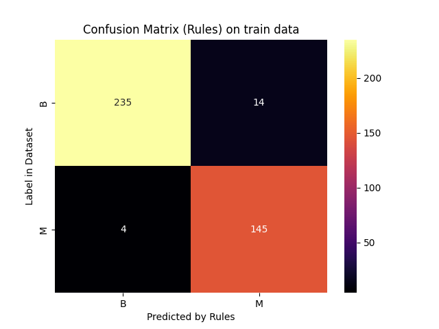
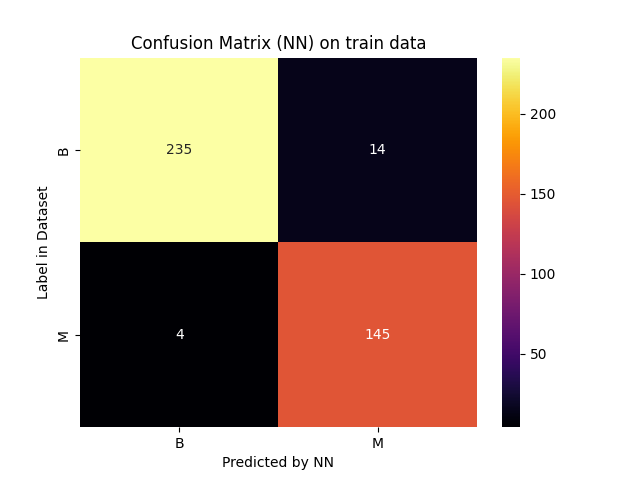
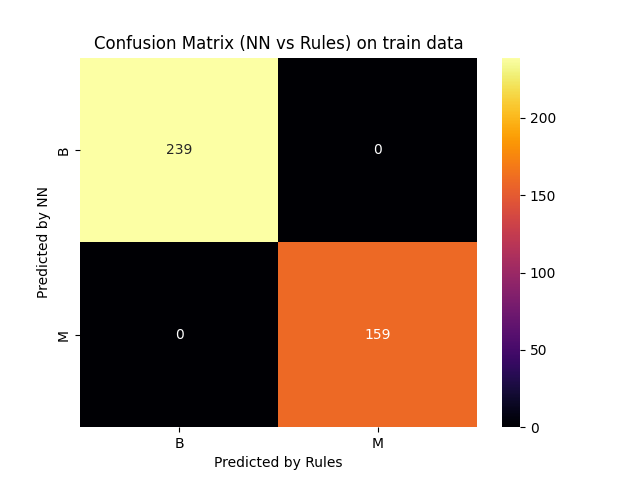

# Report for scenario: train

Rule Extraction Assistant report for alpa on train data.

- algorithm: `alpa`
- seed: `42`

## Extracted Rules

These are the rules extracted in a human-readable form:
```python

IF 0.9814814814814815[(area_worst > 823.86981) AND (compactness_worst > 0.39489999)] THEN OUTPUT_CLASS=M

IF 0.991304347826087[(texture_worst > 26.519758) AND (area_worst > 793.70001)] THEN OUTPUT_CLASS=M

IF 0.9893617021276596[(area_worst > 804.95831) AND (area_se > 46.081497)] THEN OUTPUT_CLASS=M

IF 0.9900990099009901[(texture_worst > 19.799999) AND (area_se > 46.752827)] THEN OUTPUT_CLASS=M

IF 0.9795918367346939[(texture_worst > 26.519758) AND (concave points_worst > 0.1329) AND (concave points_worst <= 0.16875669) AND (compactness_worst > 0.1866) AND (area_worst > 720.91199)] THEN OUTPUT_CLASS=M

IF 0.9761904761904762[(texture_worst > 31.59) AND (compactness_worst > 0.33197734)] THEN OUTPUT_CLASS=M

IF 0.9473684210526315[(area_se > 25.452349) AND (area_worst > 720.91199) AND (smoothness_se <= 0.0046423469)] THEN OUTPUT_CLASS=M

IF 0.9230769230769231[(symmetry_se > 0.03156) AND (texture_worst > 26.34) AND (smoothness_se <= 0.0055029425)] THEN OUTPUT_CLASS=M

IF 0.9166666666666666[(compactness_se <= 0.015880547) AND (compactness_worst > 0.1866) AND (area_worst > 720.91199) AND (texture_worst > 26.519758)] THEN OUTPUT_CLASS=M

IF 0.8888888888888888[(texture_worst <= 26.519758) AND (perimeter_se > 1.973) AND (area_worst > 720.91199) AND (area_worst <= 741.59998)] THEN OUTPUT_CLASS=M

IF 0.7510917030567685[(area_worst <= 977.99597)] THEN OUTPUT_CLASS=B

IF 0.9850746268656716[(area_worst <= 804.95831) AND (texture_worst <= 19.799999)] THEN OUTPUT_CLASS=B

IF 0.875[(texture_worst > 31.59) AND (concave points_worst > 0.091399997) AND (perimeter_se <= 1.646153)] THEN OUTPUT_CLASS=M

IF 0.9917355371900827[(concave points_worst > 0.17394769)] THEN OUTPUT_CLASS=M

IF 0.9911504424778761[(area_worst > 977.99597)] THEN OUTPUT_CLASS=M

IF 0.8[(perimeter_se > 1.973) AND (area_worst > 720.91199) AND (texture_worst <= 17.16)] THEN OUTPUT_CLASS=M

```

And these are the rules with internal decoding:
```python

IF 0.9814814814814815[(h_0,23 > 823.86981) AND (h_0,25 > 0.39489999)] THEN OUTPUT_CLASS=M
Number of clauses: 1

IF 0.991304347826087[(h_0,21 > 26.519758) AND (h_0,23 > 793.70001)] THEN OUTPUT_CLASS=M
Number of clauses: 1

IF 0.9893617021276596[(h_0,23 > 804.95831) AND (h_0,13 > 46.081497)] THEN OUTPUT_CLASS=M
Number of clauses: 1

IF 0.9900990099009901[(h_0,21 > 19.799999) AND (h_0,13 > 46.752827)] THEN OUTPUT_CLASS=M
Number of clauses: 1

IF 0.9795918367346939[(h_0,21 > 26.519758) AND (h_0,27 > 0.1329) AND (h_0,27 <= 0.16875669) AND (h_0,25 > 0.1866) AND (h_0,23 > 720.91199)] THEN OUTPUT_CLASS=M
Number of clauses: 1

IF 0.9761904761904762[(h_0,21 > 31.59) AND (h_0,25 > 0.33197734)] THEN OUTPUT_CLASS=M
Number of clauses: 1

IF 0.9473684210526315[(h_0,13 > 25.452349) AND (h_0,23 > 720.91199) AND (h_0,14 <= 0.0046423469)] THEN OUTPUT_CLASS=M
Number of clauses: 1

IF 0.9230769230769231[(h_0,18 > 0.03156) AND (h_0,21 > 26.34) AND (h_0,14 <= 0.0055029425)] THEN OUTPUT_CLASS=M
Number of clauses: 1

IF 0.9166666666666666[(h_0,15 <= 0.015880547) AND (h_0,25 > 0.1866) AND (h_0,23 > 720.91199) AND (h_0,21 > 26.519758)] THEN OUTPUT_CLASS=M
Number of clauses: 1

IF 0.8888888888888888[(h_0,21 <= 26.519758) AND (h_0,12 > 1.973) AND (h_0,23 > 720.91199) AND (h_0,23 <= 741.59998)] THEN OUTPUT_CLASS=M
Number of clauses: 1

IF 0.7510917030567685[(h_0,23 <= 977.99597)] THEN OUTPUT_CLASS=B
Number of clauses: 1

IF 0.9850746268656716[(h_0,23 <= 804.95831) AND (h_0,21 <= 19.799999)] THEN OUTPUT_CLASS=B
Number of clauses: 1

IF 0.875[(h_0,21 > 31.59) AND (h_0,27 > 0.091399997) AND (h_0,12 <= 1.646153)] THEN OUTPUT_CLASS=M
Number of clauses: 1

IF 0.9917355371900827[(h_0,27 > 0.17394769)] THEN OUTPUT_CLASS=M
Number of clauses: 1

IF 0.9911504424778761[(h_0,23 > 977.99597)] THEN OUTPUT_CLASS=M
Number of clauses: 1

IF 0.8[(h_0,12 > 1.973) AND (h_0,23 > 720.91199) AND (h_0,21 <= 17.16)] THEN OUTPUT_CLASS=M
Number of clauses: 1

```


### Rule Metrics

The following are metrics on the ruleset.


The loop of the ALPA algorithm you used found the following optimum:
- maximum fidelity achieved: `0.9949748743718593`
- rho with maximum fidelity: `1.0`


The following metrics are *per output class*:

|class:                  |                "M"       |                "B"       |
|-----------------------:|:--------------------------------:|:--------------------------------:|
|n_clauses:              |       `14`   |       `2`   |
|min_terms:              |             `1` |             `1` |
|max_terms:              |             `5` |             `2` |
|avg_terms:              |     `2.64` |     `1.5` |
|used features:          |        `area_worst, area_se, perimeter_se, compactness_worst, compactness_se, texture_worst, symmetry_se, smoothness_se, concave points_worst`        |        `area_worst, texture_worst`        |
|features in every rule: | ``        | `area_worst`        |

These metrics are over the *whole ruleset*:

- total number of rules: 16
- common features (used by all classes): `area_worst, texture_worst`
  - number of common features: `2`

## Accuracy and Fidelity

The accuracy and fidelity measures of the neural network compared to the rules.

- neural network:
  - accuracy: `0.9548`
- rules:
  - accuracy: `0.9548`
  - fidelity: `1.0`

## Confusion Matrices







## Performance

- rule extraction:
    - time: `9.3281 sec`
    - memory: `149.8945 MB`
