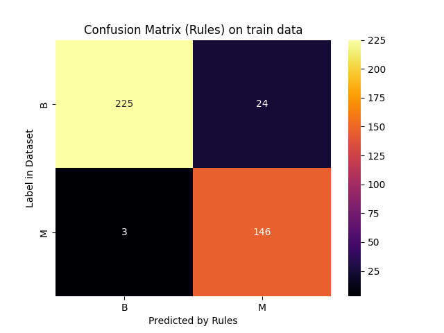
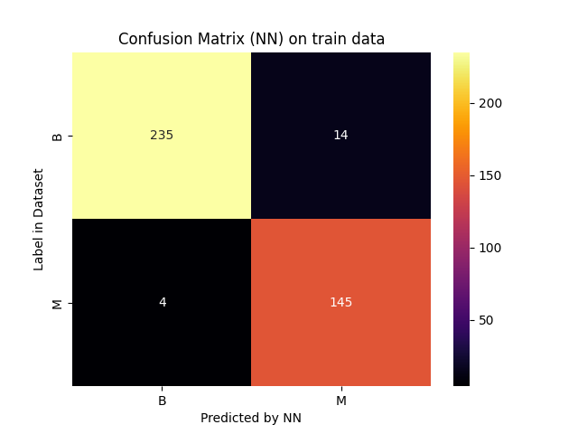
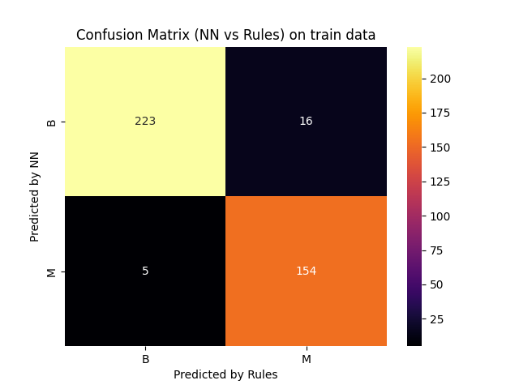

# Report for scenario: train

Rule Extraction Assistant report for dnnre on train data.

- algorithm: `dnnre`
- seed: `42`

## Extracted Rules

These are the rules extracted in a human-readable form:
```python

IF 0.8967580946031551[(concave points_worst > 0.1556) AND (radius_se <= 1.1670001) AND (perimeter_worst > 116.6)] OR 0.9135784651671702[(texture_mean <= 15.62) AND (radius_se <= 1.1670001) AND (perimeter_worst > 116.6) AND (area_mean > 338.29999)] OR 0.9314046834106018[(radius_mean > 13.38) AND (perimeter_worst > 112.5) AND (texture_worst > 23)] OR 0.8307771082837071[(texture_worst > 20.5) AND (perimeter_worst > 105.9)] OR 0.8488695810097084[(perimeter_worst > 101.4) AND (area_se > 30.18) AND (texture_worst > 27.780001) AND (concave points_worst > 0.02832)] OR 0.9089819609064178[(perimeter_worst > 101.4) AND (texture_worst > 27.780001) AND (perimeter_mean > 77.610001) AND (texture_mean <= 26.969999)] OR 0.8641454272246912[(concave points_worst > 0.1556) AND (perimeter_worst > 116.6)] OR 0.8678226418086261[(perimeter_worst > 105.9) AND (texture_worst > 20.5) AND (concave points_worst > 0.1556)] OR 0.905407137623322[(concave points_worst > 0.1556) AND (perimeter_worst > 112.5) AND (texture_worst > 23)] OR 0.9223897371200881[(texture_mean <= 15.62) AND (perimeter_worst > 112.5) AND (texture_worst > 23) AND (area_mean > 338.29999)] OR 0.8764965312819757[(concave points_worst > 0.1556)] OR 0.9225072947759712[(radius_se <= 1.1670001) AND (radius_mean > 13.38) AND (perimeter_worst > 116.6)] OR 0.8633544474286046[(texture_worst > 33.330002) AND (concave points_worst > 0.051849999)] OR 0.7884844136518505[(perimeter_worst > 100.3) AND (radius_se <= 1.1670001)] OR 0.7960891798150417[(perimeter_worst > 100.3) AND (texture_worst > 23)] OR 0.901580223639683[(perimeter_worst > 101.4) AND (texture_worst > 27.780001) AND (texture_mean <= 22.76) AND (perimeter_mean > 74.199997)] OR 0.775886219226942[(perimeter_worst > 100.3) AND (texture_worst > 27.780001)] OR 0.893089150633976[(perimeter_worst > 101.4) AND (texture_worst > 27.780001) AND (area_mean > 366.5) AND (texture_mean <= 19.4)] OR 0.9326505430727348[(perimeter_mean > 77.610001) AND (perimeter_worst > 112.5) AND (texture_worst > 23) AND (texture_mean <= 26.969999)] OR 0.8682156774253872[(perimeter_worst > 101.4) AND (concave points_worst > 0.1556) AND (texture_worst > 23)] OR 0.8626528184972954[(area_se > 30.18) AND (radius_se <= 1.1670001) AND (perimeter_worst > 116.6) AND (concave points_worst > 0.02832)] OR 0.8989815512303687[(perimeter_worst > 101.4) AND (texture_worst > 27.780001) AND (texture_mean <= 15.62) AND (area_mean > 338.29999)] OR 0.8824299320772826[(perimeter_worst > 101.4) AND (concave points_worst > 0.1556) AND (texture_worst > 27.780001)] OR 0.9077677183724793[(perimeter_worst > 101.4) AND (texture_worst > 27.780001) AND (radius_mean > 13.38)] OR 0.9237412531691974[(perimeter_mean > 77.610001) AND (radius_se <= 1.1670001) AND (perimeter_worst > 116.6) AND (texture_mean <= 26.969999)] OR 0.8272568662994542[(perimeter_worst > 110.2)] OR 0.8311533660320239[(perimeter_worst > 101.4) AND (texture_worst > 23)] OR 0.8709729233099016[(area_se > 30.18) AND (perimeter_worst > 112.5) AND (texture_worst > 23) AND (concave points_worst > 0.02832)] OR 0.9250560752192494[(perimeter_mean > 74.199997) AND (texture_mean <= 22.76) AND (perimeter_worst > 112.5) AND (texture_worst > 23)] OR 0.8264996517765256[(texture_worst > 33.330002) AND (perimeter_worst > 110.2) AND (concave points_worst > 0.051849999)] OR 0.8390807275569075[(perimeter_worst > 110.2) AND (concave points_worst > 0.1716)] OR 0.9163439068917878[(texture_mean <= 19.4) AND (perimeter_worst > 112.5) AND (texture_worst > 23) AND (area_mean > 366.5)] OR 0.9075903886759062[(texture_mean <= 19.4) AND (radius_se <= 1.1670001) AND (perimeter_worst > 116.6) AND (area_mean > 366.5)] OR 0.9162193326554122[(radius_se <= 1.1670001) AND (perimeter_mean > 74.199997) AND (texture_mean <= 22.76) AND (perimeter_worst > 116.6)] THEN OUTPUT_CLASS=M

IF 0.8569456697197831[(texture_mean > 15.62) AND (area_mean <= 366.5) AND (concave points_worst <= 0.02832)] OR 0.9484656546396519[(texture_worst <= 23) AND (perimeter_worst <= 105.9)] OR 0.843519641648644[(concave points_worst <= 0.1556) AND (concave points_mean > 0.03613) AND (area_se <= 24.870001) AND (texture_mean > 19.4) AND (perimeter_mean <= 74.199997)] OR 0.9287787600641052[(concave points_worst <= 0.051849999)] OR 0.8011400215283817[(texture_worst <= 23) AND (concave points_worst <= 0.1556) AND (perimeter_worst <= 110.2)] OR 0.8174199555673495[(radius_mean <= 13.38) AND (perimeter_worst <= 100.3) AND (area_se <= 30.18) AND (texture_mean > 26.969999) AND (concave points_worst <= 0.1556)] OR 0.9452505168273141[(perimeter_worst <= 116.6) AND (texture_worst <= 20.5)] OR 0.8389677885368507[(area_mean <= 338.29999) AND (concave points_worst <= 0.02832)] OR 0.841776832471684[(area_se <= 24.870001) AND (area_mean <= 338.29999) AND (concave points_mean > 0.03613) AND (concave points_worst <= 0.1556)] OR 0.8407047818878587[(concave points_worst <= 0.02832) AND (perimeter_mean <= 74.199997) AND (texture_mean > 19.4)] OR 0.8231361790328555[(perimeter_mean <= 77.610001) AND (texture_mean > 22.76) AND (perimeter_worst <= 100.3) AND (area_se <= 30.18) AND (concave points_worst <= 0.1556)] OR 0.9380203397662356[(concave points_worst <= 0.1716) AND (perimeter_worst <= 101.4) AND (texture_worst <= 33.330002)] OR 0.85981490745322[(area_mean <= 366.5) AND (concave points_mean > 0.03613) AND (texture_mean > 15.62) AND (area_se <= 24.870001) AND (concave points_worst <= 0.1556)] OR 0.8694375891034535[(area_mean <= 366.5) AND (perimeter_worst <= 100.3) AND (area_se <= 30.18) AND (texture_mean > 15.62) AND (concave points_worst <= 0.1556)] OR 0.8056754159758646[(concave points_worst <= 0.02832) AND (radius_mean <= 13.38) AND (texture_mean > 26.969999)] OR 0.8521203236502135[(perimeter_worst <= 112.5) AND (concave points_worst <= 0.1556) AND (texture_worst <= 27.780001)] OR 0.8140259478847054[(perimeter_mean <= 77.610001) AND (texture_mean > 22.76) AND (concave points_mean > 0.03613) AND (area_se <= 24.870001) AND (concave points_worst <= 0.1556)] OR 0.8539272752293825[(concave points_worst <= 0.1556) AND (perimeter_worst <= 110.2)] OR 0.8511976396817028[(area_mean <= 338.29999) AND (perimeter_worst <= 100.3) AND (concave points_worst <= 0.1556) AND (area_se <= 30.18)] OR 0.8083729899132838[(radius_mean <= 13.38) AND (concave points_mean > 0.03613) AND (area_se <= 24.870001) AND (texture_mean > 26.969999) AND (concave points_worst <= 0.1556)] OR 0.8113095097938777[(texture_mean > 22.76) AND (concave points_worst <= 0.02832) AND (perimeter_mean <= 77.610001)] OR 0.8529599536354951[(concave points_worst <= 0.1556) AND (perimeter_worst <= 100.3) AND (area_se <= 30.18) AND (texture_mean > 19.4) AND (perimeter_mean <= 74.199997)] THEN OUTPUT_CLASS=B

```

And these are the rules with internal decoding:
```python

IF 0.8967580946031551[(h_0,27 > 0.1556) AND (h_0,10 <= 1.1670001) AND (h_0,22 > 116.6)] OR 0.9135784651671702[(h_0,1 <= 15.62) AND (h_0,10 <= 1.1670001) AND (h_0,22 > 116.6) AND (h_0,3 > 338.29999)] OR 0.9314046834106018[(h_0,0 > 13.38) AND (h_0,22 > 112.5) AND (h_0,21 > 23)] OR 0.8307771082837071[(h_0,21 > 20.5) AND (h_0,22 > 105.9)] OR 0.8488695810097084[(h_0,22 > 101.4) AND (h_0,13 > 30.18) AND (h_0,21 > 27.780001) AND (h_0,27 > 0.02832)] OR 0.9089819609064178[(h_0,22 > 101.4) AND (h_0,21 > 27.780001) AND (h_0,2 > 77.610001) AND (h_0,1 <= 26.969999)] OR 0.8641454272246912[(h_0,27 > 0.1556) AND (h_0,22 > 116.6)] OR 0.8678226418086261[(h_0,22 > 105.9) AND (h_0,21 > 20.5) AND (h_0,27 > 0.1556)] OR 0.905407137623322[(h_0,27 > 0.1556) AND (h_0,22 > 112.5) AND (h_0,21 > 23)] OR 0.9223897371200881[(h_0,1 <= 15.62) AND (h_0,22 > 112.5) AND (h_0,21 > 23) AND (h_0,3 > 338.29999)] OR 0.8764965312819757[(h_0,27 > 0.1556)] OR 0.9225072947759712[(h_0,10 <= 1.1670001) AND (h_0,0 > 13.38) AND (h_0,22 > 116.6)] OR 0.8633544474286046[(h_0,21 > 33.330002) AND (h_0,27 > 0.051849999)] OR 0.7884844136518505[(h_0,22 > 100.3) AND (h_0,10 <= 1.1670001)] OR 0.7960891798150417[(h_0,22 > 100.3) AND (h_0,21 > 23)] OR 0.901580223639683[(h_0,22 > 101.4) AND (h_0,21 > 27.780001) AND (h_0,1 <= 22.76) AND (h_0,2 > 74.199997)] OR 0.775886219226942[(h_0,22 > 100.3) AND (h_0,21 > 27.780001)] OR 0.893089150633976[(h_0,22 > 101.4) AND (h_0,21 > 27.780001) AND (h_0,3 > 366.5) AND (h_0,1 <= 19.4)] OR 0.9326505430727348[(h_0,2 > 77.610001) AND (h_0,22 > 112.5) AND (h_0,21 > 23) AND (h_0,1 <= 26.969999)] OR 0.8682156774253872[(h_0,22 > 101.4) AND (h_0,27 > 0.1556) AND (h_0,21 > 23)] OR 0.8626528184972954[(h_0,13 > 30.18) AND (h_0,10 <= 1.1670001) AND (h_0,22 > 116.6) AND (h_0,27 > 0.02832)] OR 0.8989815512303687[(h_0,22 > 101.4) AND (h_0,21 > 27.780001) AND (h_0,1 <= 15.62) AND (h_0,3 > 338.29999)] OR 0.8824299320772826[(h_0,22 > 101.4) AND (h_0,27 > 0.1556) AND (h_0,21 > 27.780001)] OR 0.9077677183724793[(h_0,22 > 101.4) AND (h_0,21 > 27.780001) AND (h_0,0 > 13.38)] OR 0.9237412531691974[(h_0,2 > 77.610001) AND (h_0,10 <= 1.1670001) AND (h_0,22 > 116.6) AND (h_0,1 <= 26.969999)] OR 0.8272568662994542[(h_0,22 > 110.2)] OR 0.8311533660320239[(h_0,22 > 101.4) AND (h_0,21 > 23)] OR 0.8709729233099016[(h_0,13 > 30.18) AND (h_0,22 > 112.5) AND (h_0,21 > 23) AND (h_0,27 > 0.02832)] OR 0.9250560752192494[(h_0,2 > 74.199997) AND (h_0,1 <= 22.76) AND (h_0,22 > 112.5) AND (h_0,21 > 23)] OR 0.8264996517765256[(h_0,21 > 33.330002) AND (h_0,22 > 110.2) AND (h_0,27 > 0.051849999)] OR 0.8390807275569075[(h_0,22 > 110.2) AND (h_0,27 > 0.1716)] OR 0.9163439068917878[(h_0,1 <= 19.4) AND (h_0,22 > 112.5) AND (h_0,21 > 23) AND (h_0,3 > 366.5)] OR 0.9075903886759062[(h_0,1 <= 19.4) AND (h_0,10 <= 1.1670001) AND (h_0,22 > 116.6) AND (h_0,3 > 366.5)] OR 0.9162193326554122[(h_0,10 <= 1.1670001) AND (h_0,2 > 74.199997) AND (h_0,1 <= 22.76) AND (h_0,22 > 116.6)] THEN OUTPUT_CLASS=M
Number of clauses: 34

IF 0.8569456697197831[(h_0,1 > 15.62) AND (h_0,3 <= 366.5) AND (h_0,27 <= 0.02832)] OR 0.9484656546396519[(h_0,21 <= 23) AND (h_0,22 <= 105.9)] OR 0.843519641648644[(h_0,27 <= 0.1556) AND (h_0,7 > 0.03613) AND (h_0,13 <= 24.870001) AND (h_0,1 > 19.4) AND (h_0,2 <= 74.199997)] OR 0.9287787600641052[(h_0,27 <= 0.051849999)] OR 0.8011400215283817[(h_0,21 <= 23) AND (h_0,27 <= 0.1556) AND (h_0,22 <= 110.2)] OR 0.8174199555673495[(h_0,0 <= 13.38) AND (h_0,22 <= 100.3) AND (h_0,13 <= 30.18) AND (h_0,1 > 26.969999) AND (h_0,27 <= 0.1556)] OR 0.9452505168273141[(h_0,22 <= 116.6) AND (h_0,21 <= 20.5)] OR 0.8389677885368507[(h_0,3 <= 338.29999) AND (h_0,27 <= 0.02832)] OR 0.841776832471684[(h_0,13 <= 24.870001) AND (h_0,3 <= 338.29999) AND (h_0,7 > 0.03613) AND (h_0,27 <= 0.1556)] OR 0.8407047818878587[(h_0,27 <= 0.02832) AND (h_0,2 <= 74.199997) AND (h_0,1 > 19.4)] OR 0.8231361790328555[(h_0,2 <= 77.610001) AND (h_0,1 > 22.76) AND (h_0,22 <= 100.3) AND (h_0,13 <= 30.18) AND (h_0,27 <= 0.1556)] OR 0.9380203397662356[(h_0,27 <= 0.1716) AND (h_0,22 <= 101.4) AND (h_0,21 <= 33.330002)] OR 0.85981490745322[(h_0,3 <= 366.5) AND (h_0,7 > 0.03613) AND (h_0,1 > 15.62) AND (h_0,13 <= 24.870001) AND (h_0,27 <= 0.1556)] OR 0.8694375891034535[(h_0,3 <= 366.5) AND (h_0,22 <= 100.3) AND (h_0,13 <= 30.18) AND (h_0,1 > 15.62) AND (h_0,27 <= 0.1556)] OR 0.8056754159758646[(h_0,27 <= 0.02832) AND (h_0,0 <= 13.38) AND (h_0,1 > 26.969999)] OR 0.8521203236502135[(h_0,22 <= 112.5) AND (h_0,27 <= 0.1556) AND (h_0,21 <= 27.780001)] OR 0.8140259478847054[(h_0,2 <= 77.610001) AND (h_0,1 > 22.76) AND (h_0,7 > 0.03613) AND (h_0,13 <= 24.870001) AND (h_0,27 <= 0.1556)] OR 0.8539272752293825[(h_0,27 <= 0.1556) AND (h_0,22 <= 110.2)] OR 0.8511976396817028[(h_0,3 <= 338.29999) AND (h_0,22 <= 100.3) AND (h_0,27 <= 0.1556) AND (h_0,13 <= 30.18)] OR 0.8083729899132838[(h_0,0 <= 13.38) AND (h_0,7 > 0.03613) AND (h_0,13 <= 24.870001) AND (h_0,1 > 26.969999) AND (h_0,27 <= 0.1556)] OR 0.8113095097938777[(h_0,1 > 22.76) AND (h_0,27 <= 0.02832) AND (h_0,2 <= 77.610001)] OR 0.8529599536354951[(h_0,27 <= 0.1556) AND (h_0,22 <= 100.3) AND (h_0,13 <= 30.18) AND (h_0,1 > 19.4) AND (h_0,2 <= 74.199997)] THEN OUTPUT_CLASS=B
Number of clauses: 22

```


### Rule Metrics

The following are metrics on the ruleset.


The following metrics are *per output class*:

|class:                  |                "M"       |                "B"       |
|-----------------------:|:--------------------------------:|:--------------------------------:|
|n_clauses:              |       `34`   |       `22`   |
|min_terms:              |             `1` |             `1` |
|max_terms:              |             `4` |             `5` |
|avg_terms:              |     `3.09` |     `3.55` |
|used features:          |        `texture_mean, radius_se, radius_mean, area_se, area_mean, perimeter_worst, perimeter_mean, texture_worst, concave points_worst`        |        `texture_mean, concave points_mean, radius_mean, area_se, area_mean, perimeter_worst, perimeter_mean, texture_worst, concave points_worst`        |
|features in every rule: | `texture_mean, radius_se, radius_mean, area_se, area_mean, perimeter_worst, perimeter_mean, texture_worst, concave points_worst`        | `texture_mean, concave points_mean, radius_mean, area_se, area_mean, perimeter_worst, perimeter_mean, texture_worst, concave points_worst`        |

These metrics are over the *whole ruleset*:

- total number of rules: 2
- common features (used by all classes): `texture_mean, radius_mean, area_se, area_mean, perimeter_worst, perimeter_mean, texture_worst, concave points_worst`
  - number of common features: `8`

## Accuracy and Fidelity

The accuracy and fidelity measures of the neural network compared to the rules.

- neural network:
  - accuracy: `0.9548`
- rules:
  - accuracy: `0.9322`
  - fidelity: `0.9472`

## Confusion Matrices







## Performance

- rule extraction:
    - time: `2.4062 sec`
    - memory: `85.4453 MB`
