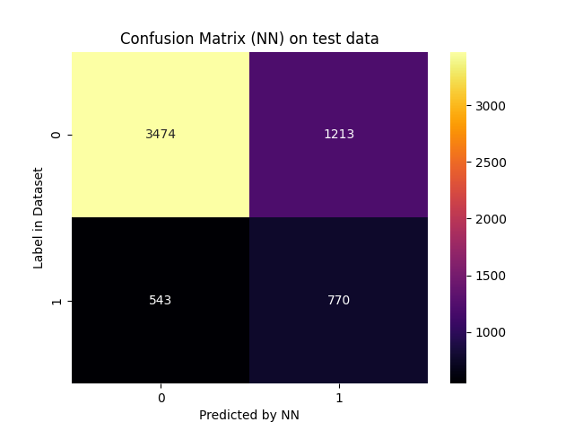
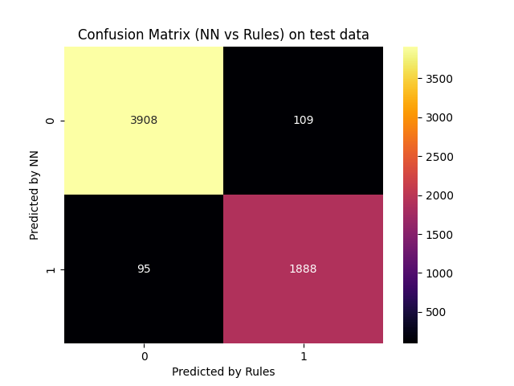

# Report for scenario: test

Rule Extraction Assistant report for alpa on test data.

- algorithm: `alpa`
- seed: `42`

## Extracted Rules

These are the rules extracted in a human-readable form:
```python

IF 0.9511111111111111[(PAY_6 > 0.337257) AND (PAY_4 > -1.26867247) AND (AGE > 42.999999720000005) AND (PAY_0 > -0.49915650000000006)] THEN OUTPUT_CLASS=1

IF 0.9478260869565217[(PAY_3 > -0.4593467000000001) AND (EDUCATION <= 1.481667) AND (MARRIAGE <= 1.46011914) AND (AGE > 46.152857100000006) AND (LIMIT_BAL <= 163166.57290000003)] THEN OUTPUT_CLASS=1

IF 0.9442687747035573[(PAY_0 > 1.4762108)] THEN OUTPUT_CLASS=1

IF 0.9034749034749034[(PAY_3 > -0.4593467000000001) AND (PAY_5 > -0.6393614) AND (EDUCATION <= 1.481667) AND (LIMIT_BAL <= 149999.9986) AND (BILL_AMT3 <= 44959.00223700002) AND (SEX <= 1.0) AND (BILL_AMT5 <= 66222.01041314998)] THEN OUTPUT_CLASS=1

IF 0.8563288563288564[(PAY_3 > -0.4593467000000001) AND (SEX <= 1.0) AND (BILL_AMT5 <= 154387.00001549997) AND (MARRIAGE <= 1.46011914)] THEN OUTPUT_CLASS=1

IF 0.6824516129032258[(PAY_3 > -0.4593467000000001) AND (LIMIT_BAL <= 99222.27688)] THEN OUTPUT_CLASS=1

IF 0.9919467787114846[(PAY_5 > -0.6393614) AND (BILL_AMT2 <= 211137.01131852003) AND (PAY_2 > 1.0000000999999996) AND (PAY_0 > -0.49915650000000006)] THEN OUTPUT_CLASS=1

IF 0.9954389965792474[(PAY_3 > -0.4593467000000001) AND (PAY_5 > -0.3502182000000001) AND (MARRIAGE <= 1.46011914) AND (PAY_0 > -0.8491309) AND (LIMIT_BAL <= 62500.823650000006) AND (PAY_6 > -0.5618667000000002) AND (EDUCATION <= 3.0) AND (BILL_AMT4 <= 20217.994384240006)] THEN OUTPUT_CLASS=1

IF 0.9953488372093023[(PAY_3 > -0.4593467000000001) AND (AGE > 44.00000034000001) AND (MARRIAGE <= 1.46011914) AND (EDUCATION <= 2.4803701200000003) AND (PAY_6 > -0.5618667000000002) AND (LIMIT_BAL <= 127031.2264) AND (BILL_AMT4 <= 51136.994494180006) AND (PAY_0 > -0.5685202)] THEN OUTPUT_CLASS=1

IF 0.9946091644204852[(PAY_2 > 1.0000000999999996) AND (PAY_4 > 1.6408538) AND (PAY_AMT6 > 219.99999969216003)] THEN OUTPUT_CLASS=1

IF 0.9943502824858758[(PAY_3 > -0.4593467000000001) AND (LIMIT_BAL <= 12392.800695999998) AND (MARRIAGE <= 2.00000007) AND (PAY_4 > -0.2599498) AND (PAY_6 > -0.5618667000000002) AND (SEX <= 1.0) AND (PAY_0 > -0.6408536)] THEN OUTPUT_CLASS=1

IF 0.9941860465116279[(PAY_3 > -0.4593467000000001) AND (MARRIAGE <= 2.00000007) AND (PAY_6 > -0.5618667000000002) AND (LIMIT_BAL <= 99222.27688) AND (PAY_AMT4 <= 849.9999599999999) AND (AGE > 25.424075222) AND (SEX <= 1.0) AND (PAY_0 > -0.6408536) AND (BILL_AMT3 <= 17517.998888278013)] THEN OUTPUT_CLASS=1

IF 0.9944690265486725[(PAY_3 > -0.4593467000000001) AND (PAY_5 > 0.7545181000000001) AND (PAY_6 > 0.337257) AND (LIMIT_BAL <= 99222.27688) AND (BILL_AMT2 <= 55559.00608956001) AND (PAY_0 > -0.5685202)] THEN OUTPUT_CLASS=1

IF 0.9920508744038156[(PAY_3 > -0.4593467000000001) AND (MARRIAGE <= 1.46011914) AND (EDUCATION <= 2.4803701200000003) AND (PAY_AMT6 <= 1381.9999588488) AND (PAY_6 > -0.5618667000000002) AND (AGE > 36.24265288) AND (BILL_AMT4 <= 51136.994494180006) AND (PAY_0 > -0.5685202) AND (PAY_4 > -0.6450948000000001) AND (LIMIT_BAL <= 163166.57290000003)] THEN OUTPUT_CLASS=1

IF 0.9538461538461539[(PAY_3 > -0.4593467000000001) AND (BILL_AMT2 <= 2929.9963268880115) AND (MARRIAGE <= 1.46011914) AND (PAY_6 > -0.5618667000000002) AND (LIMIT_BAL <= 99222.27688)] THEN OUTPUT_CLASS=1

IF 0.9936224489795918[(BILL_AMT5 <= 30359.996185249995) AND (MARRIAGE <= 1.46011914) AND (PAY_0 > -0.49915650000000006) AND (PAY_4 > -1.26867247) AND (SEX <= 1.0) AND (LIMIT_BAL <= 63930.03022)] THEN OUTPUT_CLASS=1

IF 0.9940119760479041[(PAY_3 > -0.4593467000000001) AND (MARRIAGE <= 1.46011914) AND (AGE > 47.09515758) AND (LIMIT_BAL <= 209999.99800000002) AND (PAY_2 > -0.5765290000000001) AND (SEX <= 1.0)] THEN OUTPUT_CLASS=1

IF 0.9910313901345291[(PAY_3 > -0.4593467000000001) AND (MARRIAGE <= 2.00000007) AND (LIMIT_BAL <= 71793.60517) AND (EDUCATION <= 2.4803701200000003) AND (PAY_4 > -0.2599498) AND (PAY_AMT4 > 1650.0000429) AND (PAY_AMT4 <= 4019.0000337) AND (PAY_6 > -0.5618667000000002) AND (BILL_AMT4 <= 35458.00622577999) AND (SEX <= 1.0) AND (PAY_0 > -0.6408536)] THEN OUTPUT_CLASS=1

IF 0.9905561385099685[(PAY_3 > -0.4593467000000001) AND (MARRIAGE <= 2.00000007) AND (BILL_AMT4 <= 48621.00382660001) AND (PAY_4 > -0.2599498) AND (PAY_AMT6 <= 2718.0000546384) AND (PAY_6 > -0.5618667000000002) AND (LIMIT_BAL <= 99222.27688) AND (SEX <= 1.0) AND (AGE > 35.1128819) AND (PAY_0 > -0.6408536)] THEN OUTPUT_CLASS=1

IF 0.9992872416250891[(MARRIAGE <= 1.46011914) AND (BILL_AMT5 <= 176498.00822820002) AND (PAY_2 > 1.0000000999999996) AND (PAY_0 > -0.49915650000000006)] THEN OUTPUT_CLASS=1

IF 0.9923273657289002[(PAY_2 > 2.0000001)] THEN OUTPUT_CLASS=1

IF 0.9928057553956835[(PAY_3 > -0.4593467000000001) AND (MARRIAGE <= 1.46011914) AND (PAY_5 > 0.9554298999999999) AND (BILL_AMT5 <= 60986.00372889999) AND (PAY_AMT6 <= 9118.000305210002)] THEN OUTPUT_CLASS=1

IF 0.9916413373860182[(PAY_3 > -0.4593467000000001) AND (MARRIAGE <= 2.00000007) AND (LIMIT_BAL <= 71793.60517) AND (EDUCATION <= 2.4803701200000003) AND (PAY_4 > -0.2599498) AND (PAY_AMT4 <= 4019.0000337) AND (PAY_6 > -0.5618667000000002) AND (BILL_AMT4 <= 35458.00622577999) AND (SEX <= 1.0) AND (PAY_AMT6 <= 2931.0000618378003) AND (PAY_0 > -0.6408536)] THEN OUTPUT_CLASS=1

IF 0.9929178470254958[(PAY_3 > -0.4593467000000001) AND (PAY_AMT6 <= 8549.999968812) AND (PAY_6 > 0.337257) AND (BILL_AMT4 <= 55729.00151163998) AND (SEX <= 1.0)] THEN OUTPUT_CLASS=1

IF 0.992818671454219[(MARRIAGE <= 2.00000007) AND (PAY_5 > -1.7633148) AND (PAY_0 > -0.49915650000000006) AND (PAY_AMT2 <= 7544.9998009073) AND (PAY_2 > 1.0000000999999996) AND (BILL_AMT2 <= 211137.01131852003)] THEN OUTPUT_CLASS=1

IF 0.9931818181818182[(PAY_3 > -0.4593467000000001) AND (BILL_AMT1 <= 182026.01289647003) AND (EDUCATION <= 1.481667) AND (PAY_4 > 1.0000000999999996) AND (PAY_5 > 0.9554298999999999)] THEN OUTPUT_CLASS=1

IF 0.9919786096256684[(PAY_3 > -0.4593467000000001) AND (MARRIAGE <= 2.00000007) AND (EDUCATION <= 1.481667) AND (PAY_AMT6 <= 8060.000071386001) AND (PAY_4 > -0.2599498) AND (PAY_6 > -0.5618667000000002) AND (BILL_AMT4 <= 51245.99814466) AND (LIMIT_BAL <= 99222.27688) AND (SEX <= 1.0) AND (PAY_AMT4 <= 2266.1787231000003) AND (PAY_0 > -0.6408536)] THEN OUTPUT_CLASS=1

IF 0.9915700737618546[(BILL_AMT5 <= 30359.996185249995) AND (PAY_6 > -1.6366443099999999) AND (MARRIAGE <= 1.46011914) AND (PAY_0 > -0.49915650000000006) AND (PAY_AMT4 <= 5172.9997383) AND (PAY_4 > -1.26867247) AND (LIMIT_BAL <= 201863.287) AND (SEX <= 1.0)] THEN OUTPUT_CLASS=1

IF 0.9956896551724138[(PAY_3 > -0.4593467000000001) AND (MARRIAGE <= 1.46011914) AND (PAY_4 > 1.0000000999999996) AND (PAY_AMT2 <= 10842.0001215457) AND (LIMIT_BAL <= 163166.57290000003)] THEN OUTPUT_CLASS=1

IF 0.9960369881109643[(PAY_3 > -0.4593467000000001) AND (BILL_AMT3 <= 101494.01791936) AND (PAY_5 > 0.9554298999999999) AND (PAY_0 > -0.49915650000000006) AND (SEX <= 1.0) AND (LIMIT_BAL <= 169999.9984)] THEN OUTPUT_CLASS=1

IF 0.9961013645224172[(BILL_AMT3 > 218141.98797140006) AND (PAY_5 <= 0.9554298999999999) AND (PAY_2 <= 1.0000000999999996) AND (LIMIT_BAL > 271865.67220000003) AND (PAY_0 <= 1.4762108)] THEN OUTPUT_CLASS=0

IF 0.9962210675484175[(PAY_5 <= 0.9554298999999999) AND (BILL_AMT4 > 3107.00091285999) AND (PAY_0 <= -0.49915650000000006) AND (PAY_3 <= -1.0)] THEN OUTPUT_CLASS=0

IF 0.9939759036144579[(PAY_0 <= 1.4762108) AND (BILL_AMT5 > 110592.00477719998) AND (PAY_AMT2 > 23000.000054963) AND (PAY_2 <= 1.0000000999999996)] THEN OUTPUT_CLASS=0

IF 0.9942196531791907[(PAY_5 <= 0.9554298999999999) AND (PAY_2 <= 1.0000000999999996) AND (AGE <= 47.09515758) AND (PAY_AMT2 > 4499.999827682) AND (LIMIT_BAL > 271865.67220000003) AND (PAY_0 <= 1.4762108)] THEN OUTPUT_CLASS=0

IF 0.9933862433862434[(LIMIT_BAL > 163166.57290000003) AND (PAY_0 <= 1.4762108) AND (PAY_AMT4 > 18462.000249) AND (PAY_2 <= 1.0000000999999996)] THEN OUTPUT_CLASS=0

IF 0.9933920704845814[(PAY_5 <= -0.6393614) AND (PAY_AMT2 > 7544.9998009073) AND (PAY_3 <= -1.0) AND (MARRIAGE > 1.46011914)] THEN OUTPUT_CLASS=0

IF 0.98005698005698[(PAY_AMT4 > 9517.999932) AND (PAY_3 <= 1.0000000999999996) AND (BILL_AMT2 > 211137.01131852003)] THEN OUTPUT_CLASS=0

IF 0.9966777408637874[(PAY_3 <= 1.0000000999999996) AND (BILL_AMT5 > 176498.00822820002) AND (SEX > 1.0) AND (PAY_0 <= 1.4762108) AND (BILL_AMT2 > 211137.01131852003)] THEN OUTPUT_CLASS=0

IF 0.9961416250567408[(PAY_2 <= -0.4309186000000001) AND (PAY_6 <= 0.337257) AND (PAY_AMT2 > 1.9999999608422) AND (PAY_0 <= -0.8491309)] THEN OUTPUT_CLASS=0

IF 0.9964285714285714[(PAY_3 <= 1.0000000999999996) AND (BILL_AMT5 > 41686.99992264999) AND (PAY_6 <= 0.337257) AND (BILL_AMT1 <= 29523.001169419997) AND (PAY_2 <= 1.0000000999999996) AND (SEX > 1.0) AND (PAY_0 <= 1.4762108)] THEN OUTPUT_CLASS=0

IF 0.9956140350877193[(AGE <= 43.21224318) AND (PAY_3 <= 1.0000000999999996) AND (BILL_AMT2 > 61650.00733188001) AND (EDUCATION > 1.481667) AND (PAY_6 <= 0.337257) AND (PAY_4 <= 1.0000000999999996) AND (PAY_2 <= 1.0000000999999996) AND (PAY_AMT4 > 520.00000731) AND (SEX > 1.0) AND (LIMIT_BAL > 66464.60149) AND (PAY_0 <= 1.4762108)] THEN OUTPUT_CLASS=0

IF 0.9990677439403356[(PAY_5 <= 0.7545181000000001) AND (EDUCATION > 1.481667) AND (PAY_6 <= 2.0000001) AND (PAY_2 <= 1.0000000999999996) AND (PAY_3 <= 1.6100894) AND (SEX > 1.0) AND (PAY_0 <= 1.4762108) AND (MARRIAGE > 1.46011914)] THEN OUTPUT_CLASS=0

IF 0.9971014492753624[(PAY_AMT6 > 8336.99938008) AND (MARRIAGE <= 1.46011914) AND (PAY_4 <= 1.0000000999999996) AND (SEX > 1.0) AND (PAY_0 <= -0.49915650000000006)] THEN OUTPUT_CLASS=0

IF 0.9973045822102425[(LIMIT_BAL > 40000.00069) AND (PAY_4 <= 1.0000000999999996) AND (SEX > 1.0) AND (PAY_0 <= -0.49915650000000006) AND (PAY_4 > -0.6450948000000001) AND (MARRIAGE > 1.46011914)] THEN OUTPUT_CLASS=0

IF 0.9944598337950139[(PAY_5 <= 0.9554298999999999) AND (BILL_AMT3 > 144314.99226645002) AND (PAY_2 <= 1.0000000999999996) AND (BILL_AMT5 > 110592.00477719998) AND (PAY_0 <= 1.4762108) AND (AGE <= 36.328269)] THEN OUTPUT_CLASS=0

IF 0.9992331288343558[(LIMIT_BAL > 329999.9968) AND (PAY_4 <= 1.0000000999999996) AND (PAY_2 <= 1.0000000999999996) AND (PAY_0 <= 1.4762108) AND (MARRIAGE > 1.46011914)] THEN OUTPUT_CLASS=0

IF 0.9986197377501725[(MARRIAGE > 1.46011914) AND (PAY_3 <= -0.4593467000000001) AND (PAY_2 <= 1.0000000999999996) AND (LIMIT_BAL > 100000.00305999999)] THEN OUTPUT_CLASS=0

IF 0.9996802046690119[(PAY_5 <= 0.9554298999999999) AND (PAY_0 <= -0.6408536) AND (PAY_4 <= 1.0000000999999996) AND (PAY_2 <= 1.0000000999999996) AND (MARRIAGE > 1.46011914)] THEN OUTPUT_CLASS=0

IF 0.9990034877927254[(PAY_0 <= -0.5685202) AND (PAY_5 <= 0.9554298999999999) AND (PAY_4 <= 1.0000000999999996) AND (PAY_2 <= 1.0000000999999996) AND (LIMIT_BAL > 271865.67220000003)] THEN OUTPUT_CLASS=0

IF 0.9994934143870314[(PAY_0 <= -0.5685202) AND (PAY_3 <= 0.7654725000000001) AND (PAY_6 <= 0.337257) AND (PAY_2 <= 1.0000000999999996) AND (SEX > 1.0)] THEN OUTPUT_CLASS=0

IF 0.9990530303030303[(AGE <= 35.1128819) AND (PAY_5 <= 0.9554298999999999) AND (PAY_3 <= 0.7654725000000001) AND (EDUCATION > 1.481667) AND (PAY_4 <= 1.0000000999999996) AND (PAY_2 <= 1.0000000999999996) AND (SEX > 1.0) AND (BILL_AMT4 > 10748.997587619986) AND (PAY_0 > -0.5685202) AND (PAY_0 <= 1.4762108) AND (LIMIT_BAL > 114764.7205)] THEN OUTPUT_CLASS=0

IF 0.9975550122249389[(PAY_3 <= 1.0000000999999996) AND (AGE <= 48.3302525) AND (BILL_AMT5 > 27574.001122749993) AND (PAY_6 <= 0.337257) AND (LIMIT_BAL > 99222.27688) AND (PAY_4 <= 1.0000000999999996) AND (PAY_2 <= 1.0000000999999996) AND (PAY_0 <= 1.4762108) AND (BILL_AMT3 <= 40125.00388029001) AND (MARRIAGE > 1.46011914)] THEN OUTPUT_CLASS=0

IF 0.9984326018808778[(BILL_AMT4 > 69046.00339348) AND (PAY_4 <= 1.0000000999999996) AND (PAY_2 <= 1.0000000999999996) AND (SEX > 1.0) AND (PAY_AMT6 > 4540.0000551648) AND (MARRIAGE > 1.46011914)] THEN OUTPUT_CLASS=0

IF 0.9980276134122288[(PAY_5 <= 0.9554298999999999) AND (PAY_2 <= 1.0000000999999996) AND (BILL_AMT5 > 134645.010388) AND (BILL_AMT1 > 167299.01731268) AND (MARRIAGE > 1.46011914)] THEN OUTPUT_CLASS=0

IF 0.9975308641975309[(SEX > 1.0) AND (PAY_4 <= 1.0000000999999996) AND (LIMIT_BAL > 319999.987) AND (PAY_0 <= -0.49915650000000006)] THEN OUTPUT_CLASS=0

IF 0.9967488485505284[(PAY_3 <= 1.0000000999999996) AND (PAY_2 <= 1.0000000999999996) AND (PAY_4 <= -0.2599498) AND (PAY_0 <= 1.4762108) AND (MARRIAGE > 1.46011914)] THEN OUTPUT_CLASS=0

IF 0.9963636363636363[(SEX <= 1.0) AND (PAY_AMT2 <= 1700.000084614) AND (PAY_3 > -1.0) AND (PAY_2 > 1.0000000999999996)] THEN OUTPUT_CLASS=1

IF 0.9874167283493709[(PAY_3 > -0.4593467000000001) AND (PAY_5 > -0.3502182000000001) AND (MARRIAGE <= 1.46011914) AND (PAY_0 > -0.8491309) AND (EDUCATION <= 2.4803701200000003) AND (PAY_6 > -0.5618667000000002) AND (BILL_AMT5 <= 41686.99992264999) AND (BILL_AMT2 <= 61650.00733188001) AND (LIMIT_BAL <= 99222.27688)] THEN OUTPUT_CLASS=1

IF 0.9828080229226361[(PAY_0 > -0.5685202) AND (LIMIT_BAL <= 67409.73865) AND (PAY_3 > 1.6100894) AND (PAY_6 > -0.5618667000000002)] THEN OUTPUT_CLASS=1

IF 0.9827586206896551[(PAY_3 > -0.4593467000000001) AND (PAY_5 > -0.3502182000000001) AND (MARRIAGE <= 1.46011914) AND (LIMIT_BAL <= 99222.27688) AND (AGE > 56.054352040000005)] THEN OUTPUT_CLASS=1

IF 0.9824561403508771[(PAY_3 > -0.4593467000000001) AND (EDUCATION <= 1.481667) AND (LIMIT_BAL <= 24451.84378) AND (PAY_6 > 0.337257)] THEN OUTPUT_CLASS=1

IF 0.9821428571428571[(PAY_3 > -0.4593467000000001) AND (BILL_AMT3 <= 80831.00491024999) AND (PAY_6 > -1.6366443099999999) AND (LIMIT_BAL > 99222.27688) AND (LIMIT_BAL <= 149999.9986) AND (SEX <= 1.0) AND (AGE > 48.3302525) AND (BILL_AMT5 <= 66222.01041314998)] THEN OUTPUT_CLASS=1

IF 0.9821428571428571[(PAY_0 > -0.5685202) AND (PAY_3 > 1.0000000999999996) AND (SEX <= 1.0)] THEN OUTPUT_CLASS=1

IF 0.9798561151079137[(SEX <= 1.0) AND (PAY_2 > 1.0000000999999996) AND (MARRIAGE <= 1.46011914)] THEN OUTPUT_CLASS=1

IF 0.9988412514484357[(PAY_6 > 0.337257) AND (PAY_0 > -0.5685202) AND (LIMIT_BAL <= 99222.27688) AND (PAY_3 > 1.6100894)] THEN OUTPUT_CLASS=1

IF 0.9991158267020336[(BILL_AMT1 <= 167299.01731268) AND (PAY_4 > 1.0000000999999996) AND (PAY_0 > 1.4762108)] THEN OUTPUT_CLASS=1

IF 0.9991652754590985[(SEX <= 1.0) AND (PAY_3 > -1.0) AND (PAY_2 > 1.0000000999999996) AND (LIMIT_BAL <= 163166.57290000003)] THEN OUTPUT_CLASS=1

IF 0.9916317991631799[(PAY_5 <= 0.9554298999999999) AND (PAY_4 <= 1.0000000999999996) AND (BILL_AMT5 > 110592.00477719998) AND (EDUCATION > 2.4803701200000003) AND (PAY_2 <= 1.0000000999999996) AND (PAY_AMT6 > 4353.9998135844) AND (PAY_0 <= 1.4762108)] THEN OUTPUT_CLASS=0

IF 0.9916083916083916[(PAY_5 <= 0.9554298999999999) AND (EDUCATION > 1.481667) AND (PAY_2 <= 1.0000000999999996) AND (AGE <= 47.09515758) AND (BILL_AMT5 > 41872.00007984999) AND (LIMIT_BAL > 271865.67220000003) AND (PAY_0 <= 1.4762108)] THEN OUTPUT_CLASS=0

IF 0.9913793103448276[(SEX > 1.0) AND (PAY_3 <= 1.0000000999999996) AND (BILL_AMT2 > 211137.01131852003) AND (MARRIAGE > 1.46011914)] THEN OUTPUT_CLASS=0

IF 0.9996187571483035[(PAY_5 <= 0.7545181000000001) AND (LIMIT_BAL > 24451.84378) AND (PAY_6 <= 2.0000001) AND (PAY_3 <= 1.6100894) AND (PAY_2 <= 1.0000000999999996) AND (SEX > 1.0) AND (PAY_0 <= 1.4762108) AND (AGE <= 45.80505719999999) AND (MARRIAGE > 1.46011914)] THEN OUTPUT_CLASS=0

IF 0.9987867758568395[(SEX > 1.0) AND (PAY_6 <= -0.5618667000000002) AND (PAY_0 <= -0.8491309) AND (PAY_2 <= 1.0000000999999996)] THEN OUTPUT_CLASS=0

IF 0.9775280898876404[(PAY_5 <= 0.9554298999999999) AND (LIMIT_BAL > 99222.27688) AND (PAY_2 <= 1.0000000999999996) AND (EDUCATION > 2.4803701200000003) AND (PAY_AMT6 > 7999.999652382) AND (PAY_0 <= 1.4762108) AND (PAY_AMT2 <= 4123.0001774731)] THEN OUTPUT_CLASS=0

IF 0.9705882352941176[(PAY_0 <= 1.4762108) AND (PAY_3 <= 1.0000000999999996) AND (MARRIAGE > 2.00000007) AND (PAY_2 <= 1.0000000999999996)] THEN OUTPUT_CLASS=0

IF 0.7728943042258969[(PAY_2 <= 1.0000000999999996)] THEN OUTPUT_CLASS=0

IF 0.9946658299341073[(PAY_3 <= 1.0000000999999996) AND (PAY_6 <= -0.5618667000000002) AND (PAY_2 <= 1.0000000999999996) AND (AGE <= 38.00000068) AND (PAY_0 <= 1.4762108) AND (MARRIAGE > 1.46011914)] THEN OUTPUT_CLASS=0

IF 0.995049504950495[(PAY_0 <= 1.4762108) AND (PAY_2 <= -0.5765290000000001) AND (BILL_AMT1 > 15763.99633258999) AND (MARRIAGE > 1.46011914)] THEN OUTPUT_CLASS=0

IF 0.9954158480681073[(PAY_5 <= -1.7633148) AND (AGE <= 38.390943299999996) AND (BILL_AMT3 <= 11671.005884087013) AND (LIMIT_BAL > 99222.27688) AND (PAY_2 <= 1.0000000999999996) AND (PAY_0 <= 1.4762108) AND (BILL_AMT1 <= 192159.99092987)] THEN OUTPUT_CLASS=0

IF 0.9954954954954955[(BILL_AMT5 <= 41872.00007984999) AND (LIMIT_BAL > 271865.67220000003) AND (PAY_AMT6 > 24902.00042769)] THEN OUTPUT_CLASS=0

IF 0.9946581196581197[(PAY_5 <= 0.9554298999999999) AND (LIMIT_BAL > 319999.987) AND (PAY_2 <= 1.0000000999999996) AND (AGE <= 47.09515758) AND (BILL_AMT5 > 41872.00007984999) AND (PAY_0 <= 1.4762108)] THEN OUTPUT_CLASS=0

IF 0.9947735191637631[(LIMIT_BAL > 163166.57290000003) AND (PAY_AMT2 > 1700.000084614) AND (PAY_0 <= -0.49915650000000006)] THEN OUTPUT_CLASS=0

IF 0.9982062780269059[(PAY_5 <= 0.9554298999999999) AND (BILL_AMT4 > 121366.99128196) AND (PAY_2 <= 1.0000000999999996) AND (SEX > 1.0) AND (PAY_0 <= 1.4762108)] THEN OUTPUT_CLASS=0

IF 0.9989701338825953[(PAY_4 <= 1.0000000999999996) AND (LIMIT_BAL > 299999.99710000004) AND (PAY_2 <= 1.0000000999999996) AND (SEX > 1.0) AND (PAY_0 <= 1.4762108)] THEN OUTPUT_CLASS=0

IF 0.998587570621469[(BILL_AMT4 > 69046.00339348) AND (LIMIT_BAL > 190000.0081) AND (PAY_4 <= 1.0000000999999996) AND (PAY_2 <= 1.0000000999999996) AND (SEX > 1.0) AND (MARRIAGE > 1.46011914)] THEN OUTPUT_CLASS=0

IF 0.9986286341195831[(SEX > 1.0) AND (PAY_4 <= 1.6408538) AND (PAY_0 <= -0.49915650000000006) AND (PAY_3 <= -1.0)] THEN OUTPUT_CLASS=0

IF 0.9993761696818465[(PAY_4 <= 1.0000000999999996) AND (SEX > 1.0) AND (PAY_0 <= -0.49915650000000006) AND (PAY_2 <= 2.0000001) AND (PAY_5 <= -0.6393614) AND (MARRIAGE > 1.46011914)] THEN OUTPUT_CLASS=0

IF 0.9989082969432315[(BILL_AMT5 > 486.9999934049979) AND (PAY_4 <= 1.0000000999999996) AND (SEX > 1.0) AND (PAY_0 <= -0.49915650000000006) AND (PAY_5 <= -0.6393614) AND (MARRIAGE > 1.46011914)] THEN OUTPUT_CLASS=0

IF 0.9989106753812637[(PAY_5 <= -1.7633148) AND (MARRIAGE > 1.46011914) AND (SEX > 1.0) AND (LIMIT_BAL > 63930.03022) AND (PAY_3 <= -1.0)] THEN OUTPUT_CLASS=0

IF 0.998280309544282[(BILL_AMT1 <= 1172.0014196599918) AND (PAY_2 <= 1.0000000999999996) AND (SEX > 1.0) AND (PAY_3 <= -0.4593467000000001) AND (MARRIAGE > 1.46011914)] THEN OUTPUT_CLASS=0

IF 0.9955423476968797[(PAY_5 <= 0.9554298999999999) AND (BILL_AMT4 > 136066.98494116002) AND (AGE <= 44.00000034000001) AND (PAY_2 <= 1.0000000999999996) AND (BILL_AMT1 > 192159.99092987) AND (PAY_0 <= 1.4762108)] THEN OUTPUT_CLASS=0

IF 0.9961538461538462[(PAY_5 <= -0.6393614) AND (LIMIT_BAL > 99222.27688) AND (PAY_AMT4 > 18462.000249) AND (PAY_2 <= 1.0000000999999996)] THEN OUTPUT_CLASS=0

IF 0.996219281663516[(PAY_5 <= 0.9554298999999999) AND (AGE <= 38.99999956) AND (PAY_2 <= 1.0000000999999996) AND (PAY_AMT6 <= 24902.00042769) AND (LIMIT_BAL > 439999.99569999997)] THEN OUTPUT_CLASS=0

IF 0.9955357142857143[(PAY_0 <= 1.4762108) AND (LIMIT_BAL > 430000.0156) AND (PAY_2 <= 1.0000000999999996) AND (PAY_AMT6 > 3591.0000714876)] THEN OUTPUT_CLASS=0

IF 0.9983193277310924[(MARRIAGE <= 2.00000007) AND (PAY_4 > -0.2599498) AND (PAY_5 > 0.9554298999999999) AND (LIMIT_BAL <= 99222.27688) AND (SEX <= 1.0) AND (PAY_0 > -0.6408536)] THEN OUTPUT_CLASS=1

IF 0.9979144942648592[(PAY_3 > -0.4593467000000001) AND (PAY_5 > 0.7545181000000001) AND (BILL_AMT3 <= 48917.00265483001) AND (PAY_4 > 0.0) AND (LIMIT_BAL <= 99222.27688)] THEN OUTPUT_CLASS=1

IF 0.9977827050997783[(PAY_AMT4 <= 18462.000249) AND (MARRIAGE <= 1.46011914) AND (BILL_AMT5 <= 154387.00001549997) AND (PAY_4 > 1.0000000999999996) AND (PAY_0 > -0.49915650000000006) AND (SEX <= 1.0)] THEN OUTPUT_CLASS=1

IF 0.9979395604395604[(BILL_AMT1 <= 182026.01289647003) AND (PAY_4 > 1.0000000999999996) AND (PAY_5 > 0.9554298999999999) AND (PAY_3 > 0.7654725000000001)] THEN OUTPUT_CLASS=1

IF 0.997789240972734[(SEX <= 1.0) AND (PAY_AMT4 <= 9517.999932) AND (PAY_2 > 1.0000000999999996) AND (PAY_0 > -0.49915650000000006)] THEN OUTPUT_CLASS=1

IF 0.9966996699669967[(PAY_3 > -0.4593467000000001) AND (PAY_5 > -0.3502182000000001) AND (MARRIAGE <= 1.46011914) AND (PAY_0 > -0.8491309) AND (PAY_6 > -0.5618667000000002) AND (BILL_AMT5 <= 41686.99992264999) AND (EDUCATION <= 3.0) AND (LIMIT_BAL <= 43760.600829999996)] THEN OUTPUT_CLASS=1

IF 0.991304347826087[(PAY_5 > -0.6393614) AND (EDUCATION <= 1.481667) AND (MARRIAGE <= 1.46011914) AND (PAY_6 > -0.5618667000000002) AND (AGE > 31.0000004) AND (BILL_AMT4 <= 51136.994494180006) AND (PAY_0 > -0.5685202) AND (LIMIT_BAL <= 163166.57290000003)] THEN OUTPUT_CLASS=1

IF 0.9903030303030304[(PAY_3 > -0.4593467000000001) AND (MARRIAGE <= 2.00000007) AND (PAY_AMT6 <= 1749.999973521) AND (PAY_4 > -0.2599498) AND (PAY_6 > -0.5618667000000002) AND (LIMIT_BAL <= 99222.27688) AND (AGE > 33.44479552000001) AND (EDUCATION <= 3.0) AND (BILL_AMT4 <= 35458.00622577999) AND (SEX <= 1.0) AND (PAY_0 > -0.6408536)] THEN OUTPUT_CLASS=1

IF 0.9900990099009901[(BILL_AMT2 > 46748.99564988001) AND (EDUCATION <= 2.4803701200000003) AND (AGE > 28.430663620000004) AND (PAY_6 > -0.5618667000000002) AND (LIMIT_BAL <= 99222.27688) AND (PAY_0 > -0.6408536) AND (BILL_AMT4 > 35458.00622577999) AND (SEX <= 1.0) AND (BILL_AMT2 <= 50906.00015484001)] THEN OUTPUT_CLASS=1

IF 0.9901768172888016[(PAY_3 > -0.4593467000000001) AND (PAY_5 > -0.3502182000000001) AND (MARRIAGE <= 1.46011914) AND (PAY_0 > -0.8491309) AND (EDUCATION <= 2.4803701200000003) AND (PAY_6 > -0.5618667000000002) AND (BILL_AMT2 <= 61650.00733188001) AND (LIMIT_BAL <= 99222.27688) AND (AGE > 33.44479552000001)] THEN OUTPUT_CLASS=1

IF 0.9896907216494846[(PAY_3 > -0.4593467000000001) AND (PAY_5 > -0.3502182000000001) AND (BILL_AMT5 > -829.0001981050126) AND (MARRIAGE <= 1.46011914) AND (PAY_0 > -0.8491309) AND (PAY_AMT4 <= 157.99999293) AND (BILL_AMT2 <= 61650.00733188001) AND (LIMIT_BAL <= 99222.27688) AND (PAY_6 > -1.32268642)] THEN OUTPUT_CLASS=1

IF 0.99002849002849[(PAY_3 > -0.4593467000000001) AND (PAY_5 > -0.3502182000000001) AND (MARRIAGE <= 1.46011914) AND (PAY_0 > -0.8491309) AND (PAY_6 > -0.5618667000000002) AND (BILL_AMT2 <= 61650.00733188001) AND (LIMIT_BAL <= 99222.27688) AND (BILL_AMT5 <= 38853.00002214999) AND (AGE > 43.21224318)] THEN OUTPUT_CLASS=1

IF 0.9901207464324918[(PAY_3 > -0.4593467000000001) AND (PAY_4 > 1.0000000999999996) AND (LIMIT_BAL <= 319999.987) AND (PAY_2 > -0.5765290000000001) AND (SEX <= 1.0) AND (BILL_AMT4 <= 81424.99850158)] THEN OUTPUT_CLASS=1

IF 0.9970674486803519[(PAY_3 > -0.4593467000000001) AND (PAY_6 > 0.337257) AND (LIMIT_BAL <= 99222.27688) AND (SEX <= 1.0) AND (AGE <= 33.44479552000001)] THEN OUTPUT_CLASS=1

IF 0.9972067039106145[(PAY_3 > -0.4593467000000001) AND (PAY_4 > 1.0000000999999996) AND (LIMIT_BAL <= 99222.27688) AND (SEX <= 1.0) AND (PAY_0 > -0.6408536)] THEN OUTPUT_CLASS=1

IF 0.9988998899889989[(PAY_3 > -0.4593467000000001) AND (PAY_5 > -0.3502182000000001) AND (MARRIAGE <= 1.46011914) AND (PAY_0 > -0.8491309) AND (PAY_6 > -0.5618667000000002) AND (BILL_AMT5 <= 41686.99992264999) AND (EDUCATION <= 3.0) AND (LIMIT_BAL <= 59588.369380000004) AND (AGE > 37.48462602)] THEN OUTPUT_CLASS=1

IF 0.9775280898876404[(MARRIAGE <= 2.00000007) AND (PAY_AMT4 <= 1493.9999991) AND (PAY_4 > -0.2599498) AND (LIMIT_BAL <= 99222.27688) AND (BILL_AMT4 > 35458.00622577999) AND (SEX <= 1.0) AND (PAY_AMT2 <= 1955.1798077413998) AND (PAY_0 > -0.6408536)] THEN OUTPUT_CLASS=1

IF 0.9761904761904762[(PAY_3 > -0.4593467000000001) AND (EDUCATION <= 1.481667) AND (MARRIAGE <= 1.46011914) AND (AGE > 53.999998420000004) AND (LIMIT_BAL <= 224505.3592)] THEN OUTPUT_CLASS=1

IF 0.9764359351988218[(PAY_0 > -0.5685202) AND (PAY_3 > 0.7654725000000001) AND (MARRIAGE <= 1.46011914)] THEN OUTPUT_CLASS=1

IF 0.974585635359116[(PAY_3 > -0.4593467000000001) AND (MARRIAGE <= 1.46011914) AND (BILL_AMT2 <= 116685.99806412002) AND (PAY_6 > 0.337257)] THEN OUTPUT_CLASS=1

IF 0.9754901960784313[(PAY_3 > -0.4593467000000001) AND (PAY_5 > -0.6393614) AND (EDUCATION <= 1.481667) AND (PAY_AMT4 <= 912.0000411) AND (LIMIT_BAL <= 149999.9986) AND (BILL_AMT3 <= 44959.00223700002) AND (SEX <= 1.0) AND (PAY_0 > -0.5685202)] THEN OUTPUT_CLASS=1

IF 0.967948717948718[(PAY_3 > -0.4593467000000001) AND (EDUCATION <= 1.481667) AND (MARRIAGE <= 1.46011914) AND (PAY_6 > -0.5618667000000002) AND (BILL_AMT1 <= 52713.99411226999) AND (PAY_AMT6 <= 1019.000014338) AND (LIMIT_BAL <= 224505.3592)] THEN OUTPUT_CLASS=1

IF 0.9615384615384616[(PAY_3 > -0.4593467000000001) AND (MARRIAGE <= 1.46011914) AND (LIMIT_BAL > 99222.27688) AND (PAY_6 > -0.5618667000000002) AND (LIMIT_BAL <= 127031.2264) AND (PAY_4 > -0.6450948000000001) AND (BILL_AMT4 <= 10748.997587619986)] THEN OUTPUT_CLASS=1

IF 0.9583333333333334[(PAY_3 > -0.4593467000000001) AND (PAY_0 > -0.5685202) AND (MARRIAGE <= 0.0)] THEN OUTPUT_CLASS=1

IF 0.9583333333333334[(PAY_3 > -0.4593467000000001) AND (EDUCATION <= 1.481667) AND (LIMIT_BAL <= 149999.9986) AND (BILL_AMT3 > 44959.00223700002) AND (SEX <= 1.0) AND (AGE > 38.390943299999996) AND (BILL_AMT5 <= 66222.01041314998)] THEN OUTPUT_CLASS=1

IF 0.9961880559085133[(PAY_3 > -0.4593467000000001) AND (BILL_AMT1 <= 182026.01289647003) AND (PAY_4 > 1.0000000999999996) AND (PAY_5 > 0.9554298999999999) AND (SEX <= 1.0)] THEN OUTPUT_CLASS=1

IF 0.9975961538461539[(AGE <= 35.1128819) AND (PAY_6 <= 0.337257) AND (PAY_2 <= 1.0000000999999996) AND (PAY_AMT6 > 8060.000071386001) AND (BILL_AMT4 > 35458.00622577999) AND (PAY_0 <= 1.4762108) AND (MARRIAGE > 1.46011914)] THEN OUTPUT_CLASS=0

IF 0.9984697781178271[(AGE <= 48.3302525) AND (EDUCATION > 1.481667) AND (PAY_6 <= 0.337257) AND (PAY_4 <= 1.0000000999999996) AND (PAY_2 <= 1.0000000999999996) AND (SEX > 1.0) AND (PAY_0 <= 1.4762108) AND (BILL_AMT5 > 24019.999247599997) AND (MARRIAGE > 1.46011914)] THEN OUTPUT_CLASS=0

IF 0.9984659215428446[(PAY_4 <= 1.0000000999999996) AND (LIMIT_BAL > 99222.27688) AND (PAY_2 <= 1.0000000999999996) AND (AGE <= 46.999999880000004) AND (PAY_0 <= -0.49915650000000006)] THEN OUTPUT_CLASS=0

IF 0.9985892785167271[(PAY_3 <= 1.0000000999999996) AND (PAY_5 <= 0.9554298999999999) AND (AGE <= 48.3302525) AND (PAY_6 <= 0.337257) AND (PAY_4 <= 1.0000000999999996) AND (PAY_2 <= 1.0000000999999996) AND (LIMIT_BAL > 132599.22400000002) AND (PAY_0 <= 1.4762108) AND (MARRIAGE > 1.46011914)] THEN OUTPUT_CLASS=0

IF 0.9862385321100917[(PAY_0 <= 1.4762108) AND (EDUCATION > 3.0) AND (SEX > 1.0) AND (PAY_2 <= 1.0000000999999996)] THEN OUTPUT_CLASS=0

IF 0.9859154929577465[(BILL_AMT1 > 167299.01731268) AND (AGE <= 32.652380959999995) AND (PAY_2 <= 1.0000000999999996)] THEN OUTPUT_CLASS=0

IF 0.9971762807583703[(PAY_4 <= -0.9650419000000001) AND (SEX > 1.0) AND (PAY_2 <= 1.0000000999999996) AND (MARRIAGE > 1.46011914)] THEN OUTPUT_CLASS=0

IF 0.9971233369291622[(PAY_3 <= -1.0) AND (PAY_5 <= 0.9554298999999999) AND (PAY_0 <= -0.49915650000000006) AND (MARRIAGE > 1.46011914)] THEN OUTPUT_CLASS=0

IF 0.9831932773109243[(EDUCATION > 4.00000014) AND (PAY_0 <= 1.4762108) AND (LIMIT_BAL > 99222.27688) AND (AGE <= 43.21224318)] THEN OUTPUT_CLASS=0

IF 0.9818181818181818[(PAY_3 <= 1.0000000999999996) AND (BILL_AMT5 > 41686.99992264999) AND (PAY_6 <= 0.337257) AND (PAY_2 <= 1.0000000999999996) AND (EDUCATION > 2.4803701200000003) AND (SEX > 1.0) AND (PAY_0 <= 1.4762108) AND (AGE <= 56.054352040000005)] THEN OUTPUT_CLASS=0

IF 0.9989473684210526[(PAY_4 > 1.0000000999999996) AND (EDUCATION <= 2.2430008800000003) AND (LIMIT_BAL <= 99222.27688) AND (PAY_3 > 1.6100894) AND (PAY_0 > -0.5685202)] THEN OUTPUT_CLASS=1

IF 0.9966722129783694[(PAY_3 > -0.4593467000000001) AND (PAY_0 > 0.23650779999999982) AND (PAY_4 > 1.0000000999999996)] THEN OUTPUT_CLASS=1

IF 0.9971223021582734[(SEX <= 1.0) AND (PAY_5 > 0.9554298999999999) AND (PAY_2 > 1.0000000999999996)] THEN OUTPUT_CLASS=1

IF 0.9971202303815695[(PAY_3 > -1.0) AND (MARRIAGE <= 1.46011914) AND (PAY_AMT6 <= 8336.99938008) AND (LIMIT_BAL <= 319999.987) AND (PAY_2 > 1.0000000999999996)] THEN OUTPUT_CLASS=1

IF 0.9964200477326969[(PAY_4 > -0.2599498) AND (PAY_3 > 1.0000000999999996) AND (LIMIT_BAL <= 99222.27688) AND (SEX <= 1.0) AND (PAY_0 > -0.6408536)] THEN OUTPUT_CLASS=1

IF 0.996268656716418[(PAY_3 > -0.4593467000000001) AND (MARRIAGE <= 2.00000007) AND (EDUCATION <= 2.4803701200000003) AND (PAY_4 > -0.2599498) AND (PAY_6 > -0.5618667000000002) AND (LIMIT_BAL <= 99222.27688) AND (BILL_AMT4 <= 35458.00622577999) AND (SEX <= 1.0) AND (BILL_AMT1 <= 15763.99633258999) AND (PAY_0 > -0.6408536)] THEN OUTPUT_CLASS=1

IF 0.9959677419354839[(PAY_3 > -0.4593467000000001) AND (PAY_6 > 2.0000001)] THEN OUTPUT_CLASS=1

IF 0.9894957983193278[(PAY_3 > -0.4593467000000001) AND (PAY_5 > -0.3502182000000001) AND (MARRIAGE <= 1.46011914) AND (PAY_0 > -0.8491309) AND (EDUCATION <= 2.4803701200000003) AND (PAY_AMT4 <= 3115.9998972) AND (LIMIT_BAL <= 99222.27688) AND (AGE > 43.21224318)] THEN OUTPUT_CLASS=1

IF 0.9880834160873883[(PAY_3 > -0.4593467000000001) AND (MARRIAGE <= 2.00000007) AND (PAY_6 > -0.5618667000000002) AND (LIMIT_BAL <= 61590.23254) AND (SEX <= 1.0) AND (AGE > 35.1128819) AND (PAY_0 > -0.6408536)] THEN OUTPUT_CLASS=1

IF 0.9880073800738007[(PAY_3 > -0.4593467000000001) AND (PAY_AMT4 <= 1460.9999970000001) AND (LIMIT_BAL <= 114764.7205) AND (MARRIAGE <= 1.46011914) AND (EDUCATION <= 2.4803701200000003) AND (PAY_6 > -0.5618667000000002) AND (BILL_AMT4 <= 51136.994494180006) AND (PAY_0 > -0.5685202) AND (PAY_4 > -0.6450948000000001)] THEN OUTPUT_CLASS=1

IF 0.986784140969163[(PAY_3 > -0.4593467000000001) AND (MARRIAGE <= 2.00000007) AND (EDUCATION <= 1.481667) AND (AGE > 31.29449424) AND (PAY_6 > -0.5618667000000002) AND (LIMIT_BAL <= 99222.27688) AND (SEX <= 1.0) AND (PAY_0 > -0.6408536)] THEN OUTPUT_CLASS=1

IF 0.9940476190476191[(PAY_6 > 0.337257) AND (PAY_3 > 0.7654725000000001) AND (MARRIAGE <= 1.46011914)] THEN OUTPUT_CLASS=1

IF 0.994413407821229[(AGE <= 43.21224318) AND (PAY_5 > -0.3502182000000001) AND (MARRIAGE <= 1.46011914) AND (PAY_0 > -0.8491309) AND (PAY_6 > -0.5618667000000002) AND (BILL_AMT4 <= 18968.00871681999) AND (LIMIT_BAL <= 99222.27688) AND (AGE > 37.48462602)] THEN OUTPUT_CLASS=1

IF 0.9942987457240593[(PAY_3 > -0.4593467000000001) AND (MARRIAGE <= 1.46011914) AND (PAY_5 > 0.9554298999999999) AND (LIMIT_BAL <= 201863.287) AND (PAY_AMT6 <= 9118.000305210002)] THEN OUTPUT_CLASS=1

IF 0.9943555973659455[(PAY_0 > 1.4762108) AND (PAY_5 > 0.9554298999999999)] THEN OUTPUT_CLASS=1

IF 0.9932432432432432[(PAY_3 > -0.4593467000000001) AND (PAY_5 > -0.3502182000000001) AND (EDUCATION <= 1.481667) AND (MARRIAGE <= 1.46011914) AND (PAY_AMT4 > 520.00000731) AND (LIMIT_BAL <= 99222.27688) AND (PAY_AMT6 <= 2770.0000124646003)] THEN OUTPUT_CLASS=1

IF 0.9930915371329879[(MARRIAGE <= 2.00000007) AND (PAY_AMT2 <= 1863.9999203879) AND (PAY_4 > -0.2599498) AND (AGE > 38.00000068) AND (LIMIT_BAL <= 99222.27688) AND (SEX <= 1.0) AND (PAY_0 > -0.6408536)] THEN OUTPUT_CLASS=1

IF 0.99302649930265[(BILL_AMT5 <= 24019.999247599997) AND (EDUCATION > 1.481667) AND (PAY_6 > -0.5618667000000002) AND (PAY_3 > 1.6100894) AND (PAY_0 > -0.5685202) AND (LIMIT_BAL <= 67409.73865)] THEN OUTPUT_CLASS=1

IF 0.9930955120828538[(PAY_3 > -0.4593467000000001) AND (MARRIAGE <= 1.46011914) AND (PAY_4 > 1.0000000999999996) AND (LIMIT_BAL <= 250000.0075) AND (PAY_AMT4 <= 2809.9999737)] THEN OUTPUT_CLASS=1

IF 0.9956483899042646[(MARRIAGE <= 1.46011914) AND (PAY_3 > 0.7654725000000001) AND (BILL_AMT4 <= 121366.99128196) AND (LIMIT_BAL <= 299999.99710000004) AND (PAY_0 > -0.5685202)] THEN OUTPUT_CLASS=1

IF 0.9785522788203753[(PAY_3 > -0.4593467000000001) AND (MARRIAGE <= 1.46011914) AND (PAY_6 > -0.5618667000000002) AND (BILL_AMT4 <= 51136.994494180006) AND (LIMIT_BAL <= 127031.2264) AND (AGE > 48.999999380000006) AND (BILL_AMT4 > 10748.997587619986) AND (PAY_4 > -0.6450948000000001)] THEN OUTPUT_CLASS=1

IF 0.9920886075949367[(PAY_5 <= 0.9554298999999999) AND (EDUCATION > 1.481667) AND (BILL_AMT5 > 110592.00477719998) AND (PAY_2 <= 1.0000000999999996) AND (PAY_0 <= 1.4762108) AND (AGE <= 36.328269)] THEN OUTPUT_CLASS=0

```

And these are the rules with internal decoding:
```python

IF 0.9511111111111111[(h_0,10 > 0.2337257) AND (h_0,8 > 0.073132753) AND (h_0,4 > 0.37931034) AND (h_0,5 > 0.15008435)] THEN OUTPUT_CLASS=1
Number of clauses: 1

IF 0.9478260869565217[(h_0,7 > 0.15406533) AND (h_0,2 <= 0.2469445) AND (h_0,3 <= 0.48670638) AND (h_0,4 > 0.43366995) AND (h_0,0 <= 0.15471371)] THEN OUTPUT_CLASS=1
Number of clauses: 1

IF 0.9442687747035573[(h_0,5 > 0.34762108)] THEN OUTPUT_CLASS=1
Number of clauses: 1

IF 0.9034749034749034[(h_0,7 > 0.15406533) AND (h_0,9 > 0.13606386) AND (h_0,2 <= 0.2469445) AND (h_0,0 <= 0.14141414) AND (h_0,13 <= 0.111029) AND (h_0,1 <= 0) AND (h_0,15 <= 0.14631163)] THEN OUTPUT_CLASS=1
Number of clauses: 1

IF 0.8563288563288564[(h_0,7 > 0.15406533) AND (h_0,1 <= 0) AND (h_0,15 <= 0.2337331) AND (h_0,3 <= 0.48670638)] THEN OUTPUT_CLASS=1
Number of clauses: 1

IF 0.6824516129032258[(h_0,7 > 0.15406533) AND (h_0,0 <= 0.090123512)] THEN OUTPUT_CLASS=1
Number of clauses: 1

IF 0.9919467787114846[(h_0,9 > 0.13606386) AND (h_0,12 <= 0.26659569) AND (h_0,6 > 0.30000001) AND (h_0,5 > 0.15008435)] THEN OUTPUT_CLASS=1
Number of clauses: 1

IF 0.9954389965792474[(h_0,7 > 0.15406533) AND (h_0,9 > 0.16497818) AND (h_0,3 <= 0.48670638) AND (h_0,5 > 0.11508691) AND (h_0,0 <= 0.053031135) AND (h_0,10 > 0.14381333) AND (h_0,2 <= 0.5) AND (h_0,14 <= 0.17918284)] THEN OUTPUT_CLASS=1
Number of clauses: 1

IF 0.9953488372093023[(h_0,7 > 0.15406533) AND (h_0,4 > 0.39655173) AND (h_0,3 <= 0.48670638) AND (h_0,2 <= 0.41339502) AND (h_0,10 > 0.14381333) AND (h_0,0 <= 0.11821336) AND (h_0,14 <= 0.20830813) AND (h_0,5 > 0.14314798)] THEN OUTPUT_CLASS=1
Number of clauses: 1

IF 0.9946091644204852[(h_0,6 > 0.30000001) AND (h_0,8 > 0.36408538) AND (h_0,22 > 0.00041614176)] THEN OUTPUT_CLASS=1
Number of clauses: 1

IF 0.9943502824858758[(h_0,7 > 0.15406533) AND (h_0,0 <= 0.0024169704) AND (h_0,3 <= 0.66666669) AND (h_0,8 > 0.17400502) AND (h_0,10 > 0.14381333) AND (h_0,1 <= 0) AND (h_0,5 > 0.13591464)] THEN OUTPUT_CLASS=1
Number of clauses: 1

IF 0.9941860465116279[(h_0,7 > 0.15406533) AND (h_0,3 <= 0.66666669) AND (h_0,10 > 0.14381333) AND (h_0,0 <= 0.090123512) AND (h_0,20 <= 0.00136876) AND (h_0,4 > 0.076277159) AND (h_0,1 <= 0) AND (h_0,5 > 0.13591464) AND (h_0,13 <= 0.095962726)] THEN OUTPUT_CLASS=1
Number of clauses: 1

IF 0.9944690265486725[(h_0,7 > 0.15406533) AND (h_0,9 > 0.27545181) AND (h_0,10 > 0.2337257) AND (h_0,0 <= 0.090123512) AND (h_0,12 <= 0.11894757) AND (h_0,5 > 0.14314798)] THEN OUTPUT_CLASS=1
Number of clauses: 1

IF 0.9920508744038156[(h_0,7 > 0.15406533) AND (h_0,3 <= 0.48670638) AND (h_0,2 <= 0.41339502) AND (h_0,22 <= 0.0026141268) AND (h_0,10 > 0.14381333) AND (h_0,4 > 0.26280436) AND (h_0,14 <= 0.20830813) AND (h_0,5 > 0.14314798) AND (h_0,8 > 0.13549052) AND (h_0,0 <= 0.15471371)] THEN OUTPUT_CLASS=1
Number of clauses: 1

IF 0.9538461538461539[(h_0,7 > 0.15406533) AND (h_0,12 <= 0.069001086) AND (h_0,3 <= 0.48670638) AND (h_0,10 > 0.14381333) AND (h_0,0 <= 0.090123512)] THEN OUTPUT_CLASS=1
Number of clauses: 1

IF 0.9936224489795918[(h_0,15 <= 0.11075205) AND (h_0,3 <= 0.48670638) AND (h_0,5 > 0.15008435) AND (h_0,8 > 0.073132753) AND (h_0,1 <= 0) AND (h_0,0 <= 0.054474778)] THEN OUTPUT_CLASS=1
Number of clauses: 1

IF 0.9940119760479041[(h_0,7 > 0.15406533) AND (h_0,3 <= 0.48670638) AND (h_0,4 > 0.44991651) AND (h_0,0 <= 0.2020202) AND (h_0,6 > 0.1423471) AND (h_0,1 <= 0)] THEN OUTPUT_CLASS=1
Number of clauses: 1

IF 0.9910313901345291[(h_0,7 > 0.15406533) AND (h_0,3 <= 0.66666669) AND (h_0,0 <= 0.062417783) AND (h_0,2 <= 0.41339502) AND (h_0,8 > 0.17400502) AND (h_0,20 > 0.0026570049) AND (h_0,20 <= 0.0064718197) AND (h_0,10 > 0.14381333) AND (h_0,14 <= 0.19353873) AND (h_0,1 <= 0) AND (h_0,5 > 0.13591464)] THEN OUTPUT_CLASS=1
Number of clauses: 1

IF 0.9905561385099685[(h_0,7 > 0.15406533) AND (h_0,3 <= 0.66666669) AND (h_0,14 <= 0.2059381) AND (h_0,8 > 0.17400502) AND (h_0,22 <= 0.0051412424) AND (h_0,10 > 0.14381333) AND (h_0,0 <= 0.090123512) AND (h_0,1 <= 0) AND (h_0,4 > 0.24332555) AND (h_0,5 > 0.13591464)] THEN OUTPUT_CLASS=1
Number of clauses: 1

IF 0.9992872416250891[(h_0,3 <= 0.48670638) AND (h_0,15 <= 0.25565764) AND (h_0,6 > 0.30000001) AND (h_0,5 > 0.15008435)] THEN OUTPUT_CLASS=1
Number of clauses: 1

IF 0.9923273657289002[(h_0,6 > 0.40000001)] THEN OUTPUT_CLASS=1
Number of clauses: 1

IF 0.9928057553956835[(h_0,7 > 0.15406533) AND (h_0,3 <= 0.48670638) AND (h_0,9 > 0.29554299) AND (h_0,15 <= 0.14111978) AND (h_0,22 <= 0.017247185)] THEN OUTPUT_CLASS=1
Number of clauses: 1

IF 0.9916413373860182[(h_0,7 > 0.15406533) AND (h_0,3 <= 0.66666669) AND (h_0,0 <= 0.062417783) AND (h_0,2 <= 0.41339502) AND (h_0,8 > 0.17400502) AND (h_0,20 <= 0.0064718197) AND (h_0,10 > 0.14381333) AND (h_0,14 <= 0.19353873) AND (h_0,1 <= 0) AND (h_0,22 <= 0.0055441433) AND (h_0,5 > 0.13591464)] THEN OUTPUT_CLASS=1
Number of clauses: 1

IF 0.9929178470254958[(h_0,7 > 0.15406533) AND (h_0,22 <= 0.016172782) AND (h_0,10 > 0.2337257) AND (h_0,14 <= 0.21263374) AND (h_0,1 <= 0)] THEN OUTPUT_CLASS=1
Number of clauses: 1

IF 0.992818671454219[(h_0,3 <= 0.66666669) AND (h_0,9 > 0.02366852) AND (h_0,5 > 0.15008435) AND (h_0,18 <= 0.0044797147) AND (h_0,6 > 0.30000001) AND (h_0,12 <= 0.26659569)] THEN OUTPUT_CLASS=1
Number of clauses: 1

IF 0.9931818181818182[(h_0,7 > 0.15406533) AND (h_0,11 <= 0.30759117) AND (h_0,2 <= 0.2469445) AND (h_0,8 > 0.30000001) AND (h_0,9 > 0.29554299)] THEN OUTPUT_CLASS=1
Number of clauses: 1

IF 0.9919786096256684[(h_0,7 > 0.15406533) AND (h_0,3 <= 0.66666669) AND (h_0,2 <= 0.2469445) AND (h_0,22 <= 0.015245921) AND (h_0,8 > 0.17400502) AND (h_0,10 > 0.14381333) AND (h_0,14 <= 0.20841081) AND (h_0,0 <= 0.090123512) AND (h_0,1 <= 0) AND (h_0,20 <= 0.0036492411) AND (h_0,5 > 0.13591464)] THEN OUTPUT_CLASS=1
Number of clauses: 1

IF 0.9915700737618546[(h_0,15 <= 0.11075205) AND (h_0,10 > 0.036335569) AND (h_0,3 <= 0.48670638) AND (h_0,5 > 0.15008435) AND (h_0,20 <= 0.0083301123) AND (h_0,8 > 0.073132753) AND (h_0,0 <= 0.1938013) AND (h_0,1 <= 0)] THEN OUTPUT_CLASS=1
Number of clauses: 1

IF 0.9956896551724138[(h_0,7 > 0.15406533) AND (h_0,3 <= 0.48670638) AND (h_0,8 > 0.30000001) AND (h_0,18 <= 0.0064372523) AND (h_0,0 <= 0.15471371)] THEN OUTPUT_CLASS=1
Number of clauses: 1

IF 0.9960369881109643[(h_0,7 > 0.15406533) AND (h_0,13 <= 0.14206912) AND (h_0,9 > 0.29554299) AND (h_0,5 > 0.15008435) AND (h_0,1 <= 0) AND (h_0,0 <= 0.16161616)] THEN OUTPUT_CLASS=1
Number of clauses: 1

IF 0.9961013645224172[(h_0,13 > 0.2061138) AND (h_0,9 <= 0.29554299) AND (h_0,6 <= 0.30000001) AND (h_0,0 > 0.26451078) AND (h_0,5 <= 0.34762108)] THEN OUTPUT_CLASS=0
Number of clauses: 1

IF 0.9962210675484175[(h_0,9 <= 0.29554299) AND (h_0,14 > 0.16306451) AND (h_0,5 <= 0.15008435) AND (h_0,7 <= 0.1)] THEN OUTPUT_CLASS=0
Number of clauses: 1

IF 0.9939759036144579[(h_0,5 <= 0.34762108) AND (h_0,15 > 0.19030744) AND (h_0,18 > 0.013655857) AND (h_0,6 <= 0.30000001)] THEN OUTPUT_CLASS=0
Number of clauses: 1

IF 0.9942196531791907[(h_0,9 <= 0.29554299) AND (h_0,6 <= 0.30000001) AND (h_0,4 <= 0.44991651) AND (h_0,18 > 0.002671798) AND (h_0,0 > 0.26451078) AND (h_0,5 <= 0.34762108)] THEN OUTPUT_CLASS=0
Number of clauses: 1

IF 0.9933862433862434[(h_0,0 > 0.15471371) AND (h_0,5 <= 0.34762108) AND (h_0,20 > 0.029729469) AND (h_0,6 <= 0.30000001)] THEN OUTPUT_CLASS=0
Number of clauses: 1

IF 0.9933920704845814[(h_0,9 <= 0.13606386) AND (h_0,18 > 0.0044797147) AND (h_0,7 <= 0.1) AND (h_0,3 > 0.48670638)] THEN OUTPUT_CLASS=0
Number of clauses: 1

IF 0.98005698005698[(h_0,20 > 0.015326892) AND (h_0,7 <= 0.30000001) AND (h_0,12 > 0.26659569)] THEN OUTPUT_CLASS=0
Number of clauses: 1

IF 0.9966777408637874[(h_0,7 <= 0.30000001) AND (h_0,15 > 0.25565764) AND (h_0,1 > 0) AND (h_0,5 <= 0.34762108) AND (h_0,12 > 0.26659569)] THEN OUTPUT_CLASS=0
Number of clauses: 1

IF 0.9961416250567408[(h_0,6 <= 0.15690814) AND (h_0,10 <= 0.2337257) AND (h_0,18 > 1.1874658e-06) AND (h_0,5 <= 0.11508691)] THEN OUTPUT_CLASS=0
Number of clauses: 1

IF 0.9964285714285714[(h_0,7 <= 0.30000001) AND (h_0,15 > 0.12198353) AND (h_0,10 <= 0.2337257) AND (h_0,11 <= 0.17264362) AND (h_0,6 <= 0.30000001) AND (h_0,1 > 0) AND (h_0,5 <= 0.34762108)] THEN OUTPUT_CLASS=0
Number of clauses: 1

IF 0.9956140350877193[(h_0,4 <= 0.38296971) AND (h_0,7 <= 0.30000001) AND (h_0,12 > 0.12472811) AND (h_0,2 > 0.2469445) AND (h_0,10 <= 0.2337257) AND (h_0,8 <= 0.30000001) AND (h_0,6 <= 0.30000001) AND (h_0,20 > 0.00083735911) AND (h_0,1 > 0) AND (h_0,0 > 0.057034951) AND (h_0,5 <= 0.34762108)] THEN OUTPUT_CLASS=0
Number of clauses: 1

IF 0.9990677439403356[(h_0,9 <= 0.27545181) AND (h_0,2 > 0.2469445) AND (h_0,10 <= 0.40000001) AND (h_0,6 <= 0.30000001) AND (h_0,7 <= 0.36100894) AND (h_0,1 > 0) AND (h_0,5 <= 0.34762108) AND (h_0,3 > 0.48670638)] THEN OUTPUT_CLASS=0
Number of clauses: 1

IF 0.9971014492753624[(h_0,22 > 0.01576988) AND (h_0,3 <= 0.48670638) AND (h_0,8 <= 0.30000001) AND (h_0,1 > 0) AND (h_0,5 <= 0.15008435)] THEN OUTPUT_CLASS=0
Number of clauses: 1

IF 0.9973045822102425[(h_0,0 > 0.030303031) AND (h_0,8 <= 0.30000001) AND (h_0,1 > 0) AND (h_0,5 <= 0.15008435) AND (h_0,8 > 0.13549052) AND (h_0,3 > 0.48670638)] THEN OUTPUT_CLASS=0
Number of clauses: 1

IF 0.9944598337950139[(h_0,9 <= 0.29554299) AND (h_0,13 > 0.16557965) AND (h_0,6 <= 0.30000001) AND (h_0,15 > 0.19030744) AND (h_0,5 <= 0.34762108) AND (h_0,4 <= 0.2642805)] THEN OUTPUT_CLASS=0
Number of clauses: 1

IF 0.9992331288343558[(h_0,0 > 0.32323232) AND (h_0,8 <= 0.30000001) AND (h_0,6 <= 0.30000001) AND (h_0,5 <= 0.34762108) AND (h_0,3 > 0.48670638)] THEN OUTPUT_CLASS=0
Number of clauses: 1

IF 0.9986197377501725[(h_0,3 > 0.48670638) AND (h_0,7 <= 0.15406533) AND (h_0,6 <= 0.30000001) AND (h_0,0 > 0.090909094)] THEN OUTPUT_CLASS=0
Number of clauses: 1

IF 0.9996802046690119[(h_0,9 <= 0.29554299) AND (h_0,5 <= 0.13591464) AND (h_0,8 <= 0.30000001) AND (h_0,6 <= 0.30000001) AND (h_0,3 > 0.48670638)] THEN OUTPUT_CLASS=0
Number of clauses: 1

IF 0.9990034877927254[(h_0,5 <= 0.14314798) AND (h_0,9 <= 0.29554299) AND (h_0,8 <= 0.30000001) AND (h_0,6 <= 0.30000001) AND (h_0,0 > 0.26451078)] THEN OUTPUT_CLASS=0
Number of clauses: 1

IF 0.9994934143870314[(h_0,5 <= 0.14314798) AND (h_0,7 <= 0.27654725) AND (h_0,10 <= 0.2337257) AND (h_0,6 <= 0.30000001) AND (h_0,1 > 0)] THEN OUTPUT_CLASS=0
Number of clauses: 1

IF 0.9990530303030303[(h_0,4 <= 0.24332555) AND (h_0,9 <= 0.29554299) AND (h_0,7 <= 0.27654725) AND (h_0,2 > 0.2469445) AND (h_0,8 <= 0.30000001) AND (h_0,6 <= 0.30000001) AND (h_0,1 > 0) AND (h_0,14 > 0.17026317) AND (h_0,5 > 0.14314798) AND (h_0,5 <= 0.34762108) AND (h_0,0 > 0.10582295)] THEN OUTPUT_CLASS=0
Number of clauses: 1

IF 0.9975550122249389[(h_0,7 <= 0.30000001) AND (h_0,4 <= 0.47121125) AND (h_0,15 > 0.10798955) AND (h_0,10 <= 0.2337257) AND (h_0,0 > 0.090123512) AND (h_0,8 <= 0.30000001) AND (h_0,6 <= 0.30000001) AND (h_0,5 <= 0.34762108) AND (h_0,13 <= 0.10837493) AND (h_0,3 > 0.48670638)] THEN OUTPUT_CLASS=0
Number of clauses: 1

IF 0.9984326018808778[(h_0,14 > 0.22517818) AND (h_0,8 <= 0.30000001) AND (h_0,6 <= 0.30000001) AND (h_0,1 > 0) AND (h_0,22 > 0.0085876528) AND (h_0,3 > 0.48670638)] THEN OUTPUT_CLASS=0
Number of clauses: 1

IF 0.9980276134122288[(h_0,9 <= 0.29554299) AND (h_0,6 <= 0.30000001) AND (h_0,15 > 0.2141576) AND (h_0,11 > 0.29455948) AND (h_0,3 > 0.48670638)] THEN OUTPUT_CLASS=0
Number of clauses: 1

IF 0.9975308641975309[(h_0,1 > 0) AND (h_0,8 <= 0.30000001) AND (h_0,0 > 0.3131313) AND (h_0,5 <= 0.15008435)] THEN OUTPUT_CLASS=0
Number of clauses: 1

IF 0.9967488485505284[(h_0,7 <= 0.30000001) AND (h_0,6 <= 0.30000001) AND (h_0,8 <= 0.17400502) AND (h_0,5 <= 0.34762108) AND (h_0,3 > 0.48670638)] THEN OUTPUT_CLASS=0
Number of clauses: 1

IF 0.9963636363636363[(h_0,1 <= 0) AND (h_0,18 <= 0.001009346) AND (h_0,7 > 0.1) AND (h_0,6 > 0.30000001)] THEN OUTPUT_CLASS=1
Number of clauses: 1

IF 0.9874167283493709[(h_0,7 > 0.15406533) AND (h_0,9 > 0.16497818) AND (h_0,3 <= 0.48670638) AND (h_0,5 > 0.11508691) AND (h_0,2 <= 0.41339502) AND (h_0,10 > 0.14381333) AND (h_0,15 <= 0.12198353) AND (h_0,12 <= 0.12472811) AND (h_0,0 <= 0.090123512)] THEN OUTPUT_CLASS=1
Number of clauses: 1

IF 0.9828080229226361[(h_0,5 > 0.14314798) AND (h_0,0 <= 0.057989635) AND (h_0,7 > 0.36100894) AND (h_0,10 > 0.14381333)] THEN OUTPUT_CLASS=1
Number of clauses: 1

IF 0.9827586206896551[(h_0,7 > 0.15406533) AND (h_0,9 > 0.16497818) AND (h_0,3 <= 0.48670638) AND (h_0,0 <= 0.090123512) AND (h_0,4 > 0.60438538)] THEN OUTPUT_CLASS=1
Number of clauses: 1

IF 0.9824561403508771[(h_0,7 > 0.15406533) AND (h_0,2 <= 0.2469445) AND (h_0,0 <= 0.014597822) AND (h_0,10 > 0.2337257)] THEN OUTPUT_CLASS=1
Number of clauses: 1

IF 0.9821428571428571[(h_0,7 > 0.15406533) AND (h_0,13 <= 0.13072425) AND (h_0,10 > 0.036335569) AND (h_0,0 > 0.090123512) AND (h_0,0 <= 0.14141414) AND (h_0,1 <= 0) AND (h_0,4 > 0.47121125) AND (h_0,15 <= 0.14631163)] THEN OUTPUT_CLASS=1
Number of clauses: 1

IF 0.9821428571428571[(h_0,5 > 0.14314798) AND (h_0,7 > 0.30000001) AND (h_0,1 <= 0)] THEN OUTPUT_CLASS=1
Number of clauses: 1

IF 0.9798561151079137[(h_0,1 <= 0) AND (h_0,6 > 0.30000001) AND (h_0,3 <= 0.48670638)] THEN OUTPUT_CLASS=1
Number of clauses: 1

IF 0.9988412514484357[(h_0,10 > 0.2337257) AND (h_0,5 > 0.14314798) AND (h_0,0 <= 0.090123512) AND (h_0,7 > 0.36100894)] THEN OUTPUT_CLASS=1
Number of clauses: 1

IF 0.9991158267020336[(h_0,11 <= 0.29455948) AND (h_0,8 > 0.30000001) AND (h_0,5 > 0.34762108)] THEN OUTPUT_CLASS=1
Number of clauses: 1

IF 0.9991652754590985[(h_0,1 <= 0) AND (h_0,7 > 0.1) AND (h_0,6 > 0.30000001) AND (h_0,0 <= 0.15471371)] THEN OUTPUT_CLASS=1
Number of clauses: 1

IF 0.9916317991631799[(h_0,9 <= 0.29554299) AND (h_0,8 <= 0.30000001) AND (h_0,15 > 0.19030744) AND (h_0,2 > 0.41339502) AND (h_0,6 <= 0.30000001) AND (h_0,22 > 0.0082358234) AND (h_0,5 <= 0.34762108)] THEN OUTPUT_CLASS=0
Number of clauses: 1

IF 0.9916083916083916[(h_0,9 <= 0.29554299) AND (h_0,2 > 0.2469445) AND (h_0,6 <= 0.30000001) AND (h_0,4 <= 0.44991651) AND (h_0,15 > 0.12216697) AND (h_0,0 > 0.26451078) AND (h_0,5 <= 0.34762108)] THEN OUTPUT_CLASS=0
Number of clauses: 1

IF 0.9913793103448276[(h_0,1 > 0) AND (h_0,7 <= 0.30000001) AND (h_0,12 > 0.26659569) AND (h_0,3 > 0.48670638)] THEN OUTPUT_CLASS=0
Number of clauses: 1

IF 0.9996187571483035[(h_0,9 <= 0.27545181) AND (h_0,0 > 0.014597822) AND (h_0,10 <= 0.40000001) AND (h_0,7 <= 0.36100894) AND (h_0,6 <= 0.30000001) AND (h_0,1 > 0) AND (h_0,5 <= 0.34762108) AND (h_0,4 <= 0.4276734) AND (h_0,3 > 0.48670638)] THEN OUTPUT_CLASS=0
Number of clauses: 1

IF 0.9987867758568395[(h_0,1 > 0) AND (h_0,10 <= 0.14381333) AND (h_0,5 <= 0.11508691) AND (h_0,6 <= 0.30000001)] THEN OUTPUT_CLASS=0
Number of clauses: 1

IF 0.9775280898876404[(h_0,9 <= 0.29554299) AND (h_0,0 > 0.090123512) AND (h_0,6 <= 0.30000001) AND (h_0,2 > 0.41339502) AND (h_0,22 > 0.015132427) AND (h_0,5 <= 0.34762108) AND (h_0,18 <= 0.0024479609)] THEN OUTPUT_CLASS=0
Number of clauses: 1

IF 0.9705882352941176[(h_0,5 <= 0.34762108) AND (h_0,7 <= 0.30000001) AND (h_0,3 > 0.66666669) AND (h_0,6 <= 0.30000001)] THEN OUTPUT_CLASS=0
Number of clauses: 1

IF 0.7728943042258969[(h_0,6 <= 0.30000001)] THEN OUTPUT_CLASS=0
Number of clauses: 1

IF 0.9946658299341073[(h_0,7 <= 0.30000001) AND (h_0,10 <= 0.14381333) AND (h_0,6 <= 0.30000001) AND (h_0,4 <= 0.29310346) AND (h_0,5 <= 0.34762108) AND (h_0,3 > 0.48670638)] THEN OUTPUT_CLASS=0
Number of clauses: 1

IF 0.995049504950495[(h_0,5 <= 0.34762108) AND (h_0,6 <= 0.1423471) AND (h_0,11 > 0.16046849) AND (h_0,3 > 0.48670638)] THEN OUTPUT_CLASS=0
Number of clauses: 1

IF 0.9954158480681073[(h_0,9 <= 0.02366852) AND (h_0,4 <= 0.29984385) AND (h_0,13 <= 0.092752479) AND (h_0,0 > 0.090123512) AND (h_0,6 <= 0.30000001) AND (h_0,5 <= 0.34762108) AND (h_0,11 <= 0.31655857)] THEN OUTPUT_CLASS=0
Number of clauses: 1

IF 0.9954954954954955[(h_0,15 <= 0.12216697) AND (h_0,0 > 0.26451078) AND (h_0,22 > 0.047103465)] THEN OUTPUT_CLASS=0
Number of clauses: 1

IF 0.9946581196581197[(h_0,9 <= 0.29554299) AND (h_0,0 > 0.3131313) AND (h_0,6 <= 0.30000001) AND (h_0,4 <= 0.44991651) AND (h_0,15 > 0.12216697) AND (h_0,5 <= 0.34762108)] THEN OUTPUT_CLASS=0
Number of clauses: 1

IF 0.9947735191637631[(h_0,0 > 0.15471371) AND (h_0,18 > 0.001009346) AND (h_0,5 <= 0.15008435)] THEN OUTPUT_CLASS=0
Number of clauses: 1

IF 0.9982062780269059[(h_0,9 <= 0.29554299) AND (h_0,14 > 0.27446386) AND (h_0,6 <= 0.30000001) AND (h_0,1 > 0) AND (h_0,5 <= 0.34762108)] THEN OUTPUT_CLASS=0
Number of clauses: 1

IF 0.9989701338825953[(h_0,8 <= 0.30000001) AND (h_0,0 > 0.29292929) AND (h_0,6 <= 0.30000001) AND (h_0,1 > 0) AND (h_0,5 <= 0.34762108)] THEN OUTPUT_CLASS=0
Number of clauses: 1

IF 0.998587570621469[(h_0,14 > 0.22517818) AND (h_0,0 > 0.18181819) AND (h_0,8 <= 0.30000001) AND (h_0,6 <= 0.30000001) AND (h_0,1 > 0) AND (h_0,3 > 0.48670638)] THEN OUTPUT_CLASS=0
Number of clauses: 1

IF 0.9986286341195831[(h_0,1 > 0) AND (h_0,8 <= 0.36408538) AND (h_0,5 <= 0.15008435) AND (h_0,7 <= 0.1)] THEN OUTPUT_CLASS=0
Number of clauses: 1

IF 0.9993761696818465[(h_0,8 <= 0.30000001) AND (h_0,1 > 0) AND (h_0,5 <= 0.15008435) AND (h_0,6 <= 0.40000001) AND (h_0,9 <= 0.13606386) AND (h_0,3 > 0.48670638)] THEN OUTPUT_CLASS=0
Number of clauses: 1

IF 0.9989082969432315[(h_0,15 > 0.081130981) AND (h_0,8 <= 0.30000001) AND (h_0,1 > 0) AND (h_0,5 <= 0.15008435) AND (h_0,9 <= 0.13606386) AND (h_0,3 > 0.48670638)] THEN OUTPUT_CLASS=0
Number of clauses: 1

IF 0.9989106753812637[(h_0,9 <= 0.02366852) AND (h_0,3 > 0.48670638) AND (h_0,1 > 0) AND (h_0,0 > 0.054474778) AND (h_0,7 <= 0.1)] THEN OUTPUT_CLASS=0
Number of clauses: 1

IF 0.998280309544282[(h_0,11 <= 0.14755626) AND (h_0,6 <= 0.30000001) AND (h_0,1 > 0) AND (h_0,7 <= 0.15406533) AND (h_0,3 > 0.48670638)] THEN OUTPUT_CLASS=0
Number of clauses: 1

IF 0.9955423476968797[(h_0,9 <= 0.29554299) AND (h_0,14 > 0.28831106) AND (h_0,4 <= 0.39655173) AND (h_0,6 <= 0.30000001) AND (h_0,11 > 0.31655857) AND (h_0,5 <= 0.34762108)] THEN OUTPUT_CLASS=0
Number of clauses: 1

IF 0.9961538461538462[(h_0,9 <= 0.13606386) AND (h_0,0 > 0.090123512) AND (h_0,20 > 0.029729469) AND (h_0,6 <= 0.30000001)] THEN OUTPUT_CLASS=0
Number of clauses: 1

IF 0.996219281663516[(h_0,9 <= 0.29554299) AND (h_0,4 <= 0.31034482) AND (h_0,6 <= 0.30000001) AND (h_0,22 <= 0.047103465) AND (h_0,0 > 0.43434343)] THEN OUTPUT_CLASS=0
Number of clauses: 1

IF 0.9955357142857143[(h_0,5 <= 0.34762108) AND (h_0,0 > 0.42424244) AND (h_0,6 <= 0.30000001) AND (h_0,22 > 0.0067925686)] THEN OUTPUT_CLASS=0
Number of clauses: 1

IF 0.9983193277310924[(h_0,3 <= 0.66666669) AND (h_0,8 > 0.17400502) AND (h_0,9 > 0.29554299) AND (h_0,0 <= 0.090123512) AND (h_0,1 <= 0) AND (h_0,5 > 0.13591464)] THEN OUTPUT_CLASS=1
Number of clauses: 1

IF 0.9979144942648592[(h_0,7 > 0.15406533) AND (h_0,9 > 0.27545181) AND (h_0,13 <= 0.11320211) AND (h_0,8 > 0.2) AND (h_0,0 <= 0.090123512)] THEN OUTPUT_CLASS=1
Number of clauses: 1

IF 0.9977827050997783[(h_0,20 <= 0.029729469) AND (h_0,3 <= 0.48670638) AND (h_0,15 <= 0.2337331) AND (h_0,8 > 0.30000001) AND (h_0,5 > 0.15008435) AND (h_0,1 <= 0)] THEN OUTPUT_CLASS=1
Number of clauses: 1

IF 0.9979395604395604[(h_0,11 <= 0.30759117) AND (h_0,8 > 0.30000001) AND (h_0,9 > 0.29554299) AND (h_0,7 > 0.27654725)] THEN OUTPUT_CLASS=1
Number of clauses: 1

IF 0.997789240972734[(h_0,1 <= 0) AND (h_0,20 <= 0.015326892) AND (h_0,6 > 0.30000001) AND (h_0,5 > 0.15008435)] THEN OUTPUT_CLASS=1
Number of clauses: 1

IF 0.9966996699669967[(h_0,7 > 0.15406533) AND (h_0,9 > 0.16497818) AND (h_0,3 <= 0.48670638) AND (h_0,5 > 0.11508691) AND (h_0,10 > 0.14381333) AND (h_0,15 <= 0.12198353) AND (h_0,2 <= 0.5) AND (h_0,0 <= 0.034101617)] THEN OUTPUT_CLASS=1
Number of clauses: 1

IF 0.991304347826087[(h_0,9 > 0.13606386) AND (h_0,2 <= 0.2469445) AND (h_0,3 <= 0.48670638) AND (h_0,10 > 0.14381333) AND (h_0,4 > 0.1724138) AND (h_0,14 <= 0.20830813) AND (h_0,5 > 0.14314798) AND (h_0,0 <= 0.15471371)] THEN OUTPUT_CLASS=1
Number of clauses: 1

IF 0.9903030303030304[(h_0,7 > 0.15406533) AND (h_0,3 <= 0.66666669) AND (h_0,22 <= 0.0033102185) AND (h_0,8 > 0.17400502) AND (h_0,10 > 0.14381333) AND (h_0,0 <= 0.090123512) AND (h_0,4 > 0.21456544) AND (h_0,2 <= 0.5) AND (h_0,14 <= 0.19353873) AND (h_0,1 <= 0) AND (h_0,5 > 0.13591464)] THEN OUTPUT_CLASS=1
Number of clauses: 1

IF 0.9900990099009901[(h_0,12 > 0.11058661) AND (h_0,2 <= 0.41339502) AND (h_0,4 > 0.12811489) AND (h_0,10 > 0.14381333) AND (h_0,0 <= 0.090123512) AND (h_0,5 > 0.13591464) AND (h_0,14 > 0.19353873) AND (h_0,1 <= 0) AND (h_0,12 <= 0.11453173)] THEN OUTPUT_CLASS=1
Number of clauses: 1

IF 0.9901768172888016[(h_0,7 > 0.15406533) AND (h_0,9 > 0.16497818) AND (h_0,3 <= 0.48670638) AND (h_0,5 > 0.11508691) AND (h_0,2 <= 0.41339502) AND (h_0,10 > 0.14381333) AND (h_0,12 <= 0.12472811) AND (h_0,0 <= 0.090123512) AND (h_0,4 > 0.21456544)] THEN OUTPUT_CLASS=1
Number of clauses: 1

IF 0.9896907216494846[(h_0,7 > 0.15406533) AND (h_0,9 > 0.16497818) AND (h_0,15 > 0.079826079) AND (h_0,3 <= 0.48670638) AND (h_0,5 > 0.11508691) AND (h_0,20 <= 0.00025442833) AND (h_0,12 <= 0.12472811) AND (h_0,0 <= 0.090123512) AND (h_0,10 > 0.067731358)] THEN OUTPUT_CLASS=1
Number of clauses: 1

IF 0.99002849002849[(h_0,7 > 0.15406533) AND (h_0,9 > 0.16497818) AND (h_0,3 <= 0.48670638) AND (h_0,5 > 0.11508691) AND (h_0,10 > 0.14381333) AND (h_0,12 <= 0.12472811) AND (h_0,0 <= 0.090123512) AND (h_0,15 <= 0.11917343) AND (h_0,4 > 0.38296971)] THEN OUTPUT_CLASS=1
Number of clauses: 1

IF 0.9901207464324918[(h_0,7 > 0.15406533) AND (h_0,8 > 0.30000001) AND (h_0,0 <= 0.3131313) AND (h_0,6 > 0.1423471) AND (h_0,1 <= 0) AND (h_0,14 <= 0.23683903)] THEN OUTPUT_CLASS=1
Number of clauses: 1

IF 0.9970674486803519[(h_0,7 > 0.15406533) AND (h_0,10 > 0.2337257) AND (h_0,0 <= 0.090123512) AND (h_0,1 <= 0) AND (h_0,4 <= 0.21456544)] THEN OUTPUT_CLASS=1
Number of clauses: 1

IF 0.9972067039106145[(h_0,7 > 0.15406533) AND (h_0,8 > 0.30000001) AND (h_0,0 <= 0.090123512) AND (h_0,1 <= 0) AND (h_0,5 > 0.13591464)] THEN OUTPUT_CLASS=1
Number of clauses: 1

IF 0.9988998899889989[(h_0,7 > 0.15406533) AND (h_0,9 > 0.16497818) AND (h_0,3 <= 0.48670638) AND (h_0,5 > 0.11508691) AND (h_0,10 > 0.14381333) AND (h_0,15 <= 0.12198353) AND (h_0,2 <= 0.5) AND (h_0,0 <= 0.050089262) AND (h_0,4 > 0.28421769)] THEN OUTPUT_CLASS=1
Number of clauses: 1

IF 0.9775280898876404[(h_0,3 <= 0.66666669) AND (h_0,20 <= 0.0024057971) AND (h_0,8 > 0.17400502) AND (h_0,0 <= 0.090123512) AND (h_0,14 > 0.19353873) AND (h_0,1 <= 0) AND (h_0,18 <= 0.0011608546) AND (h_0,5 > 0.13591464)] THEN OUTPUT_CLASS=1
Number of clauses: 1

IF 0.9761904761904762[(h_0,7 > 0.15406533) AND (h_0,2 <= 0.2469445) AND (h_0,3 <= 0.48670638) AND (h_0,4 > 0.56896549) AND (h_0,0 <= 0.21667208)] THEN OUTPUT_CLASS=1
Number of clauses: 1

IF 0.9764359351988218[(h_0,5 > 0.14314798) AND (h_0,7 > 0.27654725) AND (h_0,3 <= 0.48670638)] THEN OUTPUT_CLASS=1
Number of clauses: 1

IF 0.974585635359116[(h_0,7 > 0.15406533) AND (h_0,3 <= 0.48670638) AND (h_0,12 <= 0.17695889) AND (h_0,10 > 0.2337257)] THEN OUTPUT_CLASS=1
Number of clauses: 1

IF 0.9754901960784313[(h_0,7 > 0.15406533) AND (h_0,9 > 0.13606386) AND (h_0,2 <= 0.2469445) AND (h_0,20 <= 0.0014685991) AND (h_0,0 <= 0.14141414) AND (h_0,13 <= 0.111029) AND (h_0,1 <= 0) AND (h_0,5 > 0.14314798)] THEN OUTPUT_CLASS=1
Number of clauses: 1

IF 0.967948717948718[(h_0,7 > 0.15406533) AND (h_0,2 <= 0.2469445) AND (h_0,3 <= 0.48670638) AND (h_0,10 > 0.14381333) AND (h_0,11 <= 0.19316497) AND (h_0,22 <= 0.001927493) AND (h_0,0 <= 0.21667208)] THEN OUTPUT_CLASS=1
Number of clauses: 1

IF 0.9615384615384616[(h_0,7 > 0.15406533) AND (h_0,3 <= 0.48670638) AND (h_0,0 > 0.090123512) AND (h_0,10 > 0.14381333) AND (h_0,0 <= 0.11821336) AND (h_0,8 > 0.13549052) AND (h_0,14 <= 0.17026317)] THEN OUTPUT_CLASS=1
Number of clauses: 1

IF 0.9583333333333334[(h_0,7 > 0.15406533) AND (h_0,5 > 0.14314798) AND (h_0,3 <= 0)] THEN OUTPUT_CLASS=1
Number of clauses: 1

IF 0.9583333333333334[(h_0,7 > 0.15406533) AND (h_0,2 <= 0.2469445) AND (h_0,0 <= 0.14141414) AND (h_0,13 > 0.111029) AND (h_0,1 <= 0) AND (h_0,4 > 0.29984385) AND (h_0,15 <= 0.14631163)] THEN OUTPUT_CLASS=1
Number of clauses: 1

IF 0.9961880559085133[(h_0,7 > 0.15406533) AND (h_0,11 <= 0.30759117) AND (h_0,8 > 0.30000001) AND (h_0,9 > 0.29554299) AND (h_0,1 <= 0)] THEN OUTPUT_CLASS=1
Number of clauses: 1

IF 0.9975961538461539[(h_0,4 <= 0.24332555) AND (h_0,10 <= 0.2337257) AND (h_0,6 <= 0.30000001) AND (h_0,22 > 0.015245921) AND (h_0,14 > 0.19353873) AND (h_0,5 <= 0.34762108) AND (h_0,3 > 0.48670638)] THEN OUTPUT_CLASS=0
Number of clauses: 1

IF 0.9984697781178271[(h_0,4 <= 0.47121125) AND (h_0,2 > 0.2469445) AND (h_0,10 <= 0.2337257) AND (h_0,8 <= 0.30000001) AND (h_0,6 <= 0.30000001) AND (h_0,1 > 0) AND (h_0,5 <= 0.34762108) AND (h_0,15 > 0.10446552) AND (h_0,3 > 0.48670638)] THEN OUTPUT_CLASS=0
Number of clauses: 1

IF 0.9984659215428446[(h_0,8 <= 0.30000001) AND (h_0,0 > 0.090123512) AND (h_0,6 <= 0.30000001) AND (h_0,4 <= 0.44827586) AND (h_0,5 <= 0.15008435)] THEN OUTPUT_CLASS=0
Number of clauses: 1

IF 0.9985892785167271[(h_0,7 <= 0.30000001) AND (h_0,9 <= 0.29554299) AND (h_0,4 <= 0.47121125) AND (h_0,10 <= 0.2337257) AND (h_0,8 <= 0.30000001) AND (h_0,6 <= 0.30000001) AND (h_0,0 > 0.1238376) AND (h_0,5 <= 0.34762108) AND (h_0,3 > 0.48670638)] THEN OUTPUT_CLASS=0
Number of clauses: 1

IF 0.9862385321100917[(h_0,5 <= 0.34762108) AND (h_0,2 > 0.5) AND (h_0,1 > 0) AND (h_0,6 <= 0.30000001)] THEN OUTPUT_CLASS=0
Number of clauses: 1

IF 0.9859154929577465[(h_0,11 > 0.29455948) AND (h_0,4 <= 0.20090312) AND (h_0,6 <= 0.30000001)] THEN OUTPUT_CLASS=0
Number of clauses: 1

IF 0.9971762807583703[(h_0,8 <= 0.10349581) AND (h_0,1 > 0) AND (h_0,6 <= 0.30000001) AND (h_0,3 > 0.48670638)] THEN OUTPUT_CLASS=0
Number of clauses: 1

IF 0.9971233369291622[(h_0,7 <= 0.1) AND (h_0,9 <= 0.29554299) AND (h_0,5 <= 0.15008435) AND (h_0,3 > 0.48670638)] THEN OUTPUT_CLASS=0
Number of clauses: 1

IF 0.9831932773109243[(h_0,2 > 0.66666669) AND (h_0,5 <= 0.34762108) AND (h_0,0 > 0.090123512) AND (h_0,4 <= 0.38296971)] THEN OUTPUT_CLASS=0
Number of clauses: 1

IF 0.9818181818181818[(h_0,7 <= 0.30000001) AND (h_0,15 > 0.12198353) AND (h_0,10 <= 0.2337257) AND (h_0,6 <= 0.30000001) AND (h_0,2 > 0.41339502) AND (h_0,1 > 0) AND (h_0,5 <= 0.34762108) AND (h_0,4 <= 0.60438538)] THEN OUTPUT_CLASS=0
Number of clauses: 1

IF 0.9989473684210526[(h_0,8 > 0.30000001) AND (h_0,2 <= 0.37383348) AND (h_0,0 <= 0.090123512) AND (h_0,7 > 0.36100894) AND (h_0,5 > 0.14314798)] THEN OUTPUT_CLASS=1
Number of clauses: 1

IF 0.9966722129783694[(h_0,7 > 0.15406533) AND (h_0,5 > 0.22365078) AND (h_0,8 > 0.30000001)] THEN OUTPUT_CLASS=1
Number of clauses: 1

IF 0.9971223021582734[(h_0,1 <= 0) AND (h_0,9 > 0.29554299) AND (h_0,6 > 0.30000001)] THEN OUTPUT_CLASS=1
Number of clauses: 1

IF 0.9971202303815695[(h_0,7 > 0.1) AND (h_0,3 <= 0.48670638) AND (h_0,22 <= 0.01576988) AND (h_0,0 <= 0.3131313) AND (h_0,6 > 0.30000001)] THEN OUTPUT_CLASS=1
Number of clauses: 1

IF 0.9964200477326969[(h_0,8 > 0.17400502) AND (h_0,7 > 0.30000001) AND (h_0,0 <= 0.090123512) AND (h_0,1 <= 0) AND (h_0,5 > 0.13591464)] THEN OUTPUT_CLASS=1
Number of clauses: 1

IF 0.996268656716418[(h_0,7 > 0.15406533) AND (h_0,3 <= 0.66666669) AND (h_0,2 <= 0.41339502) AND (h_0,8 > 0.17400502) AND (h_0,10 > 0.14381333) AND (h_0,0 <= 0.090123512) AND (h_0,14 <= 0.19353873) AND (h_0,1 <= 0) AND (h_0,11 <= 0.16046849) AND (h_0,5 > 0.13591464)] THEN OUTPUT_CLASS=1
Number of clauses: 1

IF 0.9959677419354839[(h_0,7 > 0.15406533) AND (h_0,10 > 0.40000001)] THEN OUTPUT_CLASS=1
Number of clauses: 1

IF 0.9894957983193278[(h_0,7 > 0.15406533) AND (h_0,9 > 0.16497818) AND (h_0,3 <= 0.48670638) AND (h_0,5 > 0.11508691) AND (h_0,2 <= 0.41339502) AND (h_0,20 <= 0.0050177132) AND (h_0,0 <= 0.090123512) AND (h_0,4 > 0.38296971)] THEN OUTPUT_CLASS=1
Number of clauses: 1

IF 0.9880834160873883[(h_0,7 > 0.15406533) AND (h_0,3 <= 0.66666669) AND (h_0,10 > 0.14381333) AND (h_0,0 <= 0.052111346) AND (h_0,1 <= 0) AND (h_0,4 > 0.24332555) AND (h_0,5 > 0.13591464)] THEN OUTPUT_CLASS=1
Number of clauses: 1

IF 0.9880073800738007[(h_0,7 > 0.15406533) AND (h_0,20 <= 0.002352657) AND (h_0,0 <= 0.10582295) AND (h_0,3 <= 0.48670638) AND (h_0,2 <= 0.41339502) AND (h_0,10 > 0.14381333) AND (h_0,14 <= 0.20830813) AND (h_0,5 > 0.14314798) AND (h_0,8 > 0.13549052)] THEN OUTPUT_CLASS=1
Number of clauses: 1

IF 0.986784140969163[(h_0,7 > 0.15406533) AND (h_0,3 <= 0.66666669) AND (h_0,2 <= 0.2469445) AND (h_0,4 > 0.17749128) AND (h_0,10 > 0.14381333) AND (h_0,0 <= 0.090123512) AND (h_0,1 <= 0) AND (h_0,5 > 0.13591464)] THEN OUTPUT_CLASS=1
Number of clauses: 1

IF 0.9940476190476191[(h_0,10 > 0.2337257) AND (h_0,7 > 0.27654725) AND (h_0,3 <= 0.48670638)] THEN OUTPUT_CLASS=1
Number of clauses: 1

IF 0.994413407821229[(h_0,4 <= 0.38296971) AND (h_0,9 > 0.16497818) AND (h_0,3 <= 0.48670638) AND (h_0,5 > 0.11508691) AND (h_0,10 > 0.14381333) AND (h_0,14 <= 0.17800537) AND (h_0,0 <= 0.090123512) AND (h_0,4 > 0.28421769)] THEN OUTPUT_CLASS=1
Number of clauses: 1

IF 0.9942987457240593[(h_0,7 > 0.15406533) AND (h_0,3 <= 0.48670638) AND (h_0,9 > 0.29554299) AND (h_0,0 <= 0.1938013) AND (h_0,22 <= 0.017247185)] THEN OUTPUT_CLASS=1
Number of clauses: 1

IF 0.9943555973659455[(h_0,5 > 0.34762108) AND (h_0,9 > 0.29554299)] THEN OUTPUT_CLASS=1
Number of clauses: 1

IF 0.9932432432432432[(h_0,7 > 0.15406533) AND (h_0,9 > 0.16497818) AND (h_0,2 <= 0.2469445) AND (h_0,3 <= 0.48670638) AND (h_0,20 > 0.00083735911) AND (h_0,0 <= 0.090123512) AND (h_0,22 <= 0.0052396031)] THEN OUTPUT_CLASS=1
Number of clauses: 1

IF 0.9930915371329879[(h_0,3 <= 0.66666669) AND (h_0,18 <= 0.0011067181) AND (h_0,8 > 0.17400502) AND (h_0,4 > 0.29310346) AND (h_0,0 <= 0.090123512) AND (h_0,1 <= 0) AND (h_0,5 > 0.13591464)] THEN OUTPUT_CLASS=1
Number of clauses: 1

IF 0.99302649930265[(h_0,15 <= 0.10446552) AND (h_0,2 > 0.2469445) AND (h_0,10 > 0.14381333) AND (h_0,7 > 0.36100894) AND (h_0,5 > 0.14314798) AND (h_0,0 <= 0.057989635)] THEN OUTPUT_CLASS=1
Number of clauses: 1

IF 0.9930955120828538[(h_0,7 > 0.15406533) AND (h_0,3 <= 0.48670638) AND (h_0,8 > 0.30000001) AND (h_0,0 <= 0.24242425) AND (h_0,20 <= 0.0045249597)] THEN OUTPUT_CLASS=1
Number of clauses: 1

IF 0.9956483899042646[(h_0,3 <= 0.48670638) AND (h_0,7 > 0.27654725) AND (h_0,14 <= 0.27446386) AND (h_0,0 <= 0.29292929) AND (h_0,5 > 0.14314798)] THEN OUTPUT_CLASS=1
Number of clauses: 1

IF 0.9785522788203753[(h_0,7 > 0.15406533) AND (h_0,3 <= 0.48670638) AND (h_0,10 > 0.14381333) AND (h_0,14 <= 0.20830813) AND (h_0,0 <= 0.11821336) AND (h_0,4 > 0.48275861) AND (h_0,14 > 0.17026317) AND (h_0,8 > 0.13549052)] THEN OUTPUT_CLASS=1
Number of clauses: 1

IF 0.9920886075949367[(h_0,9 <= 0.29554299) AND (h_0,2 > 0.2469445) AND (h_0,15 > 0.19030744) AND (h_0,6 <= 0.30000001) AND (h_0,5 <= 0.34762108) AND (h_0,4 <= 0.2642805)] THEN OUTPUT_CLASS=0
Number of clauses: 1

```


### Rule Metrics

The following are metrics on the ruleset.


The loop of the ALPA algorithm you used found the following optimum:
- maximum fidelity achieved: `0.9821369636963696`
- rho with maximum fidelity: `0.01`


The following metrics are *per output class*:

|class:                  |                "1"       |                "0"       |
|-----------------------:|:--------------------------------:|:--------------------------------:|
|n_clauses:              |       `88`   |       `63`   |
|min_terms:              |             `1` |             `1` |
|max_terms:              |             `11` |             `11` |
|avg_terms:              |     `5.97` |     `5.44` |
|used features:          |        `SEX, PAY_3, AGE, PAY_6, BILL_AMT3, PAY_AMT6, EDUCATION, PAY_0, PAY_4, BILL_AMT4, BILL_AMT1, PAY_AMT4, LIMIT_BAL, MARRIAGE, PAY_5, PAY_2, BILL_AMT2, BILL_AMT5, PAY_AMT2`        |        `SEX, PAY_3, AGE, PAY_6, BILL_AMT3, PAY_AMT6, EDUCATION, PAY_0, PAY_4, BILL_AMT4, BILL_AMT1, PAY_AMT4, LIMIT_BAL, MARRIAGE, PAY_5, PAY_2, BILL_AMT2, BILL_AMT5, PAY_AMT2`        |
|features in every rule: | ``        | ``        |

These metrics are over the *whole ruleset*:

- total number of rules: 151
- common features (used by all classes): `EDUCATION, PAY_0, PAY_4, BILL_AMT4, BILL_AMT1, PAY_AMT4, SEX, PAY_3, AGE, PAY_6, BILL_AMT3, PAY_AMT6, LIMIT_BAL, MARRIAGE, PAY_5, PAY_2, BILL_AMT2, BILL_AMT5, PAY_AMT2`
  - number of common features: `19`

## Accuracy and Fidelity

The accuracy and fidelity measures of the neural network compared to the rules.

- neural network:
  - accuracy: `0.7073`
- rules:
  - accuracy: `0.7077`
  - fidelity: `0.966`

## Confusion Matrices






## Performance

- rule extraction:
    - time: `54.1719 sec`
    - memory: `314.0859 MB`
