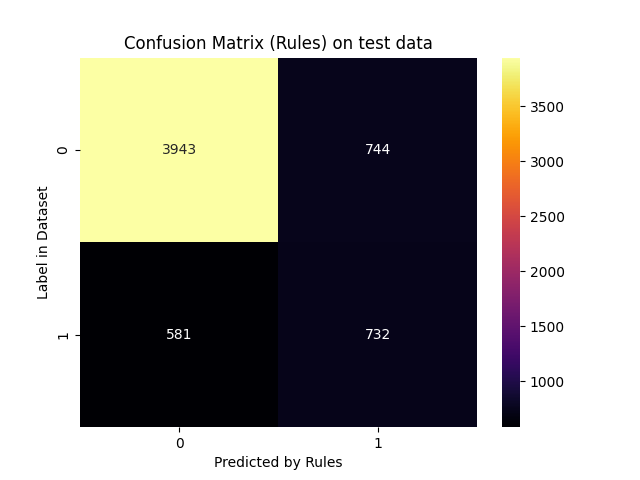
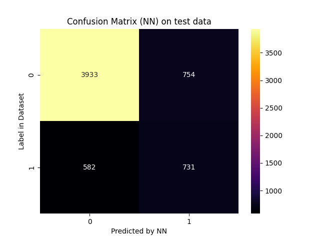
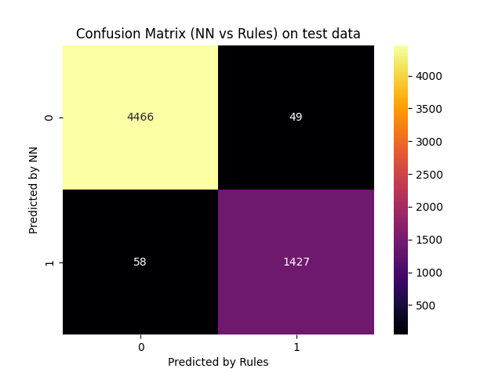

# Report for scenario: test

Rule Extraction Assistant report for alpa on test data.

- algorithm: `alpa`
- seed: `42`

## Extracted Rules

These are the rules extracted in a human-readable form:
```python

IF 0.9988053520229372[(PAY_0_1.0 <= 0.44399497) AND (PAY_5_2.0 <= 0.70204055) AND (PAY_6_2.0 <= 0.95680088) AND (PAY_0_-1.0 <= 0.39806461) AND (PAY_4_2.0 <= 0.41125512) AND (PAY_0_2.0 <= 0.48252094) AND (PAY_5_4.0 <= 0.0) AND (PAY_2_2.0 <= 0.58205396) AND (PAY_5_3.0 <= 0.0) AND (PAY_2_3.0 <= 0.0)] THEN OUTPUT_CLASS=0

IF 0.9980145598941098[(PAY_5_2.0 <= 0.70204055) AND (PAY_0_-2.0 > 0.16862851) AND (PAY_2_2.0 <= 0.58205396) AND (SEX_2.0 > 0.47639772)] THEN OUTPUT_CLASS=0

IF 0.9975728155339806[(PAY_5_2.0 <= 0.70204055) AND (PAY_0_2.0 <= 0.48252094) AND (EDUCATION_2.0 > 0.34062457) AND (PAY_2_2.0 <= 0.58205396) AND (PAY_AMT4 > 1398.0000438) AND (SEX_2.0 > 0.47639772) AND (PAY_2_3.0 <= 0.0) AND (LIMIT_BAL > 329999.9968)] THEN OUTPUT_CLASS=0

IF 0.9990539262062441[(PAY_5_2.0 <= 0.70204055) AND (PAY_AMT3 > 3018.999973968) AND (EDUCATION_1.0 > 0.4777149) AND (PAY_3_2.0 <= 0.08474566) AND (PAY_0_2.0 <= 0.48252094) AND (PAY_2_2.0 <= 0.58205396) AND (SEX_2.0 > 0.47639772) AND (MARRIAGE_2.0 > 0.24872415)] THEN OUTPUT_CLASS=0

IF 0.9996124031007751[(PAY_0_1.0 <= 0.44399497) AND (PAY_5_2.0 <= 0.70204055) AND (SEX_2.0 > 0.6976676) AND (PAY_0_-1.0 <= 0.39806461) AND (EDUCATION_1.0 > 0.21870396) AND (PAY_0_2.0 <= 0.48252094) AND (PAY_5_4.0 <= 0.0) AND (PAY_2_2.0 <= 0.58205396) AND (PAY_5_3.0 <= 0.0) AND (PAY_2_3.0 <= 0.0)] THEN OUTPUT_CLASS=0

IF 0.996606334841629[(PAY_5_2.0 <= 0.70204055) AND (LIMIT_BAL > 139999.9987) AND (PAY_5_0.0 <= 0.48476395) AND (EDUCATION_2.0 <= 0.34062457) AND (PAY_3_2.0 <= 0.08474566) AND (PAY_0_2.0 <= 0.48252094) AND (PAY_2_2.0 <= 0.58205396) AND (SEX_2.0 > 0.47639772) AND (PAY_6_-1.0 > 0.90899789)] THEN OUTPUT_CLASS=0

IF 0.9970238095238095[(SEX_2.0 > 0.37673897) AND (PAY_3_-1.0 > 0.48166698) AND (PAY_0_-1.0 > 0.39806461) AND (PAY_6_-1.0 <= 0.49816519) AND (LIMIT_BAL > 82323.01053999999) AND (PAY_4_2.0 <= 0.41125512) AND (PAY_6_2.0 <= 0.4381333) AND (EDUCATION_3.0 <= 0.41945598) AND (PAY_5_-2.0 <= 0.37798759)] THEN OUTPUT_CLASS=0

IF 0.9963503649635036[(PAY_AMT4 > 66.0000042) AND (EDUCATION_2.0 <= 0.34062457) AND (PAY_2_2.0 <= 0.58205396) AND (BILL_AMT1 > 1344.9957499399918) AND (PAY_4_-2.0 > 0.0)] THEN OUTPUT_CLASS=0

IF 0.9964664310954063[(BILL_AMT1 > 684.0055240399925) AND (PAY_AMT6 <= 3789.0000796691997) AND (PAY_0_2.0 <= 0.48252094) AND (PAY_2_2.0 <= 0.58205396) AND (SEX_2.0 > 0.47639772) AND (PAY_4_-2.0 > 0.0)] THEN OUTPUT_CLASS=0

IF 0.9958847736625515[(PAY_AMT6 > 7669.99999119) AND (PAY_6_-1.0 > 0.49816519) AND (PAY_3_-1.0 > 0.48166698) AND (LIMIT_BAL > 291911.56840000005)] THEN OUTPUT_CLASS=0

IF 0.9958677685950413[(PAY_6_2.0 > 0.17720965) AND (PAY_5_2.0 > 0.70204055) AND (EDUCATION_3.0 > 0.41945598)] THEN OUTPUT_CLASS=1

IF 0.9995331465919701[(PAY_0_2.0 > 0.48252094)] THEN OUTPUT_CLASS=1

IF 0.9991539763113367[(PAY_5_2.0 > 0.70204055) AND (PAY_3_2.0 > 0.42852697)] THEN OUTPUT_CLASS=1

IF 0.9990867579908675[(PAY_AMT1 > 451.99999345488004) AND (PAY_4_2.0 > 0.19789074) AND (PAY_5_2.0 > 0.70204055)] THEN OUTPUT_CLASS=1

IF 0.9298245614035088[(PAY_0_-1.0 > 0.39806461) AND (PAY_3_2.0 > 0.78319091) AND (SEX_2.0 <= 0.55370307) AND (PAY_AMT4 <= 6357.0000150000005)] THEN OUTPUT_CLASS=1

IF 0.9252049180327869[(PAY_AMT6 <= 3789.0000796691997) AND (MARRIAGE_2.0 <= 0.24872415) AND (PAY_0_1.0 > 0.44399497) AND (PAY_3_-1.0 <= 0.48166698)] THEN OUTPUT_CLASS=1

IF 0.92[(SEX_2.0 <= 0.20668437) AND (LIMIT_BAL <= 123415.62759999999) AND (PAY_0_-1.0 > 0.39806461) AND (PAY_AMT4 <= 332.00000739) AND (MARRIAGE_1.0 > 0.42407542) AND (PAY_3_-1.0 <= 0.26835224)] THEN OUTPUT_CLASS=1

IF 0.9922844682992285[(LIMIT_BAL <= 291911.56840000005) AND (PAY_2_2.0 > 0.58205396)] THEN OUTPUT_CLASS=1

IF 0.9907407407407407[(MARRIAGE_1.0 > 0.27387917) AND (EDUCATION_1.0 <= 0.4777149) AND (EDUCATION_2.0 <= 0.34062457) AND (SEX_2.0 <= 0.6976676) AND (PAY_3_-1.0 <= 0.29763517) AND (PAY_4_2.0 > 0.41125512) AND (LIMIT_BAL <= 223853.959)] THEN OUTPUT_CLASS=1

IF 0.9907407407407407[(EDUCATION_1.0 <= 0.4777149) AND (PAY_4_-2.0 <= 0.0) AND (PAY_3_-1.0 <= 0.48166698) AND (PAY_0_1.0 > 0.44399497) AND (PAY_AMT4 <= 667.9999503)] THEN OUTPUT_CLASS=1

IF 0.9904661016949152[(PAY_3_2.0 > 0.78319091) AND (PAY_6_-1.0 <= 0.49816519) AND (PAY_5_0.0 <= 0.61726373) AND (LIMIT_BAL <= 100000.00305999999)] THEN OUTPUT_CLASS=1

IF 0.9903181189488244[(SEX_2.0 <= 0.47639772) AND (PAY_4_-2.0 <= 0.0) AND (PAY_0_1.0 > 0.44399497) AND (PAY_3_-1.0 <= 0.48166698)] THEN OUTPUT_CLASS=1

IF 0.9875[(PAY_6_2.0 > 0.95680088) AND (PAY_3_2.0 > 0.78319091) AND (BILL_AMT1 <= 4503.001146709985)] THEN OUTPUT_CLASS=1

IF 0.9875[(SEX_2.0 <= 0.47639772) AND (BILL_AMT1 > -60.00118672000387) AND (PAY_4_0.0 > 0.43445185) AND (PAY_0_1.0 > 0.44399497) AND (EDUCATION_3.0 > 0.41945598)] THEN OUTPUT_CLASS=1

IF 0.9871794871794872[(PAY_2_4.0 > 0.0)] THEN OUTPUT_CLASS=1

IF 0.9864864864864865[(SEX_2.0 <= 0.47639772) AND (PAY_6_2.0 > 0.83516574) AND (MARRIAGE_2.0 <= 0.45202813) AND (LIMIT_BAL <= 113430.943)] THEN OUTPUT_CLASS=1

IF 0.9852941176470589[(PAY_5_4.0 > 0.0) AND (PAY_5_-2.0 <= 0.0)] THEN OUTPUT_CLASS=1

IF 0.9[(SEX_2.0 <= 0.47639772) AND (PAY_4_0.0 > 0.43445185) AND (PAY_5_2.0 > 0.70204055) AND (PAY_0_-1.0 > 0.39806461)] THEN OUTPUT_CLASS=1

IF 0.8888888888888888[(SEX_2.0 <= 0.20668437) AND (PAY_AMT4 <= 9.000000234) AND (PAY_0_-1.0 > 0.39806461) AND (PAY_5_-1.0 > 0.90829587) AND (MARRIAGE_1.0 > 0.42407542) AND (PAY_3_-1.0 <= 0.26835224)] THEN OUTPUT_CLASS=1

IF 0.875[(PAY_AMT4 <= 3.000000078) AND (PAY_0_-1.0 > 0.39806461) AND (EDUCATION_1.0 <= 0.4777149) AND (MARRIAGE_1.0 > 0.42407542) AND (PAY_3_-1.0 <= 0.26835224) AND (PAY_5_-1.0 > 0.092306294) AND (PAY_3_2.0 <= 0.78319091)] THEN OUTPUT_CLASS=1

IF 0.9411764705882353[(PAY_AMT1 > 1348.9999723296) AND (PAY_6_2.0 > 0.83516574) AND (MARRIAGE_2.0 <= 0.45202813) AND (MARRIAGE_1.0 <= 0.42407542)] THEN OUTPUT_CLASS=1

IF 0.9986249570299072[(PAY_2_2.0 > 0.58205396) AND (PAY_3_-1.0 <= 0.48166698)] THEN OUTPUT_CLASS=1

IF 0.9978118161925602[(PAY_6_2.0 > 0.95680088) AND (SEX_2.0 <= 0.20668437) AND (PAY_AMT1 <= 6649.9999460304) AND (PAY_3_2.0 > 0.78319091)] THEN OUTPUT_CLASS=1

IF 0.9983164983164983[(EDUCATION_1.0 <= 0.4777149) AND (SEX_2.0 <= 0.6976676) AND (PAY_3_-1.0 <= 0.29763517) AND (PAY_4_2.0 > 0.41125512) AND (PAY_3_0.0 <= 0.46273658)] THEN OUTPUT_CLASS=1

IF 0.9975429975429976[(PAY_4_2.0 > 0.41125512) AND (PAY_3_2.0 > 0.42852697) AND (LIMIT_BAL <= 82323.01053999999) AND (SEX_2.0 <= 0.6976676)] THEN OUTPUT_CLASS=1

IF 0.99800796812749[(PAY_4_2.0 > 0.19789074) AND (PAY_5_2.0 > 0.70204055) AND (MARRIAGE_1.0 <= 0.42407542) AND (AGE > 26.000000084)] THEN OUTPUT_CLASS=1

IF 0.9982425307557118[(PAY_0_-1.0 <= 0.39806461) AND (PAY_2_2.0 > 0.58205396)] THEN OUTPUT_CLASS=1

IF 0.9955257270693513[(PAY_6_2.0 > 0.95680088) AND (PAY_3_2.0 > 0.78319091) AND (LIMIT_BAL <= 203023.9432) AND (MARRIAGE_1.0 > 0.42407542)] THEN OUTPUT_CLASS=1

IF 0.9961734693877551[(PAY_3_2.0 > 0.08474566) AND (PAY_0_1.0 > 0.44399497) AND (PAY_3_-1.0 <= 0.48166698)] THEN OUTPUT_CLASS=1

IF 0.9955156950672646[(PAY_0_1.0 > 0.48667383) AND (MARRIAGE_1.0 > 0.42407542) AND (PAY_5_2.0 > 0.70204055)] THEN OUTPUT_CLASS=1

IF 0.9354838709677419[(SEX_2.0 <= 0.47639772) AND (PAY_3_-1.0 <= 0.3945218) AND (PAY_6_2.0 > 0.83516574) AND (PAY_0_-1.0 > 0.39806461)] THEN OUTPUT_CLASS=1

IF 0.9953161592505855[(SEX_2.0 <= 0.47639772) AND (PAY_AMT4 <= 66.0000042) AND (PAY_0_1.0 > 0.44399497) AND (PAY_3_-1.0 <= 0.48166698)] THEN OUTPUT_CLASS=1

IF 0.9954988747186797[(PAY_6_2.0 > 0.17720965) AND (PAY_5_2.0 > 0.70204055) AND (PAY_3_-1.0 <= 0.48166698)] THEN OUTPUT_CLASS=1

IF 0.9942307692307693[(SEX_2.0 <= 0.6976676) AND (EDUCATION_2.0 > 0.34062457) AND (PAY_3_-1.0 <= 0.29763517) AND (PAY_4_2.0 > 0.41125512) AND (LIMIT_BAL <= 223853.959)] THEN OUTPUT_CLASS=1

IF 0.9934024505183789[(PAY_4_2.0 > 0.41125512) AND (PAY_3_2.0 > 0.56852031) AND (EDUCATION_1.0 <= 0.21870396) AND (BILL_AMT1 <= 110418.99457792999)] THEN OUTPUT_CLASS=1

IF 0.9927272727272727[(SEX_2.0 <= 0.47639772) AND (PAY_4_2.0 > 0.41125512) AND (PAY_0_1.0 > 0.44399497)] THEN OUTPUT_CLASS=1

IF 0.9919354838709677[(SEX_2.0 <= 0.47639772) AND (EDUCATION_2.0 > 0.34062457) AND (PAY_0_1.0 > 0.44399497) AND (PAY_3_-1.0 <= 0.48166698)] THEN OUTPUT_CLASS=1

IF 0.9920977011494253[(PAY_2_2.0 > 0.58205396) AND (SEX_2.0 <= 0.37673897)] THEN OUTPUT_CLASS=1

IF 0.9591836734693877[(SEX_2.0 <= 0.47639772) AND (PAY_2_-2.0 > 0.30235812) AND (PAY_0_1.0 > 0.44399497) AND (EDUCATION_3.0 > 0.41945598)] THEN OUTPUT_CLASS=1

IF 0.9583333333333334[(SEX_2.0 <= 0.47639772) AND (PAY_6_-1.0 <= 0.49816519) AND (PAY_4_-2.0 <= 0.0) AND (PAY_5_-2.0 > 0.37798759) AND (PAY_0_1.0 > 0.44399497)] THEN OUTPUT_CLASS=1

IF 0.9411764705882353[(SEX_2.0 <= 0.20668437) AND (PAY_AMT4 <= 9.000000234) AND (PAY_0_-1.0 > 0.39806461) AND (PAY_6_-1.0 <= 0.49816519) AND (PAY_5_-1.0 > 0.90829587) AND (PAY_3_-1.0 <= 0.26835224)] THEN OUTPUT_CLASS=1

IF 0.9906542056074766[(PAY_5_2.0 <= 0.70204055) AND (AGE > 42.336553380000005) AND (EDUCATION_2.0 <= 0.34062457) AND (PAY_0_2.0 <= 0.48252094) AND (PAY_2_2.0 <= 0.58205396) AND (PAY_6_-1.0 <= 0.90899789) AND (SEX_2.0 > 0.47639772) AND (PAY_2_3.0 <= 0.0) AND (LIMIT_BAL > 209999.99800000002)] THEN OUTPUT_CLASS=0

IF 0.8663218336259669[(PAY_2_2.0 <= 0.58205396)] THEN OUTPUT_CLASS=0

IF 0.995[(PAY_3_-1.0 > 0.48166698) AND (LIMIT_BAL > 263374.54120000004) AND (PAY_0_-1.0 > 0.39806461) AND (PAY_6_-1.0 <= 0.49816519) AND (PAY_4_2.0 <= 0.41125512) AND (PAY_6_2.0 <= 0.4381333) AND (EDUCATION_3.0 <= 0.41945598) AND (PAY_5_-2.0 <= 0.37798759)] THEN OUTPUT_CLASS=0

IF 0.9844054580896686[(PAY_6_-1.0 <= 0.49816519) AND (PAY_4_-2.0 <= 0.0) AND (PAY_3_-1.0 <= 0.48166698) AND (PAY_0_1.0 > 0.44399497) AND (PAY_AMT4 <= 667.9999503)] THEN OUTPUT_CLASS=1

IF 0.9837837837837838[(AGE <= 48.999999380000006) AND (PAY_4_0.0 <= 0.43445185) AND (EDUCATION_3.0 <= 0.78129607) AND (PAY_3_0.0 > 0.46273658) AND (PAY_5_2.0 > 0.70204055)] THEN OUTPUT_CLASS=1

IF 0.9787234042553191[(PAY_5_3.0 > 0.0)] THEN OUTPUT_CLASS=1

IF 0.9761904761904762[(SEX_2.0 <= 0.47639772) AND (PAY_3_2.0 > 0.78319091) AND (PAY_0_-1.0 > 0.39806461) AND (PAY_5_0.0 > 0.61726373)] THEN OUTPUT_CLASS=1

IF 0.9702970297029703[(PAY_0_-1.0 > 0.39806461) AND (PAY_3_2.0 > 0.78319091) AND (LIMIT_BAL <= 213186.73870000002) AND (PAY_5_0.0 > 0.61726373)] THEN OUTPUT_CLASS=1

IF 0.9633699633699634[(SEX_2.0 <= 0.47639772) AND (MARRIAGE_2.0 <= 0.45202813) AND (BILL_AMT1 <= 64299.99216884) AND (PAY_5_2.0 > 0.70204055)] THEN OUTPUT_CLASS=1

IF 0.9629629629629629[(PAY_2_5.0 > 0.0)] THEN OUTPUT_CLASS=1

IF 0.9961977186311787[(PAY_2_3.0 > 0.0)] THEN OUTPUT_CLASS=1

IF 0.9952380952380953[(PAY_6_2.0 > 0.95680088) AND (PAY_3_2.0 > 0.78319091) AND (EDUCATION_3.0 > 0.41945598)] THEN OUTPUT_CLASS=1

IF 0.9949494949494949[(PAY_0_1.0 <= 0.44399497) AND (PAY_AMT2 <= 4.0000000901103) AND (PAY_4_2.0 > 0.41125512) AND (SEX_2.0 <= 0.6976676)] THEN OUTPUT_CLASS=1

```

And these are the rules with internal decoding:
```python

IF 0.9988053520229372[(h_0,19 <= 0.44399497) AND (h_0,62 <= 0.70204055) AND (h_0,70 <= 0.95680088) AND (h_0,16 <= 0.39806461) AND (h_0,51 <= 0.41125512) AND (h_0,15 <= 0.48252094) AND (h_0,65 <= 0) AND (h_0,26 <= 0.58205396) AND (h_0,63 <= 0) AND (h_0,30 <= 0)] THEN OUTPUT_CLASS=0
Number of clauses: 1

IF 0.9980145598941098[(h_0,62 <= 0.70204055) AND (h_0,18 > 0.16862851) AND (h_0,26 <= 0.58205396) AND (h_0,1 > 0.47639772)] THEN OUTPUT_CLASS=0
Number of clauses: 1

IF 0.9975728155339806[(h_0,62 <= 0.70204055) AND (h_0,15 <= 0.48252094) AND (h_0,3 > 0.34062457) AND (h_0,26 <= 0.58205396) AND (h_0,88 > 0.0022512078) AND (h_0,1 > 0.47639772) AND (h_0,30 <= 0) AND (h_0,0 > 0.32323232)] THEN OUTPUT_CLASS=0
Number of clauses: 1

IF 0.9990539262062441[(h_0,62 <= 0.70204055) AND (h_0,87 > 0.0033692692) AND (h_0,4 > 0.4777149) AND (h_0,39 <= 0.08474566) AND (h_0,15 <= 0.48252094) AND (h_0,26 <= 0.58205396) AND (h_0,1 > 0.47639772) AND (h_0,11 > 0.24872415)] THEN OUTPUT_CLASS=0
Number of clauses: 1

IF 0.9996124031007751[(h_0,19 <= 0.44399497) AND (h_0,62 <= 0.70204055) AND (h_0,1 > 0.6976676) AND (h_0,16 <= 0.39806461) AND (h_0,4 > 0.21870396) AND (h_0,15 <= 0.48252094) AND (h_0,65 <= 0) AND (h_0,26 <= 0.58205396) AND (h_0,63 <= 0) AND (h_0,30 <= 0)] THEN OUTPUT_CLASS=0
Number of clauses: 1

IF 0.996606334841629[(h_0,62 <= 0.70204055) AND (h_0,0 > 0.13131313) AND (h_0,60 <= 0.48476395) AND (h_0,3 <= 0.34062457) AND (h_0,39 <= 0.08474566) AND (h_0,15 <= 0.48252094) AND (h_0,26 <= 0.58205396) AND (h_0,1 > 0.47639772) AND (h_0,72 > 0.90899789)] THEN OUTPUT_CLASS=0
Number of clauses: 1

IF 0.9970238095238095[(h_0,1 > 0.37673897) AND (h_0,37 > 0.48166698) AND (h_0,16 > 0.39806461) AND (h_0,72 <= 0.49816519) AND (h_0,0 > 0.073053546) AND (h_0,51 <= 0.41125512) AND (h_0,70 <= 0.4381333) AND (h_0,5 <= 0.41945598) AND (h_0,59 <= 0.37798759)] THEN OUTPUT_CLASS=0
Number of clauses: 1

IF 0.9963503649635036[(h_0,88 > 0.0001062802) AND (h_0,3 <= 0.34062457) AND (h_0,26 <= 0.58205396) AND (h_0,79 > 0.14770934) AND (h_0,50 > 0)] THEN OUTPUT_CLASS=0
Number of clauses: 1

IF 0.9964664310954063[(h_0,79 > 0.14712444) AND (h_0,90 <= 0.0071670962) AND (h_0,15 <= 0.48252094) AND (h_0,26 <= 0.58205396) AND (h_0,1 > 0.47639772) AND (h_0,50 > 0)] THEN OUTPUT_CLASS=0
Number of clauses: 1

IF 0.9958847736625515[(h_0,90 > 0.014508215) AND (h_0,72 > 0.49816519) AND (h_0,37 > 0.48166698) AND (h_0,0 > 0.28475916)] THEN OUTPUT_CLASS=0
Number of clauses: 1

IF 0.9958677685950413[(h_0,70 > 0.17720965) AND (h_0,62 > 0.70204055) AND (h_0,5 > 0.41945598)] THEN OUTPUT_CLASS=1
Number of clauses: 1

IF 0.9995331465919701[(h_0,15 > 0.48252094)] THEN OUTPUT_CLASS=1
Number of clauses: 1

IF 0.9991539763113367[(h_0,62 > 0.70204055) AND (h_0,39 > 0.42852697)] THEN OUTPUT_CLASS=1
Number of clauses: 1

IF 0.9990867579908675[(h_0,85 > 0.00051742769) AND (h_0,51 > 0.19789074) AND (h_0,62 > 0.70204055)] THEN OUTPUT_CLASS=1
Number of clauses: 1

IF 0.9298245614035088[(h_0,16 > 0.39806461) AND (h_0,39 > 0.78319091) AND (h_0,1 <= 0.55370307) AND (h_0,88 <= 0.010236715)] THEN OUTPUT_CLASS=1
Number of clauses: 1

IF 0.9252049180327869[(h_0,90 <= 0.0071670962) AND (h_0,11 <= 0.24872415) AND (h_0,19 > 0.44399497) AND (h_0,37 <= 0.48166698)] THEN OUTPUT_CLASS=1
Number of clauses: 1

IF 0.92[(h_0,1 <= 0.20668437) AND (h_0,0 <= 0.11456124) AND (h_0,16 > 0.39806461) AND (h_0,88 <= 0.00053462159) AND (h_0,10 > 0.42407542) AND (h_0,37 <= 0.26835224)] THEN OUTPUT_CLASS=1
Number of clauses: 1

IF 0.9922844682992285[(h_0,0 <= 0.28475916) AND (h_0,26 > 0.58205396)] THEN OUTPUT_CLASS=1
Number of clauses: 1

IF 0.9907407407407407[(h_0,10 > 0.27387917) AND (h_0,4 <= 0.4777149) AND (h_0,3 <= 0.34062457) AND (h_0,1 <= 0.6976676) AND (h_0,37 <= 0.29763517) AND (h_0,51 > 0.41125512) AND (h_0,0 <= 0.2160141)] THEN OUTPUT_CLASS=1
Number of clauses: 1

IF 0.9907407407407407[(h_0,4 <= 0.4777149) AND (h_0,50 <= 0) AND (h_0,37 <= 0.48166698) AND (h_0,19 > 0.44399497) AND (h_0,88 <= 0.0010756843)] THEN OUTPUT_CLASS=1
Number of clauses: 1

IF 0.9904661016949152[(h_0,39 > 0.78319091) AND (h_0,72 <= 0.49816519) AND (h_0,60 <= 0.61726373) AND (h_0,0 <= 0.090909094)] THEN OUTPUT_CLASS=1
Number of clauses: 1

IF 0.9903181189488244[(h_0,1 <= 0.47639772) AND (h_0,50 <= 0) AND (h_0,19 > 0.44399497) AND (h_0,37 <= 0.48166698)] THEN OUTPUT_CLASS=1
Number of clauses: 1

IF 0.9875[(h_0,70 > 0.95680088) AND (h_0,39 > 0.78319091) AND (h_0,79 <= 0.15050381)] THEN OUTPUT_CLASS=1
Number of clauses: 1

IF 0.9875[(h_0,1 <= 0.47639772) AND (h_0,79 > 0.14646608) AND (h_0,49 > 0.43445185) AND (h_0,19 > 0.44399497) AND (h_0,5 > 0.41945598)] THEN OUTPUT_CLASS=1
Number of clauses: 1

IF 0.9871794871794872[(h_0,33 > 0)] THEN OUTPUT_CLASS=1
Number of clauses: 1

IF 0.9864864864864865[(h_0,1 <= 0.47639772) AND (h_0,70 > 0.83516574) AND (h_0,11 <= 0.45202813) AND (h_0,0 <= 0.1044757)] THEN OUTPUT_CLASS=1
Number of clauses: 1

IF 0.9852941176470589[(h_0,65 > 0) AND (h_0,59 <= 0)] THEN OUTPUT_CLASS=1
Number of clauses: 1

IF 0.9[(h_0,1 <= 0.47639772) AND (h_0,49 > 0.43445185) AND (h_0,62 > 0.70204055) AND (h_0,16 > 0.39806461)] THEN OUTPUT_CLASS=1
Number of clauses: 1

IF 0.8888888888888888[(h_0,1 <= 0.20668437) AND (h_0,88 <= 1.4492754e-05) AND (h_0,16 > 0.39806461) AND (h_0,61 > 0.90829587) AND (h_0,10 > 0.42407542) AND (h_0,37 <= 0.26835224)] THEN OUTPUT_CLASS=1
Number of clauses: 1

IF 0.875[(h_0,88 <= 4.830918e-06) AND (h_0,16 > 0.39806461) AND (h_0,4 <= 0.4777149) AND (h_0,10 > 0.42407542) AND (h_0,37 <= 0.26835224) AND (h_0,61 > 0.092306294) AND (h_0,39 <= 0.78319091)] THEN OUTPUT_CLASS=1
Number of clauses: 1

IF 0.9411764705882353[(h_0,85 > 0.0015442698) AND (h_0,70 > 0.83516574) AND (h_0,11 <= 0.45202813) AND (h_0,10 <= 0.42407542)] THEN OUTPUT_CLASS=1
Number of clauses: 1

IF 0.9986249570299072[(h_0,26 > 0.58205396) AND (h_0,37 <= 0.48166698)] THEN OUTPUT_CLASS=1
Number of clauses: 1

IF 0.9978118161925602[(h_0,70 > 0.95680088) AND (h_0,1 <= 0.20668437) AND (h_0,85 <= 0.0076125977) AND (h_0,39 > 0.78319091)] THEN OUTPUT_CLASS=1
Number of clauses: 1

IF 0.9983164983164983[(h_0,4 <= 0.4777149) AND (h_0,1 <= 0.6976676) AND (h_0,37 <= 0.29763517) AND (h_0,51 > 0.41125512) AND (h_0,38 <= 0.46273658)] THEN OUTPUT_CLASS=1
Number of clauses: 1

IF 0.9975429975429976[(h_0,51 > 0.41125512) AND (h_0,39 > 0.42852697) AND (h_0,0 <= 0.073053546) AND (h_0,1 <= 0.6976676)] THEN OUTPUT_CLASS=1
Number of clauses: 1

IF 0.99800796812749[(h_0,51 > 0.19789074) AND (h_0,62 > 0.70204055) AND (h_0,10 <= 0.42407542) AND (h_0,14 > 0.086206898)] THEN OUTPUT_CLASS=1
Number of clauses: 1

IF 0.9982425307557118[(h_0,16 <= 0.39806461) AND (h_0,26 > 0.58205396)] THEN OUTPUT_CLASS=1
Number of clauses: 1

IF 0.9955257270693513[(h_0,70 > 0.95680088) AND (h_0,39 > 0.78319091) AND (h_0,0 <= 0.19497368) AND (h_0,10 > 0.42407542)] THEN OUTPUT_CLASS=1
Number of clauses: 1

IF 0.9961734693877551[(h_0,39 > 0.08474566) AND (h_0,19 > 0.44399497) AND (h_0,37 <= 0.48166698)] THEN OUTPUT_CLASS=1
Number of clauses: 1

IF 0.9955156950672646[(h_0,19 > 0.48667383) AND (h_0,10 > 0.42407542) AND (h_0,62 > 0.70204055)] THEN OUTPUT_CLASS=1
Number of clauses: 1

IF 0.9354838709677419[(h_0,1 <= 0.47639772) AND (h_0,37 <= 0.3945218) AND (h_0,70 > 0.83516574) AND (h_0,16 > 0.39806461)] THEN OUTPUT_CLASS=1
Number of clauses: 1

IF 0.9953161592505855[(h_0,1 <= 0.47639772) AND (h_0,88 <= 0.0001062802) AND (h_0,19 > 0.44399497) AND (h_0,37 <= 0.48166698)] THEN OUTPUT_CLASS=1
Number of clauses: 1

IF 0.9954988747186797[(h_0,70 > 0.17720965) AND (h_0,62 > 0.70204055) AND (h_0,37 <= 0.48166698)] THEN OUTPUT_CLASS=1
Number of clauses: 1

IF 0.9942307692307693[(h_0,1 <= 0.6976676) AND (h_0,3 > 0.34062457) AND (h_0,37 <= 0.29763517) AND (h_0,51 > 0.41125512) AND (h_0,0 <= 0.2160141)] THEN OUTPUT_CLASS=1
Number of clauses: 1

IF 0.9934024505183789[(h_0,51 > 0.41125512) AND (h_0,39 > 0.56852031) AND (h_0,4 <= 0.21870396) AND (h_0,79 <= 0.24422723)] THEN OUTPUT_CLASS=1
Number of clauses: 1

IF 0.9927272727272727[(h_0,1 <= 0.47639772) AND (h_0,51 > 0.41125512) AND (h_0,19 > 0.44399497)] THEN OUTPUT_CLASS=1
Number of clauses: 1

IF 0.9919354838709677[(h_0,1 <= 0.47639772) AND (h_0,3 > 0.34062457) AND (h_0,19 > 0.44399497) AND (h_0,37 <= 0.48166698)] THEN OUTPUT_CLASS=1
Number of clauses: 1

IF 0.9920977011494253[(h_0,26 > 0.58205396) AND (h_0,1 <= 0.37673897)] THEN OUTPUT_CLASS=1
Number of clauses: 1

IF 0.9591836734693877[(h_0,1 <= 0.47639772) AND (h_0,29 > 0.30235812) AND (h_0,19 > 0.44399497) AND (h_0,5 > 0.41945598)] THEN OUTPUT_CLASS=1
Number of clauses: 1

IF 0.9583333333333334[(h_0,1 <= 0.47639772) AND (h_0,72 <= 0.49816519) AND (h_0,50 <= 0) AND (h_0,59 > 0.37798759) AND (h_0,19 > 0.44399497)] THEN OUTPUT_CLASS=1
Number of clauses: 1

IF 0.9411764705882353[(h_0,1 <= 0.20668437) AND (h_0,88 <= 1.4492754e-05) AND (h_0,16 > 0.39806461) AND (h_0,72 <= 0.49816519) AND (h_0,61 > 0.90829587) AND (h_0,37 <= 0.26835224)] THEN OUTPUT_CLASS=1
Number of clauses: 1

IF 0.9906542056074766[(h_0,62 <= 0.70204055) AND (h_0,14 > 0.36787161) AND (h_0,3 <= 0.34062457) AND (h_0,15 <= 0.48252094) AND (h_0,26 <= 0.58205396) AND (h_0,72 <= 0.90899789) AND (h_0,1 > 0.47639772) AND (h_0,30 <= 0) AND (h_0,0 > 0.2020202)] THEN OUTPUT_CLASS=0
Number of clauses: 1

IF 0.8663218336259669[(h_0,26 <= 0.58205396)] THEN OUTPUT_CLASS=0
Number of clauses: 1

IF 0.995[(h_0,37 > 0.48166698) AND (h_0,0 > 0.25593388) AND (h_0,16 > 0.39806461) AND (h_0,72 <= 0.49816519) AND (h_0,51 <= 0.41125512) AND (h_0,70 <= 0.4381333) AND (h_0,5 <= 0.41945598) AND (h_0,59 <= 0.37798759)] THEN OUTPUT_CLASS=0
Number of clauses: 1

IF 0.9844054580896686[(h_0,72 <= 0.49816519) AND (h_0,50 <= 0) AND (h_0,37 <= 0.48166698) AND (h_0,19 > 0.44399497) AND (h_0,88 <= 0.0010756843)] THEN OUTPUT_CLASS=1
Number of clauses: 1

IF 0.9837837837837838[(h_0,14 <= 0.48275861) AND (h_0,49 <= 0.43445185) AND (h_0,5 <= 0.78129607) AND (h_0,38 > 0.46273658) AND (h_0,62 > 0.70204055)] THEN OUTPUT_CLASS=1
Number of clauses: 1

IF 0.9787234042553191[(h_0,63 > 0)] THEN OUTPUT_CLASS=1
Number of clauses: 1

IF 0.9761904761904762[(h_0,1 <= 0.47639772) AND (h_0,39 > 0.78319091) AND (h_0,16 > 0.39806461) AND (h_0,60 > 0.61726373)] THEN OUTPUT_CLASS=1
Number of clauses: 1

IF 0.9702970297029703[(h_0,16 > 0.39806461) AND (h_0,39 > 0.78319091) AND (h_0,0 <= 0.20523913) AND (h_0,60 > 0.61726373)] THEN OUTPUT_CLASS=1
Number of clauses: 1

IF 0.9633699633699634[(h_0,1 <= 0.47639772) AND (h_0,11 <= 0.45202813) AND (h_0,79 <= 0.20341724) AND (h_0,62 > 0.70204055)] THEN OUTPUT_CLASS=1
Number of clauses: 1

IF 0.9629629629629629[(h_0,31 > 0)] THEN OUTPUT_CLASS=1
Number of clauses: 1

IF 0.9961977186311787[(h_0,30 > 0)] THEN OUTPUT_CLASS=1
Number of clauses: 1

IF 0.9952380952380953[(h_0,70 > 0.95680088) AND (h_0,39 > 0.78319091) AND (h_0,5 > 0.41945598)] THEN OUTPUT_CLASS=1
Number of clauses: 1

IF 0.9949494949494949[(h_0,19 <= 0.44399497) AND (h_0,86 <= 2.3749317e-06) AND (h_0,51 > 0.41125512) AND (h_0,1 <= 0.6976676)] THEN OUTPUT_CLASS=1
Number of clauses: 1

```


### Rule Metrics

The following are metrics on the ruleset.


The loop of the ALPA algorithm you used found the following optimum:
- maximum fidelity achieved: `0.9907590759075907`
- rho with maximum fidelity: `0.01`


The following metrics are *per output class*:

|class:                  |                "0"       |                "1"       |
|-----------------------:|:--------------------------------:|:--------------------------------:|
|n_clauses:              |       `13`   |       `51`   |
|min_terms:              |             `1` |             `1` |
|max_terms:              |             `10` |             `7` |
|avg_terms:              |     `7.0` |     `3.69` |
|used features:          |        `SEX_2.0, PAY_2_3.0, PAY_5_4.0, EDUCATION_1.0, PAY_0_-1.0, PAY_3_2.0, PAY_0_1.0, PAY_4_2.0, PAY_5_0.0, EDUCATION_3.0, PAY_5_3.0, PAY_3_-1.0, AGE, PAY_6_-1.0, MARRIAGE_2.0, PAY_AMT3, PAY_2_2.0, LIMIT_BAL, PAY_AMT6, EDUCATION_2.0, PAY_6_2.0, PAY_0_2.0, PAY_4_-2.0, BILL_AMT1, PAY_0_-2.0, PAY_5_-2.0, PAY_AMT4, PAY_5_2.0`        |        `PAY_2_3.0, PAY_3_2.0, PAY_4_2.0, PAY_5_0.0, EDUCATION_3.0, PAY_5_3.0, AGE, PAY_6_-1.0, MARRIAGE_2.0, PAY_2_2.0, PAY_AMT6, PAY_2_-2.0, PAY_3_0.0, PAY_4_-2.0, PAY_5_-2.0, PAY_5_2.0, SEX_2.0, PAY_5_4.0, EDUCATION_1.0, MARRIAGE_1.0, PAY_0_-1.0, PAY_0_1.0, PAY_AMT2, PAY_2_5.0, PAY_3_-1.0, PAY_4_0.0, PAY_5_-1.0, LIMIT_BAL, EDUCATION_2.0, PAY_6_2.0, PAY_0_2.0, BILL_AMT1, PAY_AMT1, PAY_AMT4, PAY_2_4.0`        |
|features in every rule: | ``        | ``        |

These metrics are over the *whole ruleset*:

- total number of rules: 64
- common features (used by all classes): `PAY_2_3.0, PAY_3_2.0, PAY_4_2.0, PAY_5_0.0, EDUCATION_3.0, PAY_5_3.0, AGE, PAY_6_-1.0, MARRIAGE_2.0, PAY_2_2.0, PAY_AMT6, PAY_4_-2.0, PAY_5_-2.0, PAY_5_2.0, SEX_2.0, PAY_5_4.0, EDUCATION_1.0, PAY_0_-1.0, PAY_0_1.0, PAY_3_-1.0, LIMIT_BAL, EDUCATION_2.0, PAY_6_2.0, PAY_0_2.0, BILL_AMT1, PAY_AMT4`
  - number of common features: `26`

## Accuracy and Fidelity

The accuracy and fidelity measures of the neural network compared to the rules.

- neural network:
  - accuracy: `0.7773`
- rules:
  - accuracy: `0.7792`
  - fidelity: `0.9822`

## Confusion Matrices







## Performance

- rule extraction:
    - time: `133.5781 sec`
    - memory: `534.6211 MB`
