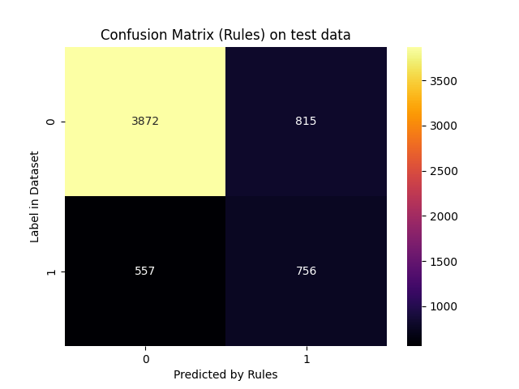
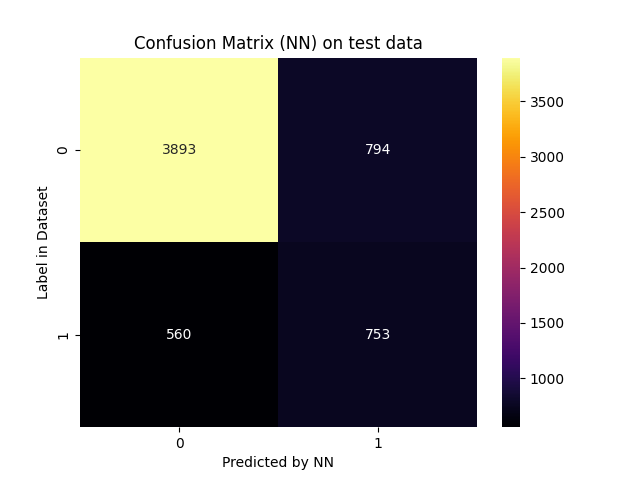
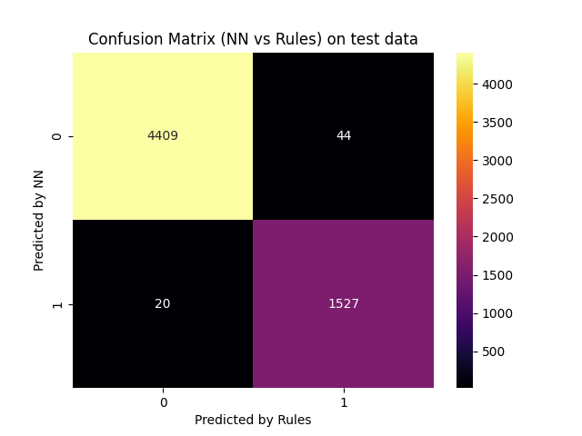

# Report for scenario: test

Rule Extraction Assistant report for alpa on test data.

- algorithm: `alpa`
- seed: `42`

## Extracted Rules

These are the rules extracted in a human-readable form:
```python

IF 0.9745762711864406[(LIMIT_BAL <= 133753.76200000002) AND (AGE > 46.41149476) AND (PAY_5_0 <= -0.13754830366598714) AND (SEX_0 <= -0.11515392719173673)] THEN OUTPUT_CLASS=1

IF 0.9988137603795967[(EDUCATION_0 <= 0.14385719323598592) AND (PAY_AMT6 <= 6932.000229834) AND (PAY_2_0 <= 0.33225847647459356) AND (LIMIT_BAL <= 234822.6442) AND (PAY_0_0 <= -0.032225325481306945)] THEN OUTPUT_CLASS=1

IF 0.9867128827267475[(EDUCATION_0 <= 0.14385719323598592) AND (AGE > 36.491446200000006) AND (PAY_0_0 <= -0.032225325481306945)] THEN OUTPUT_CLASS=1

IF 0.9996012759170654[(PAY_0_0 <= -1.4410086116426164)] THEN OUTPUT_CLASS=1

IF 0.9934895833333334[(PAY_6_0 <= -0.6153508691066555) AND (PAY_0_0 <= 0.3978672536447294) AND (SEX_0 <= -0.11515392719173673)] THEN OUTPUT_CLASS=1

IF 0.9983089064261556[(PAY_0_0 <= -0.4000887021516822) AND (EDUCATION_0 <= 0.4230715559663842) AND (SEX_0 <= -0.11515392719173673) AND (LIMIT_BAL <= 191683.2655)] THEN OUTPUT_CLASS=1

IF 0.9988590986879635[(MARRIAGE_0 <= 0.06254697951741657) AND (EDUCATION_0 <= 0.14385719323598592) AND (PAY_0_0 <= -0.15862858518159006) AND (PAY_AMT6 <= 6932.000229834) AND (LIMIT_BAL <= 292307.9347)] THEN OUTPUT_CLASS=1

IF 0.9932885906040269[(PAY_AMT4 > 247.99998906) AND (AGE > 46.41149476) AND (PAY_5_0 <= -0.13754830366598714)] THEN OUTPUT_CLASS=1

IF 0.9481641468682506[(AGE > 36.78550446) AND (PAY_6_0 <= -0.6153508691066555) AND (SEX_0 <= -0.11515392719173673)] THEN OUTPUT_CLASS=1

IF 0.8579568579568579[(PAY_5_0 <= -0.13754830366598714)] THEN OUTPUT_CLASS=1

IF 0.9984962406015038[(EDUCATION_0 <= 0.01154086673115683) AND (PAY_2_0 <= -1.2788896976152002) AND (PAY_4_0 <= -0.8532218862801688)] THEN OUTPUT_CLASS=1

IF 0.9975688816855753[(PAY_3_0 <= -0.6951604155510063) AND (PAY_6_0 <= -0.6153508691066555) AND (PAY_2_0 <= 0.4038106559015163)] THEN OUTPUT_CLASS=1

IF 0.9975961538461539[(PAY_3_0 <= -0.6951604155510063) AND (PAY_6_0 <= -0.6153508691066555) AND (AGE > 39.9999996)] THEN OUTPUT_CLASS=1

IF 0.9968831168831169[(PAY_0_0 <= -0.4000887021516822) AND (EDUCATION_0 <= 0.4230715559663842) AND (SEX_0 <= -0.11515392719173673) AND (PAY_AMT6 <= 3232.0000139328004)] THEN OUTPUT_CLASS=1

IF 0.9968[(SEX_0 > -0.11515392719173673) AND (BILL_AMT3 <= 37560.994194540006) AND (PAY_5_0 <= 0.29057086500214047) AND (LIMIT_BAL <= 159081.5161) AND (BILL_AMT2 <= 16449.00358328401) AND (PAY_0_0 <= -0.032225325481306945)] THEN OUTPUT_CLASS=1

IF 0.9969512195121951[(MARRIAGE_0 <= 0.027601159115184473) AND (PAY_3_0 <= 0.35804311170277686) AND (PAY_0_0 <= -0.032225325481306945) AND (PAY_2_0 <= 0.35461150491845955)] THEN OUTPUT_CLASS=1

IF 0.994182143656299[(PAY_5_0 <= 0.2562117352014045) AND (PAY_3_0 <= 0.35804311170277686) AND (PAY_0_0 <= -0.032225325481306945) AND (PAY_AMT2 <= 14306.9993825276)] THEN OUTPUT_CLASS=1

IF 0.9995769881556683[(PAY_3_0 <= 0.13651771909693317) AND (PAY_2_0 <= -1.2788896976152002)] THEN OUTPUT_CLASS=1

IF 0.9927007299270073[(PAY_6_0 <= -1.8023024341495646) AND (SEX_0 <= -0.11515392719173673)] THEN OUTPUT_CLASS=1

IF 0.996141975308642[(PAY_6_0 <= -0.5618553888213312) AND (PAY_5_0 <= -0.13754830366598714) AND (BILL_AMT3 > 4821.995526946016) AND (PAY_4_0 <= -0.8532218862801688)] THEN OUTPUT_CLASS=1

IF 0.9961240310077519[(PAY_6_0 <= -0.5618553888213312) AND (PAY_5_0 <= -0.13754830366598714) AND (SEX_0 <= -0.11515392719173673)] THEN OUTPUT_CLASS=1

IF 0.9957173447537473[(PAY_6_0 <= -0.5618553888213312) AND (LIMIT_BAL <= 130943.2708) AND (PAY_5_0 <= -0.13754830366598714) AND (AGE > 36.491446200000006)] THEN OUTPUT_CLASS=1

IF 0.9961389961389961[(PAY_6_0 <= -0.5618553888213312) AND (PAY_5_0 <= -0.13754830366598714) AND (AGE > 39.7643195)] THEN OUTPUT_CLASS=1

IF 0.9962825278810409[(PAY_0_0 <= 0.5365746002943392) AND (PAY_5_0 <= -0.13754830366598714) AND (LIMIT_BAL <= 25752.28402)] THEN OUTPUT_CLASS=1

IF 0.996080627099664[(PAY_AMT2 <= 831.9999958370199) AND (PAY_AMT6 <= 10322.999820996) AND (PAY_3_0 <= 0.35804311170277686) AND (LIMIT_BAL <= 324030.4552) AND (PAY_0_0 <= -0.032225325481306945)] THEN OUTPUT_CLASS=1

IF 0.9960629921259843[(PAY_3_0 <= -0.6951604155510063) AND (AGE > 41.38456632) AND (LIMIT_BAL <= 103797.56782) AND (BILL_AMT2 <= 93894.00952296001) AND (SEX_0 <= -0.11515392719173673) AND (PAY_5_0 <= 0.3158074096927994)] THEN OUTPUT_CLASS=1

IF 0.9925650557620818[(BILL_AMT2 <= 2621.9964247800026) AND (AGE > 37.158636439999995) AND (SEX_0 > -0.11515392719173673) AND (LIMIT_BAL <= 264956.6206) AND (PAY_0_0 <= -0.032225325481306945)] THEN OUTPUT_CLASS=1

IF 0.9902912621359223[(PAY_0_0 <= -0.032225325481306945) AND (BILL_AMT2 <= 161.99919090000154) AND (LIMIT_BAL <= 159081.5161)] THEN OUTPUT_CLASS=1

IF 0.975609756097561[(AGE > 36.78550446) AND (PAY_6_0 <= -0.6153508691066555) AND (EDUCATION_0 <= 0.03175652402491537) AND (SEX_0 <= -0.11515392719173673)] THEN OUTPUT_CLASS=1

IF 0.9998243456876866[(PAY_0_0 > 0.5365746002943392) AND (PAY_3_0 > -0.11421009912177851) AND (PAY_6_0 > -0.5618553888213312) AND (AGE <= 48.495453899999994)] THEN OUTPUT_CLASS=0

IF 0.997867803837953[(PAY_0_0 > -1.4410086116426164) AND (PAY_2_0 > -1.2788896976152002) AND (LIMIT_BAL > 159081.5161) AND (SEX_0 > -0.11515392719173673) AND (PAY_6_0 > 0.18349373011205825) AND (PAY_3_0 > 0.35804311170277686) AND (BILL_AMT2 > 2621.9964247800026) AND (EDUCATION_0 > 0.14385719323598592)] THEN OUTPUT_CLASS=0

IF 0.9975247524752475[(PAY_0_0 > -1.4410086116426164) AND (PAY_2_0 > -1.2788896976152002) AND (LIMIT_BAL > 264956.6206) AND (SEX_0 > -0.11515392719173673) AND (PAY_6_0 > 0.18349373011205825) AND (PAY_3_0 > 0.35804311170277686) AND (EDUCATION_0 > 0.14385719323598592)] THEN OUTPUT_CLASS=0

IF 0.9944547134935305[(PAY_0_0 > -1.4410086116426164) AND (PAY_2_0 > -1.2788896976152002) AND (LIMIT_BAL > 159081.5161) AND (SEX_0 > -0.11515392719173673) AND (PAY_6_0 > 0.18349373011205825) AND (PAY_3_0 > 0.35804311170277686) AND (AGE <= 37.158636439999995) AND (PAY_4_0 > 0.20533887852634142) AND (EDUCATION_0 > 0.14385719323598592)] THEN OUTPUT_CLASS=0

IF 0.9927536231884058[(PAY_0_0 > -1.4410086116426164) AND (SEX_0 > -0.11515392719173673) AND (LIMIT_BAL > 420000.0058) AND (PAY_3_0 > 0.35804311170277686) AND (EDUCATION_0 > 0.14385719323598592)] THEN OUTPUT_CLASS=0

IF 0.9922879177377892[(PAY_0_0 > -1.4410086116426164) AND (PAY_2_0 > -1.2788896976152002) AND (LIMIT_BAL > 292307.9347) AND (SEX_0 > -0.11515392719173673) AND (PAY_3_0 > 0.35804311170277686) AND (PAY_6_0 > 0.20078736265374159) AND (PAY_AMT3 > 1409.9999420160002)] THEN OUTPUT_CLASS=0

IF 0.9900990099009901[(PAY_0_0 > -1.4410086116426164) AND (PAY_2_0 > -1.2788896976152002) AND (EDUCATION_0 <= 0.14385719323598592) AND (PAY_AMT6 > 6932.000229834) AND (AGE <= 40.82500378) AND (PAY_3_0 > 0.35804311170277686) AND (LIMIT_BAL <= 292307.9347) AND (PAY_6_0 > 0.3012194860548725)] THEN OUTPUT_CLASS=0

IF 0.9903846153846154[(PAY_0_0 > -1.4410086116426164) AND (PAY_2_0 > -1.2788896976152002) AND (EDUCATION_0 > 0.4230715559663842) AND (SEX_0 <= -0.11515392719173673)] THEN OUTPUT_CLASS=0

IF 0.9885057471264368[(PAY_0_0 > -1.4410086116426164) AND (PAY_AMT2 > 14306.9993825276) AND (PAY_2_0 > 0.35461150491845955) AND (PAY_3_0 <= 0.35804311170277686) AND (LIMIT_BAL > 213230.5858)] THEN OUTPUT_CLASS=0

IF 0.9867549668874173[(PAY_0_0 > -1.4410086116426164) AND (EDUCATION_0 <= 0.14385719323598592) AND (LIMIT_BAL > 292307.9347) AND (AGE <= 36.491446200000006) AND (PAY_3_0 > 0.35804311170277686) AND (PAY_6_0 > 0.20078736265374159)] THEN OUTPUT_CLASS=0

IF 0.9873760144274121[(PAY_0_0 > -1.4410086116426164) AND (PAY_2_0 > -1.2788896976152002) AND (PAY_AMT6 > 3232.0000139328004) AND (MARRIAGE_0 > 0.027601159115184473) AND (LIMIT_BAL > 191683.2655) AND (EDUCATION_0 > 0.14385719323598592)] THEN OUTPUT_CLASS=0

IF 0.9867549668874173[(PAY_0_0 > -0.032225325481306945) AND (PAY_AMT2 > 12800.0000525567) AND (AGE <= 26.780239458000004)] THEN OUTPUT_CLASS=0

IF 0.9828178694158075[(PAY_0_0 > -1.4410086116426164) AND (PAY_2_0 > -1.2788896976152002) AND (BILL_AMT2 > 16449.00358328401) AND (PAY_3_0 > 0.35804311170277686) AND (EDUCATION_0 > 0.14385719323598592)] THEN OUTPUT_CLASS=0

IF 0.9824561403508771[(PAY_6_0 <= -0.6153508691066555) AND (AGE > 53.999998420000004) AND (SEX_0 <= -0.11515392719173673)] THEN OUTPUT_CLASS=1

IF 0.9917695473251029[(PAY_0_0 <= 0.5365746002943392) AND (PAY_5_0 <= -0.13754830366598714) AND (SEX_0 <= -0.11515392719173673) AND (AGE > 40.398897500000004)] THEN OUTPUT_CLASS=1

IF 0.9973094170403587[(PAY_3_0 <= -0.6951604155510063) AND (PAY_AMT4 <= 7855.999623) AND (PAY_0_1 > -0.4957904132640071) AND (SEX_0 <= -0.11515392719173673)] THEN OUTPUT_CLASS=1

IF 0.9961750956226094[(PAY_4_0 <= 0.20533887852634142) AND (PAY_0_0 <= -0.032225325481306945) AND (LIMIT_BAL <= 264956.6206) AND (BILL_AMT3 > -6.001471628973791)] THEN OUTPUT_CLASS=1

IF 0.9976209357652657[(LIMIT_BAL <= 149999.9986) AND (PAY_5_0 <= -0.13754830366598714) AND (PAY_3_0 <= -0.11421009912177851)] THEN OUTPUT_CLASS=1

IF 0.9981481481481481[(PAY_6_0 <= 0.3012194860548725) AND (EDUCATION_0 <= 0.14385719323598592) AND (LIMIT_BAL <= 292307.9347) AND (PAY_0_0 <= -0.15862858518159006)] THEN OUTPUT_CLASS=1

IF 0.9980824544582934[(SEX_0 > -0.11515392719173673) AND (PAY_2_0 <= -1.2788896976152002) AND (AGE > 24.118453346) AND (EDUCATION_0 <= 0.01154086673115683) AND (LIMIT_BAL <= 224746.0777) AND (PAY_5_0 <= 0.24153461289247866)] THEN OUTPUT_CLASS=1

IF 0.9992810927390366[(PAY_6_1 > 0.14300792264347692) AND (PAY_2_0 <= -1.2788896976152002)] THEN OUTPUT_CLASS=1

IF 0.9985507246376811[(PAY_3_0 <= -0.6951604155510063) AND (PAY_6_0 <= -0.02087009991998148) AND (SEX_0 <= -0.11515392719173673)] THEN OUTPUT_CLASS=1

IF 0.9988674971687429[(PAY_3_0 <= -0.6951604155510063) AND (EDUCATION_0 <= 0.03175652402491537) AND (SEX_0 <= -0.11515392719173673) AND (PAY_0_1 > -0.4957904132640071)] THEN OUTPUT_CLASS=1

IF 0.9975108898568762[(PAY_AMT6 <= 10322.999820996) AND (SEX_0 > -0.11515392719173673) AND (PAY_3_0 <= 0.35804311170277686) AND (PAY_0_0 <= -0.032225325481306945) AND (LIMIT_BAL <= 114814.7749)] THEN OUTPUT_CLASS=1

IF 0.9970717423133236[(AGE > 42.87253428) AND (PAY_5_0 <= 0.24153461289247866) AND (LIMIT_BAL <= 224746.0777) AND (PAY_2_0 <= -1.2788896976152002)] THEN OUTPUT_CLASS=1

IF 0.9863013698630136[(PAY_0_0 <= 0.04987616364416495) AND (AGE > 51.18162993999999)] THEN OUTPUT_CLASS=1

IF 0.9836956521739131[(PAY_6_0 <= -0.6153508691066555) AND (LIMIT_BAL <= 63722.00349999999) AND (SEX_0 <= -0.11515392719173673) AND (MARRIAGE_0 <= -0.005222361104744436)] THEN OUTPUT_CLASS=1

IF 0.9948186528497409[(AGE > 33.2495246) AND (BILL_AMT5 <= 17580.99838260499) AND (PAY_3_0 <= -0.6951604155510063) AND (LIMIT_BAL <= 103797.56782) AND (SEX_0 <= -0.11515392719173673) AND (PAY_5_0 <= 0.3158074096927994)] THEN OUTPUT_CLASS=1

IF 0.995276334435522[(PAY_3_0 <= 0.35804311170277686) AND (PAY_0_0 <= -0.032225325481306945) AND (PAY_AMT2 <= 14306.9993825276) AND (SEX_0 <= -0.11515392719173673)] THEN OUTPUT_CLASS=1

IF 0.9941072480848556[(MARRIAGE_0 <= -0.005222361104744436) AND (PAY_0_0 <= -0.032225325481306945) AND (LIMIT_BAL <= 159081.5161)] THEN OUTPUT_CLASS=1

IF 0.976303317535545[(PAY_0_0 > -1.4410086116426164) AND (PAY_2_0 > -1.2788896976152002) AND (PAY_5_0 > 0.32910918122677074) AND (SEX_0 > -0.11515392719173673) AND (PAY_3_0 > 0.35804311170277686) AND (EDUCATION_0 > 0.14385719323598592) AND (AGE <= 28.454566)] THEN OUTPUT_CLASS=0

IF 0.9747899159663865[(PAY_5_0 > 0.2562117352014045) AND (LIMIT_BAL > 324030.4552) AND (SEX_0 > -0.11515392719173673) AND (EDUCATION_0 > 0.11024497413730815)] THEN OUTPUT_CLASS=0

IF 0.9953416149068323[(PAY_0_0 > -1.4410086116426164) AND (SEX_0 > -0.11515392719173673) AND (MARRIAGE_0 > 0.06254697951741657) AND (AGE <= 40.82500378) AND (PAY_3_0 > 0.35804311170277686) AND (PAY_4_0 > 0.20533887852634142) AND (PAY_6_0 > 0.3012194860548725) AND (PAY_2_0 > 0.33225847647459356)] THEN OUTPUT_CLASS=0

IF 0.967741935483871[(BILL_AMT3 <= 4488.006741924016) AND (SEX_0 > -0.11515392719173673) AND (LIMIT_BAL > 114814.7749) AND (PAY_3_0 <= 0.35804311170277686) AND (EDUCATION_0 > 0.11024497413730815) AND (PAY_AMT2 > 831.9999958370199) AND (PAY_5_0 > 0.2562117352014045)] THEN OUTPUT_CLASS=0

IF 0.9516129032258065[(PAY_5_0 > 0.2562117352014045) AND (SEX_0 > -0.11515392719173673) AND (PAY_AMT2 <= 14306.9993825276) AND (PAY_AMT6 > 37792.99957301401)] THEN OUTPUT_CLASS=0

IF 0.9494426541285858[(PAY_0_0 > -0.032225325481306945)] THEN OUTPUT_CLASS=0

IF 0.9990636704119851[(PAY_2_0 > -1.2788896976152002) AND (PAY_2_0 <= 0.4038106559015163) AND (PAY_5_0 > -0.13754830366598714) AND (PAY_0_0 > -0.032225325481306945) AND (SEX_0 > -0.11515392719173673) AND (BILL_AMT3 > 7169.0037522170105)] THEN OUTPUT_CLASS=0

IF 0.9983157894736842[(PAY_2_0 > -1.2788896976152002) AND (PAY_0_0 > -0.15862858518159006) AND (AGE <= 40.82500378) AND (PAY_3_0 > 0.35804311170277686) AND (PAY_6_0 > 0.20078736265374159)] THEN OUTPUT_CLASS=0

IF 0.9984251968503937[(PAY_2_0 > -1.2788896976152002) AND (LIMIT_BAL > 292307.9347) AND (PAY_3_0 > 0.35804311170277686) AND (PAY_0_0 > -0.16936571053470406) AND (PAY_6_0 > 0.20078736265374159) AND (PAY_AMT3 > 1409.9999420160002)] THEN OUTPUT_CLASS=0

IF 0.9993510707332901[(PAY_5_0 > -0.13754830366598714) AND (PAY_AMT4 > 6196.0003002) AND (PAY_0_0 > 0.3978672536447294) AND (AGE <= 50.383810940000004) AND (PAY_AMT2 > 3862.9999366618)] THEN OUTPUT_CLASS=0

IF 0.996617050067659[(PAY_AMT6 <= 7304.9999974679995) AND (PAY_5_0 <= -0.13754830366598714) AND (PAY_3_0 <= -0.11421009912177851)] THEN OUTPUT_CLASS=1

IF 0.9935897435897436[(AGE > 50.383810940000004) AND (PAY_2_0 <= -1.2788896976152002)] THEN OUTPUT_CLASS=1

IF 0.9938650306748467[(PAY_3_0 <= -1.546369120173351) AND (SEX_0 <= -0.11515392719173673)] THEN OUTPUT_CLASS=1

IF 0.9940476190476191[(PAY_3_0 <= -0.6951604155510063) AND (PAY_6_0 <= -0.6153508691066555) AND (AGE > 25.374066578) AND (LIMIT_BAL <= 44935.18534)] THEN OUTPUT_CLASS=1

IF 0.996172772006561[(PAY_AMT6 <= 10322.999820996) AND (SEX_0 > -0.11515392719173673) AND (PAY_3_0 <= 0.35804311170277686) AND (PAY_AMT2 <= 14306.9993825276) AND (EDUCATION_0 <= 0.11024497413730815) AND (PAY_0_0 <= -0.032225325481306945)] THEN OUTPUT_CLASS=1

IF 0.9953488372093023[(PAY_6_0 <= 0.18349373011205825) AND (SEX_0 > -0.11515392719173673) AND (PAY_5_0 <= 0.32910918122677074) AND (BILL_AMT2 <= 16449.00358328401) AND (PAY_0_0 <= -0.032225325481306945) AND (LIMIT_BAL <= 420000.0058)] THEN OUTPUT_CLASS=1

IF 0.9954128440366973[(PAY_0_0 <= -0.4000887021516822) AND (MARRIAGE_0 <= 0.027601159115184473) AND (SEX_0 <= -0.11515392719173673)] THEN OUTPUT_CLASS=1

IF 0.9990604447228312[(PAY_0_0 <= -0.032225325481306945) AND (PAY_2_0 <= -1.2788896976152002)] THEN OUTPUT_CLASS=1

IF 0.9992395437262357[(PAY_0_0 <= 0.6424161774373088) AND (PAY_5_0 <= -0.13754830366598714) AND (PAY_6_0 <= -0.5618553888213312)] THEN OUTPUT_CLASS=1

IF 0.9993265993265993[(PAY_5_0 <= -0.13754830366598714) AND (PAY_2_0 <= -1.2788896976152002)] THEN OUTPUT_CLASS=1

```

And these are the rules with internal decoding:
```python

IF 0.9745762711864406[(h_0,0 <= 0.1250038) AND (h_0,1 > 0.43812922) AND (h_0,28 <= 0.83728796) AND (h_0,14 <= 0)] THEN OUTPUT_CLASS=1
Number of clauses: 1

IF 0.9988137603795967[(h_0,16 <= 0.17613734) AND (h_0,13 <= 0.013112249) AND (h_0,22 <= 0.97328466) AND (h_0,0 <= 0.22709358) AND (h_0,20 <= 0.78196377)] THEN OUTPUT_CLASS=1
Number of clauses: 1

IF 0.9867128827267475[(h_0,16 <= 0.17613734) AND (h_0,1 > 0.2670939) AND (h_0,20 <= 0.78196377)] THEN OUTPUT_CLASS=1
Number of clauses: 1

IF 0.9996012759170654[(h_0,20 <= 0.33762425)] THEN OUTPUT_CLASS=1
Number of clauses: 1

IF 0.9934895833333334[(h_0,30 <= 0.70004731) AND (h_0,20 <= 0.9176178) AND (h_0,14 <= 0)] THEN OUTPUT_CLASS=1
Number of clauses: 1

IF 0.9983089064261556[(h_0,20 <= 0.66593724) AND (h_0,16 <= 0.33360401) AND (h_0,14 <= 0) AND (h_0,0 <= 0.18351845)] THEN OUTPUT_CLASS=1
Number of clauses: 1

IF 0.9988590986879635[(h_0,18 <= 0.22283439) AND (h_0,16 <= 0.17613734) AND (h_0,20 <= 0.74209535) AND (h_0,13 <= 0.013112249) AND (h_0,0 <= 0.28515953)] THEN OUTPUT_CLASS=1
Number of clauses: 1

IF 0.9932885906040269[(h_0,11 > 0.00039935586) AND (h_0,1 > 0.43812922) AND (h_0,28 <= 0.83728796)] THEN OUTPUT_CLASS=1
Number of clauses: 1

IF 0.9481641468682506[(h_0,1 > 0.27216387) AND (h_0,30 <= 0.70004731) AND (h_0,14 <= 0)] THEN OUTPUT_CLASS=1
Number of clauses: 1

IF 0.8579568579568579[(h_0,28 <= 0.83728796)] THEN OUTPUT_CLASS=1
Number of clauses: 1

IF 0.9984962406015038[(h_0,16 <= 0.10151578) AND (h_0,22 <= 0.39024985) AND (h_0,26 <= 0.61029959)] THEN OUTPUT_CLASS=1
Number of clauses: 1

IF 0.9975688816855753[(h_0,24 <= 0.64508653) AND (h_0,30 <= 0.70004731) AND (h_0,22 <= 0.99917763)] THEN OUTPUT_CLASS=1
Number of clauses: 1

IF 0.9975961538461539[(h_0,24 <= 0.64508653) AND (h_0,30 <= 0.70004731) AND (h_0,1 > 0.3275862)] THEN OUTPUT_CLASS=1
Number of clauses: 1

IF 0.9968831168831169[(h_0,20 <= 0.66593724) AND (h_0,16 <= 0.33360401) AND (h_0,14 <= 0) AND (h_0,13 <= 0.0061135008)] THEN OUTPUT_CLASS=1
Number of clauses: 1

IF 0.9968[(h_0,14 > 0) AND (h_0,4 <= 0.10696718) AND (h_0,28 <= 0.97055626) AND (h_0,0 <= 0.15058739) AND (h_0,3 <= 0.081831023) AND (h_0,20 <= 0.78196377)] THEN OUTPUT_CLASS=1
Number of clauses: 1

IF 0.9969512195121951[(h_0,18 <= 0.19457789) AND (h_0,24 <= 0.97729379) AND (h_0,20 <= 0.78196377) AND (h_0,22 <= 0.98137367)] THEN OUTPUT_CLASS=1
Number of clauses: 1

IF 0.994182143656299[(h_0,28 <= 0.95986068) AND (h_0,24 <= 0.97729379) AND (h_0,20 <= 0.78196377) AND (h_0,9 <= 0.0084945364)] THEN OUTPUT_CLASS=1
Number of clauses: 1

IF 0.9995769881556683[(h_0,24 <= 0.90741903) AND (h_0,22 <= 0.39024985)] THEN OUTPUT_CLASS=1
Number of clauses: 1

IF 0.9927007299270073[(h_0,30 <= 0.32260942) AND (h_0,14 <= 0)] THEN OUTPUT_CLASS=1
Number of clauses: 1

IF 0.996141975308642[(h_0,30 <= 0.7170583) AND (h_0,28 <= 0.83728796) AND (h_0,4 > 0.088992082) AND (h_0,26 <= 0.61029959)] THEN OUTPUT_CLASS=1
Number of clauses: 1

IF 0.9961240310077519[(h_0,30 <= 0.7170583) AND (h_0,28 <= 0.83728796) AND (h_0,14 <= 0)] THEN OUTPUT_CLASS=1
Number of clauses: 1

IF 0.9957173447537473[(h_0,30 <= 0.7170583) AND (h_0,0 <= 0.12216492) AND (h_0,28 <= 0.83728796) AND (h_0,1 > 0.2670939)] THEN OUTPUT_CLASS=1
Number of clauses: 1

IF 0.9961389961389961[(h_0,30 <= 0.7170583) AND (h_0,28 <= 0.83728796) AND (h_0,1 > 0.32352275)] THEN OUTPUT_CLASS=1
Number of clauses: 1

IF 0.9962825278810409[(h_0,20 <= 0.96136701) AND (h_0,28 <= 0.83728796) AND (h_0,0 <= 0.015911398)] THEN OUTPUT_CLASS=1
Number of clauses: 1

IF 0.996080627099664[(h_0,9 <= 0.00049398578) AND (h_0,13 <= 0.019526506) AND (h_0,24 <= 0.97729379) AND (h_0,0 <= 0.31720248) AND (h_0,20 <= 0.78196377)] THEN OUTPUT_CLASS=1
Number of clauses: 1

IF 0.9960629921259843[(h_0,24 <= 0.64508653) AND (h_0,1 > 0.35145804) AND (h_0,0 <= 0.094745018) AND (h_0,3 <= 0.15532862) AND (h_0,14 <= 0) AND (h_0,28 <= 0.97841209)] THEN OUTPUT_CLASS=1
Number of clauses: 1

IF 0.9925650557620818[(h_0,3 <= 0.068708785) AND (h_0,1 > 0.27859718) AND (h_0,14 > 0) AND (h_0,0 <= 0.25753194) AND (h_0,20 <= 0.78196377)] THEN OUTPUT_CLASS=1
Number of clauses: 1

IF 0.9902912621359223[(h_0,20 <= 0.78196377) AND (h_0,3 <= 0.066374175) AND (h_0,0 <= 0.15058739)] THEN OUTPUT_CLASS=1
Number of clauses: 1

IF 0.975609756097561[(h_0,1 > 0.27216387) AND (h_0,30 <= 0.70004731) AND (h_0,16 <= 0.11291667) AND (h_0,14 <= 0)] THEN OUTPUT_CLASS=1
Number of clauses: 1

IF 0.9998243456876866[(h_0,20 > 0.96136701) AND (h_0,24 > 0.82833308) AND (h_0,30 > 0.7170583) AND (h_0,1 <= 0.47405955)] THEN OUTPUT_CLASS=0
Number of clauses: 1

IF 0.997867803837953[(h_0,20 > 0.33762425) AND (h_0,22 > 0.39024985) AND (h_0,0 > 0.15058739) AND (h_0,14 > 0) AND (h_0,30 > 0.95407134) AND (h_0,24 > 0.97729379) AND (h_0,3 > 0.068708785) AND (h_0,16 > 0.17613734)] THEN OUTPUT_CLASS=0
Number of clauses: 1

IF 0.9975247524752475[(h_0,20 > 0.33762425) AND (h_0,22 > 0.39024985) AND (h_0,0 > 0.25753194) AND (h_0,14 > 0) AND (h_0,30 > 0.95407134) AND (h_0,24 > 0.97729379) AND (h_0,16 > 0.17613734)] THEN OUTPUT_CLASS=0
Number of clauses: 1

IF 0.9944547134935305[(h_0,20 > 0.33762425) AND (h_0,22 > 0.39024985) AND (h_0,0 > 0.15058739) AND (h_0,14 > 0) AND (h_0,30 > 0.95407134) AND (h_0,24 > 0.97729379) AND (h_0,1 <= 0.27859718) AND (h_0,26 > 0.93756032) AND (h_0,16 > 0.17613734)] THEN OUTPUT_CLASS=0
Number of clauses: 1

IF 0.9927536231884058[(h_0,20 > 0.33762425) AND (h_0,14 > 0) AND (h_0,0 > 0.41414142) AND (h_0,24 > 0.97729379) AND (h_0,16 > 0.17613734)] THEN OUTPUT_CLASS=0
Number of clauses: 1

IF 0.9922879177377892[(h_0,20 > 0.33762425) AND (h_0,22 > 0.39024985) AND (h_0,0 > 0.28515953) AND (h_0,14 > 0) AND (h_0,24 > 0.97729379) AND (h_0,30 > 0.95957053) AND (h_0,10 > 0.0015735904)] THEN OUTPUT_CLASS=0
Number of clauses: 1

IF 0.9900990099009901[(h_0,20 > 0.33762425) AND (h_0,22 > 0.39024985) AND (h_0,16 <= 0.17613734) AND (h_0,13 > 0.013112249) AND (h_0,1 <= 0.34181041) AND (h_0,24 > 0.97729379) AND (h_0,0 <= 0.28515953) AND (h_0,30 > 0.99150687)] THEN OUTPUT_CLASS=0
Number of clauses: 1

IF 0.9903846153846154[(h_0,20 > 0.33762425) AND (h_0,22 > 0.39024985) AND (h_0,16 > 0.33360401) AND (h_0,14 <= 0)] THEN OUTPUT_CLASS=0
Number of clauses: 1

IF 0.9885057471264368[(h_0,20 > 0.33762425) AND (h_0,9 > 0.0084945364) AND (h_0,22 > 0.98137367) AND (h_0,24 <= 0.97729379) AND (h_0,0 > 0.20528342)] THEN OUTPUT_CLASS=0
Number of clauses: 1

IF 0.9867549668874173[(h_0,20 > 0.33762425) AND (h_0,16 <= 0.17613734) AND (h_0,0 > 0.28515953) AND (h_0,1 <= 0.2670939) AND (h_0,24 > 0.97729379) AND (h_0,30 > 0.95957053)] THEN OUTPUT_CLASS=0
Number of clauses: 1

IF 0.9873760144274121[(h_0,20 > 0.33762425) AND (h_0,22 > 0.39024985) AND (h_0,13 > 0.0061135008) AND (h_0,18 > 0.19457789) AND (h_0,0 > 0.18351845) AND (h_0,16 > 0.17613734)] THEN OUTPUT_CLASS=0
Number of clauses: 1

IF 0.9867549668874173[(h_0,20 > 0.78196377) AND (h_0,9 > 0.0075997813) AND (h_0,1 <= 0.099659301)] THEN OUTPUT_CLASS=0
Number of clauses: 1

IF 0.9828178694158075[(h_0,20 > 0.33762425) AND (h_0,22 > 0.39024985) AND (h_0,3 > 0.081831023) AND (h_0,24 > 0.97729379) AND (h_0,16 > 0.17613734)] THEN OUTPUT_CLASS=0
Number of clauses: 1

IF 0.9824561403508771[(h_0,30 <= 0.70004731) AND (h_0,1 > 0.56896549) AND (h_0,14 <= 0)] THEN OUTPUT_CLASS=1
Number of clauses: 1

IF 0.9917695473251029[(h_0,20 <= 0.96136701) AND (h_0,28 <= 0.83728796) AND (h_0,14 <= 0) AND (h_0,1 > 0.33446375)] THEN OUTPUT_CLASS=1
Number of clauses: 1

IF 0.9973094170403587[(h_0,24 <= 0.64508653) AND (h_0,11 <= 0.012650563) AND (h_0,21 > 0.051496591) AND (h_0,14 <= 0)] THEN OUTPUT_CLASS=1
Number of clauses: 1

IF 0.9961750956226094[(h_0,26 <= 0.93756032) AND (h_0,20 <= 0.78196377) AND (h_0,0 <= 0.25753194) AND (h_0,4 > 0.086341307)] THEN OUTPUT_CLASS=1
Number of clauses: 1

IF 0.9976209357652657[(h_0,0 <= 0.14141414) AND (h_0,28 <= 0.83728796) AND (h_0,24 <= 0.82833308)] THEN OUTPUT_CLASS=1
Number of clauses: 1

IF 0.9981481481481481[(h_0,30 <= 0.99150687) AND (h_0,16 <= 0.17613734) AND (h_0,0 <= 0.28515953) AND (h_0,20 <= 0.74209535)] THEN OUTPUT_CLASS=1
Number of clauses: 1

IF 0.9980824544582934[(h_0,14 > 0) AND (h_0,22 <= 0.39024985) AND (h_0,1 > 0.053766437) AND (h_0,16 <= 0.10151578) AND (h_0,0 <= 0.21691523) AND (h_0,28 <= 0.95529187)] THEN OUTPUT_CLASS=1
Number of clauses: 1

IF 0.9992810927390366[(h_0,31 > 0.14975269) AND (h_0,22 <= 0.39024985)] THEN OUTPUT_CLASS=1
Number of clauses: 1

IF 0.9985507246376811[(h_0,24 <= 0.64508653) AND (h_0,30 <= 0.88908583) AND (h_0,14 <= 0)] THEN OUTPUT_CLASS=1
Number of clauses: 1

IF 0.9988674971687429[(h_0,24 <= 0.64508653) AND (h_0,16 <= 0.11291667) AND (h_0,14 <= 0) AND (h_0,21 > 0.051496591)] THEN OUTPUT_CLASS=1
Number of clauses: 1

IF 0.9975108898568762[(h_0,13 <= 0.019526506) AND (h_0,14 > 0) AND (h_0,24 <= 0.97729379) AND (h_0,20 <= 0.78196377) AND (h_0,0 <= 0.10587351)] THEN OUTPUT_CLASS=1
Number of clauses: 1

IF 0.9970717423133236[(h_0,1 > 0.37711266) AND (h_0,28 <= 0.95529187) AND (h_0,0 <= 0.21691523) AND (h_0,22 <= 0.39024985)] THEN OUTPUT_CLASS=1
Number of clauses: 1

IF 0.9863013698630136[(h_0,20 <= 0.80785912) AND (h_0,1 > 0.52037293)] THEN OUTPUT_CLASS=1
Number of clauses: 1

IF 0.9836956521739131[(h_0,30 <= 0.70004731) AND (h_0,0 <= 0.05426465) AND (h_0,14 <= 0) AND (h_0,18 <= 0.16803744)] THEN OUTPUT_CLASS=1
Number of clauses: 1

IF 0.9948186528497409[(h_0,1 > 0.2111987) AND (h_0,6 <= 0.098080821) AND (h_0,24 <= 0.64508653) AND (h_0,0 <= 0.094745018) AND (h_0,14 <= 0) AND (h_0,28 <= 0.97841209)] THEN OUTPUT_CLASS=1
Number of clauses: 1

IF 0.995276334435522[(h_0,24 <= 0.97729379) AND (h_0,20 <= 0.78196377) AND (h_0,9 <= 0.0084945364) AND (h_0,14 <= 0)] THEN OUTPUT_CLASS=1
Number of clauses: 1

IF 0.9941072480848556[(h_0,18 <= 0.16803744) AND (h_0,20 <= 0.78196377) AND (h_0,0 <= 0.15058739)] THEN OUTPUT_CLASS=1
Number of clauses: 1

IF 0.976303317535545[(h_0,20 > 0.33762425) AND (h_0,22 > 0.39024985) AND (h_0,28 > 0.98255277) AND (h_0,14 > 0) AND (h_0,24 > 0.97729379) AND (h_0,16 > 0.17613734) AND (h_0,1 <= 0.128527)] THEN OUTPUT_CLASS=0
Number of clauses: 1

IF 0.9747899159663865[(h_0,28 > 0.95986068) AND (h_0,0 > 0.31720248) AND (h_0,14 > 0) AND (h_0,16 > 0.15718128)] THEN OUTPUT_CLASS=0
Number of clauses: 1

IF 0.9953416149068323[(h_0,20 > 0.33762425) AND (h_0,14 > 0) AND (h_0,18 > 0.22283439) AND (h_0,1 <= 0.34181041) AND (h_0,24 > 0.97729379) AND (h_0,26 > 0.93756032) AND (h_0,30 > 0.99150687) AND (h_0,22 > 0.97328466)] THEN OUTPUT_CLASS=0
Number of clauses: 1

IF 0.967741935483871[(h_0,4 <= 0.088808708) AND (h_0,14 > 0) AND (h_0,0 > 0.10587351) AND (h_0,24 <= 0.97729379) AND (h_0,16 > 0.15718128) AND (h_0,9 > 0.00049398578) AND (h_0,28 > 0.95986068)] THEN OUTPUT_CLASS=0
Number of clauses: 1

IF 0.9516129032258065[(h_0,28 > 0.95986068) AND (h_0,14 > 0) AND (h_0,9 <= 0.0084945364) AND (h_0,13 > 0.071487479)] THEN OUTPUT_CLASS=0
Number of clauses: 1

IF 0.9494426541285858[(h_0,20 > 0.78196377)] THEN OUTPUT_CLASS=0
Number of clauses: 1

IF 0.9990636704119851[(h_0,22 > 0.39024985) AND (h_0,22 <= 0.99917763) AND (h_0,28 > 0.83728796) AND (h_0,20 > 0.78196377) AND (h_0,14 > 0) AND (h_0,4 > 0.090280689)] THEN OUTPUT_CLASS=0
Number of clauses: 1

IF 0.9983157894736842[(h_0,22 > 0.39024985) AND (h_0,20 > 0.74209535) AND (h_0,1 <= 0.34181041) AND (h_0,24 > 0.97729379) AND (h_0,30 > 0.95957053)] THEN OUTPUT_CLASS=0
Number of clauses: 1

IF 0.9984251968503937[(h_0,22 > 0.39024985) AND (h_0,0 > 0.28515953) AND (h_0,24 > 0.97729379) AND (h_0,20 > 0.73870879) AND (h_0,30 > 0.95957053) AND (h_0,10 > 0.0015735904)] THEN OUTPUT_CLASS=0
Number of clauses: 1

IF 0.9993510707332901[(h_0,28 > 0.83728796) AND (h_0,11 > 0.0099774562) AND (h_0,20 > 0.9176178) AND (h_0,1 <= 0.50661743) AND (h_0,9 > 0.0022935902)] THEN OUTPUT_CLASS=0
Number of clauses: 1

IF 0.996617050067659[(h_0,13 <= 0.013817798) AND (h_0,28 <= 0.83728796) AND (h_0,24 <= 0.82833308)] THEN OUTPUT_CLASS=1
Number of clauses: 1

IF 0.9935897435897436[(h_0,1 > 0.50661743) AND (h_0,22 <= 0.39024985)] THEN OUTPUT_CLASS=1
Number of clauses: 1

IF 0.9938650306748467[(h_0,24 <= 0.37659359) AND (h_0,14 <= 0)] THEN OUTPUT_CLASS=1
Number of clauses: 1

IF 0.9940476190476191[(h_0,24 <= 0.64508653) AND (h_0,30 <= 0.70004731) AND (h_0,1 > 0.075414941) AND (h_0,0 <= 0.035288066)] THEN OUTPUT_CLASS=1
Number of clauses: 1

IF 0.996172772006561[(h_0,13 <= 0.019526506) AND (h_0,14 > 0) AND (h_0,24 <= 0.97729379) AND (h_0,9 <= 0.0084945364) AND (h_0,16 <= 0.15718128) AND (h_0,20 <= 0.78196377)] THEN OUTPUT_CLASS=1
Number of clauses: 1

IF 0.9953488372093023[(h_0,30 <= 0.95407134) AND (h_0,14 > 0) AND (h_0,28 <= 0.98255277) AND (h_0,3 <= 0.081831023) AND (h_0,20 <= 0.78196377) AND (h_0,0 <= 0.41414142)] THEN OUTPUT_CLASS=1
Number of clauses: 1

IF 0.9954128440366973[(h_0,20 <= 0.66593724) AND (h_0,18 <= 0.19457789) AND (h_0,14 <= 0)] THEN OUTPUT_CLASS=1
Number of clauses: 1

IF 0.9990604447228312[(h_0,20 <= 0.78196377) AND (h_0,22 <= 0.39024985)] THEN OUTPUT_CLASS=1
Number of clauses: 1

IF 0.9992395437262357[(h_0,20 <= 0.99475014) AND (h_0,28 <= 0.83728796) AND (h_0,30 <= 0.7170583)] THEN OUTPUT_CLASS=1
Number of clauses: 1

IF 0.9993265993265993[(h_0,28 <= 0.83728796) AND (h_0,22 <= 0.39024985)] THEN OUTPUT_CLASS=1
Number of clauses: 1

```


### Rule Metrics

The following are metrics on the ruleset.


The loop of the ALPA algorithm you used found the following optimum:
- maximum fidelity achieved: `0.995873786407767`
- rho with maximum fidelity: `0.03`


The following metrics are *per output class*:

|class:                  |                "1"       |                "0"       |
|-----------------------:|:--------------------------------:|:--------------------------------:|
|n_clauses:              |       `56`   |       `23`   |
|min_terms:              |             `1` |             `1` |
|max_terms:              |             `6` |             `9` |
|avg_terms:              |     `3.59` |     `5.65` |
|used features:          |        `AGE, PAY_6_0, BILL_AMT3, EDUCATION_0, PAY_AMT6, PAY_2_0, PAY_5_0, PAY_6_1, SEX_0, PAY_AMT4, PAY_0_0, PAY_4_0, LIMIT_BAL, BILL_AMT2, PAY_AMT2, BILL_AMT5, PAY_0_1, MARRIAGE_0, PAY_3_0`        |        `AGE, PAY_6_0, BILL_AMT3, PAY_AMT3, EDUCATION_0, PAY_AMT6, PAY_2_0, PAY_5_0, SEX_0, PAY_AMT4, PAY_0_0, PAY_4_0, LIMIT_BAL, BILL_AMT2, PAY_AMT2, MARRIAGE_0, PAY_3_0`        |
|features in every rule: | ``        | ``        |

These metrics are over the *whole ruleset*:

- total number of rules: 79
- common features (used by all classes): `AGE, PAY_6_0, PAY_0_0, BILL_AMT3, PAY_4_0, EDUCATION_0, LIMIT_BAL, PAY_AMT6, BILL_AMT2, PAY_AMT2, PAY_2_0, PAY_5_0, MARRIAGE_0, PAY_3_0, SEX_0, PAY_AMT4`
  - number of common features: `16`

## Accuracy and Fidelity

The accuracy and fidelity measures of the neural network compared to the rules.

- neural network:
  - accuracy: `0.7743`
- rules:
  - accuracy: `0.7713`
  - fidelity: `0.9893`

## Confusion Matrices







## Performance

- rule extraction:
    - time: `60.1562 sec`
    - memory: `260.7852 MB`
